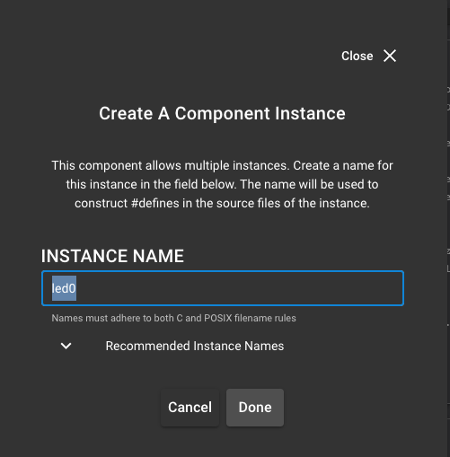

## Summary ##
The purpose of this example application is to demonstrate how to create custom cpcd commands. The application allows the user to type either '1' or '0' from the primary (host) to turn on or off the LED on the secondary (RCP). Similarily, button 0 on the RCP will toggle the LED on the RCP. Pressing 'q' will terminate the application.

For the purpose of this example, *primary* and *host* as well as *secondary* and *RCP* will be used interchangably.

This sample application works by first initializing and connecting to cpcd via the API call: cpc_init. It then opens a user endpoint using the API call: cpc_open_endpoint. 

Commands that wish to write to the RCP from the host will use: cpc_write_endpoint

When writing, the maximum buffer size is determined by the secondary and writing buffers larger than this limit will fail. This value can be queried with cpc_get_endpoint_max_write_size.

Commands that involve reading data from the RCP on the Host will use: cpc_read_endpoint

When reading, the buffer must be at least SL_CPC_READ_MINIMUM_SIZE bytes. 

Both APIs will return a negative value in case of error, otherwise it will return the number of bytes read/written.

## Gecko SDK version ##
* Simplicity Studio v5
* GSDK 4.3.1

## Hardware Required ##
* 1x WPK (brd 4002A) + MG21 (brd 4181B)
* 1x Raspberry Pi 4 with CPCd installed

## Connections Required ##
* EFR32 (brd 4181B) connected to WPK (brd 4002A) to form the RCP
* Connect the RCP to the Rasperry Pi 4 via UART (USB cable)
* Ssh connection to the Raspberry Pi

## Setup ##

### On the Secondary (RCP)
1. Build and flash a bootloader (in this case: bootloader-uart-xmodem)
   

2. Create a new RCP sample app 
   
   then in the RCP .slcp file make the following changes under "the software components" tab:

    i. Turn off cpc security (by installing CPC Security None)
    

    ii. Add simple LED > hit 'done' on the prompt
    
    

    iii. Add simple button > hit 'done' on the prompt
    
    

    iv. In Secondary Device (Co-Processor) > Configure > Max Number of User Endpoints should be incremented from 0 to at least 1
    
    

    v. Add the following files from the src/RCP folder to your project in Simplicity studio
      * *cpc_button_led.c*
      * *cpc_button_led.h* 
      * *cpc_commands.h*
  
    vi. Replace the *app.c* in your Simplicity Studio project with the *app.c* in the src/RCP folder

3. build the project & flash the binary to the RCP
4. Connect the RCP to the Host using 

### On the Primary (Host)
1. Copy '*custom_cpc_host*' directory to the host. This can be done using something like *scp*
2. ssh to the host
3. cd to the *custom_cpc_host* directory
4. run the command: sudo make -f Makefile 
5. start cpcd (/usr/local/bin/cpcd)
6. start the host app ( ./cpcledbutton)

## How It Works ##
1. Press any key to bring up the menu
2. press '1' or '0' on the host to turn on the led on the secondary
3. press 'btn0' on the secondary to toggle the led and notify the host
4. press 'q' to exit the application and close the endpoint
