# Optimization on the EM2 Current Consumption of the DynamicMultiprotocolLightSed Example Project #

## Summary ##

A concrete guide to disable SPI display and SPI flash from the DynamicMultiprotocolLightSed example project on radio board EFR32MG12 is provided in this article. Active events in EM2 are investigated. Sample test results on EM2 current and essential troubleshooting approaches are included.

## Gecko SDK version ##

Gecko SDK Suite 3.0.

## Hardware Required ##

* Wireless Starter Kit Main Board (BRD4001)
* EFR32xG22 2.4GHz 10 dBm Radio Board (BRD4162A Rev A01)

## Connections Required ##

NA

## Setup ##

### Disable SPI Display  
1. Change the selection of DMP UI Demo Code plugin to the Stub one.  
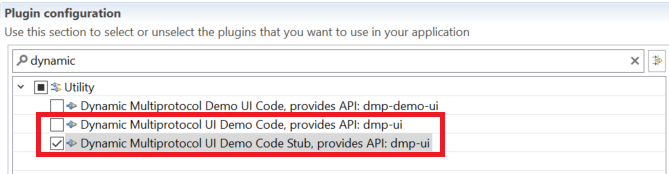
2. Un-check the "Graphics Library" plugin.  
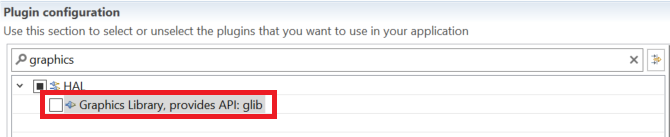
3. Un-check the "WSTK Display Driver" plugin. Please note that this step automatically disables "SPI Display" in hardware configuration.  
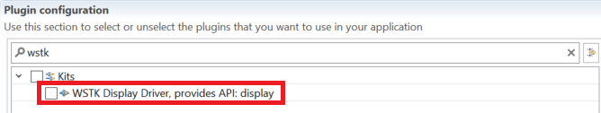
4. Save and generate the project.  
5. Open "*ProjectName*_callbacks.c", find function "void lcdMainMenuDisplayEventHandler(void)" at line 597, comment function call "dmpUiClrLcdDisplayMainScreen();". Because function "dmpUiClrLcdDisplayMainScreen()" turns undefined when the plugin "Dynamic Multiprotocol UI Demo Code Stub" is selected. This issue is expected to be fixed in future releases, please refer to UID 625885 in future release notes.  
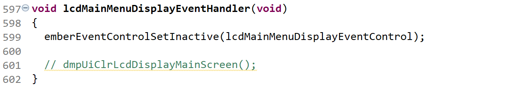
### Disable SPI Flash  
Since the SPI flash has a significant impact on the EM2 current, it is necessary to power it down in order to obtain an ideal result.  
1. Modify on the current DynamicMultiprotocolLightSed project, check plugin "EEPROM POWERDOWN".  
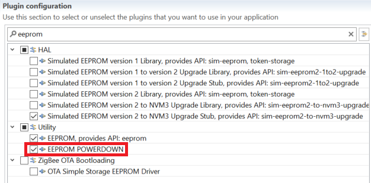
2. Change bootloader configuration to "Local Storage".  
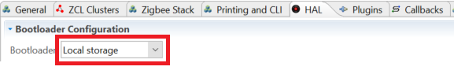
### Remaining Active Events  
We investigated the remaining active events. The intervals of the following events have been changed very long or *cancelled* in order to find out whether there exists other events.  

Active Events | Default Interval (s) | Changed To (s)
--- | --- | ---
Reporting Plugin Tick | 30 | 65535
End Device Support Plugin Polling NWK 0 | 3 | 300
Bluetooth Advertiser | 0.16 | 65.535
*Poll CLI* | 0.25 | *cancelled*

### Steps to Change the Intervals or Disable Unnecessary Events  
1. To change the interval of "Reporting Plugin Tick":  
    1. Set "reportingEntry.data.reported.maxInterval" at line 508 of file ProjectName_callbacks.c to a desired value in second.  
    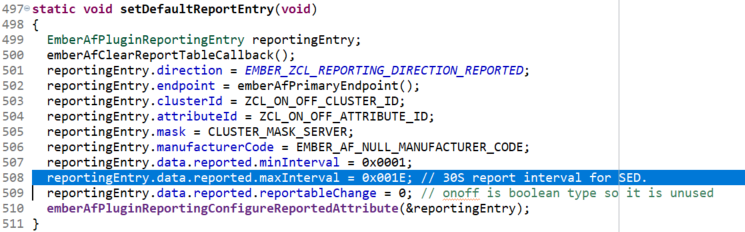
2. To change the interval of "End Device Support Plugin Polling NWK 0":  
    1. Select plugin "End Device Support", change field "Long Poll Interval (seconds)" to a desired value in second.  
    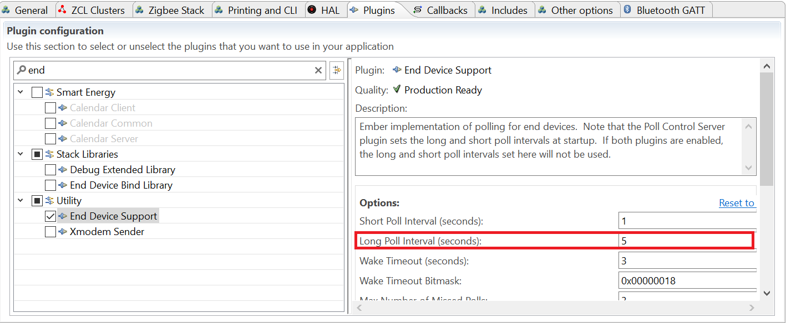
3. To change the interval of "Bluetooth Advertiser":  
    1. Set the second and the third arguments of function call "sl_bt_advertiser_set_timing" in function "static void BeaconAdvertisements(uint16_t devId)" at line 1391 of file ProjecName_callbacks.c to a desired value in millisecond. Please note that there are three such function calls in the caller function.  
    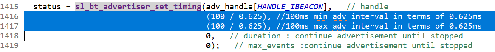  
      
    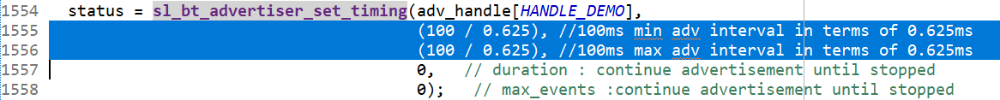  
4. To disable "Poll CLI" and "CPU usage tracking":  
    1. Select plugin "Micrium RTOS, provides API: main, micrium-rtos", un-check option "CPU usage tracking" and "Poll CLI" on the right.  
    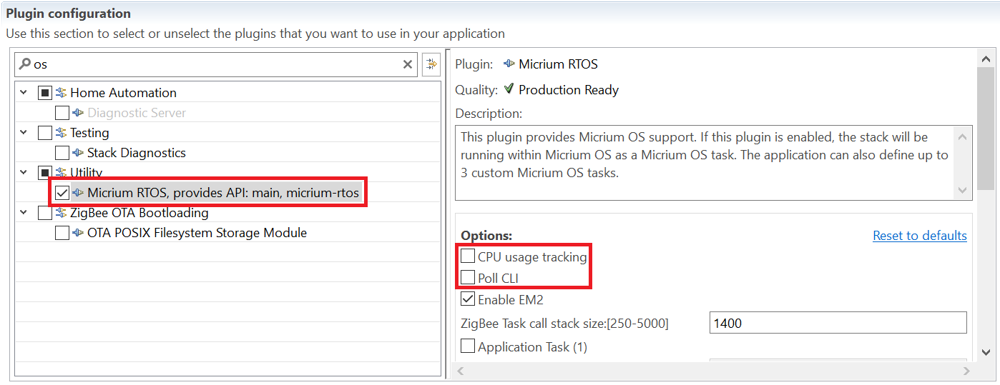  

## How It Works ##

This is intended for current tests only. For functional tests, it is highly recommended NOT to change the intervals of the events.
Energy Profiler is used to implement the EM2 current test. In accordance with "AEM Accuracy and Performance" section from [UG172](https://www.silabs.com/documents/public/user-guides/ug172-brd4320a-user-guide.pdf), when measuring currents below 250 uA, the accuracy is 1 uA. For more precise results, it is necessary to measure the current using a high-accuracy DC analyzer.  
Go to Energy Profiler and start energy capture. The screenshot below provides a sample result before changing intervals of the events.  
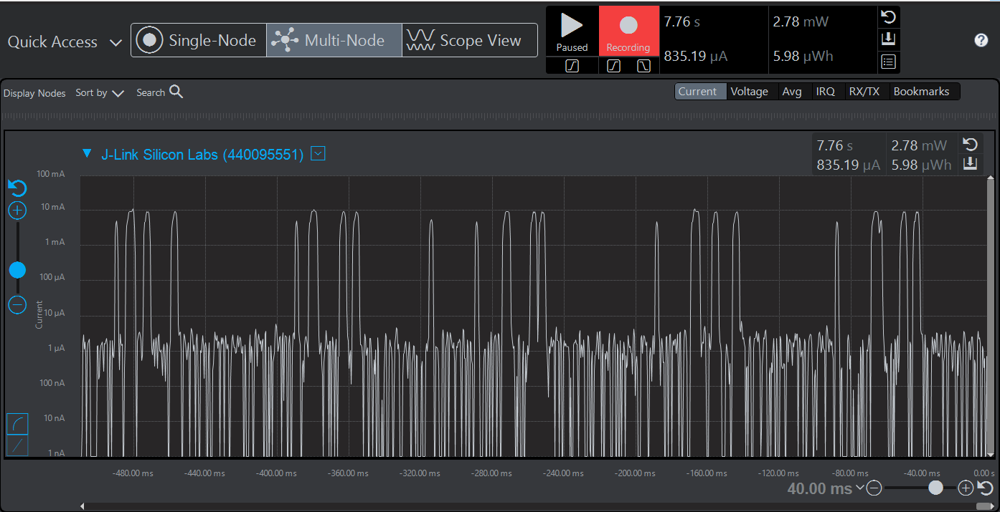  
The screenshot below provides a sample result after changing intervals of the events. The average EM2 current is about 3.4 uA.  
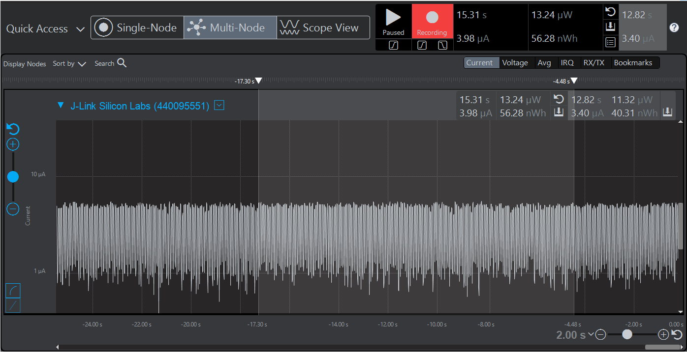  
According to the screenshot provided above, no other events can be observed.  

## .sls Projects Used ##

* dmp_sed_light_mg12.sls *(Events unchanged)*

## How to Port to Another Part ##

* Import the .sls file into Simplicity Studio
* Open the .isc file of each project, turn to "General" tab, hit button "Edit Architecture", then select the board and part.

## Special Notes ##

1. The intervals of the active events are not changed in the provided sls project file.
1. The application built from the sls project provided requires a correct bootloader to work.
2. The generation directory of the imported project may need to be changed to comply with the destination path. Save and generate after the change.  
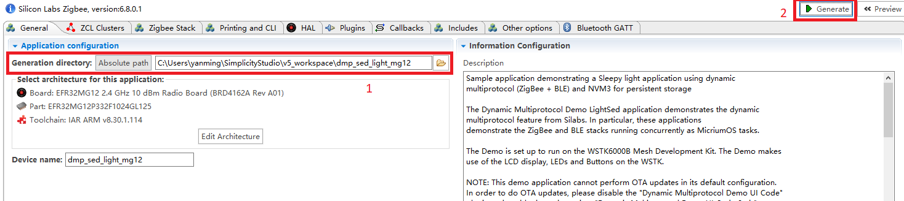  
1. There exists other tactics to further optimize the EM2 current consumption, such as initializing DCDC, disabling watchdog, disabling "Virtual COM Port" and other unnecessary peripherals. For more detailed information, please refer to *Optimization on EM2 Current Consumption of the Sleepy Z3Swtich Example Project*.
2. For functional tests, please refer to [QSG155: Getting Started with the Silicon Labs Dynamic Multiprotocol Demonstration Applications in GSDK v2.x](https://www.silabs.com/documents/public/quick-start-guides/qsg155-dynamic-multiprotocol-demo-quick-start-guide.pdf)
1. After a reset, the SED light automatically starts to identify if it successfully (re)joins a network, which prevents it from entering EM2. Short press PB1 on the main board of the SED light to stop identifying.  
2. An average 90 uA EM2 current may be encountered, keep capturing and try to re-flash the firmware. This is because when the Energy Profiler is used the target part debug module TMS/SWDIO pin is set low by the Jlink shared library and so there is an extra 80 uA of current through the TMS/SWDIO pullup. This issue is expected to be fixed in future releases, please refer to UID 519744 in future release notes.  
3. Current may always stick at mA level after flashing a new firmware, keep capturing and try to slide the power source to BAT then back to AEM on the bottom left of the main board.  
4. Plugin "EEPROM POWERDOWN" may not shut down the SPI flash successfully, if the EM2 current still stays at about 8 uA. Press RESET on the main board. This issue is expected to be fixed in future releases, please refer to UID 406826 in future release notes.  
