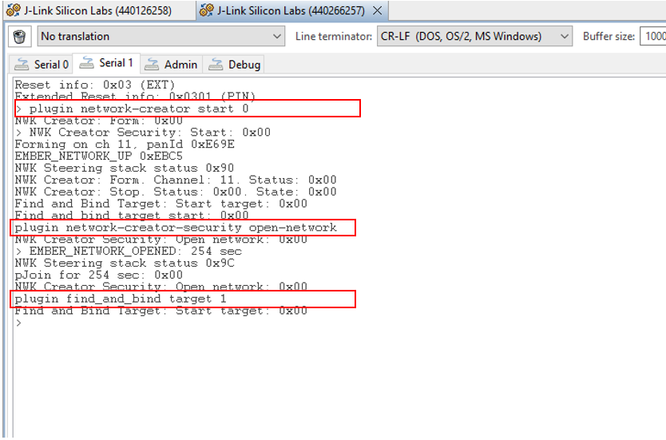

# Zigbee Battery Monitor Example #

## Summary ##

This project will provide a Battery Monitor application that supports both series 1 SoCs and series 2 SoCs. The following steps will also show that how is the implementation of this Zigbee battery monitor application.

Here is how the application works:

    

 

**On the End Device side**
1. We use the PRS to associate the radio signal `Radio Tx Complete` with a GPIO pin. So that when a packet is sent to the air, the GPIO pin will go high.
2. Then we configure the GPIO to generate an interrupt when the level goes high.
3. When serving the interrupt, an event is activated. Then we start to read the ADC or IADC.
4. The PRS channel and the GPIO pin used here are both configurable.
5. The end device periodically sends a power configuration report to the coordinator.

**On the Coordinator device side**
1. The Coordinator periodically hears a report from The end device.
2. Analys the power configuration report to get the battery voltage.

## Gecko SDK version ##
Gecko SDK Suite 4.2.2

## Hardware Required ##

[EFR32MG21 Wireless Gecko Starter Kit](https://www.silabs.com/development-tools/wireless/efr32xg21-wireless-starter-kit?tab=overview)

### NOTE: Tested boards for working with this example: ###

| Board ID | Description  |
| ---------------------- | ------ |
| BRD4161A | [EFR32MG12 2.4GHz 19 dBm Radio Board- BRD4161A](https://www.silabs.com/documents/public/user-guides/ug260-brd4161a-user-guide.pdf)    |
| BRD4180A | [EFR32xG21 2.4 GHz 20 dBm Radio Board-BRD4180A](https://www.silabs.com/documents/public/user-guides/ug385-brd4180a-user-guide.pdf) |

## Connections Required ##

The following picture shows the hardware for this application.

## Setup ##

### Zigbee Coordinator - Power Configuration Client ###

To create a Coordinator, you can either create a project based on an example project or start with a "Zigbee - SoC ZigbeeMinimal" project based on your hardware.

#### **Create the Zigbee Coordinator based on an example project** ####
1. From the Launcher Home, add hardware to MyProducts tabs, click on **Start**, and click on the EXAMPLE PROJECTS & DEMOS tab. Find the example project with the filter "battery monitor coordinator".

2. Create a **Zigbee - Battery Monitor Coordinator** project in Simplicity Studio. This example projects creation dialog pops up -> click Create and Finish and the project should be generated.

3. Build and flash this example to your board.

#### **Create a Zigbee Coordinator with a "Zigbee - SoC ZigbeeMinimal" project** ####

1. Create a **Zigbee - SoC ZigbeeMinimal** project in Simplicity Studio.

2. Copy all attached files in src/coordinator/ folders into the project root folder (overwriting existing).
3. Open the .slcp file:
  - Select the **SOFTWARE COMPONENTS** tab and install these software components:
    - [Zigbee] → [Zigbee 3.0] → [Find and Bind Target]
    - [Zigbee] → [Zigbee 3.0] → [Network Creator]
    - [Zigbee] → [Zigbee 3.0] → [Network Creator Security]: make sure the 'Network Creator Security' component is also installed.
    - [Zigbee] → [Utility] → [Zigbee Device Config]: change [Primary Network Device Type] : coordinator or router.

  - Select the **CONFIGURATION TOOLS** tab and open **Zigbee Cluster Configurator**:
    - Select Endpoint 1: 
      - [Power Configuration cluster]: enable the client side.
      - [Identify cluster]: enable server side.

4. Copy all attached files in the config/coordinator/zcl folder into the project folder (overwriting existing).

5. Build and flash this project to your board.

### Zigbee Sleepy End Device - Power Configuration Server ###

To create a Sleepy End Device, you can either create a project based on an example project or start with a "Zigbee - SoC ZigbeeMinimal" project based on your hardware.

#### **Create a Zigbee Sleepy End Device project based on an example project** ###

1. From the Launcher Home, add your hardware to MyProducts, click on it, and click on the **EXAMPLE PROJECTS & DEMOS** tab. Find the example project with the filter "battery monitor".

2. Based on your hardware, the **Zigbee - Battery Monitor (Series 1 Devices)** example or **Zigbee - Battery Monitor (Series 2 Devices)** example will appear. Click **Create** button on it. This example projects creation dialog pops up -> click Create and Finish and the project should be generated.

4. In the battery_monitor.c, change the channel, Port, and Pin compatible with your board.

5. Build and flash this example to your boards.

#### **Create a Zigbee Sleepy End Device project with a "Zigbee - SoC ZigbeeMinimal" project** ####

1. Create a **Zigbee - SoC ZigbeeMinimal** project in Simplicity Studio.

2. Copy all attached files in src/end_device folders into the project root folder (overwriting existing):
    - With series 1 devices: src/end_device/series_1
    - With series 1 devices: src/end_device/series_2

3. In the battery_monitor.c, change the channel, Port, and Pin corresponding with PRS module on your board. 

4. Open the .slcp file:
  - Select the **SOFTWARE COMPONENTS** tab and install these software components:
    - [Zigbee] → [Stack] → [Pro Core] → uninstall [Pro Stack]
    - [Zigbee] → [Stack] → [Pro Core] → install [Pro Leaf Stack]
    - [Zigbee] → [Zigbee 3.0] → [Network Steering]: make sure the 'Network Steering' component is installed.
    - [Zigbee] → [Zigbee 3.0] → [Find and Bind Initiator]
    - [Zigbee] → [Cluster Library] → [Common] → [Reporting]
    - [Zigbee] → [Utility] → [Zigbee Device Config]: change [Primary Network Device Type] : Sleepy End Device.
    - [Zigbee] → [Utility] → [End Device Support]

  - Select the **CONFIGURATION TOOLS** tab and open **Zigbee Cluster Configurator**:
    - Select Endpoint 1: 
      - [Power Configuration cluster]: enable Server side.
      - [Identify cluster]: enable Client side.

5. Copy all attached files in the config/end_device/zcl folder into the project folder (overwriting existing).

6. Build and flash this project to your board.

## How It Works ##
1. **Form** a network with the coordinator, also **open the network** and **bind** with the incoming device at the same time with the following command.

    *plugin network-creator start 0*

    *plugin network-creator-security open-network*

    *plugin find_and_bind target 1*

2. In the sleepy end device side, start to join into the network and bind endpoint 1 of the sleepy end device to the coordinator by the following command.

    *plugin network-steering start 0*

3. After joining the network, the sleepy end device will periodically report its battery voltage in less than 10 seconds.

