# 1. Introduction

In this worksheet we provide a step-by-step guide to create, build and run ZigBee 3.0 applications based on EmberZNet Stack 7.1.0. If you use a later release in the future, most of the instructions should be still applied, although there could be minor differences not foreseen at the time of this document.
These exercises help you get familiar with ZigBee 3.0 in the EmberZNet Stack, Simplicity Studio v5 development environment, and the Wireless Start Kit (WSTK) with EFR32MG12 SoC. We assume that you have two WSTK with SoC Radio boards and the following software (Simplicity Studio and EmberZnet SDK).

## 1.1. Application features

The boot camp series hands-on workshop will cover the four functionalities below, and the application development is split into four steps respectively to show how an application should be built up from scratch.
The exercise in this documentation is the first exercise in the "Zigbee Boot Camp" series.
- **The 1st phase, forming a basic network (Light), and a joining process (Switch) will be done using install code.**
- The 2nd phase, will prepare the devices to transmit, receive, and process the On-Off commands using APIs.
- The 3rd phase, the Switch will have a periodic event to execute custom code, in this case a blinking LED.
- The 4th phase, the Switch will be able to store any custom data in its flash using Non-volatile memory.


## 1.2. Purpose

This tutorial will give an overall knowledge about how to build a Light and Switch device from scratch. By the end of this Lab, the user will be familiar with Simplicity Studio and  Zigbee fundamentals. 
The network will consist of two devices using the EFR32MG12 SoCs (BRD4162A).
- One of the devices is the Light. Since the created network is centralized, the Light will work as the Coordinator and Trust Center of the network. This device forms and opens the network, permits other devices to join, and manages security keys.
- The other device is the Switch. It joins the network opened by the Light and sends On-Off commands to the Light.
The figure below illustrates the workflow of this hands-on.

<div align="center">
  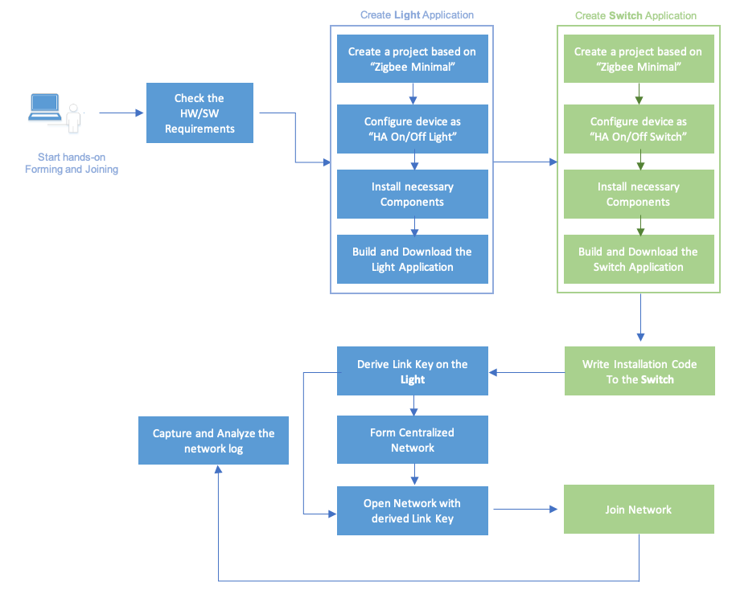
</div>
<div align="center">
  <b>Figure 1-1 Light and Switch Application Workflow</b>
</div>  
</br>

# 2. Create Light Application

As presented in Section 1.2, the purpose of the Light is to form and open the network.
The Silicon Labs Project Wizard will be used for creating the application. Silicon Labs Project Wizard is an interactive GUI tool that allows developers to create and configure most of their Zigbee application.

1. Go to File > New > Silicon Labs Project Wizard. This will bring up the New Project Wizard. See the Figure 2-1 below.

<div align="center">
  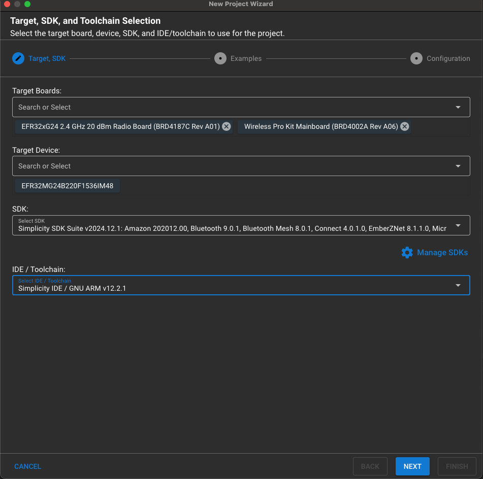
</div>
<div align="center">
  <b>Figure 2-1 New Project Wizard</b>
</div>  
</br>

2. Select your Target Board (BRD4162A), Target Device (EFR32MG12P332F1024GL125), and ensure that you have selected GSDK 4.1.0 and GNU ARM v10.3.1 click Next. See Figure 2-2.

<div align="center">
  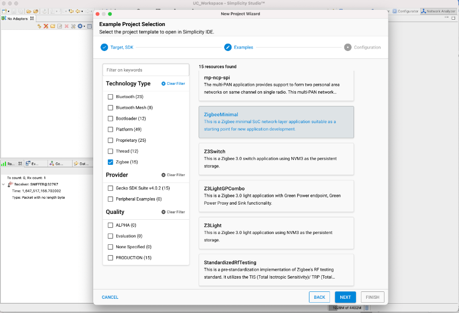
</div>
<div align="center">
  <b>Figure 2-2 Example Project Selection. </b>
</div>  
</br>

3. Under Technology Type check “Zigbee”, search and select “ZigbeeMinimal”. This is a Zigbee minimal application suitable as a starting point for new application development. Click Next. See Figure 2-3.

<div align="center">
  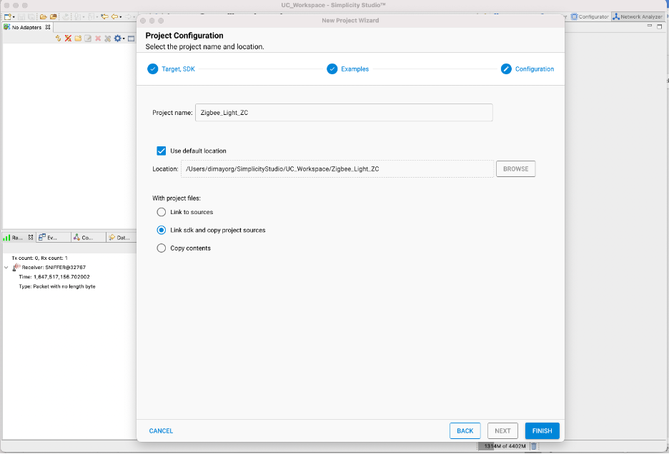
</div>
<div align="center">
  <b>Figure 2-3 Project Configuration. </b>
</div>  
</br>

4. Name your project to "Zigbee_Light_ZC" and then Click Finish to create the project.


## 2.1. Configure the "Zigbee_Light_ZC" project.

Once the project has been created Simplicity Studio should automatically open the Project Configurator (.slcp) which shows an overview of the project as depicted in Fig 2-4. In the overview you can see the Target and SDK Selection, Project Details and the Project Generators. 

<div align="center">
  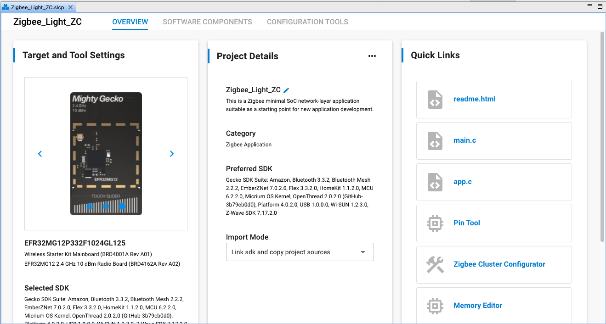
</div>
<div align="center">
  <b>Figure 2-4 Project Overview </b>
</div>  
</br>

### Zigbee Cluster Configurator.

For this tutorial, you must define the device type which will provide the proper clusters and attributes for the Light application. It is important to set the ZCL (Zigbee Cluster Library) configuration for the Light Application as it assists in configuration of the cluster functionality incorporated . In order to change the ZCL configuration, you must open the Zigbee Cluster Configurator in the Configuration Tools tab of the .slcp.
 If an endpoint is not created, click on ADD NEW ENDPOINT. Once an endpoint has been added click on edit and select Device: “HA On/Off Light (0x0100)”. By selecting a device type endpoint is configured according to the Zigbee Specifications.

**Note:** The endpoint clusters with a yellow warning sign implies that the component corresponding to that cluster is not installed in the Software Components tab see Figure 2-5. Click on the warning sign and it will automatically install the component. The Enabled Clusters filter can be used to identify the required clusters easily.

<div align="center">
  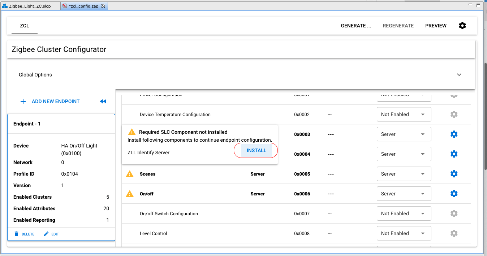
</div>
<div align="center">
  <b>Figure 2-5 Warning to install missing Components </b>
</div>  
</br>

Configure the Zigbee Light as a coordinator:
- In the Project Configurator click on “Software Components”. This will show the components that can be installed/uninstalled in the project.
- Go to Zigbee > Utility > Zigbee Device Config and click Configure.
- Change the Primary Network Device Type to Coordinator.
The components mentioned below must be installed or removed to get a device that can operate as a Coordinator. See Figure 2-6 on how to install components in Project Configurator. Please note that the components mentioned below are the minimal requirements to finish the Forming and Joining hands-on, however, it’s not enough for making the “Coordinator/Router” and “Router” device to pass the Z3 certification. For Z3 certification, please refer to the Z3LightSoc and Z3SwitchSoc examples for the necessary Components.

<div align="center">
  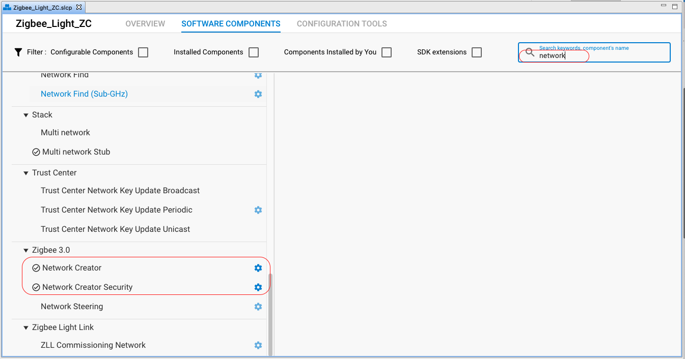
</div>
<div align="center">
  <b>Figure 2-6 Components </b>
</div>  
</br>

​ •The **Network Creator** and **Network Creator Security** components implement the network forming and opening functionality, therefore these are required to have for the Coordinator.

​ •The **Network Steering** and **Update TC Link Key** can be removed, since the device doesn't intend to join to any network.

​ •The **Pro Stack** component under Zigbee > Stack > Pro Core includes one of the most complex stack libraries. It contains routing, networking, scanning, neighbor, child-handler and other functionalities. It's mandatory for Coordinator and Router. The sample application uses this component by default.

​ •The **Security Link Keys** component under Zigbee > Stack provides management of APS link keys in the key table. It is used by a trust center (coordinator) to manage link keys of devices in the network, or by non-trust center devices wishing to manage partner link keys. Therefore, it is required to have.

​ •The **CLI: Command Line Interface**, **CLI Core** components in **Services > CLI**. This interface lets the user communicate with the SoC. In case of selecting the correct board at project creation phase, the component settings should fit to the pinout of the device, but it is also important to double check the values. The WSTK comes with a built-in VCOM, and application can use it by connecting WSTK to PC via USB connector. This is the Virtual COM port, which must be enabled by installing the IO Stream: USART Component under Services > IO Stream. 

**Note:** Ensure the Zigbee > Zigbee Core CLI is also installed in the project. This component should be preinstalled by the Zigbee Minimal Project Configuration. 


Table 2.1 depicts the affected components on the Light (Coordinator) node:

<div align="center">
  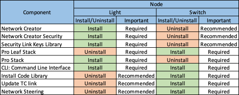
</div>
<div align="center">
  <b>Table 2-1 Components to Install/Uninstall </b>
</div>  
</br>

Press the Build button. Upon a successful build, the binary files should appear in the “Binaries” directory.

# 3. Download and test the Light application

Let's download the Zigbee_Light_ZC.s37 file to the development kit as shown below. See Figure 3-1 and Figure 3-2.
The highlighted "Advanced Settings.." in Figure 3-3 allows the user to decide how to flash the chip. Here, the flash can be merged with a new image (Merge Content), partially (Page Erase) or completely (Full Erase) erase before downloading the file.
Keep in mind that neither erase type cleans the bootloader section in EFR32MG12 part, but the Full erase deletes the token region.
After the image has been downloaded, it's possible to communicate with the device. For this purpose, open the Launch console, which is a built-in serial port terminal in the Studio. 

**Note:** Please execute an "Erase" process before the following steps to avoid any unintended effect by the existing network settings in the device.

<div align="center">
  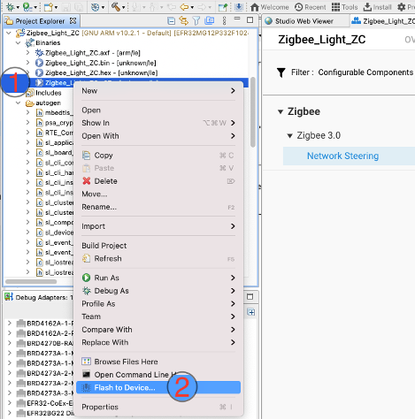
</div>
<div align="center">
  <b>Figure 3-1 Open Flash Programmer </b>
</div>  
</br>

<div align="center">
  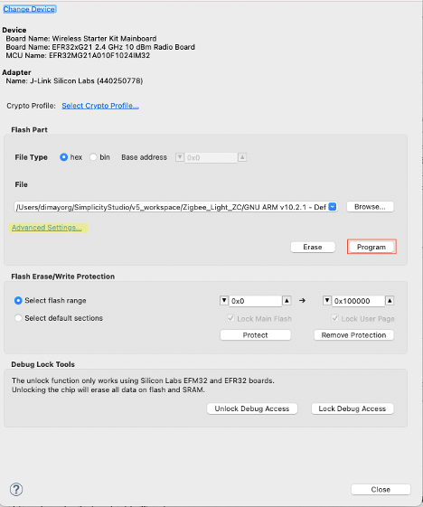
</div>
<div align="center">
  <b>Figure 3-2 Download the Image. </b>
</div>  
</br>

<div align="center">
  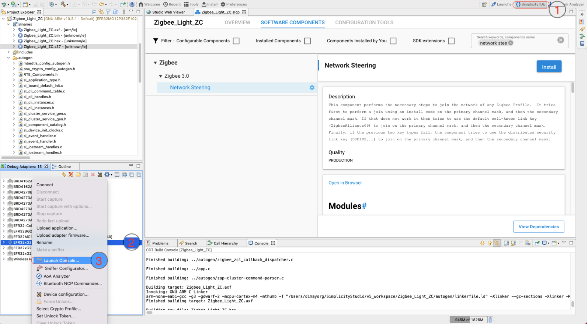
</div>
<div align="center">
  <b>Figure 3-3 Open Serial Console. </b>
</div>  
</br>


If the serial console is opened, switch to "Serial 1" and press "Enter". See Figure 3-4.

<div align="center">
  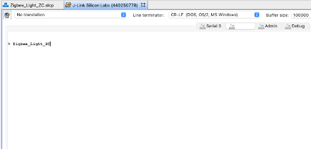
</div>
<div align="center">
  <b>Figure 3-4 Select Serial 1 tab. </b>
</div>  
</br>

The "\n\r" characters triggers the project name printing. This basic test shows that the RX and TX of the CLI is working correctly.
If the same text is printed, put away the Light application and start creating the Switch.
Note: If the project name does not appear in console you can add this in the Services > CLI: CLI Core Component > New Command prompt option as depicted in Figure 3-5. 


<div align="center">
  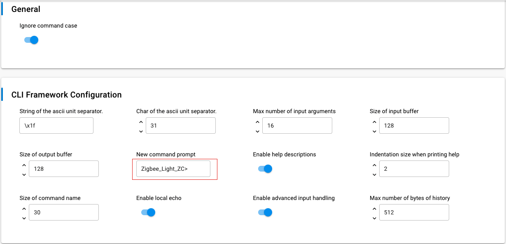
</div>
<div align="center">
  <b>Figure 3-5 New Command Prompt CLI Core </b>
</div>  
</br>

# 4. Create Switch Applicaion

In this hands-on, the Switch is the device that will join the network created and opened by the Light. However, the procedure to create and form the network is described in the next module.
Creating the project and configuration is similar to the Light application. The Switch application is also based on the "ZigBeeMinimal" sample application, therefore:
1.  Repeat the step 1-4 of chapter Create Light application, except name the project to "Zigbee_Switch_ZR".
2.  Open the .slcp file of the project.
 - Go to  Configuration Tools  tab, open the Zigbee Cluster Configurator and choose HA On/Off Switch(0x0000) device template. Install the clusters that have a yellow warning sign. The Enabled Clusters filter can be used to identify the required clusters easily. 
 - Go to Software Components tab and search for Zigbee Device Config select the Router device type from the dropdown menu.
  - Go to Software Components tab and double check the below components are installed: 
   - Debug Print
   - CLI: Command Line Interface 
   - CLI: CLI Core Components.
   - Network Steering.
   - Update TC Link Key.
   - Install code library.

The major difference between the Light application and Switch application is the selection of the network related components. Let's have a closer look at the enabled components.

​ •The **Network Steering** component serves to discover the existing networks on the enabled channels. The device issues a Beacon Request message and listens to the responses. If the Beacon response (from ZC or ZR) is received with "permit association" flag set, the device starts the joining process for the network, otherwise continue the scanning. Please see the Table 5.1 below for the recommended and required components.

​ •The **Update TC Link Key** is used to request new APS Link Key from the Trust Center. It should be installed since the Light (Trust Center) has the Security Link Keys Library.

​ •The **Install Code Library** provides an initial link key based upon an install code manufacturing token in the device. The key is hashed according to the ZigBee spec.
Summarized the above, the following table presents the affected plugins on the Switch (Router) node.

Table 4-1 presents the affected plugins on the Switch (Router) node.

<div align="center">
  
</div>
<div align="center">
  <b>Table 4-1 Components to check </b>
</div>  
</br>

# 5. Download and test the Switch application

Please repeat the steps from the chapter **3. Download and test the Light application** and test if the Switch application is working by pressing enter on the Serial 1 tab of the Launch console. See Figure 5-1.

<div align="center">
  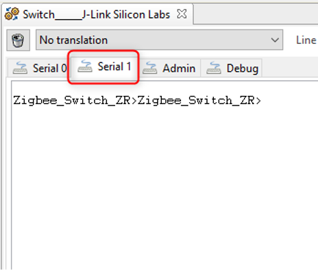
</div>
<div align="center">
  <b>Figure 5-1 CLI Testing </b>
</div>  
</br>

# 6. Establish Connection between Light and Switch with an install code-derived link key

This chapter presents how to form and join a network. The communication between devices will be captured by the Network Analyzer tool. The install code will be programmed in this section. An install code is used to create a preconfigured link key. The install code is transformed into a link key by using the AES-MMO hash algorithm, and the derived Zigbee link key will be known only by the Trust Center (Light) and the joining device (Switch). So, the Trust Center can use that key to securely transport the Zigbee network key to the device. Once the device has the network key, it can communicate at the network layer to the Zigbee network.

## 6.1 Programming the Install Code to Switch (Router) Device

For programming the install code into the Switch device, you need to create a text file with the value of the install code, and then write the install code into the manufacturing area of the Switch node by using the Simplicity Commander.
To save your time on this hands-on, we have prepared a batch file as below that can finish the install code programming automatically. Create a batch file, as seen below, open it with any text editor, copy and paste the content below to it, save and execute it for programming the install code. Please ensure only the switch device is connected to the PC, before running the script. 

```
@echo off

:: THIS FILE IS USED FOR PROGRAMMING INSTALLATION CODE AUTOMATICALLY.

:: use PATH_SCMD env var to override default path for Simplicity Commander
if "%PATH_SCMD%"=="" (
  set COMMANDER="C:\SiliconLabs\SimplicityStudio\v4\developer\adapter_packs\commander\commander.exe"
) else (
  set COMMANDER=%PATH_SCMD%\commander.exe
)

:: default file extension of GCC and IAR
set DEFAULT_INSTALL_CODE="83FED3407A939723A5C639B26916D505"

:: change the working dir to the dir of the batch file, which should be in the project root
cd %~dp0

if not exist "%COMMANDER%" (
  echo Error: Simplicity Commander not found at '%COMMANDER%'
  echo Use PATH_SCMD env var to override default path for Simplicity Commander.
  pause
  goto:eof
)

echo **********************************************************************
echo Program the default installation code to the specified device
echo 1. Erase the Installation Code if existing
echo 2. Program the Installation Code into the Manufacturing Area of the specified Device
echo 3. Check the Stored Installation Code
echo **********************************************************************
echo.
%COMMANDER% flash --tokengroup znet --token "Install Code: !ERASE!"
echo.
%COMMANDER% flash --tokengroup znet --token "Install Code:%DEFAULT_INSTALL_CODE%"
echo.
%COMMANDER% tokendump --tokengroup znet --token TOKEN_MFG_INSTALLATION_CODE

pause
```

Below is the result of executing the batch file: 

<div align="center">
  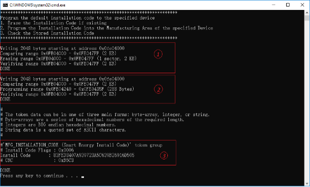
</div>
<div align="center">
  <b>Figure 6-1 Programming the Install Code </b>
</div>  
</br>

Note: The sections below (invisible by default, click the heading to view the details) describe in detail how to program the install code. You can skip it and go to **6.2 Form centralized network on Light (Coordinator) device** if you don't want spend much time on that.

<details>
  <summary> Show/Hide detail about how to program the install code (non-required) </summary>
  
### 6.1.1 Format of the Install Code File
To program the install code, create a simple text file with the value of the install code (without the CRC). In these instructions the file is named ```install-code-file.txt.```
The format of the file is as follows:
```Install Code: <ascii-hex> ```

Here is a sample install code file. The CRC for that code is 0xB5C3 and is not included in the file.

```Install Code: 83FED3407A939723A5C639B26916D505```

### 6.1.2. Checking the Install Code on an EFR32 Device

To get started, it is best to verify there is connectivity with the device to be programmed, and what information is currently stored on the node.
To do this, make sure that only the Switch device is connected to your PC (otherwise a new dialog will pop-up for selecting the right device), and then execute the following command to print all manufacturing token data from an EFR32-based device. The tokendump command prints manufacturing token data as key-value pairs. Simplicity Commander supports more than one group of tokens. In this example, the token group named "znet" is used.

```$ C:\SiliconLabs\SimplicityStudio\v5\developer\adapter_packs\commander\commander.exe tokendump --tokengroup znet ```

You should see the following output if you didn't write the install code before, where the code in highlighted area below reflects the significant fields related to the install code:
Note: If the commander command is not available on your PowerShell console, please check if you have installed the commander correctly, and make sure the commander.exe is included in the directory below.

``` C:\SiliconLabs\SimplicityStudio\v5\developer\adapter_packs\commander```

<div align="center">
  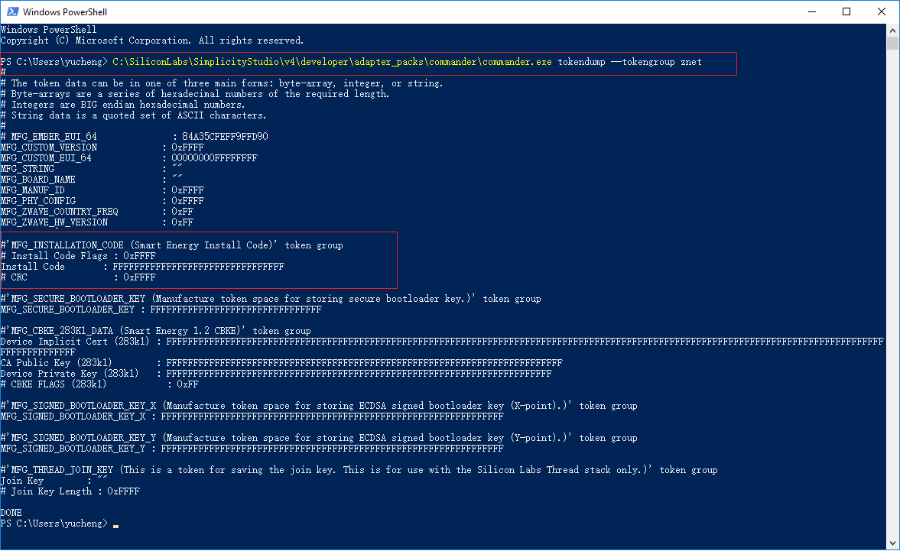
</div>
<div align="center">
  <b>Figure 6-2 Programming the Install Code </b>
</div>  
</br>

### 6.1.3 Writing the Install Code into the Manufacturing Area on an EFR32 Device

To write the install code into the manufacturing area of the Switch node, execute the following command:

```$ C:\SiliconLabs\SimplicityStudio\v5\developer\adapter_packs\commander\commander.exe flash --tokengroup znet --tokenfile install-code-file.txt```

### 6.1.4 Verifying the Stored Install Code on an EFR32 Device

After writing the install code, it is best to verify the information by executing the following command again:

```$ C:\SiliconLabs\SimplicityStudio\v5\developer\adapter_packs\commander\commander.exe tokendump --tokengroup znet```

<div align="center">
  
</div>
<div align="center">
  <b>Figure 6-3 Verifying the Stored Install Code </b>
</div>  
</br>
</details>


## 6.2 Form centralized network on Light (Coordinator) device

### 6.2.1 Derive a link key from the install code

To derive a link key from the install code and store that into the link key table on the Light, which acts as the Trust Center for the centralized network, enter the command below:
option install-code <link key table index> {<Joining Node's EUI64>} {<16-byte install code + 2-byte CRC>}
For example:

```
option install-code <link key table index> {<Joining Node's EUI64>} {<16-byte install code + 2-byte CRC>}
For example:
option install-code 0 {00 0B 57 FF FE 64 8D D8} {83 FE D3 40 7A 93 97 23 A5 C6 39 B2 69 16 D5 05 C3 B5}
```

- The first argument is the link key table index.
- The next argument is the EUI64 of the joining node (in this example, it's the Switch node). You can find this information by running the info command on the Switch node's CLI , and looking for the string 
similar to node [(>)000B57FFFE648DD8].

<div align="center">
  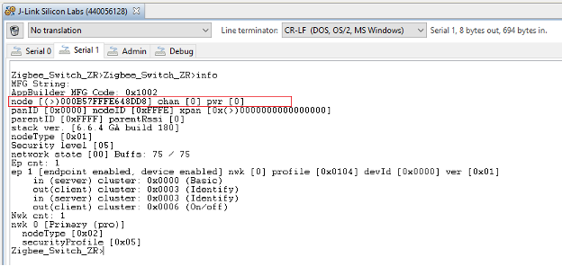
</div>
<div align="center">
  <b>Figure 6-4 Check Device EUI </b>
</div>  
</br>


- The last argument is the install code with the 2-byte CRC appended at the end. You can calculate the CRC yourself, or you can simply find out from the output of the batch file execution which has the command `$ commander tokendump --tokengroup znet` inside:

<div align="center">
  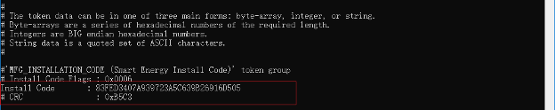
</div>
<div align="center">
  <b>Figure 6-5 Get the CRC Install Code </b>
</div>  
</br>

The CRC is displayed just below the install code and is printed in little endian format. Reverse the bytes to big endian before using as an argument with the option install-code CLI.

To see if the link key is added successfully to the Transient Key Table, enter the `keys print` command on the CLI of the Light node. The printout shows the Transient Key table that contains the derived key. Additionally, once the Switch application is connected to the network it shows the Trust Center Link key table and the Network key.

<div align="center">
  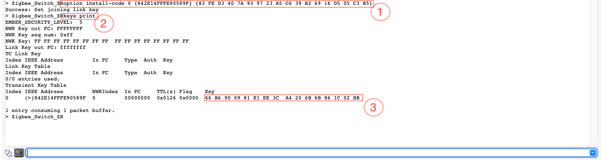
</div>
<div align="center">
  <b>Figure 6-6 Check the Link Key </b>
</div>  
</br>

As show above, the derived link key is:

'''
66 B6 90 09 81 E1 EE 3C  A4 20 6B 6B 86 1C 02 BB 
'''

### 6.2.2 Form Centralized Network.

On Light node, use the command below to form a centralized network with Zigbee 3.0 security.
```
plugin network-creator start 1
```

After that, please check the Pan ID of the network, it will be used to identify the network.

```
network id
```

<div align="center">
  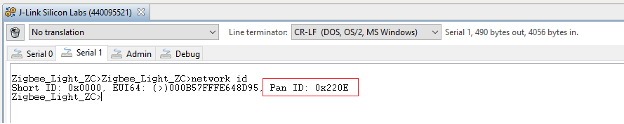
</div>
<div align="center">
  <b>Figure 6-7 Check the Pan ID </b>
</div>  
</br>

### 6.2.3 Open the network with the derived link key

Now set the transient link key (the same link key that you derived from the install code) on the Trust Center and open the network on the Light Application to join with the joining device's EUI64:

```
plugin network-creator-security open-with-key {eui64} {linkkey}
```

For example:

```
plugin network-creator-security open-with-key {00 0B 57 FF FE 64 8D D8} {66 B6 90 09 81 E1 EE 3C A4 20 6B 6B 86 1C 02 BB}
```


## 6.3 Join the network on Switch (Router) device

On the Switch node, enter this CLI to use the Network Steering plugin to join the network:

```
plugin network-steering start 0
```

And the serial console will output similar as below to indicate that the Switch node has joined the network 0x220E successfully.

<div align="center">
  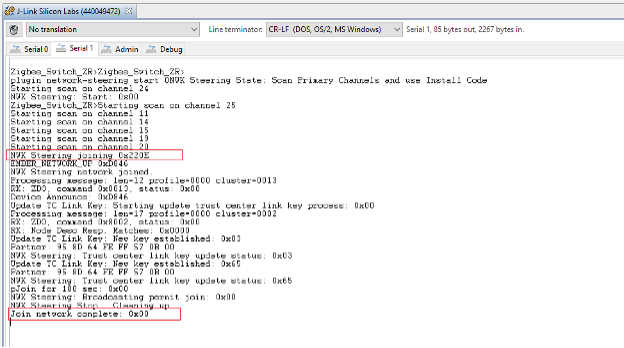
</div>
<div align="center">
  <b>Figure 6-8 Join the Network </b>
</div>  
</br>

## 6.4 Capture the Network log on Light (Coordinator) device

### 6.4.1 Find the Network key and Derived Link key for capturing

The network key is necessary for analyzing the network log, you can get the network key on the coordinator side with the command below.
Command:
keys print
Result:

```
EMBER_SECURITY_LEVEL: 05
NWK Key out FC: 00000057
NWK Key seq num: 0x00
NWK Key: C1 05 57 73 1A 09 83 71  77 C3 22 B7 E1 90 9A A1  
Link Key out FC: 00000006
TC Link Key
Index IEEE Address         In FC     Type  Auth  Key
-     (>)000B57FFFE648D95  00000000  L     y     A8 ED 49 FB C5 13 FA 64  E5 60 D1 76 13 FD B8 6A  
Link Key Table
Index IEEE Address         In FC     Type  Auth  Key
0     (>)000B57FFFE648DD8  00001002  L     y     66 B6 90 09 81 E1 EE 3C  A4 20 6B 6B 86 1C 02 BB  
1/6 entries used.
Transient Key Table
Index IEEE Address         In FC     TTL(s) Flag    Key    
0 entry consuming 0 packet buffer.
```

### 6.4.2 Add network key and Derived link key to Network Analyzer

Add the network key C1 05 57 73 1A 09 83 71 77 C3 22 B7 E1 90 9A A1 and derived link key 66 B6 90 09 81 E1 EE 3C A4 20 6B 6B 86 1C 02 BB to the Network Analyzer's key storage to be able to decode the messages.

1. Open Window -> Preferences

<div align="center">
  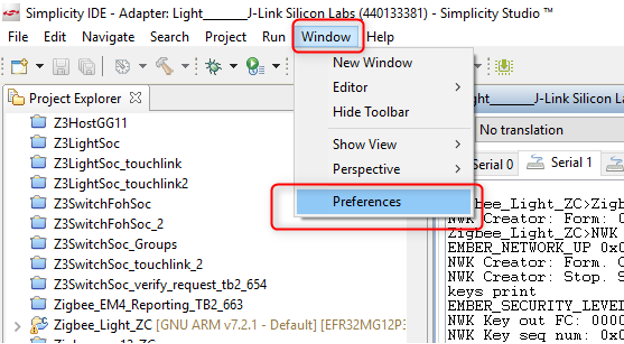
</div>
<div align="center">
  <b>Figure 6-9 Preferences </b>
</div>  
</br>

2. Make sure that Network Analyzer is set to decode the correct protocol. Select Window > Preferences > Network Analyzer > Decoding > Stack Versions, and verify it is set correctly. If you need to change it, click the correct stack, click Apply, and then OK.

<div align="center">
  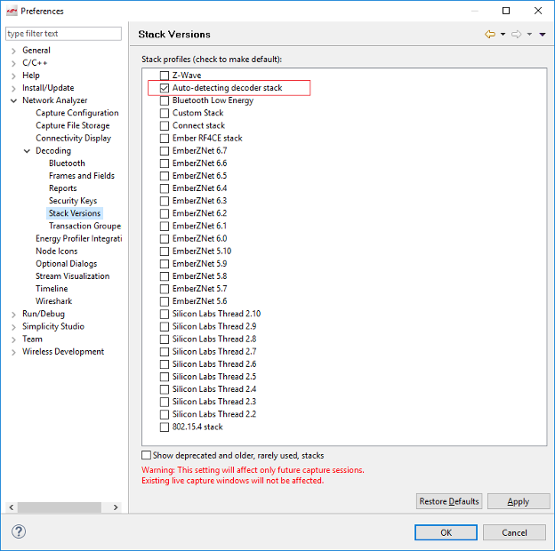
</div>
<div align="center">
  <b>Figure 6-10 Select the correct Stack </b>
</div>  
</br>

3. Navigate to Network Analyzer->Decoding-> Security Keys and add the network keys. See the figure below.

<div align="center">
  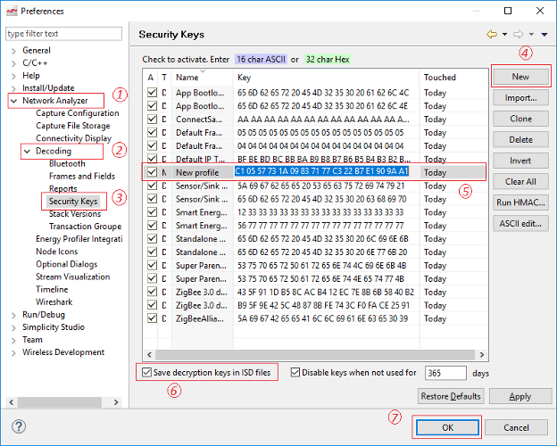
</div>
<div align="center">
  <b>Figure 6-11 Add Network Key </b>
</div>  


4.  Repeat the last step for adding the derived link key to the list.

Now the Switch should have joined the network created by the Light, please use the command on the Switch for leaving the network firstly.

```
network leave
```

Right click on Adapter name of the Light-> Connect (if not connected yet)-> Start capture.

<div align="center">
  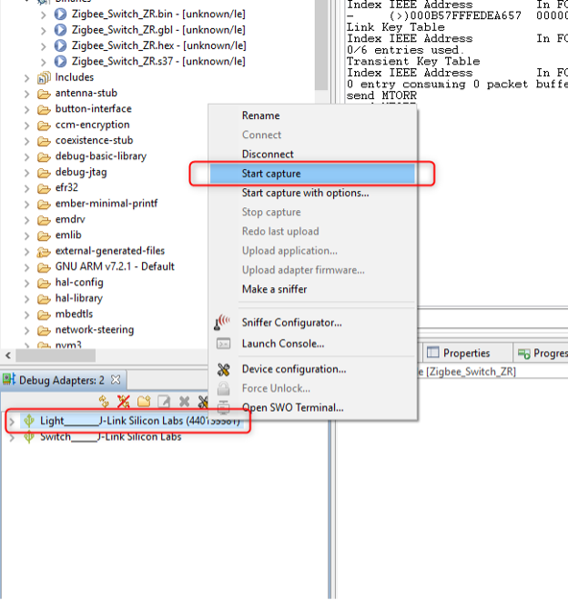
</div>
<div align="center">
  <b>Figure 6-12 Start Capturing </b>
</div>  
</br>

It should change the view to Network Analyzer and immediately start capturing.

<div align="center">
  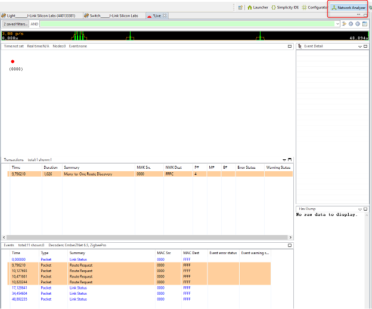
</div>
<div align="center">
  <b>Figure 6-13 Capturing on Light </b>
</div>  
</br>

And then repeat the step in **Open the network with the derived link key** to open the network, and step in **Join the network on Switch (Router) device** to join the network.
The capture file (Live) should show the packets on the network.


### 6.4.3 Joining Process in Network Analyzer

Stop the network analyzer after the Switch finish joining the network, and have a look at the Network Analyzer how the joining process works. See the figure below.

<div align="center">
  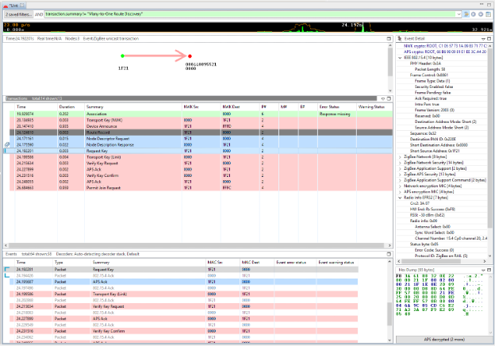
</div>
<div align="center">
  <b>Figure 6-14 Joining Process in Network Analyzer </b>
</div>  
</br>

**Note:** Probably a lot of "Many-to-One Route Discovery" appear in the log. The upper green filter box can be used to filter these messages out. Right click on this package and "Show only summary: Many…..", then negate the condition from "==" to "!=".


## Conclusion

In this hands-on, you learned how to create your Zigbee application projects starting with ZigbeeMinimal example. And how to configure your application as different type of Zigbee node (coordinator, Router, etc.), how to enable/disable different Components for different functionality to meet your needs, and how to form a centralized network and join this network.
This hands-on also demonstrates how to evaluate data being transmitted in the Zigbee network using the Network Analyzer tool.
