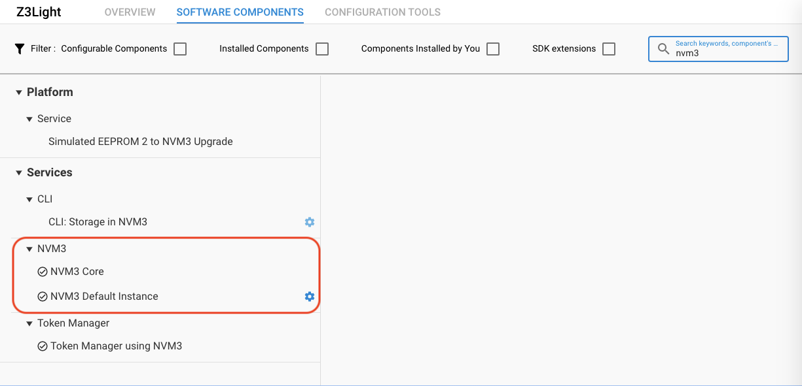
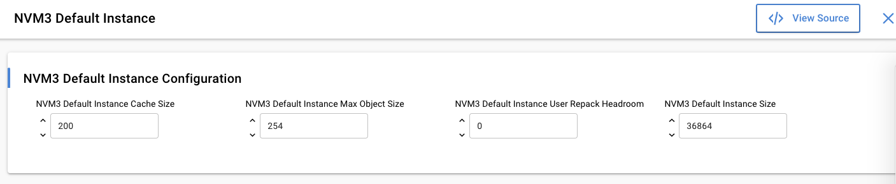
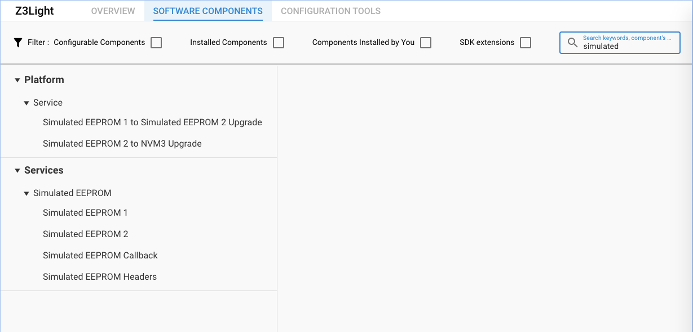
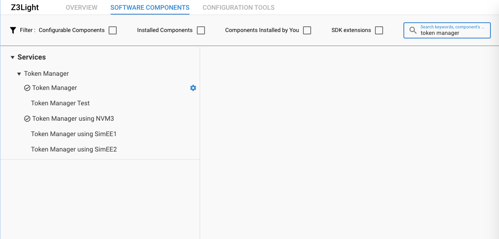
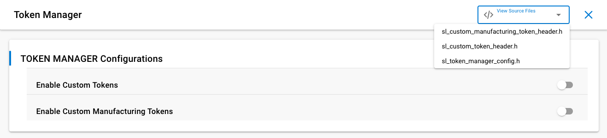
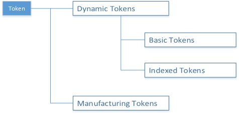
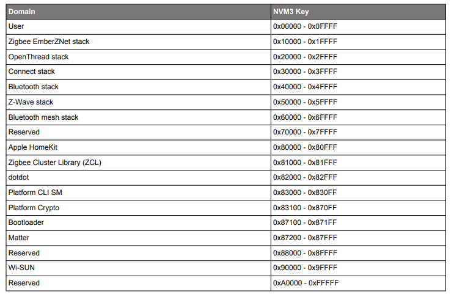
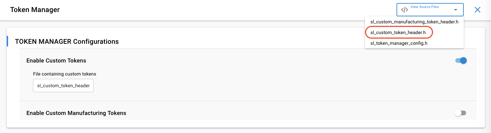

# 1. Introduction

## 1.1. Application features

The boot camp series hands-on workshop will cover four functionalities below, and the application development is split into four steps respectively to show how an application should be built up from the beginning.

The exercise is the 4th part of series “Zigbee Boot Camp” course.

- In the 1st phase, a basic network forming by the Light, and a joining process by the Switch will be realized.
- The 2nd part will prepare the devices to transmit, receive, and process the On-Off commands by using APIs.
- At the 3rd step the Switch will have a periodic event to execute any custom code, which will be a LED blinking in our case.
- **The 4th thing to do is to make the Switch to be able to store any custom data in its flash by using Non-volatile memory.**

## 1.2. Purpose

This training demonstrates the basic usage of Non-Volatile data storage on EmberZNet Stack. And also some of the basic knowledge are included in this documentation to help everyone to understand the hands-on well.

**You will learn**

- With this hands-on course, you will learn the basic knowledge of non-voltage data storage, and the available implementation provided by Silicon Labs, and also how to use token to access non-voltage data storage objects.

**You need to do**

- There is a problem we need to solve is that how to store the Light On/Off status locally over power cycle on our EFR32MG12 platform without EEPROM. In this hands-on, we provide the solution to do that with the token.
- And also you need to retrieve the manufacturing string that the manufacturer has programmed during production.


# 2. Using NVM in EmberZNet

Non-Volatile Memory (NVM) or Non-Volatile Storage is memory that can retrieve stored information even when the device is power-cycled. Silicon Labs offers 3 different implementations for Non-Volatile data storage in flash memory and also offer Token mechanism for storing and retrieving data from the Non-Volatile Data Storage. These 3 different implementations for Non-Volatile data storage including 

- Persistent Store (PS Store)
  - PS Store is only used with Bluetooth devices on all platforms except for EFR32 Series 2. The persistent store size is 2048 bytes and uses two flash pages for storage. Since this documentation focus on EmberZNet PRO, we will not introduce the PS Store much in this document.
- SimEEv1/v2
  - SimEEv1(Simulated EEPROM version 1) or SimEEv2(Simulated EEPROM version 2) are used with EmberZNet PRO, Silicon Labs Thread, Silicon Labs Connect on EM35x and EFR32 Series 1 platforms. SimEEv1 uses two virtual pages, with each virtual page consisting of two flash pages, while SimEEv2 uses three virtual pages where each virtual page consists of 6 flash pages.
- NVM3
  - The third generation Non-Volatile Memory (NVM3) data storage driver is an alternative to SimEEv1/v2 and PS Store, it is designed to work in EmberZNet, Silicon Labs Thread, Connect, and Bluetooth applications running on EFR32 as well as MCU applications running on EFM32.
  - Since the NVM3 is more configurable which allows for better balance of token capacity versus reserved flash, and it's compatible with DMP application, it's recommended for developing on EFR32. In this hands-on course, we will use the NVM3 for data storage.

Beginning with Zigbee EmberZnet SDK version 7.x, Zigbee applications are configured through a component-based architecture using the Simplicity Studio 5 Project Configurator rather than a plugin-based architecture using the legacy AppBuilder tool. In this section, we will introduce the required software components for using the Non-Volatile Storage.

## 2.1 NVM3

Simplicity Studio 5 Project Configurator provides an **NVM3 Core** component and **NVM3 Default Instance** component to initialize and use with NVM3. By typing "nvm3" in the search bar in the upper right corner, the NVM3 related software components can be found.

<div align="center">
  
</div>
<div align="center">
  <b>Figure 2-1 NVM3 Software Components</b>
</div>  
</br>

The NVM3 Default Instance with a gear icon represents that this component can be configured.

<div align="center">
  
</div>
<div align="center">
  <b>Figure 2-2 NVM3 Configuration</b>
</div>  
</br>

The **NVM3 Default Instance** component provides the following configurations:

​	• **Cache Size:** Number of objects to cache. To reduce access times, this number should be equal to or higher than the number of live and deleted objects stored in NVM3 at any time.

​	• **Max Object Size:** Size of largest allowed NVM3 object in bytes. Must be between 208 and 4096 bytes.

​	• **User Repack Headroom:** Headroom determining how many bytes below the forced repack limit the user repack limit is placed. The default value is 0, which means that the forced and the user repack limits are the same.

​	• **Default Instance Size:** Size of the NVM3 storage region in flash. This must be set to match an integer number of flash pages, 3 pages at minimum.

For more details about NVM3 Data Management driver, please refer to [NVM3 - NVM Data Manager](https://docs.silabs.com/gecko-platform/4.0/driver/api/group-nvm3) and [AN1135: Using Third Generation Non Volatile Memory (NVM3) Data Storage](https://www.silabs.com/documents/public/application-notes/an1135-using-third-generation-nonvolatile-memory.pdf).

## 2.2 Simulated EEPROM

Simulated EEPROM version 1 (SimEEv1) and Simulated EEPROM version 2 (SimEEv2) use a section of internal flash memory for stack and application token storage. Specifically, SimEEv1 uses two virtual pages, with each virtual page consisting of two flash pages, while SimEEv2 uses three virtual pages where each virtual page consists of 6 flash pages. By searching "simulated", the Simulated EEPROM related components will be shown up.

<div align="center">
  
</div>
<div align="center">
  <b>Figure 2-3 Simulated EEPROM Software Components</b>
</div>  
</br>

Apart from the basic implementation of SimEEv1/v2, the Gecko Platform provides also **Simulated EEPROM 1 to Simulated EEPROM 2 Upgrade** component and **Simulated EEPROM 2 to NVM3 Upgrade** component to assist upgrade to Simulated EEPROM 2 instance or NVM3 instance while maintaining any token data. 

For more details about Simulated EEPROM, please refer to [Simulated EEPROM 1 and 2](https://docs.silabs.com/gecko-platform/4.0/service/api/group-simeepromcom) and [AN703: Using Simulated EEPROM Version 1 and Version 2 for the EFR32 Series 1 SoC Platform](https://www.silabs.com/documents/public/application-notes/an703-simulated-eeprom.pdf)

## 2.3 Token Manager

The Token Manager is design to abstract implementation details and simplify interacting with differing non-volatile systems. By searching "token manager", the Token Manager related components will be shown up.

<div align="center">
  
</div>
<div align="center">
  <b>Figure 2-4 Token Manager Software Components</b>
</div>  
</br>

Token Manager enables SimEE data storage with the same API for accessing NVM3 or SimEE storage. The Simulated EEPROM needs to periodically perform a page erase oper, which will cause a high memory wear level. The NVM3 driver which is designed to use pages in a sequential order (providing equal usage and wear) is preferred to be used for Non-Volatile Storage. 

**Note:** SimEEv1/v2 are not implemented on EFR32 Series 2. 

By clicking the gear icon in the Token Manager component, we can configure to **Enable Custom tokens** and/or *** Enable Custom Manufacturing Tokens***, which can be further configured and defined in sl_custom_token_header.h and sl_custom_manufacturing_token_header.h respectively. Detailed description will be illustrated in next chapter.

<div align="center">
  
</div>
<div align="center">
  <b>Figure 2-5 Token Manager Configuration</b>
</div>  
</br>

## 2.4 Zigbee Token Definitions

The EmberZNet PRO stack has defined lots of tokens for stack, Application Framework, manufacturing data storage. The majority of tokens are stored in NVM3 or Simulated EEPROM (both use Flash) where they can be rewritten. Manufacturing tokens are stored in dedicated regions of flash and are not designed to be rewritten.

- Zigbee Stack Token

Stack Tokens are runtime configuration options set by the stack. These dynamic tokens should not be changed by the application.

To view the stack tokens, refer to the file:
`<install-dir>/stack/config/token-stack.h`

- Manufaturing Token

Manufacturing Tokens are set at manufacturing time and cannot be changed by the application.

To view the Manufacturing Token for the EFR32 series of chips, refer to the following files.

`gecko_sdk/platform/service/token_manager/inc/sl_token_manufacturing.h`

- Application Framework Token

Application Framework Tokens are application tokens used by the Application Framework, these tokens should not be changed by the application after project generation. Examples of these are ZCL attribute tokens and plugin tokens.

To view the Application Token generated by Project Configurator, refer to the file:

`<project_name>/autogen/zap-tokens.h`

- Custom Tokens

In addition to default tokens, users can add these types of tokens specific to their application:

For custom manufacturing token, it is defined by the user with Token Manager, and set at manufacturing time.

`<project_name>/config/sl_custom_manufacturing_token_header.h`

For custom application token, please define and use with Token Manager.

`<project_name>/config/sl_custom_token_header.h`


# 3. Token Using NVM3

Depending on how the tokens are going to be used, it can be distinguished as **Dynamic Tokens** or **Manufacturing Tokens**. 

<div align="center">
  
</div>
<div align="center">
  <b>Figure 3-1 Types of Tokens</b>
</div>  
</br>

In this chapter, we will introduce **How to defining and accesing dynamic tokens and manufacturing tokens in NVM3**. A lab will be will be provided to demonstrat in the next chapter.

## 3.1 Dynamic Tokens

There are two types of dynamic tokens, includes Non-indexed/Basic dynamic tokens and Indexed dynamic tokens. 

- **Non-indexed/Basic Dynamic Tokens** can be thought of as a simple char variable type. They can be used to store an array, but if one element changes the entire array must be rewritten.
  - **Counter Token** is a special type of Non-indexed dynamic token meant to store a number that increments by 1 at a time.

- **Indexed Dynamic Tokens** can be considered as a linked array of char variables where each element is expected to change independently of the others and therefore is stored internally as an independent token and accessed explicitly through the token API.

### 3.1.1 Creating Dynamic Tokens

In general, creating a dynamic token involves three steps below.

(1) Define the Token name.

​	When defining the name, please do not prepend the word TOKEN. For NVM3 dynamic tokens, use the word NVM3KEY as the prefix. NVM3 Objects are identified with 20-bit object identifiers denoted as keys. Please note that the token key values must be unique within this device. Note also that the NVM3KEY value for an indexed token is set to a value where the subsequent 0x7F values are unused.

```
/**
* Custom Zigbee Application Tokens
*/
// Define token names here
#define NVM3KEY_LED0_ON_OFF			(NVM3KEY_DOMAIN_USER | 0x0001)
```


​	For NVM3, custom application tokens should use the **NVM3KEY_DOMAIN_USER** range so as not to collide with the stack tokens in other ranges such as **NVM3KEY_DOMAIN_ZIGBEE**. See the table below for the NVM3 default instance key space.

<div align="center">
  
</div>
<div align="center">
  <b>Figure 3-2 NVM3 default instance key space</b>
</div>  
</br>

(2) Define the Token Type

​	The token type can be either a built-in C data type, or defined as a custom data structure using typedef.

```
#if defined(DEFINETYPES)
// Include or define any typedef for tokens here
typedef bool ledOnOff;        // LED ON OFF status
#endif //DEFINETYPES
```

(3) Define the Token Storage

​	After any custom types are defined, you should define the token storage to inform the token management software about the tokens being defined. Each token, whether custom or default, gets its own entry in this part:

```
#ifdef DEFINETOKENS
// Define the actual token storage information here
DEFINE_BASIC_TOKEN(LED0_ON_OFF,
                   ledOnOff,
                   false)
#endif
```

​	DEFINE_BASIC_TOKEN takes three arguments: the token name (LED0_ON_OFF, without the prefix "NVM3KEY"), the token type (ledOnOff) what we defined above, and the default value of the token if it has never been written by the application (false).

​	In this case, the value (ledOnOff) is set to `false` to represent the default status of the LED0.

### 3.1.2 Accessing Dynamic Tokens

A new infrastructure was introduced with Gecko SDK Suite (GSDK) v3.x. As part of that infrastructure update, the HAL APIs used to access and manage tokens have been replaced with Token Manager APIs. In this lab, we will focus on how to access tokens with Tokan Manager APIs.

The networking stack provides a simple set of APIs for accessing token data. The APIs differ slightly depending on the type of the tokens. 

#### 3.1.2.1 Accessing Basic (Non-indexed) Tokens

The non-indexed/basic token token API functions include:

```
Ecode_t sl_token_get_data (uint32_t token, uint32_t index, void *data, uint32_t length)
Ecode_t sl_token_set_data (uint32_t token, uint32_t index, void *data, uint32_t length)
```

In this case, 'token' is the token key, ‘index’ is 1 for non-indexed/basic tokens, 'data' is the token data, and ‘length’ is the size in bytes of the data. Note that sl_token_get_data() and sl_token_set_data() are specific for basic dynamic tokens.

Now let us use an example to explain the usage of these APIs.
As mentioned in the section [You need to do](https://github.com/SiliconLabs/IoT-Developer-Boot-Camp/wiki/Zigbee-Hands-on-Non-volatile-Data-Storage#12-purpose) at the beginning of this documentation, we needs to store the LED0's on/off status frequently, and restore the LED0 last on/off status after power up. As we have defined the token as above, then you can access it with the code snippet like this:

```
ledOnOffStatus_t led0OnOffStatus;

// Retrieve the previous status of LED0
sl_token_get_data(TOKEN_LED0_ON_OFF, 1, &led0OnOffStatus, sizeof(led0OnOffStatus));

led0OnOffStatus.ledOnOff = <current status>;

// Store the current status of LED0
sl_token_set_data(TOKEN_LED0_ON_OFF, 1, &led0OnOffStatus, sizeof(led0OnOffStatus));
```

Since this hands-on is designed for new to the Silicon Labs EmberZNet stack, we will focus on the basic token usage, if you are interested about how to write the counter token, please read the section [3.4.1.1 Accessing Counter Tokens](https://www.silabs.com/documents/public/application-notes/an1154-tokens-for-non-volatile-storage.pdf) of AN1154.

#### 3.1.2.2 Accessing Indexed Dynamic Tokens

The indexed token API functions are the same as the non-indexed/basic token API functions. The only difference is the ‘index’ parameter can be something other than 1.

As explained above, we will not spend much space of this documentation to introduce Indexed Tokens, please refer to the section [3.4.2 Accessing Indexed Tokens](https://www.silabs.com/documents/public/application-notes/an1154-tokens-for-non-volatile-storage.pdf) of AN1154 for more information.

## 3.2 Manufacturing Tokens

The major difference between Manufacturing Tokens and Dynamic Tokens is on where the tokens are stored and how they are accessed. Manufacturing Tokens are set at manufacturing time and they are stored at absolute address of the flash. It can be written either with external programming tools or from on-chip code only if the token is currently in an erased state.

### 3.2.1 Creating Manufacturing Tokens

Manufacturing tokens are defined in a similar way as basic (non-indexed) dynamic tokens, but use the DEFINE_MFG_TOKEN in the manufacturing token header, instead of the other DEFINE_*_TOKEN macros. Note that the CREATOR_* prefix – not NVM3KEY_* - should always be used with manufacturing tokens, even when the NVM plugin is being used for non-volatile storage. Please refer to section [Creating Dynamic Token](https://github.com/SiliconLabs/IoT-Developer-Boot-Camp/wiki/Zigbee-Hands-on-Non-volatile-Data-Storage#3211-creating-dynamic-token) on how to create them.

### 3.2.2 Accessing Manufacturing Tokens

As the name suggests, Manufacturing Tokens are usually written once at manufacturing time into fixed locations in a dedicated flash page. Since their addresses are fixed, they can be easily read from external programming tools if Read Protection for this flash area is disabled.
And since the same flash cell cannot be written repeatedly without erase operations in between. Writing a manufacturing token from on-chip code works only if the token is currently in an erased state. Overwriting the manufacturing token that has been already written before always requires erasing the flash page for the manufacturing token with external programming tools.

Manufacturing tokens should be accessed with their own dedicated API below.

```
Ecode_t sl_token_get_manufacturing_data (uint32_t token, uint32_t index, void *data, uint32_t length)
Ecode_t sl_token_set_manufacturing_data (uint32_t token, void *data, uint32_t length)
```

They have the same parameters as the basic tokens APIs. The two primary purposes for using the dedicated manufacturing token access APIs are:

- For slightly faster access;
- For access early in the boot process before `emberInit()` or `sl_token_init()` is called.

Also let us use an example to explain the usage of these dedicated APIs for accessing manufacturing tokens.
As mentioned in the section [You need to do](https://github.com/SiliconLabs/IoT-Developer-Boot-Camp/wiki/Zigbee-Hands-on-Non-volatile-Data-Storage#12-purpose) at the beginning of this documentation, manufacturer will program the manufacturing string token during the production with programming tool, and we can use the on-chip code snippet below to retrieve the string data from the manufacturing token.

```
tokTypeMfgString mfgString;
// Retrieve the manufacturing string from the manufacturing token
sl_token_get_manufacturing_data (TOKEN_MFG_STRING, 1, &mfgString, sizeof(mfgString));
```


# 4. Lab

This hands-on is building on top of previous three hands-on. Since the Non-volatile data storage mechanism does not depend on the mesh node type, we will only demonstrate how to access the NVM3 object via token API on the Switch (router) device side, it refers to the `Zigbee_Switch_ZR` project. 

This section provides step-by-step instructions to demonstrate how to store and retrieve the LED0's status to/from the Non-Volatile data storage (it's NVM3 in this hands-on) objects with basic token. And also demonstrate how to access manufacturing token with the dedicated APIs.

**Hardware Requirements**

This hands-on requires either EFR32MG21/EFR32MG13/EFR32MG12 radio board, and EFR32MG12 radio board BRD4162A is recommended since we created the example project with that kit. Below is the layout of the starter kit.

**Software Requirements**

This hands-on is building on top of the previous three hands-on [Forming and Joining](https://github.com/SiliconLabs/IoT-Developer-Boot-Camp/wiki/Zigbee-Hands-on-Forming-and-Joining), [Sending on/off commands](https://github.com/SiliconLabs/IoT-Developer-Boot-Camp/wiki/Zigbee-Hands-on-Sending-OnOff-Commands) and [Using Event](https://github.com/SiliconLabs/IoT-Developer-Boot-Camp/wiki/Zigbee-Hands-on-Using-Event), and it's supposed that you have installed the Simplicity Studio and necessary SDKs as documented in our [preparatory course](https://github.com/SiliconLabs/IoT-Developer-Boot-Camp/wiki/Zigbee-Preparatory-Course).

## 4.1 Creating Custom Tokens

We will now add some custom tokens to the project in order to track the On-Off LED status. Before defining custom token, make sure the following software components are installed in your project to use Token with NVM3.

- NVM3 Core

- NVM3 Default Instance

- Token Manager

- Token Manager using NVM3

After installing these software components, navigate to the Token Manager component, enable custom tokens. Note that we can choose in which file to define our custom tokens. In this case, we will leave the values as the default. The tokens will be defined in sl_custom_token_hearder.h, which can be found in the "config" folder of the project files.

<div align="center">
  
</div>
<div align="center">
  <b>Figure 4-1 Enable Custom Token</b>
</div>  
</br>

Add the following code to the token header, sl_custom_token_header.h to define the token.

```C
/**
* Custom Zigbee Application Tokens
*/
// Define token names here
#define NVM3KEY_LED0_ON_OFF     (NVM3KEY_DOMAIN_USER | 0x0001)

#if defined(DEFINETYPES)
// Include or define any typedef for tokens here
typedef bool ledOnOff;        // LED ON OFF status
#endif //DEFINETYPES

#ifdef DEFINETOKENS
// Define the actual token storage information here
DEFINE_BASIC_TOKEN(LED0_ON_OFF,
                   ledOnOff,
                   false)
#endif
```

## 4.2 Access the Basic Token LED0_ON_OFF

Let's moving on for how to access the defined token. Below are step-by-step instructions for adding code to store the LED status to Non-volatile data storage, and retrieve the data for restoring the LED status.

### 4.2.1 Write the Basic Token data

In the last hands-on, we defined a event handler `ledBlinkingHandler()` to toggle the LED0 periodically, we need to store the LED0 status after each toggling process.

Open the `app.c`, include the head file and define "led0OnOffStatus" variable at the top of this file.

```C
#include "sl_token_manager.h"

ledOnOff led0OnOffStatus;
```

Navigate to the function `void ledBlinkingHandler(void)` in the `Zigbee_Switch_ZR_callback.c`. Write the basic token `LED0_ON_OFF` with the API `sl_token_set_data()`. Please note that the LED0 toggle process of last hands-on is surrounded by the token retrieving and storing process.

```c
void ledBlinkingEventHandler(void)
{
  sl_zigbee_event_set_inactive(&ledBlinkingEventControl);

  // Retrieve the previous status of LED0
  sl_token_get_data(TOKEN_LED0_ON_OFF, 1, &led0OnOffStatus, sizeof(led0OnOffStatus));

  sl_led_toggle(&sl_led_led0);
  led0OnOffStatus = !led0OnOffStatus;

  // Store the current status of LED0
  sl_token_set_data(TOKEN_LED0_ON_OFF, 1, &led0OnOffStatus, sizeof(led0OnOffStatus));

  //Reschedule the event after a delay of 2 seconds
  sl_zigbee_event_set_delay_ms(&ledBlinkingEventControl, 2000);
}
```

### 4.2.2 Retrieve the Basic Token data

Navigate to the function `void emberAfMainInitCallback(void)` of the `app.c` which will be called from the application's main function during the initialization, and retrieve the basic token "LED0_ON_OFF" with the API `sl_token_get_data()`. And then apply the retrieved status to the LED0 by using the API `sl_led_turn_on()` or `sl_led_turn_off()`

```C
void emberAfMainInitCallback(void)
{
  // Retrieve the LED0 status before reset/power-off from the token
  sl_token_get_data(TOKEN_LED0_ON_OFF, 1, &led0OnOffStatus, sizeof(led0OnOffStatus));

  // Restore the LED0 status during initialization
  if(led0OnOffStatus){
      sl_led_turn_on(&sl_led_led0);
  }
  else{
      sl_led_turn_off(&sl_led_led0);
  }
	....
}
```

### 4.2.3 Testing your project

Once you've added the necessary code to you project, Build and flash the `Zigbee_Switch_ZR` project to your BRD4162A radio board.

The LED0 on the starter kit will blinky periodically after few seconds delay after power up, reset the device, the application will restore the LED0 to the status before reset/power-off.
**Note:** You may notice the device spends more time in booting up, it is because Zigbee project is using LFXO as the clock source by default in SDK 7.x, which is LFRCO in SDK 6.x. This can be found in `<project_name>/autogen/sl_device_init_clocks.c`

## 4.3 Access the Manufacturing Token

Manufacturing token can be written from on-chip code only if the token is currently in an erased state. Generally, the manufacturer will write the manufacturing token with external programming tools, such as Simplicity Commander.

### 4.3.1 Read the Manufacturing Token MFG_STRING

This part will involve reading the manufacturing Token `MFG_STRING` which hold the manufacturing string programmed by the manufacture during production.Navigate to the function `void emberAfMainInitCallback(void)` of the `app.c`, and read the manufacturing Token MFG_STRING with the API `sl_token_get_manufacturing_data()`.

```
// Non-volatile Data Storage: Step 4
tokTypeMfgString mfgString;
sl_token_get_manufacturing_data (TOKEN_MFG_STRING, 1, &mfgString, sizeof(mfgString));
emberAfAppPrintln("MFG String: %s", mfgString);
```

Please note that if the manufacturing string token is not programmed by external programming tool before, the debug output will be NULL which indicates the manufacturing string is NULL.

And also you can use the Simplicity Commander to dump the manufacturing tokens as below.

```
$ commander tokendump --tokengroup znet
```


# 5. Conclusion 

We hope you enjoyed the Non-volatile data storage Lab, and understood the NVM3 implementation provided by Silicon Labs. Also, you should have learned how to create and access the basic token, as well as how to access the manufacturing token.

For more information on Non-volatile data storage and Tokens, please refer to the following documentations.  
[UG103.7: Non-Volatile Data Storage Fundamentals](https://www.silabs.com/documents/public/user-guides/ug103-07-non-volatile-data-storage-fundamentals.pdf)  
[AN1154: Using Tokens for Non-Volatile Data Storage](https://www.silabs.com/documents/public/application-notes/an1154-tokens-for-non-volatile-storage.pdf)  
[AN1135: Using Third Generation NonVolatile Memory (NVM3) Data Storage](https://www.silabs.com/documents/public/application-notes/an1135-using-third-generation-nonvolatile-memory.pdf)  
[AN703: Simulated EEPROM](https://www.silabs.com/documents/public/application-notes/an703-simulated-eeprom.pdf)