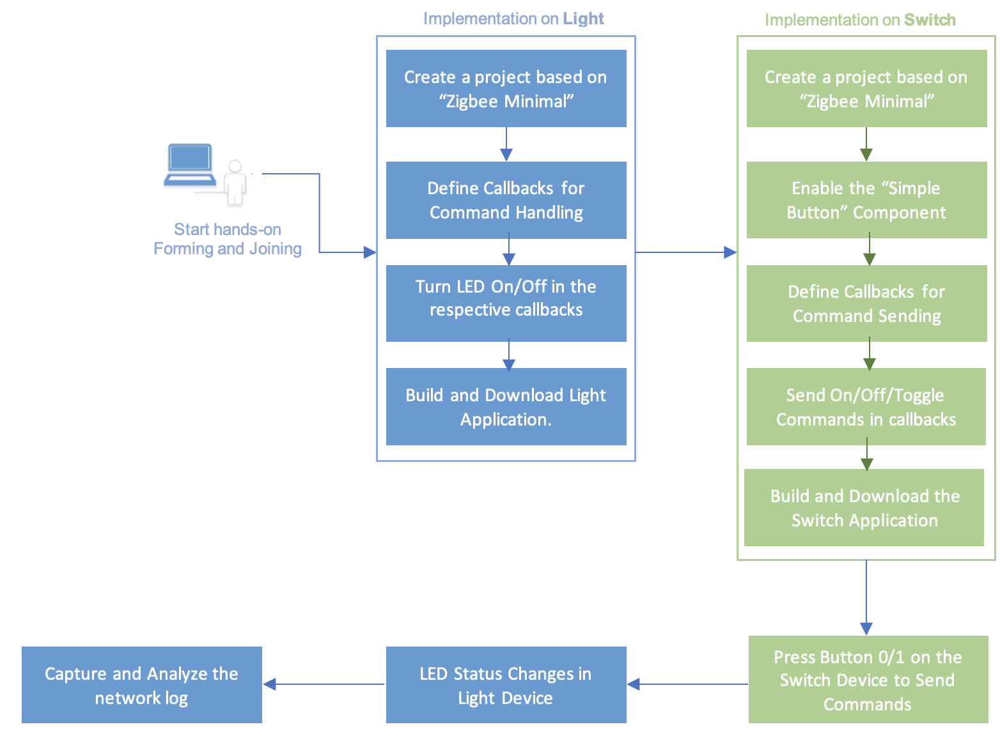
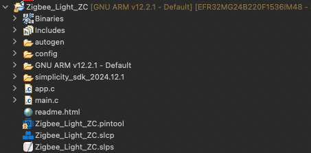
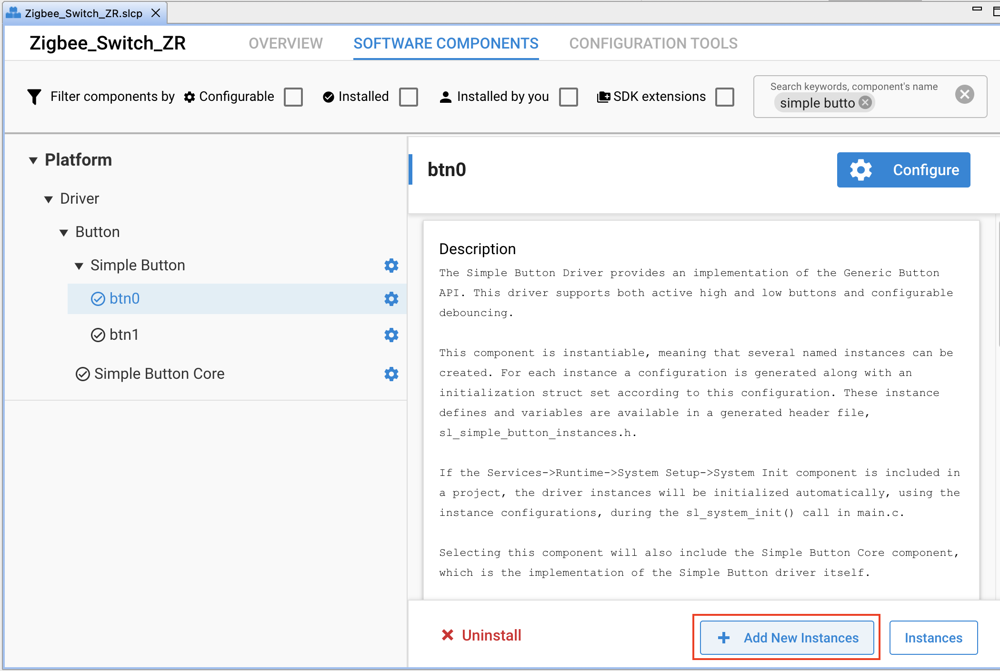
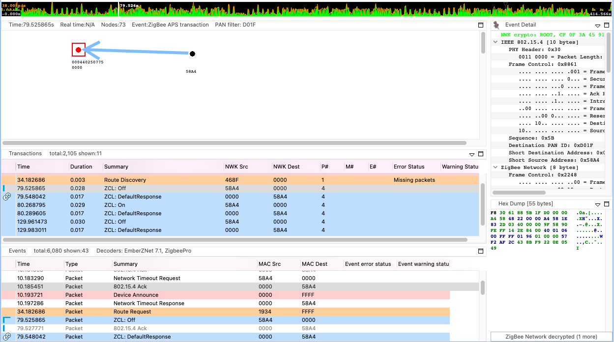
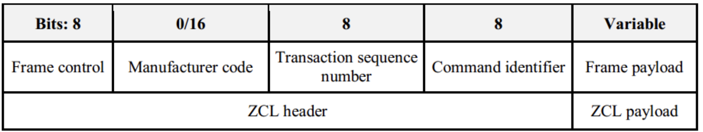
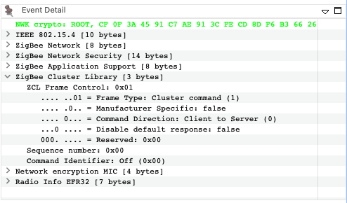
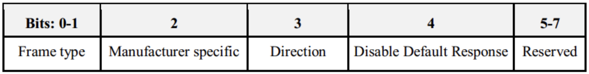

# 1. Introduction


## 1.1. Application features

The Zigbee boot camp is divided into four phases to show how an application should be built from scratch.
This module is the 2nd phase of the series “Zigbee Boot Camp” course.

- [The 1st phase, forming a basic network (Light), and a joining process (Switch) will be done using install code.](Zigbee-Hands-on-Forming-Joining.md)
- **[The 2nd phase, will prepare the devices to transmit, receive, and process the On-Off commands using APIs.](../Zigbee-Hands-on-Sending-OnOff-Commands/Zigbee-Hands-on-Sending-OnOff-Commands.md)**
- [The 3rd phase, the Switch will have a periodic event to execute custom code, in this case a blinking LED.](../Zigbee-Hands-on-Using-Event/Zigbee-Hands-on-Using-Event.md)
- [The 4th phase, the Switch will be able to store any custom data in its flash using Non-volatile memory.](../Zigbee-Hands-on-Non-volatile-Data-Storage/Zigbee-Hands-on-Non-volatile-Data-Storage.md)


## 1.2. Purposes

In the previous hands-on module [“Forming and Joining”](../Zigbee-Hands-on-Forming-and-Joining/Zigbee-Hands-on-Forming-Joining.md), we learned how to form a basic centralized Zigbee network and join the network. In this hands-on, we will demonstrate how to send ZCL on-off commands from the Switch node to operate the LED in the Light node.
As in the previous hands-on, the network will consist of two devices using BRD4162A (EFR32MG12).
The figure below depicts this hands-on workflow:

<div align="center">
  
</div>
<div align="center">
  <b>Figure 1-1 Sending On Off Commands Workflow</b>
</div>  
</br>


# 2. Sending On/Off Commands

In Phase 1 of the hands-on workshop, we created two projects, Zigbee_Light_ZC and Zigbee_Switch_ZR. These have been programmed into two separate devices which are now in the same network and ready to transmit and receive data on the network. In this phase, the Switch device should send one of the On/Off commands based on which button has been pressed. The Light application should respond by turning the LED1 on/off based on the received command. Our task is to prepare the devices for these features.

## 2.1. Command Handling on the Light Device

To become aware of any received command from the user application level, the **emberAfPostAttributeChangeCallback** callback function will be used. This callback is defined inside of the "WEAK" macro in protocol/zigbee/app/framework/util/global-callback.h. The application can override each of these weak definitions by simply adding a callback implementation to some application-level source file in this case we will do so in app.c.


<div align="center">

</div>
<div align="center">
<b> Figure 2-1 Application Code Source File. </b>
</div>  
</br>

Implement the application code as below: 

```
// Sending-OnOff-Commands: Step 1
void emberAfPostAttributeChangeCallback(uint8_t endpoint,
                                        EmberAfClusterId clusterId,
                                        EmberAfAttributeId attributeId,
                                        uint8_t mask,
                                        uint16_t manufacturerCode,
                                        uint8_t type,
                                        uint8_t size,
                                        uint8_t* value)
{
  if (clusterId == ZCL_ON_OFF_CLUSTER_ID
      && attributeId == ZCL_ON_OFF_ATTRIBUTE_ID
      && mask == CLUSTER_MASK_SERVER) {
    bool onOff;
    if (emberAfReadServerAttribute(endpoint,
                                   ZCL_ON_OFF_CLUSTER_ID,
                                   ZCL_ON_OFF_ATTRIBUTE_ID,
                                   (uint8_t *)&onOff,
                                   sizeof(onOff))
        == EMBER_ZCL_STATUS_SUCCESS) {
      if (onOff) {
        sl_led_turn_on(&sl_led_led0);
      } else {
        sl_led_turn_off(&sl_led_led0);
      }
    }
  }
}
```

## 2.2. Command Sending from Switch Device.

Moving to the Switch device application, the objective is to make use of the two WSTK buttons (BTN0 and BTN1), to turn the Light LED ON and OFF. The button operations are handled by the Platform > Driver > Button > **Simple Button** component, this component must be installed and two different instances btn0 and btn1 should be created as depicted in Figure 2-3. 

<div align="center">
  
</div>
<div align="center">
  <b>Figure 2-3 Simple Button Component Instances. </b>
</div>  
</br>

You can find the Simple Button component defined callbacks [here](https://docs.silabs.com/gecko-platform/4.1/driver/api/group-simple-button). Once the button changes its state ```void sl_button_on_change(const sl_button_t *handle) ``` is called in an interrupt context. Similar to [Section 2.1 Command Handling on Light Device](#2.1-Command-Handling-on-Light-Device) we will implement this callback in the app.c source file. In order to send commands it is important to consider that every command is stored in a buffer before being sent. The transmitted data buffer should be built up as follows:

- The actual ZCL command is made by the function below. Replace <> to “On” or “Off”.

```emberAfFillCommandOnOffCluster<>()```

- It has to be set which Client endpoint send to which Server endpoint.
```emberAfSetCommandEndpoints(emberAfPrimaryEndpoint(), 1);```

- Send the message as unicast to the device 0x0000, the Coordinator.
```emberAfSendCommandUnicast(EMBER_OUTGOING_DIRECT, 0x0000);```

- Locate the comment for step 2, and implement the complete function code as follows:

```
// Sending-OnOff-Commands: Step 2

#include "sl_simple_button.h"
#include "sl_simple_button_instances.h"
#define BUTTON0 0
#define BUTTON1 1

void sl_button_on_change(const sl_button_t *handle)
{
  EmberStatus status;

  if (SL_SIMPLE_BUTTON_INSTANCE(BUTTON0) == handle){
    if (sl_button_get_state(handle) == SL_SIMPLE_BUTTON_RELEASED){
      emberAfFillCommandOnOffClusterOn();
      
      emberAfCorePrintln("Button0 is pressed");
      emberAfCorePrintln("Command is zcl on-off ON");
      
      emberAfSetCommandEndpoints(emberAfPrimaryEndpoint(),1);
      status = emberAfSendCommandUnicast(EMBER_OUTGOING_DIRECT, 0x0000);

      if(status == EMBER_SUCCESS){
        emberAfCorePrintln("Command is successfully sent");
      }else{
        emberAfCorePrintln("Failed to send");
        emberAfCorePrintln("Status code: 0x%x",status);
      }
    }
  }

    if (SL_SIMPLE_BUTTON_INSTANCE(BUTTON1) == handle){
      if (sl_button_get_state(handle) == SL_SIMPLE_BUTTON_RELEASED){
        emberAfFillCommandOnOffClusterOff();
      
        emberAfCorePrintln("Button1 is pressed");
        emberAfCorePrintln("Command is zcl on-off OFF");
      
        emberAfSetCommandEndpoints(emberAfPrimaryEndpoint(),1);
        status = emberAfSendCommandUnicast(EMBER_OUTGOING_DIRECT, 0x0000);

       if(status == EMBER_SUCCESS){
          emberAfCorePrintln("Command is successfully sent");
        }else{
          emberAfCorePrintln("Failed to send");
          emberAfCorePrintln("Status code: 0x%x",status);
      }
    }
  }
}

```

## 3. Testing your project

The previous 2 sections presented how to make the devices send and receive commands through some APIs.

Build the applications and download the output files to the target devices. Please exit from the network log capturing before programming the device, because the debugger has no access to the chip while the Network Analyzer (or Energy Profiler) is connected.

**Note:** Please do not erase the device before programming, otherwise the "znet" tokens will be deleted, and the device cannot join the network and the Join the network chapter will have to be repeated.

Press BTN0 to send the ON command, and you will notice that LED1 on the Light turn on.
Press BTN1 to send the OFF command, and you will notice that LED1 on the Light turn off.

In the meantime, have a look at the CLI of the devices. The Switch should print something like the followings on the serial console:

```
T00000000:RX len 5, ep 01, clus 0x0006 (Unknown clus. [0x0006]) FC 08 seq 1A cmd 0B payload[00 00 ]
Button0 is pressed
Command is zcl on-off ON
Command is successfully sent

T00000000:RX len 5, ep 01, clus 0x0006 (Unknown clus. [0x0006]) FC 08 seq 1B cmd 0B payload[01 00 ]
Button1 is pressed
Command is zcl on-off OFF
Command is successfully sent
```

The serial console output of the Light is:

```
T00000000:RX len 3, ep 01, clus 0x0006 (On/off) FC 01 seq 1B cmd 01 payload[]
On/Off set value: 01 01
Toggle on/off from 00 to 01
On Command is received

T00000000:RX len 3, ep 01, clus 0x0006 (On/off) FC 01 seq 1C cmd 00 payload[]
On/Off set value: 01 00
Toggle on/off from 01 to 00
Off Command is received
```

The above transactions can be observed in the Network Analyzer as well. See Figure 3‑1.

<div align="center">

</div>
<div align="center">
<b>Figure 3-1 ZCL On/Off commands in Network Analyzer. </b>
</div>  
</br>


Take the on/off command as a example to filter the format of the General ZCL Frame, the ZCL frame format is composed of a ZCL header and a ZCL payload. The general ZCL frame SHALL be formatted as illustrated in the figure below.


<div align="center">

</div>
<div align="center">
<b>Figure 3‑2 Format of the General ZCL Frame </b>
</div>  
</br>

With the Network Analyzer, you can capture the network trace of the On/Off commands similar as below.

<div align="center">

</div>
<div align="center">
<b>Figure 3‑3 Captured ZCL On-Off commands </b>
</div>  
</br>

Frame Control
The frame control field is 8 bits in length and contains information defining the command type and other control flags. The frame control field SHALL be formatted as shown in the figure below.

<div align="center">

</div>
<div align="center">
<b>Figure 3‑4 Format of the Frame Control Field </b>
</div>  
</br>


• **Frame Type:** The Frame type in the On/Off command is 0b1 indicates the command is specific or local to a cluster (On/Off cluster).

• **Manufacturer Specific:** The value of Manufacturer Specific sub-field is set to false in the On/Off command, and the manufacturer code field will not be included in the ZCL frame.

• **Direction:** The Direction sub-field in the On/Off command is 0b0 indicates the command is being sent from the client side (Switch) of a cluster to the server side (Light) of a cluster.
The Disable Default Response sub-field in the On/Off command is 0b1. It means the Default Response command will only be returned if there is an error, also under the specified conditions documented by Zigbee Cluster Library Specification.

• **Manufacturer Code:** The manufacturer code field is 16 bits in length and specifies the assigned manufacturer code for proprietary extensions. This field SHALL only be included in the ZCL frame if the Manufacturer Specific sub-field of the frame control field is set to 1 that indicates this command refers to a manufacturer specific extension.
Because the Manufacturer Specific sub-field of the On/Off command frame control field is set to 0, so the Manufacturer Code will not be included.

• **Transaction Sequence Number:** The Transaction Sequence Number field is 8 bits in length and specifies an identification number for a single transaction.

• **Command Identifier:** The Command Identifier field is 8 bits in length and specifies the cluster command being used. And part of the command IDs for the On/Off cluster are listed below.

|ID  |Description|
|----|-----------|
|0x00|Off      |
|0x01|On       |
|0x02|Toggle   |

• **Frame Payload:** The frame payload field has a variable length and contains information specific to individual command types. Both the On and Off commands have no payload.

## 4. Conclusion

In this hands-on module, you learned how to send different ZCL commands and how to handle the received command from the user application level. As well as, how to install/uninstall different components in order for the application functionality to meet your needs.

This hands-on also demonstrate how to view and analyze the data being transmitted in the Zigbee network using the Network Analyzer tool.
