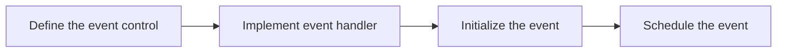

<details>
<summary><font size=5>Table of Contents</font> </summary>

- [1. Introduction](#1-introduction)
  - [1.1. Application features](#11-application-features)
  - [1.2. Purpose](#12-purpose)
- [2. Using Event](#2-using-event)
  - [2.1. Define the Event Control](#21-define-the-event-control)
  - [2.2. Implement the Event Handler](#22-implement-the-event-handler)
  - [2.3. Initialize the Event](#23-initialize-the-event)
  - [2.4. Schedule the Event](#24-schedule-the-event)
- [3. Testing your project](#3-testing-your-project)
- [4. Conclusion](#4-conclusion)

</details>

***

# 1. Introduction

## 1.1. Application features

The boot camp series hands-on workshop will cover four functionalities below, and the application development is split into four steps respectively to show how an application should be built up from the beginning.  
The exercise in this documentation is the 3rd exercise in the “Zigbee Boot Camp” series.  

- [The 1st phase, forming a basic network (Light), and a joining process (Switch) will be done using install code.](Zigbee-Hands-on-Forming-Joining.md)
- [The 2nd phase, will prepare the devices to transmit, receive, and process the On-Off commands using APIs.](../Zigbee-Hands-on-Sending-OnOff-Commands/Zigbee-Hands-on-Sending-OnOff-Commands.md)
- **[The 3rd phase, the Switch will have a periodic event to execute custom code, in this case a blinking LED.](../Zigbee-Hands-on-Using-Event/Zigbee-Hands-on-Using-Event.md)**
- [The 4th phase, the Switch will be able to store any custom data in its flash using Non-volatile memory.](../Zigbee-Hands-on-Non-volatile-Data-Storage/Zigbee-Hands-on-Non-volatile-Data-Storage.md)

## 1.2. Purpose

In the previous hands-on [“Forming and Joining”](../Zigbee-Hands-on-Forming-and-Joining/Zigbee-Hands-on-Forming-Joining.md) and [“Sending OnOff Command”](../Zigbee-Hands-on-Sending-OnOff-Commands/Zigbee-Hands-on-Sending-OnOff-Commands.md), we learned how to form a basic centralized Zigbee network and join the network, and how to send on-off command from the Switch node to the Light node in the Zigbee mesh network.  
In this hands-on, we provide step-by-step instructions to demonstrate how to use the Zigbee Stack event mechanism to schedule events on the Switch node.  
The figure below illustrates the working flow of this hands-on.  



**Note**:
Before all the individual steps would be performed, please make sure that both the hardware and software are ready for the development. 

# 2. Using Event

The Zigbee application framework and its associated cluster code use the Zigbee Stack event mechanism to schedule events to run a piece of code at the desired time interval. At a high level, the event mechanism provides a central location where all periodic actions taken by the device can be activated and deactivated based on either some user input, an over-the-air command or device initialization. It allows the Zigbee application framework to know precisely when the next action is going to occur on the device. This is extremely important for sleeping devices that need to know exactly when they must wake up to take some action, or more importantly that they can't go to sleep because some event is in progress. Another benefit of using the Zigbee event mechanism is RAM and Flash footprint reduction.  

The Zigbee application framework has two types of events: custom events and cluster events. Custom events are created by the Zigbee application framework user and can be used for any purpose within the application. Cluster events are specifically related to the cluster implementations in the Zigbee application framework's components.  

A custom event consists of **`two parts`**: **`the event handler`**, called when the event fires, and **`the event handle variable`**, which is used by the application to manipulate the event. The Zigbee application framework provides the following APIs to manipulate the event:  

- **`Initialize the event`**, this will set up a relation between the event handle and the event handler. Once the event is activated, the corresponding event handler will be called.
  
  ```C
  void sl_zigbee_af_event_init(sl_zigbee_af_event_t *event,
                          void (*handler)(sl_zigbee_af_event_t *));
  ```

- **`Schedule the event`**, to schedule the event with a specific delay, so that the event will be activated after a specific amount of time. Setting the event to `active` state means to schedule the event with a zero delay. Setting the event to `inactive` state means to cancel a scheduled event.
  
  ```C
  void sl_zigbee_af_event_set_active(sl_zigbee_af_event_t *event);
  void sl_zigbee_af_event_set_inactive(sl_zigbee_af_event_t *event);
  void sl_zigbee_af_event_set_delay_ms(sl_zigbee_af_event_t *event, uint32_t delay);
  ```

- **`Get status of the event`**, to get the current status of the event, like to get if the event is scheduled, to get the remaining time of the event, etc.
  
  ```C
  bool sl_zigbee_af_event_is_scheduled(sl_zigbee_af_event_t *event);
  uint32_t sl_zigbee_af_event_get_remaining_ms(sl_zigbee_af_event_t *event);
  ```

## 2.1. Define the Event Control

The event control must be defined as a global variable. You can define it in any source file you want. The recommended is `app.c`.

```C
static sl_zigbee_af_event_t ledBlinkingEventControl;
```

## 2.2. Implement the Event Handler

The event handler is normally defined in the same source file as the event control. Below is a simple example:

```C
#include "sl_led.h"
#include "sl_simple_led_instances.h"

static void ledBlinkingEventHandler(sl_zigbee_af_event_t *event)
{
  sl_led_toggle(&sl_led_led0);
}
```

## 2.3. Initialize the Event

An event consists of the event control and the event handler. When the event is activated, the event handler will be invoked. This relationship is set up when the event is initialized. To initialize an event, we need to call this API `sl_zigbee_af_event_init`. So we need to add some code to call this API in the application. Normally, we will call it in the *Main Init* callback which is `sl_zigbee_af_main_init_cb`. This callback function is called when the application framework initialized. It gives the application a chance to do any initialization required at system startup. It can be imagined like a function at the top of the *“main()”* before the classical “*while(true)*”. Normally we recommend to add the implementations of the callback functions in the source file `app.c`.

```C
void sl_zigbee_af_main_init_cb(void)
{
  sl_zigbee_af_event_init(&ledBlinkingEventControl, ledBlinkingEventHandler);
  sl_zigbee_af_event_set_active(&ledBlinkingEventControl);
}
```

## 2.4. Schedule the Event

The event is pretty much like a timer. It must be scheduled with a specific delay from the current time, then the event handler can be invoked after the exact time delay. And it's like a one-shot timer, that means you have to schedule it again if you want the event handler to be called again. In this lab, we will schedule the event with 5 seconds delay when the system starts up, and then schedule it every 2 seconds. To achieve that, we need to modify the callback function `sl_zigbee_af_main_init_cb` and the event handler.

```C
#include "sl_led.h"
#include "sl_simple_led_instances.h"

static sl_zigbee_af_event_t ledBlinkingEventControl;

void ledBlinkingEventHandler(void)
{
  sl_led_toggle(&sl_led_led0);

  //Reschedule the event after a delay of 2 seconds
 sl_zigbee_af_event_set_delay_ms(&ledBlinkingEventControl, 2000);
}

void sl_zigbee_af_main_init_cb(void)
{
  sl_zigbee_af_event_init(&ledBlinkingEventControl, ledBlinkingEventHandler);
  sl_zigbee_af_event_set_delay_ms(&ledBlinkingEventControl, 5000);
}
```

# 3. Testing your project

Build the applications and download the image to the Switch device. Press the Reset button on the starter kit, you will notice that the LED0 on the board will be turned on after few seconds delay, and then blink with 2s interval.  

# 4. Conclusion

In this hands-on, you learned how to create a custom event, define the event function and event control structure, and implement the event function for scheduling the LED blinking event.  
