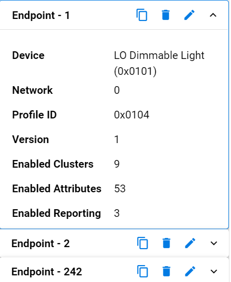
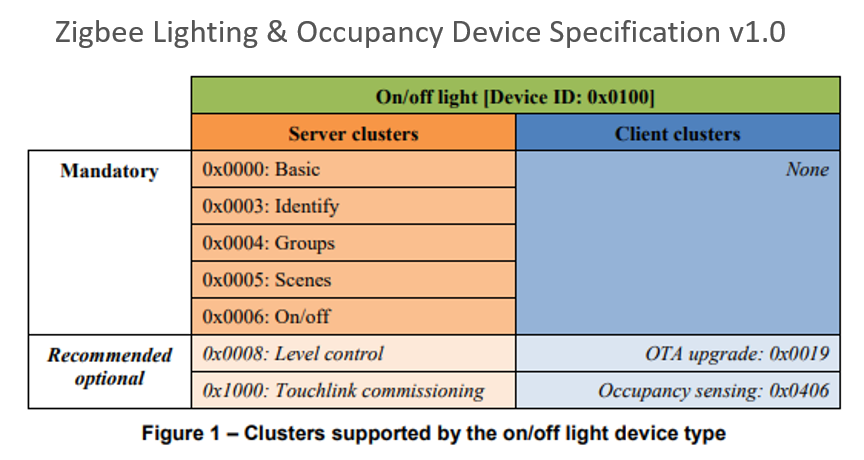

# Zigbee Introduction: Clusters, Endpoints, and Device Types

## Cluster and Attributes

Each device definition in a profile contains clusters. These clusters are a set of message types related to a certain device function. Some examples include a Level Control, On/Off, Temperature, and much more.

Each cluster is enumerated by a 16-bit ID. Similar to the way that profiles are enumerated.

The clusters are defined in an organized fashion called the ZigBee Cluster Library often referred to as the ZCL. The ZCL defines a large set of clusters which can be used in any public profile. Regardless of if you are using Zigbee 3.0 or Smart Energy, if there is any overlap between the two profiles, you can define the same set of behavior by inheriting it from the same library.

The ZigBee Cluster Library also groups the clusters in something called "functional domains". An example of a functional domain would be lighting. The types of clusters in this functional domain would consist of color control, ballast control and lighting.

If you are interested in the ZCL, please go to the Zigbee.org website where you can download the ZigBee cluster library for free.

Cluster has 3 components:

- Attributes: a set of properties which is maintained on the device

- Commands: which is what the device is responsible for being able to send or receive

- Client-Server Model: a distinction of a client and server side. The client is the side that sends a message to the server. The server is the side that actually contains the attributes

For example, in a lighting cluster, the client side would typically be a switch which sends messages, such as on/off commands, to a server which would be a light. The light, being the server, would contain the attributes such as if the devices is on or off, and what level of brightness that light is at.

The ZCL also stresses a standardized message format for commands which ensures a level of interoperability that allows for ease of interoperable use between devices.

In our example lets say we have a light with the Level Control Cluster. The Light has a set of server side attributes which the device maintains. The commands available show the different commands a client such as a switch could send to the light. The light then would make changes to its attributes after it made some local control change.  

A simplified light and switch example would be to take a look at the On/Off cluster. On the Server side we have the On/Off attribute. This is the state of the light our server for the On/Off attribute. The client would not need to store this value as it does not describe the devices state. The light here can receive commands to change its state of the On/Off attribute. For example On, Off, and Toggle. The ZCL covers all attributes and commands but any easy way to review functionality is by searching through the ZCL clusters tab in AppBuilder. The available commands are on the client side, our switch, that correspond to the functionality on the light. This way a light and switch that use the On/Off Cluster can understand the messages sent and received. 

| | Server | Client |
|-|--------|--------|
| Attribute | On/Off | None |
| Received Commands | On Off Toggle | None |
| Generated Commands | None | On Off Toggle |

## Endpoints

An endpoint is a service point on a Zigbee node. So, each endpoint implements a single device type from a single application profile. As an example, we could have a thermostat with 4 user defined endpoints. Endpoint 0 is still the ZigBee Device Profile, or the ZDO endpoint. However, endpoint 1 could be an HA endpoint acting as a thermostat device, while endpoint 2 is also HA, but acting as an On/Off Output. Our third endpoint could be on the Smart Energy profile, and could be an In-Home Display, while our last endpoint, endpoint 4, could be a proprietary endpoint. All of these device types would make up an application for one node.

In the table below we have the endpoints for our Z3 Light Sample Application. Endpoint 1 is using the HA profile ID and is a LO Dimmable Light using a Centralized network configuration. Endpoint 2 is also using HA profile ID but is a LO Extended Color Light and is using the touchlinking (or decentralized) network configuration. The 3rd endpoint in this table has a special value of 242 which is reserved for the Green Power profile ID.

There can be, in theory, up to 255 endpoints defined within a node. However there is an endpoint 0 which is built in by the stack and reserved for Zigbee Device Objects, and endpoints 240 to 255 which are reserved for special future functions. This effectively leaves endpoints 1 through 239 for user applications.

Endpoint 0 is currently used as the ZigBee Device Object endpoint for network configuration and administration and is generally used by the stack for gaining information about other devices. However, any application could use this endpoint as well, to gain information about other devices.

Endpoint 255 is used as a generic broadcast endpoint. So if you were attempting to send a message to a device, but were unsure which endpoint it was on, you could send to endpoint 255 of a node. In that case, it would be sent to all of the endpoints.

Each endpoint, when queried, will return a cluster list and a descriptor. The cluster list describes the capabilities of the device by enumerating supported client and server clusters. The descriptor contains information about which profile that endpoint is implementing, what the device ID is within that profile, how many supported client and server clusters it supports, and finally, it may contain a bitmask which indicates the version and capabilities of the application profile.

Another simplified example for multiple endpoints is a power strip. If a singular endpoint was implemented on this device, then it would be possible to turn the strip on and off. Let’s say you wanted to control each outlet individually. This would be a good case to add an endpoint for each outlet. This way it would be possible to turn on or off a singular powered device and not affecting all powered devices on the strip.

## Device types

So which clusters and attributes do we implement on our device? As was hinted in the Endpoints section and the Z3 Light sample, the ZCL defines requirements for a device type. Each Device Type has a set of mandatory clusters so that any device reacts the same way at least for an obligatory set. It is always possible for a manufacturer to add optional functionality, but must be aware that optional functions will not be supported on all like devices. In Figure 1 from the Zigbee Lighting and Occupancy Device Specification we see that an On/Off Light with Device ID 0x0100 has a set of Mandatory clusters and Recommended optional clusters.

