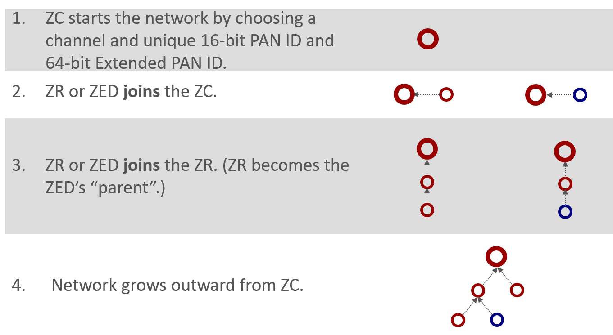
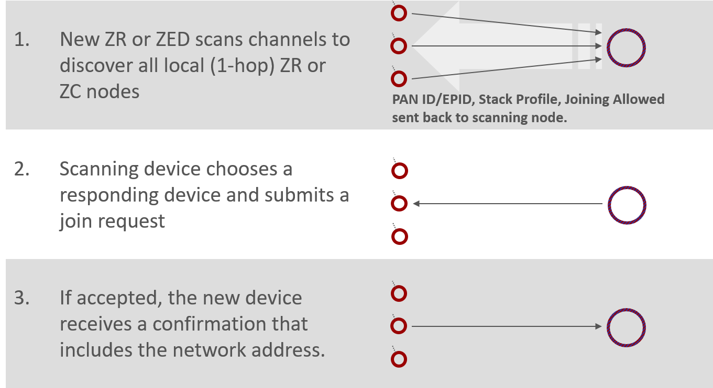
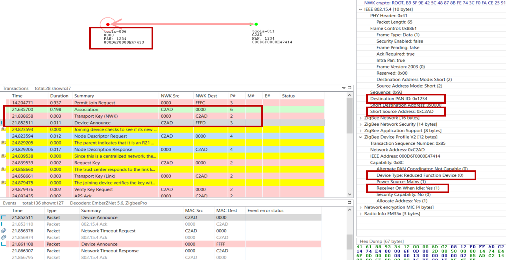
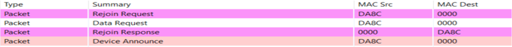
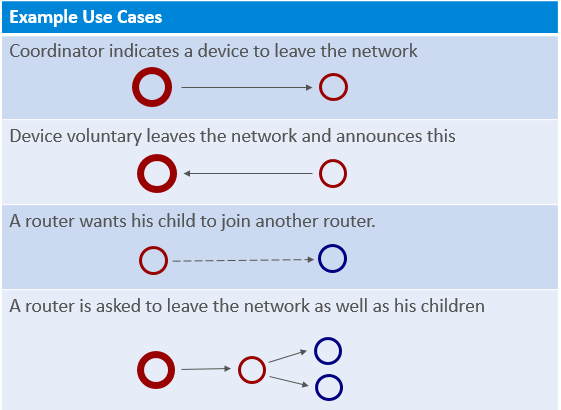
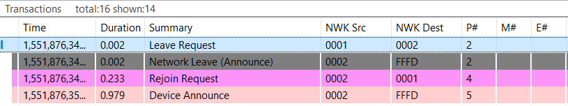
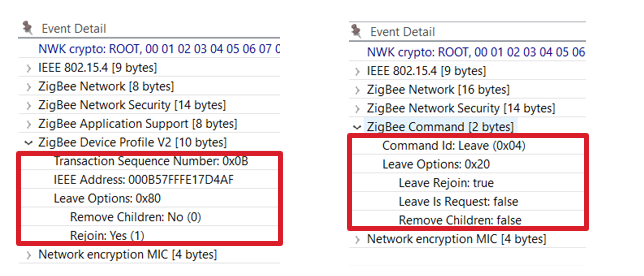

# Zigbee Introduction: Network Activities (Form, Join, Rejoin, Leave)

## Creating a Network

When a Zigbee network starts, it all begins with the __Zigbee coordinator__ (ZC). This is shown in our diagram here.

- The __Zigbee coordinator__ (ZC) is represented by a thick red circle

- The  __Zigbee Router__ (ZR) is represented by thin red circles

- The __Zigbee End Device__ (ZED) is represented by thin blue circles

The coordinator begins by choosing a channel that would be one of the 2.4 GHz allocations designated 11 through 26. These represent channels with a center frequency from 2.405 GHz all the way up to 2.480 GHz. Then the coordinator is responsible for choosing a unique 2-byte PAN ID as well as a unique 64-bit extended PAN ID. If you recall from our last presentation regarding PAN IDs, the short PAN ID is generally used to divide the network, but in case a conflict arises the extended PAN ID is our backup scheme.

Once the coordinator has chosen the channel, PAN ID and extended PAN ID, the network grows by allowing more nodes such as a router or an end device to join through the existing coordinator. The basic idea here is that a device can’t get into the network except through a node that is already in the network. The exception, of course, is the coordinator who has this special property of being able to form the network without having to get permission from anyone.

After the first router joins the coordinator after network formation, future nodes can join the network through the coordinator or the new router. They cannot join through the end  device because an end device doesn’t have the ability to route. As the network grows we start to form a tree-like structure that builds out from the coordinator, with the end devices generally being on the fringes of the network.

## Joining a Network

From the perspective of joining a network - suppose that your device who wants to come into the network is embodied by this purple circle, neither red nor blue yet because it hasn’t actually joined the network and it doesn’t have a node type yet.

First of all the device has to scan across the channels, to decide what networks are available. Then it has to solicit router and coordinator nodes to determine what networks are there, and which are available devices through which it can join. This process is called an Active Scan, an IEEE 802.15.4 MAC concept where we send the beacon request which is a single hop broadcast that transcends all the PAN ID boundaries. Every device in every 15.4 network within range can hear this beacon request, and they are supposed to respond with some indication of their network such as PAN ID, extended PAN ID and stack feature set, and a Boolean parameter that says whether or not there’s any joining allowed. This “joining-allowed” property is done on a case-by-case basis for each node. So it may be that there are two nodes in the available network but only one of those nodes is actually allowing new devices to enter. It’s something like having multiple access points into the network where they can be enabled or disabled for accessibility to new devices at will. The other information that’s not displayed in the diagram here is that there is also information from the router or coordinator about its ability to sustain additional end devices. So if you are an end device wanting to join the network, a potential parent might say it could let you into the network if you were a router, but because it can’t support any more end devices, it can’t let you in. This allows the end device to rule out that node as a potential parent.

In this diagram, in action number 1 we see the large arrow soliciting the devices with its beacon request, and the individual network indications are beacons coming back. Whichever beaconing device is heard best becomes the parent node of the joining device. Once this is chosen, the joining device submits an association request to the chosen node from the chosen network. This is action number 2 – the arrow going across to the chosen device. At this point there is no security authentication; it’s simply that if someone submits a join request to a node and it is permitting joining, and it is able to accept a new device, then it should create and send a random address to the joining device, and now the new device is successfully associated into the network. This is shown in action number 3. This process of association is really a very simple one-to-one device process and doesn’t involve contact with other nodes. After the association takes place there is a security authentication step with the trust center device to complete the story, however we will not go into that.

## Network Analyzer Capture of Joining a Network

Below is a log of the Network Analyzer to help illustrate the joining process. If you are not already familiar with this tool, we recommend that you take the time to learn about Network Analyzer.

On the top, you see a visual representation of the network, and the arrows showing the transaction between the nodes. The “__Transactions View__” shows all the transactions between nodes, the “__Event View__” showing all the messages separately, this is a bit overwhelming because the message of a transaction can be scattered over time. The “__Events detail__” view is showing the different fields inside the selected message in the “__Events View__”. More information about the Network Analyzer will be handled in the “__Studio: Key Concepts Network Analyzer__” presentation.

The joining device sends an association message to the coordinator of the network, this the green message in the log. After this the coordinator will share the network key, so the device can encrypt and decrypt the messages. After this is done the joining device is announcing itself in the network, this way the whole network knows what kind of device the just joined device is. The details of the device announcement can be seen in the “Event Detail pane” on the right. Here we see in the top red box the PAN id of the network, also here is the short Id of the joined device visible. The following 2 red boxes are more device describing, from these boxed you can determine the device type, coordinator, router, end device or a sleepy end device. Routers and Coordinators are full function devices, while an end device or a sleepy end device is reduced function devices. For a sleepy end device, the receiver will sleep when the device is in an idle state, while the other devices will always listen to the channel.

After Device Announce, the device then requests a link key update. For further information and more details on link key update, we recommend the “__Network Concept: Zigbee Security__” and “__Zigbee App Layer: Zigbee 3.0 Security Considerations__”

## Rejoin a Network

Rejoining is a way for a node to reconnect to a network of which it was previously part. Rejoining is necessary in three different circumstances:

- Sleepy devices that may no longer be able to communicate with their parent.

- Devices that have missed the network key update and need an updated copy of the network key.

- Devices that have missed a PAN ID update and need to discover the network’s new PAN ID.

When a device tries to rejoin, it may or may not have the current network key. Without the correct network key, the device's request to rejoin is silently ignored by nearby routers. Therefore, a device has two choices when rejoining: a secured rejoin or a trust center rejoin. If the rejoining device has the correct network key it will do a secure rejoin to a neighboring router. A router/coordinator device will always provisionally accept a NWK layer Rejoin command with the active network key. If the network key is invalid the rejoining device is will request a new network key from the trust center, this is called a Trust center rejoin. Note that neither of these rejoins cases requires the MAC Permit Association otherwise the procedure it the same as the Association procedure.

Let’s look at the above picture, this is part of a log from the Network Analyzer, where a device is sending a rejoin request to the coordinator. The coordinator is granting the device access to the network with a network response command. The message after this is a device announcement, this is used to notify that the device is on the network.

For more detailed explanation we recommend the “__Network concept: Zigbee Security__” and “__App layer: Zigbee 3.0 Security Considerations__”

## Leaving a Network

There are multiple ways to request a device to leave the network.

- __The ZDO leave command__ which can be indirect or direct. With the indirect way we request the parent of the end device to handle the leave of the end device. This can be useful with end devices. The direct way of a leave request will address the leave request to the device directly. This can be used for routers and end devices. (Note that messages for a sleepy end device may time out before they are delivered.)

- __APS Remove Device__ is another way to request a device to leave on the APS layer, this gives you the opportunity to encrypt the message.

If a device is receiving a leave request and then leaves, it sends __a leave announcement__ to notify the rest of the network. This gives the opportunity to the rest of the network to take adequate actions, such as updating their routing tables.

The leave announcement can also be sent to the network as a result of device voluntarily leaving the network; here you can think of it as a graceful power down.

There are some example use cases of leaving a network and you can see below figure.

1. A coordinator that requests a device to leave the network, this is used for example when the joining process is not successfully completed.

2. A device that is voluntarily leaving the network. There the device is only sending the leave announcement.

3. A router that is requesting an end device to join another router; this can be a result of a router leaving the network and allowing its end device children to remain in the network.

4. A coordinator that is asking a router to leave the network, as well as its end device children. The router will first request the children to leave the network, and after that leave the network itself.

## Example of ZDO Leave

Let’s see how a network leave looks like in the Network Analyzer

In the above figure you can see the transactions where a device is asked to leave and then rejoin the network. First, device 0x0001 is requesting device 0x0002 to leave the network.

In the leave request, the Rejoin bit is set to True while the Remove Children bit isn’t set.  This message is processed by device 0x0002 which sends a network leave announcement, the event details of which is shown on the right side. In this message we see that the Leave Rejoin bit is set, and other rejoin options are cleared. The “Leave is Request” is set when the device is leaving the network by a request; when it’s cleared the leave is initiated by the device itself. The Remove Children option bit is set when the children of the device are also removed, and cleared when this is not the case.  

This completes the leave cycle, but the rejoin bit is set in this example so the device is rejoining the network again. This can be seen in the log, by the Rejoin Request and the Device Announcement message later.