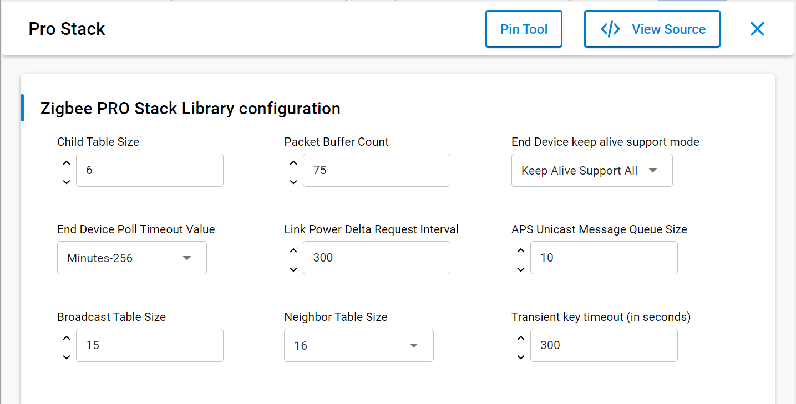
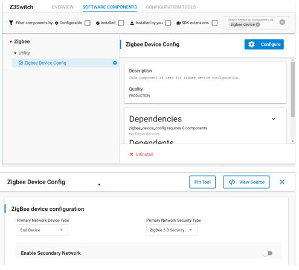
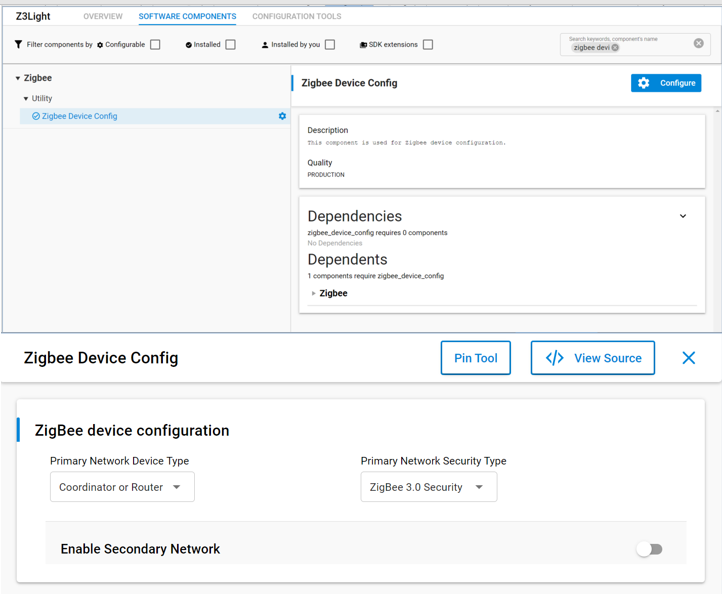

# Node Types, PAN IDs, extended PAN IDs and Addressing in EmberZNet

## Node Types

### Introduction

There are three node types in a zigbee mesh network. The differences among these types of nodes or devices mainly come down to their functionality and how they interact with other nodes in the network.

- __Zigbee Router__ (ZR): is the backbone of the mesh network as it is responsible for getting messages from A-to-B.

- __Zigbee end-devices__ (ZEDs): are leaf nodes to the mesh network with usually a router as a parent node.  They can also be sleepy but more on that later.

- __Zigbee Coordinator__ (ZC): a router with added responsibilities to govern the network

Whether the device should be a Router / Coordinator OR and EndDevice/Sleepy end device or a Router only should be decided in the design phase of the application. Changing the device type dynamically is not supported and should be avoided. One exception is when a device is configured to be a router / coordinator. These devices can implement both the NetworkCreator and NetworkSteering plugins and if said device is creating a centralized network it shall become a coordinator. Otherwise it can join another network as a end device.

Zigbee implementations before 3.0 do something similar with the Form and Join API calls.

### Zigbee Router

Zigbee Routers are mainly responsible for routing the messages of the mesh network. They can also act as end devices -> Have endpoints and added functionalities.

Line powered devices need to be chosen as Routers for the following reason:

- Since routers are relaying messages they should be ready to receive messages all the time. They always need to be powered and never in low power mode with the radio offline.
These devices should be planned to be powered as long as we want the network to function.

To setup a ZR in EmberZnet make sure you have selected Router as a device type under Znet Stack in appbuilder. Also you must enable the Zigbee PRO stack library in the plugins tab.

Also you can configure the different buffers and tables associated with router functionalities.

Typical example of a line powered router ZigBee device is a Smart Lightbulb.

Such devices are represented with a black dot in network analyzer.

### Zigbee End Device

End devices are devices that don’t participate in any routing.

The only concept of routing that they have is to send things to their parent or get things from their parent.
When I say parent I mean there is a router node, this can be the coordinator, that is responsible for that end device, so it bears the responsibility of forwarding messages out and proxying messages in for that end device.
An end device relies on its parent for communication to the network. If that communication is lost, the end device then has to go out and find a new parent, and re-attach itself to the network through this new parent.

To setup a ZR in EmberZnet make sure you have selected End device or sleepy end device as a device type under ZNet Stack in AppBuilder.

Aslo you must enable the Zigbee PRO leaf library in the plugins tab.

You can see this contains similar options to the stack library it is basically a reduced stack library for end devices.

This is also the place where you can configure the different buffers and tables associated with end device functionalities.

Typical example of a end device or sleepy end device is a wireless remote or switch for a smart light.

Such devices are represented with a green dot in network analyzer.

### Zigbee Coordinator

The coordinator is the most important part of the Centralized Zigbee Network. __Only one coordinator is allowed per Network__. It is the node that form the network. The shortID of the coordinator is always 0x0000. Can also be a Trust Center (more on that in other modules) and network manager. This could be a Single Point of Failure -> Hence the TC backup and restore mechanisms.

In network analyzer the typical colors associated with the node type is red.

In the real world such devices are usually also part of gateways towards other parts of the world like the Amazon Echo.

## Addressing in Zigbee

### Network addresses

#### PAN ID

The PAN, or Personal Area Network, is separated from other networks through its PAN ID. This is a 16-bit identifier that all nodes in the same PAN will share. So it’s something akin to a subnet mask in the Ethernet world in that you generally would only be communicating with devices within your local network, which is the PAN in this case. This identifier is placed into the low-level MAC-layer header in every out-going packet, and it allows devices that receive the packet to filter out the messages that don’t pertain to their network.

They can compare it against their own PAN ID, and decide if this is a message from someone in their own network, or if it’s from someone in a different network that just happens to be on this channel so there’s no need to try to decode or decrypt it.

The PAN ID is chosen by the coordinator upon network formation. Because the PAN ID is the distinguishing factor between one network and another, it should be random to unsure its uniqueness. It’s recommended that you select a random 16-bit value for your PAN ID that keeps your network from coinciding with any other network that happens to exist in the area.

Now, what if you happened to pick a PAN ID that’s already used by another network? Or what if you did pick a random PAN ID that wasn’t in conflict with any other network, but later another network grew to overlap with yours? If the PAN ID conflict ever happens, the stack can in fact detect such a conflict and can update its PAN ID automatically and inform all the nodes in its network to move to the new PAN ID, so that each node can continue communicating with nodes in its original network and exclude anyone on the conflicting network. You may be wondering how the stack does this. The answer is it is done through the use of the extended PAN ID

#### Extended PAN ID

Extended PAN ID is another network identifier known by all nodes in the PAN.

While the normal short 16-bit PAN ID is transmitted over the air in all the packets because it’s short and simple, the 64-bit extended PAN ID is rarely transmitted over the air. The extended PAN ID is also unique for every PAN, and it’s basically used as a backup criteria when the 16-bit PAN ID is not enough to always distinguish one network from another. For instance, when a PAN ID conflict occurs and you want to notify all devices in your network to move, the way that you distinguish your network from the conflicting network is, those devices in your network all share the same extended PAN ID. The extended PAN ID is highly unlikely to ever conflict because it has 64 bits compared to the 16 bits in the short PAN ID.

The extended PAN ID is also chosen by the coordinator during network formation. It’s only sent over the air in response to an Active Scan when nodes are soliciting the network, or when a PAN ID update is occurring.

It’s also a useful factor in allowing you to select the network. If you are trying to come into a network rather than form one, you might wonder how to tell which networks are available. The way the networks are distinguishable from one another is not only in the PAN ID but also in the extended PAN ID. You might want to do something special where you decide you are only going to use a certain subset of extended PAN IDs so that you can distinguish your networks from other networks, but just don’t limit yourself too much, because the more you limit this the more likely that you have a conflict, and if your extended PAN ID ever conflicts there’s really nothing you can do to fix that. It’s a little like a WiFi SSID, except that those can be the same between networks and this one can’t.

#### Node address

Besides their network-wide criteria, one node is distinguished from another by its individual node addresses.

A node has a short address and a long address. The long address is the IEEE-assigned MAC address, or EUI-64. It is a 64-bit address that is globally unique, meaning no two IEEE-based radios in the world should ever have the same EUI-64. This is generally assigned at manufacturing time. They are assigned when the chips come out of our manufacturing facility before they arrive to you, and they will never change. That’s how you tell one radio from another. But because 64 bits are a lot of data, this long address is not sent over the air very often.

Most of the time the much shorter, 16-bit address is used over the air. This is known as the node ID and unique within a network, similar to an IP address in Ethernet world. It is assigned as the node enters the network, and it’s supposed to be unique within that network. There may be two networks each of which has a node with the same node ID, but because they in different PANs, it doesn’t matter.

Note that it’s possible for two nodes to have chosen the same random node ID when they enter the network. If that happens, much like the PAN ID scheme, there is a method for conflict resolution. When the nodes notice the conflict, based on the EUI-64 information as a fallback, they can agree upon new addresses. So the nodes can change addresses at run-time if required, based on a conflict.

In addition to addresses of the node, there are also concepts of addresses within the node these are Endpoints and Clusters and they are explained in the “Clusters Endpoints Devices” training module.