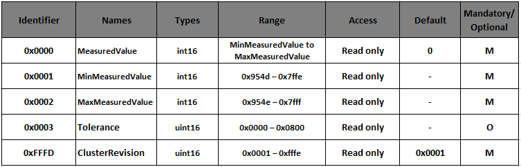
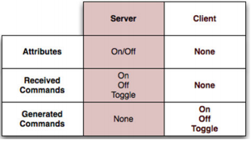
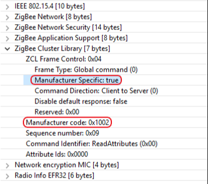

# Zigbee Introduction: Overview of Zigbee Cluster Library (ZCL)

Zigbee not only defines the MAC/PHY and Network layer standard but also defines the application layer protocol - Zigbee Cluster Library.
This training module focuses on the Zigbee Cluster Library. The specification is available for public download at www.zigbee.org.

## Overview

### Cluster

- Represents a specific functionality through defined Attributes and Commands

- Stresses a standardized message format for attributes and commands which ensures interoperability that allows for ease of interoperable use between devices

- Uses “client” and “server” model of communication

- Supports Manufacturer Extensions

### Zigbee Cluster Library (ZCL)

- Is a repository for clusters for use in public profiles

- The same cluster (and ID) can be used in multiple profiles

## Attribute

Key concepts in a cluster include data, messaging, and the direction of communication. An attribute is data associated with a cluster. Each attribute declares a 16-bit identifier, a data type, a read-only or read/write designator, a default value, and supported by mandatory or optional.

The following table lists some of the attributes of Temperature Measurement Cluster. The cluster server supports five attributes, Tolerance attribute is optionally supported. All of these attributes are read-only, indicating that any write attempts to them will fail.

Cluster Revision attribute is a global attribute which is introduced in revision 6 of the ZCL. The Global attributes are defined for every cluster instance on a device and function as normal ZCL attributes. This attribute is a way to version each of the individual cluster specifications, to improve backwards compatibility, and allow for testing of specific versioned cluster behavior. This Cluster Revision attribute is incremented for every major change to each cluster’s specification.

## Command and Client-Server Model

Commands are divided into two types according to their cluster scope: global and cluster-specific.

__Global Commands__ are mainly used for manipulating the attributes (such as read, write and report attributes), and they are not specific to any cluster.

__Cluster-Specific Commands__ are part of the cluster definition, and include the payload format, support requirements (mandatory, optional), and behavior on receipt of a cluster-specific command. For example, the ZCL On/Off cluster defines three mandatory commands (OFF, ON, and TOGGLE) as well as several optional commands.

Each cluster has a distinction of a client and server side.

The server is the side that actually contains the Attributes. The client side is usually the one that reads and/or modifies the attributes. For example, in a On/Off cluster, the client side would typically be a switch which sends messages, such as on/off commands, to a server which would be a light. The light, being the server, would contain the on/off attribute to indicate the devices is on or off.

## Manufacturer Extensions

The ZCL allows extension of the existing library in several ways: users may add manufacturer specific commands or attributes to existing clusters, or they may define entirely new clusters that are manufacturer specific.

Manufacturer-specific commands are identified by setting a special bit in the ZCL frame control and including the manufacturer code (received from the Zigbee Alliance) in the ZCL frame. This guarantees that manufacturer-specific extensions do not interfere with other manufacturer-specific extensions or existing ZCL clusters.

Manufacturer-specific clusters must use the cluster ID range of 0xFC00-0xFFFE.