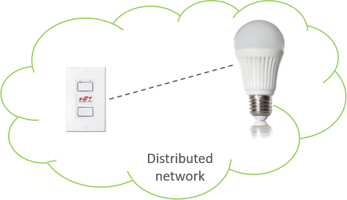
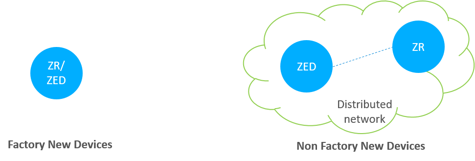
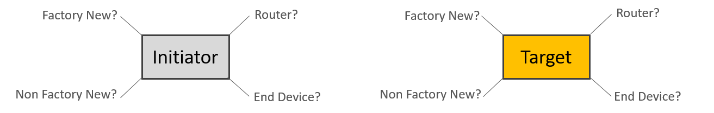
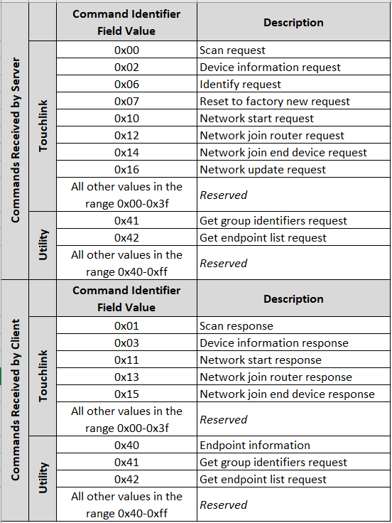
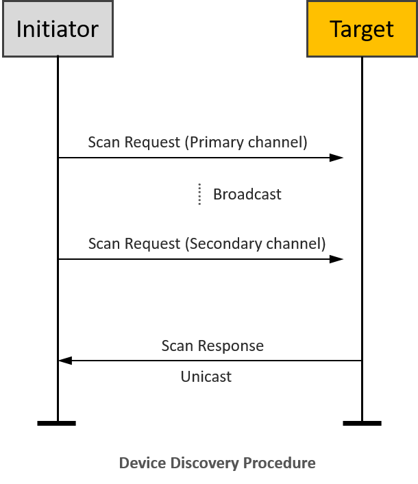
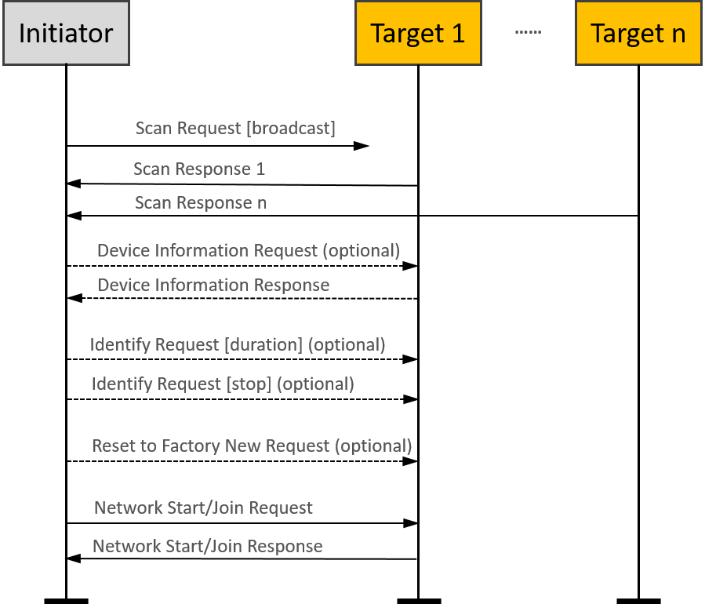
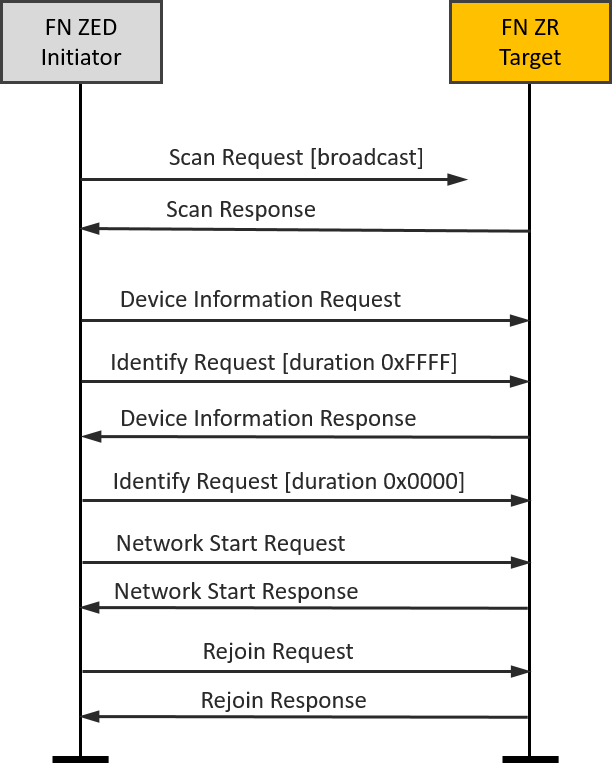
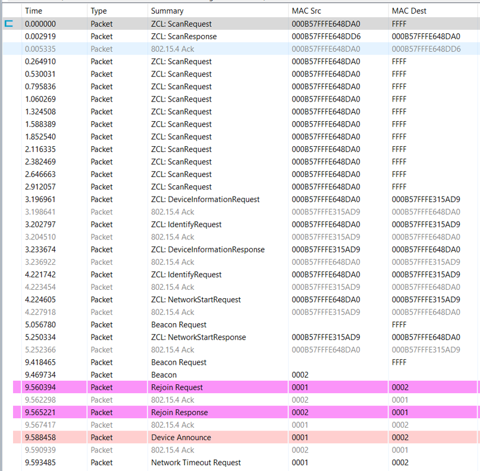
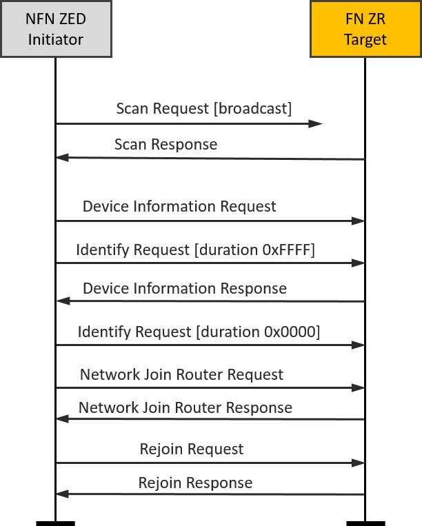
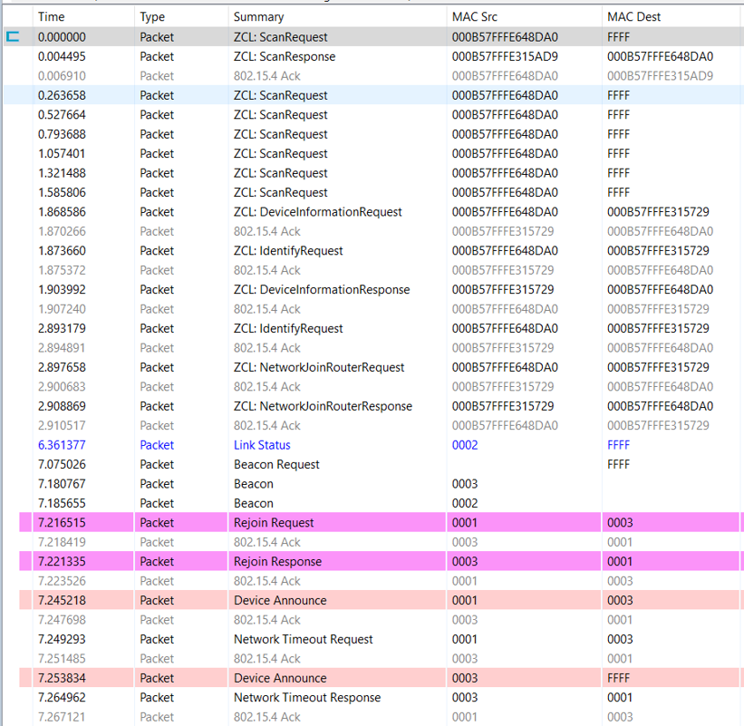

# Zigbee Introduction: Touchlink Commissioning

## Quick Review

As we know, touchlink commissioning is used in the ZLL network. It was initially developed to easily integrate devices in connected lighting systems that follow the ZigBee Light Link(legacy) standard. The idea of touchlink commissioning is to facilitate close physical proximity(approx. 10 cm) instead of cryptographic authentication.

Zigbee 3.0 inherited the touchlink commissioning procedure as an optional commissioning mechanism where nodes are commissioned on a network using commands sent using inter-PAN communication in close physical proximity.

The BDB specification describes there are four commissioning methods in Zigbee 3.0, the order are as follows:

- Touchlink commissioning

- Classical network joining

- Classical network formation

- Finding and binding

In here, touchlink commissioning is the first step in the ZigBee 3.0 network commissioning process.

<p align="center">  </p>

A device may choose to perform the touchlink process for an initiator to try and find a touchlink target. A typical example of this interaction may be a switch and a light. The switch may perform touchlink commissioning to establish itself on the same network as the light.

## Touchlink Commissioning Definitions

Touchlinking Commissioning involves two parties, an __“initiator”__, who is the device (usually a controller of some sort) initiating the discovery process, and a __“target”__, who is the device (usually a light) being discovered. A device may choose to perform the touchlink process for an initiator to try and find a touchlink target.

A device that does not contain any network parameters and is not part of a network is known as __“factory new”__. When a device is reset to __“factory new”__, its network parameters are erased.
Conversely, a device that does contain network parameters and is part of the distributed network is known as __“non factory new”__.



We can see the differences from the above figure. Once the device is a part of the network, then it is non factory new device.

## Touchlink Commissioning Scenarios

The commissioning mechanisms depend on whether the initiator is factory-new or non-factory-new. The initiator and target can be implemented from either an end device or a router, so there are many scenarios.

Here are some tips you should care:

- If the initiator is factory new, it requests a new network to be started and if the initiator is non-factory new it requests the target to join its network.

- If the target is non-factory new and already part of a network, it can be stolen onto the network of the initiator.

- If the initiator is a factory new end device, it must be commissioned with a router target so that a new network can be formed.

However, the target can decide whether to accept a request to start a new network or join an existing network when requested to do so by the initiator.



## Touchlink Commissioning Cluster

The touchlink commissioning cluster shall have a cluster identifier of 0x1000 and it is comprised of two sets of commands to support touchlink commissioning:

- One providing touchlink commissioning functionality

- One providing commissioning utility functionality

The touchlink commissioning command set has command identifiers in the range 0x00-0x3f and shall be transmitted using the inter-PAN transmission service.

The commissioning utility command set has command identifiers in the range 0x40-0xff and shall be transmitted using the standard unicast transmission service, similar to that used for other ZCL cluster commands.

<p align="center">  </p>

The above image shows that both the client and server contain the touchlink commissioning and commissioning utility commands. More details can be found in the Zigbee Cluster Library specification.

## Device Discovery Procedure

On the initiator side, device discovery begins with a broadcast of eight inter-PAN scan request command frames, with the _touchlink initiator sub-field_ of the ZLL information field set to 1 and with a nominal output power of 0dBm. The transmission proceeds as follows:

- The initiator switches to the first primary ZLL channel (i.e. channel 11) and broadcasts five consecutive scan request inter-PAN command frames.

- The initiator then switches to the remaining three primary ZLL channels and broadcasts a single scan request command frame on each channel.

- After each transmission, the initiator waits a fixed amount of time to receive any responses.

- If an extended scan is required (i.e. for a reset to factory new or if the initiator is part of a non-ZLL network), the initiator switches to each of the secondary ZLL channels and broadcasts single scan request command frames on each channel, and waits to receive any responses.



## Touchlink Commissioning inter-PAN Transaction

All touchlink commissioning cluster inter-PAN command frames shall carry a 32-bit transaction identifier.
The transaction identifier is created by the initiator of a scan request inter-PAN command frame and shall be random, non-zero and non-sequential.
Related inter-PAN command frames which follow the scan request, i.e., scan response, device information request/response, identify request, reset to factory new request, network start request/response, network join router request/response, and network join end device request/response shall carry the same transaction identifier as was defined in the scan request.

Let’s introduce the function of the inter-PAN command frames:

<p align="center">  </p>

- The __scan request__ command frame is used to initiate a scan for other devices in the vicinity of the originator. The information contained in this command frame relates to the scan request initiator.

- The __scan response__ command frame is used to respond to the originator of a scan request command frame with device details. The information contained in this command frame relates to the target that is responding to the scan request command frame.

- The __device information request__ command frame is used to request information regarding the sub-devices of a remote device.

- The __device information response__ command frame is used to return information about the sub-devices supported by a node.

Suppose the Profile Interop bit of the Touchlink Information field of the Scan Request command received at the beginning of the current touchlink exchange is set to zero. In that case, the device may represent its device information in the form of ZLL device information to support legacy devices. If this bit is set to one, the device shall use the device information as given in its simple descriptors.

- The __identify request__ command frame is used to request that the recipient identifies itself in some application specific way to aid with touchlinking. 

- The __reset to factory new request__ command frame is used to request that the recipient resets itself back to its factory new state.

- The __network start request__ command frame is used by a factory new initiator to form a new network with a router.

- The __network start response__ command frame is used by a router to respond to a network start request command frame received from an end device.

- The __network join router request__ command frame is used by a non-factory-new initiator to join a router to its network.

- The __network join router response__ command frame is used by a router to respond to a network join router request command frame received from a non-factory-new end device.

- The __network join end device request__ command frame is used by a non-factory-new initiator to join a factory new end device to its network.

- The __network join end device response__ command frame is used by a factory new end device to respond to a network join end device request command frame received from a non-factory new end device.

Please note that the “optional” in the flow chart means the command is not mandatory and can be added if needed during the Touchlink commissioning.

## Touchlink Commissioning ZCL Transaction

After the touchlink commissioning successfully, there are four kinds of ZCL commands can be used between the initiator and the target:

- Network update request

- Endpoint information

- Get group identifiers request/response

- Get endpoint list request/response

<p align="center">  </p>

The __network update request__ command frame is used to attempt to bring a router that may have missed a network update back onto the network. If an initiator finds a device during device discovery that is part of the same network as the initiator but that reports a network update identifier in its scan response inter-PAN command frame that is lower than that of the initiator, it may generate and transmit a __network update request inter-PAN__ command frame to the target using the unicast data service. The target updates its stored network update identifier and logical channel with the values received in the network update request.

The __endpoint information__ command is used to inform the remote endpoint about the general information of the local endpoint. This command may be a trigger for the remote endpoint to get more information from the local device using the other commands described as below.

A controller application endpoint may send an endpoint information command frame to another controller application endpoint to announce itself. It is then up to the recipient controller application endpoint to take further action to get information about the lights that the originator controls.

If it decides to do so, it can use the get group identifiers request command frame to gain knowledge about the group of lights controlled by the originator. The originator responds with a get group identifiers response command frame containing the requested information (which may have a start index field and a count field equal to 0, indicating no groups are used).

Similarly, the recipient device can use the get endpoint list request command frame to gain knowledge about the list of individual lights controlled by the originator. The originator responds with a get endpoint list response command frame containing the requested information (which may have a start index field and a count field equal to 0, indicating no lights are controlled).

Please note that the “optional” in here means these are mandatory for a controller device but not mandatory for other devices as defined in the device specification.

## Typical scenarios

### FN end device(Initiator)-FN router(Target)

A typical scenario might be a new remote control and a new lamp being started for the first time.

It is easy to set up the testing with Z3Switch and Z3Light samples. After you build the samples and download the firmware into the WSTK kits, you can launch the console in Network Analyzer and use the below CLI command to reset the devices to factory new.

```C
plugin zll-commissioning reset
```

Then, move the two devices close to approx. 10 cm and click the button 0 on Z3Switch, it will make the Z3Switch device works as initiator to discovery the target. In here, you can also use the below CLI command to trigger the initiator to start device discovery procedure.

```C
plugin zll-commissioning link
```

Once the FN target responds the device discovery, the touchlink commissioning is starting. During this case the Z3Light will form a distributed network and the Z3Switch will rejoin to the network. The whole procedure is shown in the image and you will see the details in packet trace.

| |  |
|-|-|

### NFN end device(Initiator)-FN router(Target)

Another typical scenario might be adding a new lamp to an existing lighting network.

It is easy to set up the testing based on the scenario one. After we finish the scenario one, the Z3Switch and Z3Light are in the same distributed network and they are non factory new devices.

Then, let’s build another Z3Light sample and download the firmware into another WSTK kit. As the same operation in scenario one, you can launch the console in Network Analyzer and use the below CLI command to reset this second Z3Light device to factory new.

```C
plugin zll-commissioning reset
```

After that, move the Z3Switch device and this second Z3Light device close to approx. 10 cm and use the below CLI command to trigger the Z3Switch to start device discovery procedure.

```C
 plugin zll-commissioning link
```

Once the second Z3Light responds to the device discovery,  the new touchlink commissioning starts. During this case, the second Z3Light target will join the pre-existing distributed network, and the Z3Switch device will rejoin the Z3Light. At last, you will find that all three devices are in the same distributed network and can talk to each other with ZCL commands. The whole procedure is shown in the image, and you will see the details in the packet trace.

| | |
|-|-|