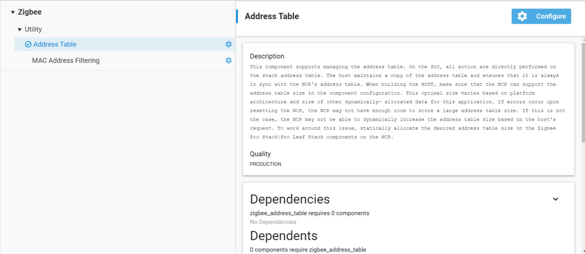

# Zigbee Introduction: Address Table

## Introduction

As we know, every device in the Zigbee network has its own EUI64 and node id. The address table is used for tracking the EUI64 and node id mapping for the other devices in the network. The benefit of the address table is to expedite unicast message sending by avoiding unnecessary network lookup queries when you send the unicast messages via address table. The address table is stored in RAM, so it is volatile and will be lost if the devices reboot. When you find some unicast failure caused by loss of address table entry, you may need to check if the device was rebooted or not.

As you can see, the content and structure of the address table is very straightforward. You may be very interested in how to use the address table. The address table is maintained by the network stack and can be modified in the application layer. The address table size can be configured in the Address Table plugin, which provides support for managing the address table with APIs. We can also send unicast messages via the address table. Let’s talk about it in detail.

## Address Table Component

There is an Address Table component in the *.slcp file. This component provides support for managing the address table. As shown in the image, the address table is configurable. If one clicks into the configuration the address table default size is 2, but can be  modified.



On SoC, all the actions are directly performed on the stack address table. On NCP, the Host maintains a copy of the address table and ensures that it is always in sync with the NCP's address table. When building for the HOST, the user should take care to make sure that the NCP can support their address table size selected below. This optimal size varies based on platform architecture and size of other dynamically allocated data for this application. If the user sees errors upon resetting the NCP, then it may be because there is not enough room on the NCP to store a very large address table.

## Send Unicast via Address Table

As mentioned before, one of the functions for the address table is when sending unicast messages. Messages can be sent using the address table by specifying the type as EMBER_OUTGOING_VIA_ADDRESS_TABLE in emberSendUnicast().  When we set the outgoing message type as EMBER_OUTGOING_VIA_ADDRESS_TABLE, it means the unicast sent using an entry in the address table to get the remote EUI64 and note id for the message. So we should make sure both the remote EUI64 and node id are valid in address table, otherwise it will get unicast failure. The other arguments like apsFrame contains the unicast message options and the buffer contains the message itself.

In a word, we can send unicast via address table if the address table entry exists and both the node id and EUI64 are valid.

```C
EmberStatus emberSendUnicast(EmberOutgoingMessageType type,
                             uint16_t indexOrDestination,
                             EmberApsFrame *apsFrame,
                             EmberMessageBuffer message);
```

- @param __type__: Specifies the outgoing message type EMBER_OUTGOING_VIA_ADDRESS_TABLE.

- @param __indexOrDestination__: The index into the address table.

- @param __apsFrame__: The APS frame which is to be added to the message.

- @param __message__: Contents of the message.

## APIs of Address Table

We provide Application Framework and Application Framework Plugin APIs and it is important to distinguish between them.

__Application Framework APIs:__

- emberAfAddAddressTableEntry (EmberEUI64 longId, EmberNodeId shortId)

- emberAfRemoveAddressTableEntry (uint8_t index)

- emberAfSetAddressTableEntry (uint8_t index, EmberEUI64 longId, EmberNodeId shortId)

__Application Framework Plugin APIs:__

- emberAfPluginAddressTableAddEntry(EmberEUI64 entry)

- emberAfPluginAddressTableRemoveEntry (EmberEUI64 entry)

Both `emberAfAddAddressTableEntry` and `emberAfPluginAddressTableAddEntry` will add a table entry to the address table. The difference between the two is that the `emberAfPluginAddressTableAddEntry` will check to make sure it is empty before adding to it. If you are using the plugin you will want to use `emberAfPluginAddressTableAddEntry`. Otherwise you will want to use `emberAfAddAddressTableEntry`. If you use the latter, you will also want to use `emberAfRemoveAddressTableEntry` to remove the entries. The reason for this is because the plugin APIs keep track of the reference count. The reference count itself is used to stop you from setting an entry to a used position.

To summarize, if you are using the plugin, use `emberAfPluginAddresTableAddEntry`/`emberAfPluginAddressTableRemoveEntry`. Otherwise, use `emberAfAddAddressTableEntry`/`emberAfRemoveAddressTableEntry` and `emberAfSetAddressTableEntry`.

## CLI Commands for Address Table

We can use CLI commands to operate the address table after we enable the Address Table Plugin. It is very convenient to add/remove/set/lookup/print the address table during the debugging.

| CLI commands | Description |
|--------------|-------------|
|plugin address-table add [EUI64] | Add an entry to the address table. |
|plugin address-table lookup [EUI64] | Lookup an entry in the address table. |
|plugin address-table print | Prints the address table. |
|plugin address-table remove [EUI64] | Remove an entry from the address table. |
|plugin address-table set [Index] [EUI] [NodeId] | Set an entry in the address table according to the arguments specified. |

## EZSP for Address Table

Below are the EZSP commands of Address Table. For host, we can use these EZSP commands to operate the address table.

| ID | EZSP enum | Description |
|----|-----------|-------------|
| 0x05 | EZSP_CONFIG_ADDRESS_TABLE_SIZE | The maximum number of EUI64 to network address associations that the stack can maintain for the application. |
| 0x19 | EZSP_CONFIG_TRUST_CENTER_ADDRESS_CACHE_SIZE | The maximum number of EUI64 to network address associations that the Trust Center can maintain. |
| 0x5B | EZSP_ADDRESS_TABLE_ENTRY_IS_ACTIVE | Indicates whether any messages are currently being sent using this address table entry. |
| 0x5C | EZSP_SET_ADDRESS_TABLE_REMOTE_EUI64 | Sets the EUI64 of an address table entry. |
| 0x5D | EZSP_SET_ADDRESS_TABLE_REMOTE_NODE_ID | Sets the short ID of an address table entry. |
| 0x5E | EZSP_GET_ADDRESS_TABLE_REMOTE_EUI64 | Gets the EUI64 of an address table entry. |
| 0x5F | EZSP_GET_ADDRESS_TABLE_REMOTE_NODE_ID | Gets the short ID of an address table entry. |
| 0x82 | EZSP_REPLACE_ADDRESS_TABLE_ENTRY | Replaces the EUI64, short ID and extended timeout setting of an address table entry. The previous EUI64, short ID and extended timeout setting are returned. |