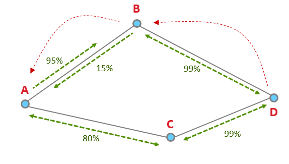
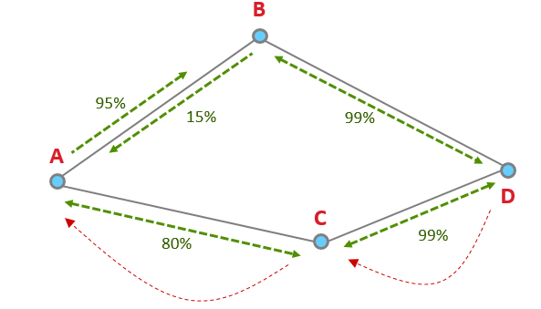

# Networking Concepts: Asymmetric Link Detection

## Asymmetric Links

This section goes over the problem of asymmetric links and how Zigbee attempts to mitigate the issue.

It has been found that link asymmetry arises largely due to manufacturing differences in mesh products. The node differences can have:

- A variance in transmit power,

- A different receive sensitivity,

- Overall component differences between each uniquely designed product.

Zigbee routing discovers routes without regards to asymmetry, sometimes resulting in non-functioning routes. This is due to route replies traveling backwards on a discovered path. Zigbee route discovery uses links in one direction to discover a route in the opposite direction. Routing discovery assumes the quality of the link is the same in both directions when it actually could be different. For example, the quality in one direction of the link can be at 95% while the other direction the quality of the link can be 15%.

## Asymmetric Link Detection

To combat message delivery failures due to an asymmetric link, nodes need to find a reliable link in both directions. Routers will exchange link cost measurements with their neighbors by periodically sending out a Link Status message and collecting the information. The Link Status is a 1-hop broadcast message transmitted about every 15 seconds (+/- 1 second).

Lets say we have these four nodes.

  

In this example, using only route discovery, the node will choose D to B to A, since it thinks the quality of A to B is 95%, vs A to C which is 80%. The node chose the worse route because of the asymmetry.

  

However, with Link Status Messages, the node is aware of the better route and will use the route with higher quality links in both directions: D to C to A.

  

## Link Status Message

Let’s take a look at an example of a Link Status Message.

The above image is pulled from our Network Analyzer which breaks down a packet so that it is easier to consume. The coordinator (0x0000 in the fourth line) has sent out a Link Status broadcast. The event detail shows under the Zigbee command section that the coordinator only has one neighbor 0x20FC.

  

The link quality is assigned outgoing and incoming link cost in a rating from 1 to 5 where 1 is the best. Here the Outgoing Cost, meaning sending messages to 0x20FC has the best link quality, while the Incoming Cost, meaning receiving messages from 0x20FC has a bad link quality.

Please note, it is possible to get a cost of 0, which means the quality of the link is “unknown”. It can take two or three link status exchanges to get a good estimates of link quality between neighboring nodes.