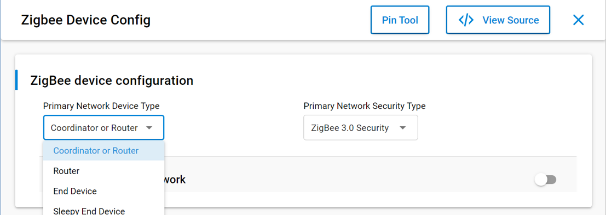
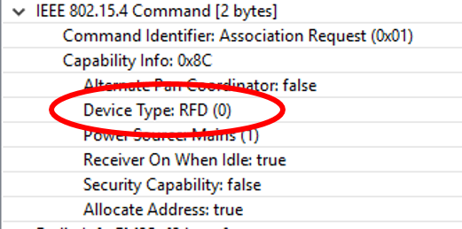
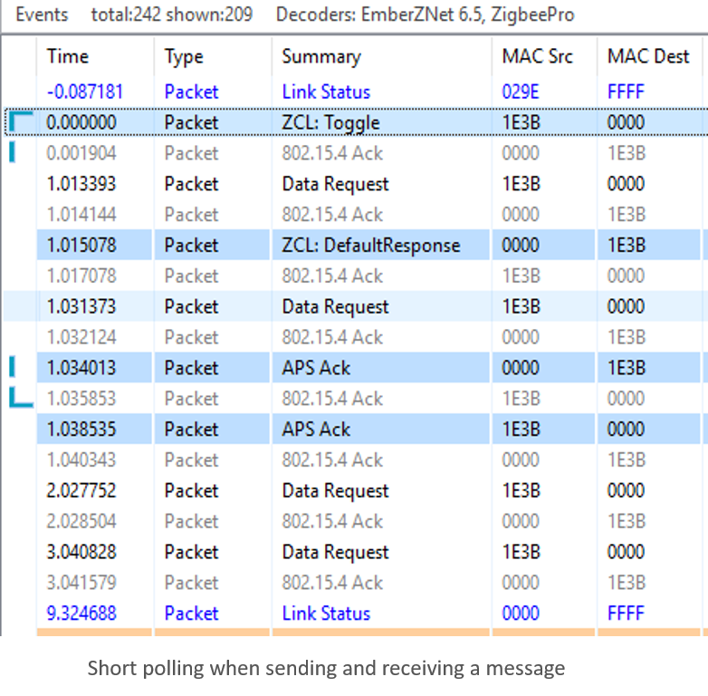
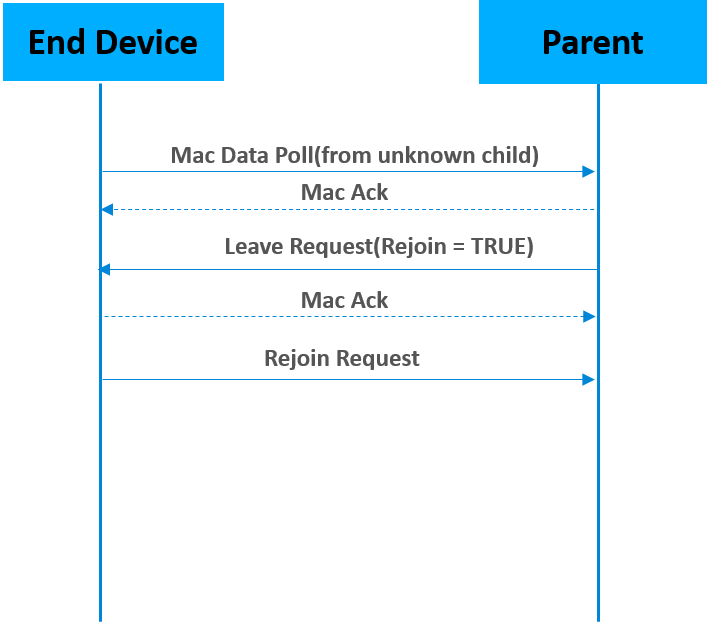
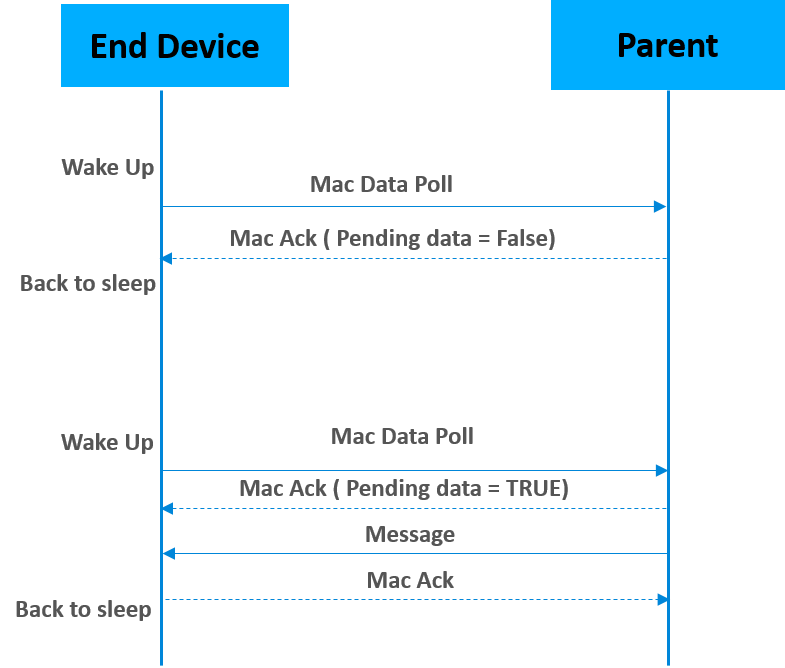
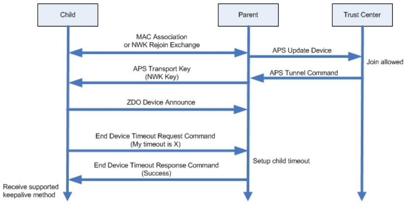

# Networking Concepts: End Devices and Polling

## End Devices

In a Zigbee network, there are three types of devices: Coordinators, routers and end devices.

__End devices__ are leaf nodes. They communicate only through their parent nodes and, unlike router devices, cannot relay messages intended for other nodes. They don’t participate in any routing. End devices rely on their parent routers to send and receive messages. End devices that do not have tight power consumption requirements may choose to have their radio on at all times. These end devices are known as RX-on-when-idle devices.

The __Sleepy End Device__ is a special kind of end device, that turns off its radio when idle, which makes it a suitable choice for battery operated devices.

## Polling

Now that we are familiar with end-devices, lets talk about polling.

__Polling__ is the event wherein an end device sends a “data request message” to its parent node.

Polling has 2 main purposes :

- _KEEP ALIVE_ : End devices poll their parent nodes periodically as a keep-alive mechanism to prevent being aged out of the network.

- _REQUEST MESSAGES_: On the sleepy end device, polling is additionally used to request messages sent to it that are held by the parent node.

__The Long Poll Interval__ represents the maximum amount of time between MAC Data Requests from the end device to its parent. When the device does not need to be responsive on the network, it polls its parent on the LONG_POLL interval.

__The Short Poll Interval__ : When a device needs to be responsive to messages being sent to it from the network, it goes into a state where it polls its parent on the SHORT_POLL interval. This ensures that any messages received by its parent will immediately be retrieved by the sleepy end device and processed. The time during which the sleepy end device is polling at the SHORT_POLL interval is referred to as “Fast Polling mode”. When the device expects data (such as the zcl/zdo message responses, etc.), it enters fast polling mode. Sometimes a sleepy device needs to stay in fast poll mode while sending a complex series of messages that constitute a complete application level transaction with another device.  The usage of this API is documented in app/framework/include/af.h.

The __packet trace__ below was captured using the Silicon Labs Network Analyzer. It shows the end device polling its parent at the short poll interval (1 second) for 3 seconds (which is determined by Wake timeout)  after sending a ZCL toggle command and expecting the default response.

  

__Poll Control cluster__ provides a mechanism for the management of an end device’s data polling rate with ZCL command. the details of Poll Control cluster are discussed further in a separate training module (App Layer: Poll Control Cluster).

### Polling as a keep-alive mechanism

Mac Data Polling is used as __the keep-alive message__ between the child and parent.

  

End devices have to poll their parent at least once within the End Device Poll Timeout (as set by __EMBER_END_DEVICE_POLL_TIMEOUT__ or __EZSP_CONFIG_END_DEVICE_POLL_TIMEOUT__). Otherwise, these devices will be removed from the child table of the parent, effectively being aged out of the network. This is done to ensure that the child table slot is not permanently reserved for an end device that has been removed from the network ungracefully (i.e., if no Leave notification was heard from that device. Leave notifications are broadcasts and are not guaranteed to be received);

The parent node will ask the end device to __leave and rejoin__ the network if it receives a mac data poll from the end device which doesn’t exist in the child table. The figure above illustrates the leave and rejoin process.
In addition to this, if the __data polling message isn’t acknowledged__ by the parent for __EMBER_AF_PLUGIN_END_DEVICE_SUPPORT_MAX_MISSED_POLLS__ times, the end device will attempt to rejoin the network to find a new parent.

### Polling as a means to request data from the parent

Sleepy end devices do not receive data directly from other devices on the network. Instead, they must poll their parent for data and receive the data from their parent. The parent acts as a surrogate for the sleepy device, staying awake and buffering messages while the child sleeps.

The figure below illustrates the data polling process. Sleepy end devices wake up and poll their parents at regular intervals. The parent node uses the Frame Pending bit in the MAC ACK to indicate that it has one or more messages waiting for the sleepy end device. If the Frame Pending bit is set to true, the sleepy end device will poll it's parent again and wait for the parent to respond with new data, and ack the data messages before going to sleep. If it is false, the sleepy end device is free to go back to sleep until the next poll attempt.

  

Please keep in mind that if you want the device to receive incoming messages and incoming APS ACKs (for its outgoing messages) reliably, you should poll at least once within the EMBER_INDIRECT_TRANSMISSION_TIMEOUT (7.68 seconds by default) to check for data at the parent because the length of time that the parent will hold on to a message is determined by this number. Some sleepy end devices (such as sensors) are not expected to asynchronously receive messages, so they don’t have the above limitation. They just need to poll within the end device poll timeout.

## Application Design Considerations

While the end device polling is supported at the Zigbee networking layer, you do need additional application layer support to configure polling parameters. Ex: how often to poll the parent, etc.

End device poll timeout can be set on both End device and parent device end.

__End Device Configuration:__

- End Device Support Component

  - Long poll interval

  - Short poll interval

  - Wake timeout

  - Wake timeout bit mask

- ZigBee PRO Leaf Stack Component

  - End device poll timeout value

__Parent Device Configuration:__

- EMBER_INDIRECT_TRANSMISSION_TIMEOUT

- ZigBee PRO Stack Component

  - End device poll timeout value

As we discussed previously, the Long Poll Interval should be less than EMBER_INDIRECT_TRANSMISSION_TIMEOUT if you want the device to reliably receive incoming messages and incoming APS ACKs (for its outgoing messages). Long Poll Interval should also be less than End device poll timeout to avoid being aged out by the parent which results in unnecessary rejoins. Generally, the SHORT_POLL interval will be something less than/or equal to 1 second to ensure that all messages can be retrieved and processed by the sleepy end device immediately.

Wake timeout is the amount of time (3 seconds by default) that the device will stay in the fast poll mode if the task set in wake timeout bitmask is active. For example, if EMBER_AF_WAITING_FOR_ZCL_RESPONSE (0x00000010) is set in wake timeout bitmask, the sleepy end device will stay in short/fast poll mode for 3 seconds when waiting for the zcl response. For more information about the Application Task in bitmask, please refer to enum EmberAfApplicationTask defined in af-types.h

## End Device Poll Timeout Negotiation

Zigbee R21 Specification offers an end device timeout negotiation protocol and a standard way to implement child aging. The End Device Timeout Request command is sent by an end device to inform the parent of its timeout value when joining/rejoining the network. When the parent receives this command, it will update the End Device Timeout value for this end device locally and generate an End Device Timeout Response command with a status of SUCCESS. Pre-R21 devices do not  support End Device Timeout command. So they can only use the default End Device Timeout value set initially on the parent node.

  
