# Networking Concepts:  Messaging (Unicast, Broadcast, and Multicast)

Before you start this training module, we strongly recommend that you get familiar with these training modules first:

- Zigbee Introduction: Node Types, PAN IDs, Addresses

- Zigbee Networking Concepts - Binding

- Zigbee Networking Concepts - Routing

## Message Types

There are three major message types, include: Broadcast, Multicast and Unicast.

- __Unicast__: The transmission of a message to a single device in the network. 

- __Multicast__: A transmission to every device in a particular PAN belonging to a dynamically defined multicast group.

- __Broadcast__: The transmission of a message to every device in a particular PAN belonging to one of a small number of statically defined broadcast groups, for example all routers or all nodes.

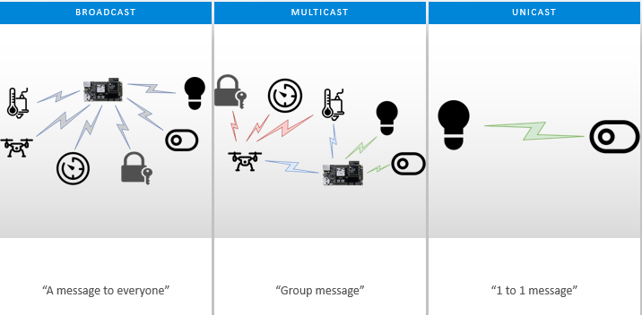

### Unicast

The unicast is a message that is directed from one node to another node. At it’s most basic level, the unicast is just a message sent between two adjacent nodes.

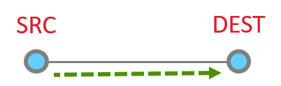

However, they can be much more complicated, being routed through 1 or more additional nodes through the network.

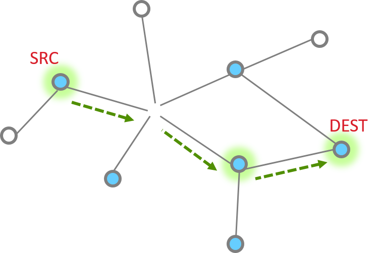

The unicast message can be sent by API emberAfSendUnicast().

Regarding how to route the message to the destination node, please review the Networking Concepts - Routing and Networking Concepts - MTORR Source Route training module.

#### Unicast Message Delivery

##### Single hop message

So let’s look at the basic message between two nodes, since this is most simple. This is the building block from which all other messaging is done.

When it works perfectly, single hop message delivery is a two part process with 4 steps total. Within 802.15.4 there are MAC acks for point to point jumps. Zigbee applies Application level acknowledgments to ensure end to end delivery.

So we start out with a message being sent Message Sent

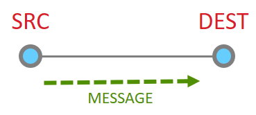

This message then is acknowledged at the MAC layer

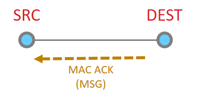

Since the message has been sent all the way to it’s destination, and it is requested, we must now get the application ACK. So this is now sent by the destination.

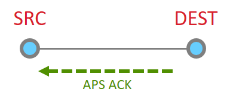

Since this is another 15.4 message, there has to be a point to point acknowledgement

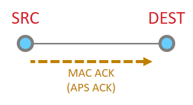

And that is the whole process. 

##### Multiple hops

More nodes end up with more steps, but as a whole the process is the same, just longer. Instead the message traverses along being MAC ack’d until it reaches its destination and then an APS ack returns down the same route with each hop being MAC Ack’d.

The message is sent

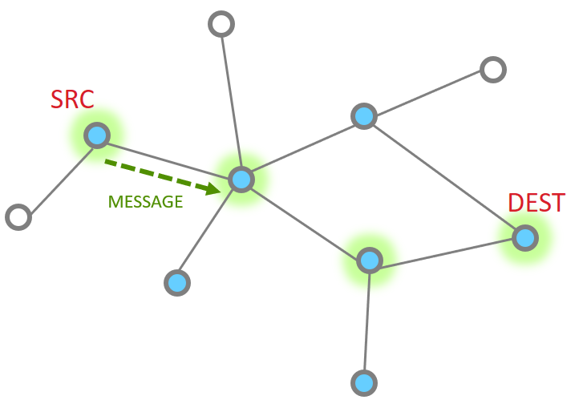

The point to point MAC Ack is received

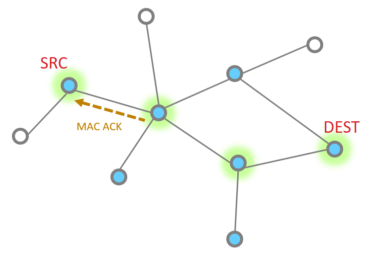

Since our message has not made the final destination, it continues
Next hop of the message and the MAC ACK

| | |
|-|-|
| 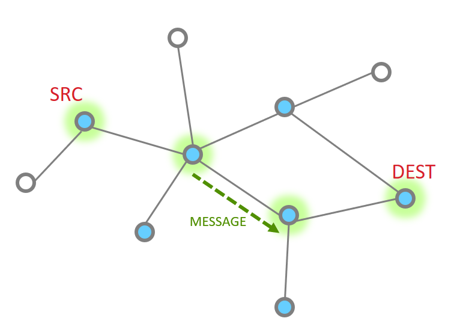 | 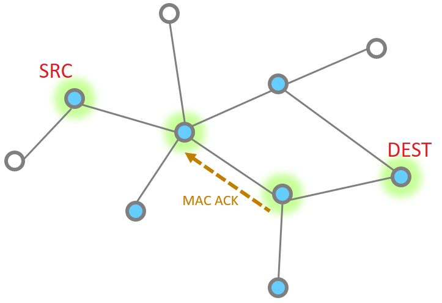|

And one more hope to get to the destination

So then our App layer must send an acknowledgement. This is just like the message

| | |
|-|-|
| 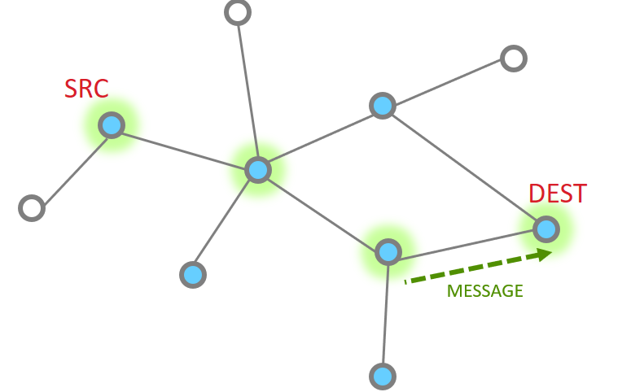 | 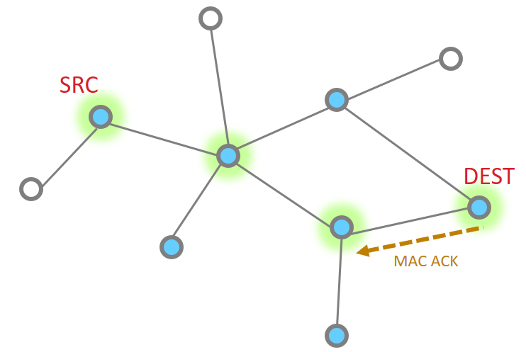|

The APS ACK is send backwards, with each step being MAC ACK’d

What happens if a message has a failure along part of this route? The EmberZNet stack has retry mechanisms in place to help resolve issues and ensure delivery.
The MAC retries are 802.15.4 mechanisms that ensure delivery from point to point. If a MAC ack is not received, the MAC layer will automatically try sending the packet again. Failure at this level is around 40mSec
EmberZNet further adds NWK layer retries. It is a timer up to 500mSec that retries MAC layer messages (point to point). These happen should the MAC retries fail.
Finally there are APS retries, these are application layer acknowledgements which are designed to ensure messages are delivered end to end. Should an APS retry not be received, then the application will attempt to transmit a message again, following the steps above as before.
The APS retry is a optional feature which can be configured by APS options EMBER_APS_OPTION_RETRY. We will discuss more APS option in the later.

### Broadcast

In Broadcast, The source node sends the message to all nodes in its 1-hop-range and these nodes repeat the message to all nodes in their 1-hop-range until the message gets to all nodes in a specific radius. In a large network, it would be difficult and unnecessary to expect all the devices that receive a broadcast message to send an acknowledgment back to the message originator, Instead a rebroadcast message is an indication of the fact that a neighbor device has received and relayed the broadcast message successfully. the source node verifies whether all of the neighboring devices have successfully relayed the message.  This is known as the passive acknowledgment mechanism. Every time a broadcast message is repeated, the radius field is decremented and broadcast messages with a radius field set to 0 are not repeated anymore. Broadcast messages are jittered to reduce possibility of collision.

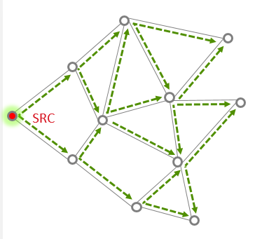

The routers maintain the record of all the messages that they broadcast in a table called the broadcast transaction table (BTT).

|BROADCAST ADDRESS | DESTINATION GROUP |
|------------------|-------------------|
| 0xFFFF           | All devices on PAN|
| 0xFFFD           | All non-sleepy devices |
| 0xFFFC           | All routing capable devices |

The record itself is known as the broadcast transaction record (BTR) and contains the sequence number and the source address of the broadcast frame which helps in retransmission of the broadcasts. So in a given window of time, the number of broadcasts is limited  by the broadcast transaction table size. In the EmberZnet, the broadcast table size can be configured in Zigbee Pro Stack Component.

While broadcast message sounds simple, it can significantly increase the traffic in the network, cause congestion and degrade performance. They should be used sparingly and with careful consideration.

Network-level broadcast options(broadcast address) exist to send messages to routers only, to all non-sleeping nodes including end devices, or also to send to sleeping end devices. End devices unicast their broadcast message to their parent node which in turn propagates the message through the network on their behalf.

The broadcast message can be sent by API __`emberAfSendBroadcast ()`__.

### Multicast

In multicast, the message is delivered to a group of devices within the same network, it is a filtered limited broadcast. The picture below illustrates that, only member device can receive the multicast message in application layer.

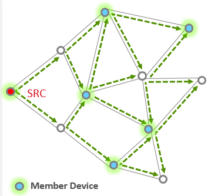

The source node does not have to be a member of a multicast group to be able to use multicasting to reach the members. Multicast messages may be originated by end devices but are not sent to devices where macRxOnWhenIdle is equal to FALSE.

Each group is identified by a 16-bit multicast group ID. The devices in the same group are known as group members. A device can be a member of more than one multicast group. Each device keeps the list of its multicast group memberships in a table called the multicast/group table

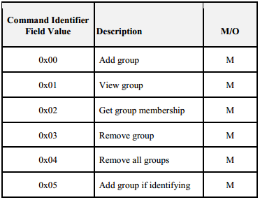

Groups usually managed via ZCL Groups cluster (see Groups client & server plugins and Zigbee cluster library Specification for more information). The table above shows the commands supported by the Group cluster.

The multicast message can be sent by API __`emberAfSendMulticast()`__.

### APS option

Here are some commonly used aps option which can be configured when filling the aps frame. The structure of APS frame is shown below

```C
typedef struct {
    uint16_t profileId
    uint16_t clusterId
    uint8_t sourceEndpoint;
    uint8_t destinationEndpoint
    EmberApsOption options
    uint16_t groupId;
    uint8_t sequence;  uint8_t radius;
} EmberApsFrame;

```

`EMBER_APS_OPTION_ENCRYPTION`: Send the message using APS Encryption using the Link Key shared with the destination node to encrypt the data at the APS Level. You can enable this bit mask if the APS data needs to be encrypted.

`EMBER_APS_OPTION_ENABLE_ROUTE_DISCOVERY`: Send the message with the NWK 'enable route discovery' flag, which causes a route discovery to be initiated if no route to the destination is known.

`EMBER_APS_OPTION_RETRY`: Resend the message using the APS retry mechanism. This option and the enable route discovery option must be enabled for an existing route to be repaired automatically

`EMBER_APS_OPTION_ENABLE_ADDRESS_DISCOVERY`: Send a ZDO request to discover the node ID of the destination if it is not already known. This option should be enabled if sending message via binding table.

`EMBER_APS_OPTION_FRAGMENT`: This option indicate the message is part of a fragmented message. For more information about the fragmentation feature please refer to fragmentation plugin.

For more APS options please refer to __ember-types.h__ file.