# Zigbee Networking Concepts – Table Routing

## EmberZNet Protocol Stack

Below is the ZigBee system architecture from the Zigbee Introduction: Architecture Basics training module

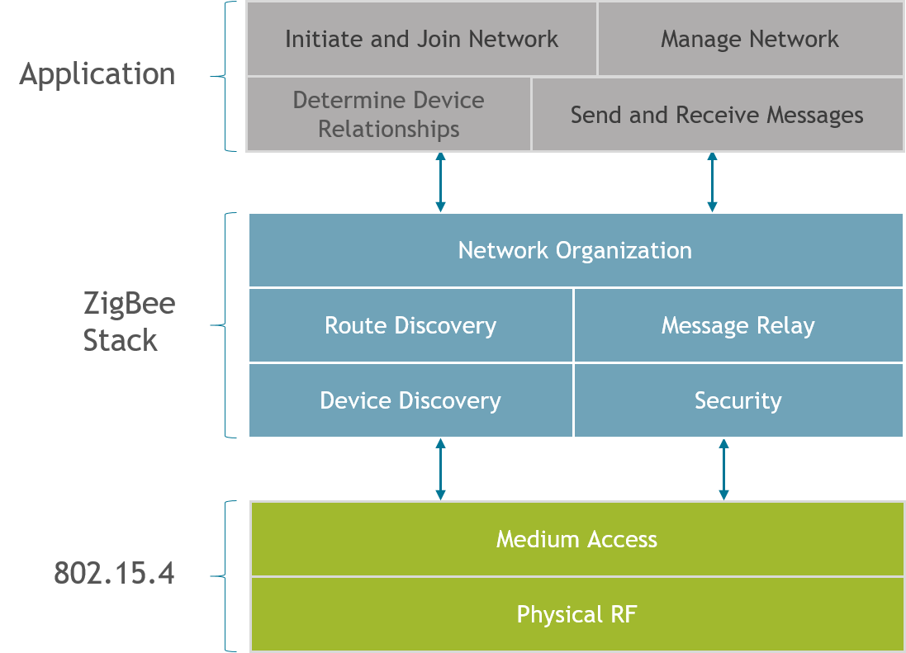

But we will focus on a specific function in the network layer of the protocol stack called routing. This behavior is defined by the Zigbee Alliance in the Zigbee PRO specification. Silicon Labs offers several Zigbee compliant platforms. For full platform details and up-to-date information, please visit www.zigbee.org.

Routing is the process in which a __node relays information to another node that is either the final destination meant to receive this information, or a next step in the path leading to the final destination.__ In a mesh network, several routing mechanisms such as unicast, broadcast, or many-to-one routing / source routing are used to efficiently exchange data in the network.

As you may recall from the “Zigbee Introduction: Node Types, PAN IDs, Addresses” training module, routers and coordinators are expected to perform routing on a Zigbee network. 

The main functions in the routing process include:

- __Route discovery__, which is the ability to discover and record paths through the network, whereby messages can be efficiently routed

- __Relaying data__ using these paths to the next hop toward reaching a final destination on the route

- __Keeping track of and repairing broken routes__, which is important to the dynamic nature of a mesh network

- __Participate in routing on behalf of end devices__, etc.

## Types of Routing

_How do you send a message from one node to another in Zigbee?_

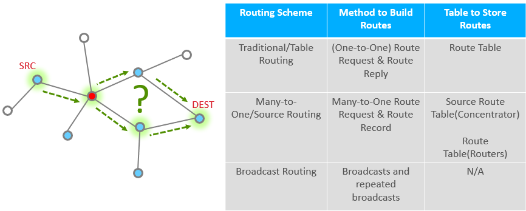

Routing will help you answer this question.

We have several types of routing commonly used in Zigbee:

- __Table routing or “traditional” routing__ is a method of routing where the source first discovers a route to the destination and stores it in a routing table. The nodes on the route then use the table to pass the message along, one hop at a time. We will look at this in greater detail in the coming slides.

- __Many-to-One / Source Routing__: In many Zigbee networks, there is commonly one central node, a “concentrator”, which all nodes frequently communicate with. An example of such a node would be a  gateway that collects status reports from all devices on the network. Many-to-one / Source routing scheme caters to these types of networks by creating an efficient means for nodes on a network to communicate with the concentrator. This topic is covered in a separate training module called Zigbee Networking Concepts: Many-to-One / Source routing.

- __Broadcast routing__ is a simplistic method of getting a message from the source to destination without having prior knowledge of how to reach the destination from the source. The source node sends the message to all nodes in its 1-hop-range and these nodes repeat the message to all nodes in their 1-hop-range until the message gets to all nodes in a specific radius.

## Broadcast Routing

In Broadcast routing, the source node sends the message to __all nodes within a specific radius__. A router within a 1-hop-range that hears the broadcast shall repeat it at least once and up to a maximum number of times until it hears the broadcast from all of its neighboring devices. Every time a broadcast message is repeated, __the radius field is decremented and broadcast messages with a radius field set to 0 are not repeated anymore__. Broadcast messages are jittered to reduce possibility of collision. There are mechanisms in place to prevent the same message from continuously looping around the network (a router can recognize a unique broadcast message and ensure that it is not repeated indefinitely).

The routers maintain the record of all the messages that they broadcast in a table called the broadcast transaction table (BTT).

|BROADCAST ADDRESS | DESTINATION GROUP |
|------------------|-------------------|
| 0xFFFF           | All devices on PAN|
| 0xFFFD           | All non-sleepy devices |
| 0xFFFC           | All routing capable devices |

Network-level broadcast options exist to send messages to routers only, to all non-sleeping nodes including end devices, or also to send to sleeping end devices. End devices unicast their broadcast message to their parent node which in turn propagates the message through the network on their behalf.

While broadcast routing sounds __simple__, it can significantly increase the traffic in the network, __cause congestion and degrade performance__. It is for this reason that the Zigbee specification limits number of broadcasts in any given interval of time. They should be used sparingly and with careful consideration.

This is also __not a reliable means of delivery__ to a sleepy end node because the parent device is responsible for buffering the message for the sleeping child but may drop the message before the end device wakes to receive it.

## Table Routing: Route Discovery 

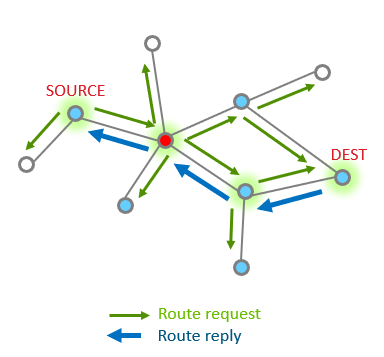

Table Routing is used when a node needs to send a message to a specific desitnaition. 

Route discovery is the first step in the table routing process and it happens when a node wants to send a message to a destination that it does not currently have a route to. Route discovery is performed automatically when __EMBER_APS_OPTION_ENABLE_ROUTE_DISCOVERY__ option is set and no current route is available. Note that creating a route from node A to node B does not discover a return route from node B to node A. The return route discovery message will inherit __EMBER_APS_OPTION_ENABLE_ROUTE_DISCOVERY__ from the incoming message to send the ACK.

Zigbee utilizes Ad-hoc On-Demand Distance Vector (__AODV__) routing to discover routes in the mesh network and to route packets. The links with the lowest cost will be chosen. The cost of a link is based on various factors (Link Quality, Probability of packet delivery on link, etc).

Each node stores information about next hop to a specific destination. If the next hop is not known, route discovery must take place in order to find a path. Since only a fixed number of routes can be saved on a node, route discovery may take place more often in a network with a large number of nodes where there is frequent communication between many different nodes.

When a source node needs to discover a route to a destination node, it sends a broadcast route request command. The route request contains the source address, destination address and path cost (to measure route quality and choose best route). Intermediate nodes listen to and rebroadcast this request while updating the path cost field and propagate the message through the network. They also store the route entry into the route discovery table. 

## Table routing : Link Cost

__If there is more than one viable path to get from one node to another, how do I know which is better ?__

Often times, in a mesh network, there are many possible routes to get from one node to another. Link cost is a metric that applies to a pair of nodes that tells us how well the two nodes can hear each other. When the route between 2 nodes is composed of multiple links, the path cost is the sum of the individual link costs on the path. During routing, link and path costs are used to come up with a route that has the best possibility of successful message reception.

Routers keep track of link status in a Zigbee network, and hold the link costs in their neighbor table. Routers can determine incoming link quality from the physical layer using the link quality measurements. They exchange this information using Link Status messages that are 1 hop broadcasts (no retries) with other routers to get the outgoing link quality.

Upon receipt of a route request command frame, the neighbor table is searched for an entry corresponding to the transmitting device. If no such entry is found, or if the outgoing cost field of the entry has a value of 0, the frame is discarded and route request processing is terminated. If an entry is found with non-zero outgoing cost, the maximum of the incoming and outgoing costs is used for the purposes of the path cost calculation, instead of only the incoming cost. This value is also used to increment the path cost field of the route request frame prior to retransmission.

__Outgoing and incoming links might not necessarily be the same__ due to differences in local noise floor, differences in receiver sensitivity, etc. The EmberZNet stack tends to prefer a link with a symmetric link cost over one that is not.

In addition to link quality, neighbor tables also store the age of the link. Generally speaking, the age of the link indicates the amount of time that has elapsed since hearing from the neighbor. The age field is updated when a new link status message is received from the neighbor. Links are marked stale after a period of inactivity.

## Table routing : Route Repair

__What happens when one or more nodes on a previously discovered route go out of commission?__

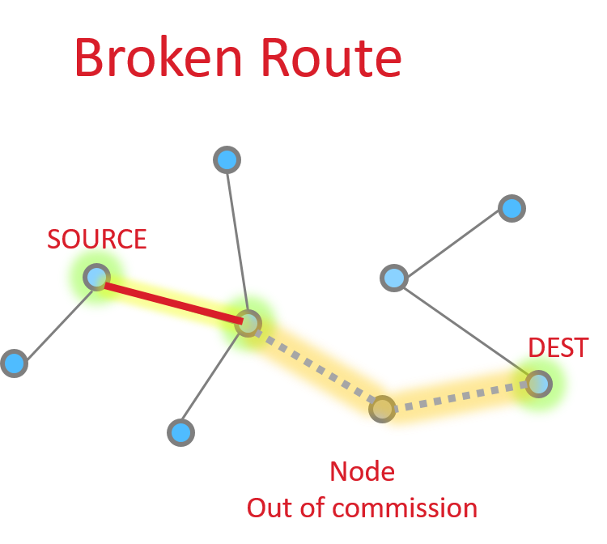

The source node is able to request an __application level acknowledgement (APS ACK)__ from the destination. The sending device will be informed when the message is successfully delivered. If it does not receive this acknowledgment, it can then take steps to repair the route.

Route repair follows exactly the same steps as route discovery, but the damaged node does not participate, resulting in a different route choice. The routing tables are updated to reflect the new next hops, and the message is successfully delivered along the new path as shown in the picture on the right.

If no alternative path is available, the sender is informed that the message could not be delivered. In EmberZNet stack, this is denoted by a response with EmberStatus of EMBER_DELIVERY_FAILED (0x66). EmberZNet will attempt to deliver a message again before performing the route repair. Route repair is performed automatically when EMBER_APS_OPTION_RETRY and EMBER_APS_OPTION_ENABLE_ROUTE_DISCOVERY are both set in the message options.

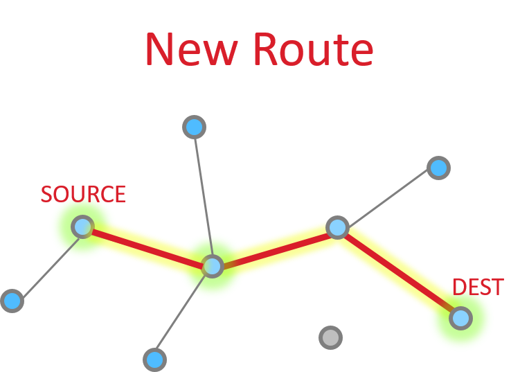

For other EmberStatus’, refer to error-def.h. For more APS options, refer to ember-types.h

## Unicast Message Delivery

### One hop

So let’s look at the basic message between two nodes, since this is most simple. This is the building block from which all other messaging is done.

When it works perfectly, single hop message delivery is a two part process with 4 steps total. Within 802.15.4 there are MAC acks for point to point jumps. Zigbee applies Application level acknowledgments to ensure end to end delivery.

So we start out with a message being sent Message Sent

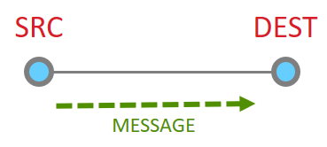

This message then is acknowledged at the MAC layer

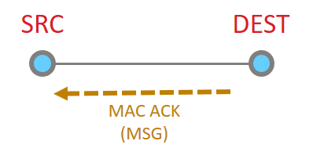

Since the message has been sent all the way to it’s destination, and it is requested, we must now get the application ACK. So this is now sent by the destination.

Since this is another 15.4 message, there has to be a point to point acknowledgement

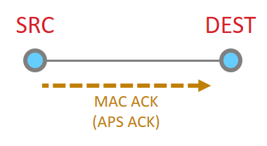

And that is the whole process. Once complete a message is considered successful and on the source node gets a success message.

### Multiple hop

More nodes end up with more steps, but as a whole the process is the same, just longer. Instead the message traverses along being MAC ack’d until it reaches its destination and then an APS ack returns down the same route with each hop being MAC Ack’d.

The message is sent

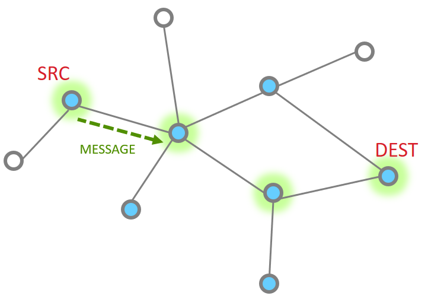

The point to point MAC Ack is received

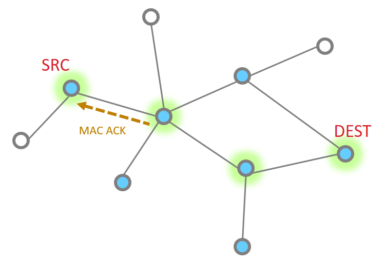

Since our message has not made the final destination, it continues
Next hop of the message and the MAC ACK

| | |
|-|-|
| 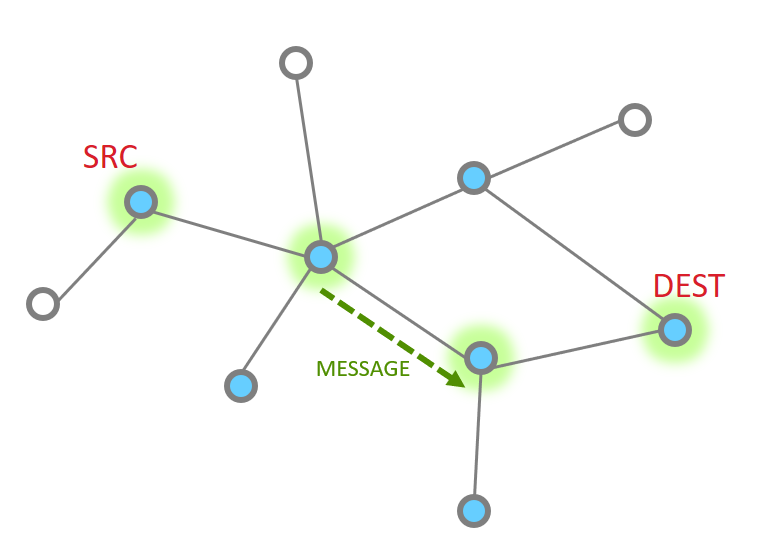 | 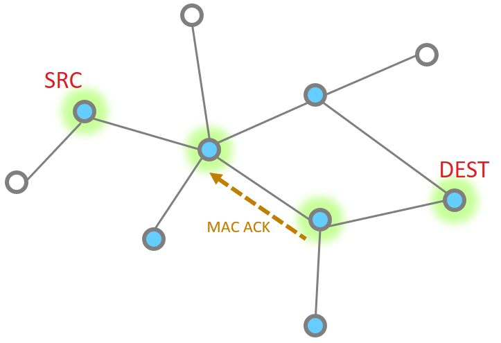|

And one more hope to get to the destination

So then our App layer must send an acknowledgement. This is just like the message

| | |
|-|-|
|  | 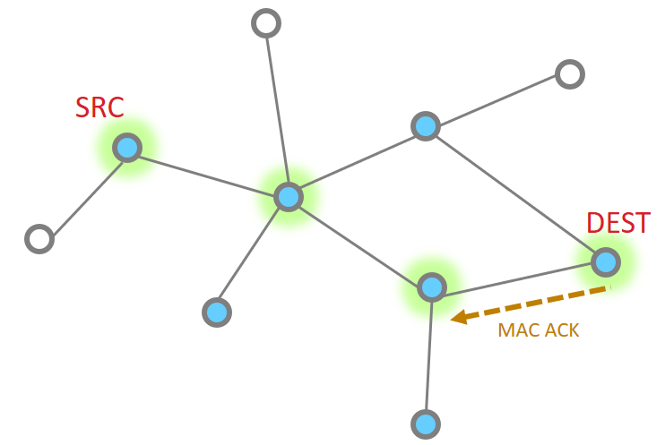|

The APS ACK is send backwards, with each step being MAC ACK’d

What happens if a message has a failure along part of this route? The EmberZNet stack has retry mechanisms in place to help resolve issues and ensure delivery.
The MAC retries are 802.15.4 mechanisms that ensure delivery from point to point. If a MAC ack is not received, the MAC layer will automatically try sending the packet again. Failure at this level is around 40mSec
EmberZNet further adds NWK layer retries. It is a timer up to 500mSec that retries MAC layer messages (point to point). These happen should the MAC retries fail.
Finally there are APS retries, these are application layer acknowledgements which are designed to ensure messages are delivered end to end. Should an APS retry not be received, then the application will attempt to transmit a message again, following the steps above as before.

The APS retry is a optional feature which can be configured by APS options EMBER_APS_OPTION_RETRY. We will discuss more APS option in the later.