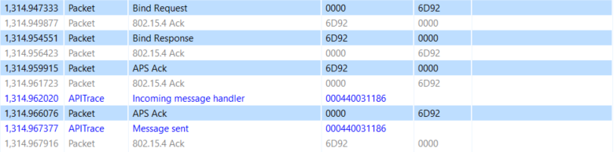
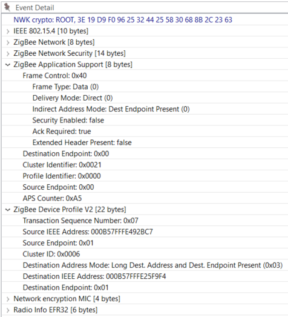
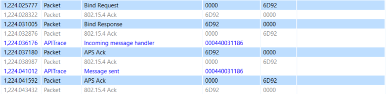
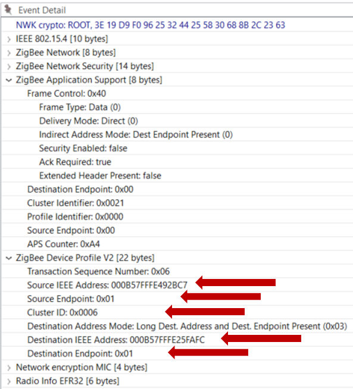
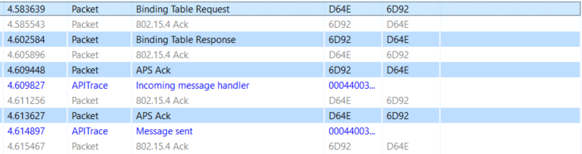
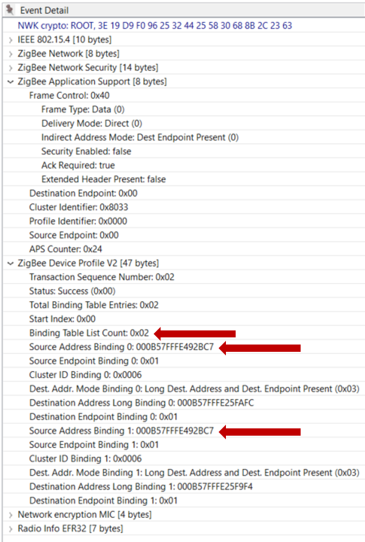

# Zigbee Introduction: Networking Concepts - Binding

## ZDO - Binding

The binding command is part of a base class of functionality known as the Zigbee Device Object. The ZDO provides an interface between the application objects, the device profile, and the APS.

A binding creates a one-way link from one node to another node or from one node to a group of nodes that have a matching cluster. This is connected through the source and destination endpoints.

Once devices are on a network, devices can create bindings to establish applicaiton layer links.


For example a switch could have a binding for a light that it will always control. However, bindings are not required for zigbee communication, but are useful for frequently used, persistent communication paths.

## Binding Table

The Binding Table maps control messages to their intended destinations. It stores the following information listed.

1. The binding index is the location of the entry in the binding table

2. The binding type is either a binding for a unicast message to one node or a group binding to several nodes in a group

3. The network index the binding belongs in. This is for devices that are in more than one network.

4. The Source Endpoint is the available local endpoint where the binding entry is available

5. The Destination Endpoint is the available endpoint on the remote device that the entry is pointing to.

6. The Cluster ID indicates the endpoint’s functionality bound to this particular remote node

7. The Destination Node ID is the remote node’s short address

8. The Destination EUI64 will either store the remote node’s long address if it is a unicast binding or a 16-bit multicast group address if the binding type is set as “group”

The addition or deletion of entries is managed completely by the application and is stored in non-volatile memory. The stack will not perform these actions automatically for any reason. The only action taken by the stack about the binding table is to update the information about the node ID in correspondence with the EUI64 destination for a binding table entry.

APIs to manipulate the binding table can be found in _stack/include/binding-table.h_.

## Bind Request CLI Command

Let’s take a look at a CLI command to understand the requirements for a Bind Request. The following CLI command ZDO Bind can be sent from any node. This is an over-the-air command.

ZDO Bind has the following arguments:

- The “__destination Node ID__” is set to the node that will be receiving this ZDO command. This is where the binding will be created.

- The “__Remote device’s source endpoint__” is the endpoint on the node that will create the binding and send messages through this binding.

- The “__Remote endpoint to bind__” is the endpoint on the node that will be receiving messages through the binding.

- The "__cluster__" that the binding is to be used for.

- The “__Remote node EUI64__” is the device’s EUI64 that is receiving messages through the binding.

- The “__Binding’s destination EUI64__” is the node where the binding is created.

Please note, since the binding is unidirectional, both sides do not need to be aware of the binding. Just the node that will be sending messages through the binding. Also, it is possible to create the bindings locally by adding an entry to the binding table. For creating a binding locally, you can use “__option binding-table set__”.

We also have a related KBA found here: https://www.silabs.com/community/wireless/zigbee-and-thread/knowledge-base.entry.html/2017/12/28/creating_bindingsan-egzv

## Binding examples

### Light requesting the creation of a binding on the switch for the light

In this example we set up a binding for the On/Off cluster between a light and switch. The command is sent from 0x0000, which in this case is the coordinator and the light, to 0x6D92 the Switch.

__Node ID of the switch: 0x6D92__ <br />
__Coordinator ID: 0x0000__ <br />
__On / Off Cluster: 0x0006__ <br />
__Switch EUI64: 000B57FFFE492BC7__ <br />
__Light EUI64: 000B57FFFE25F9F4__ <br />



The Event Detail shows the request and the arguments are found under the Zigbee Device Profile section.



Also, a good way to check this is a ZDO command is to verify the Destination and Source Endpoints are set to 0x00 under the Zigbee Application Support section.

### Coordinator requesting the creation of a binding on the switch for another light

In this example we set up a binding for the On/Off cluster between a different light and the same switch.

__Node ID of the switch: 0x6D92__ <br />
__Coordinator ID: 0x0000__ <br />
__On / Off Cluster: 0x0006__ <br />
__Switch EUI64: 000B57FFFE492BC7__ <br />
__Light EUI64: 000B57FFFE25FAFC__ <br />



The command is still sent from the coordinator to the switch 0x6D92, but the binding is for another Light. Notice the different destination IEEE addresses between the examples.



## Binding Table Request CLI Command

EmberZNet also has a CLI command available for querying our switch about what is in its binding table.

```
zdo mgmt -bind <int16u> <int8u>
```
- The first argument here is the __node ID__ of the device that has the binding table

- The second argument is the __first entry__ you want to see plus all entries after it.

For example the following binding request starts the query from 0x00 and iterates down the table.



The Binding Table Response is shown in the Event Detail.



Notice the number of entries in the table and the two bindings that were created in the previous examples.