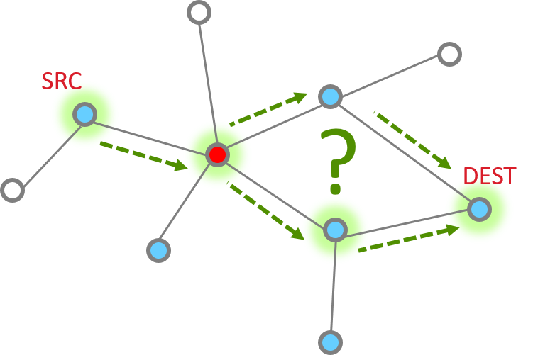
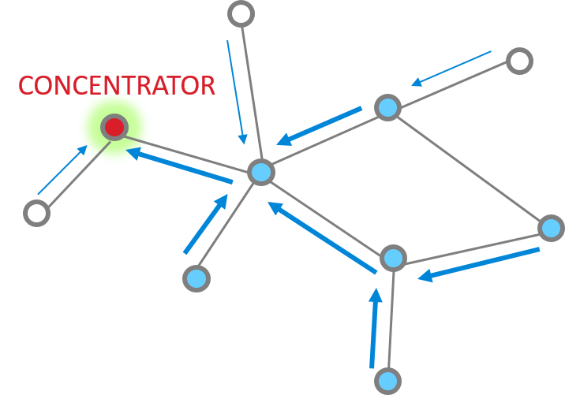
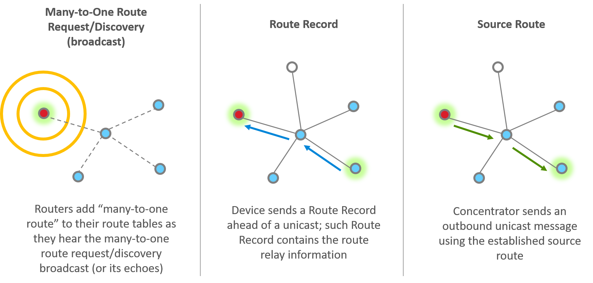
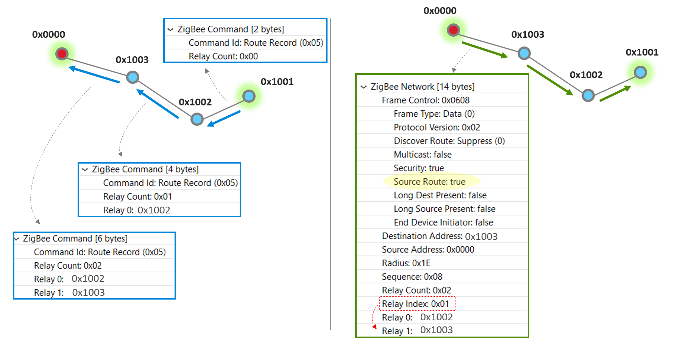
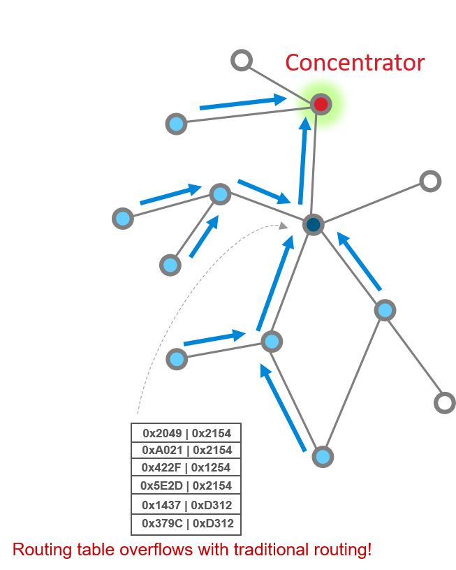

# Zigbee Networking Concepts: Many-to-One and Source Routing

Before you start this training module, we strongly recommend that you get familiar with these training modules first:

- Zigbee Introduction: Architecture Basics

- Zigbee Introduction: Node Types, PAN IDs, Addresses

- Zigbee Networking: Unicast

- Zigbee Networking: Routing (traditional)

## Routing

_How do you send a message from one node to another in Zigbee?_

Routing will help you answer this question.

We have several types of routing commonly used in Zigbee:

- __Table routing__ (also considered the “traditional” routing scheme): you look up the routing table to find the entry matching your destination. This entry would tell you who is the immediate next hop to go to, in order to reach your final destination. This topic is covered in a separate training module, “Zigbee Networking Concepts: Introduction to Routing (Traditional)”.

- __Source Routing__: in many Zigbee networks there is commonly one central node, a “concentrator”, which all nodes frequently communicate with. For example, a gateway that collects status reports from all devices in the network. In this training module we focus on a routing scheme efficient in the many-to-one and one-to-many communication pattern: Source Routing, and the accompanying many-to-one route request and many-to-one routing.

- __Broadcast routing__: nodes not in 1-hop range of the transmitter rely on repeated broadcasts to get messages. While this is simple and does not require any routing algorithm, the obvious drawback is that it’s enormously inefficient. In a dense network, broadcast messages can quickly “flood” the network. Broadcasts should be used sparingly and with good consideration.

| Routing Scheme | Method to Build Routes | Table to Store Routes |
|----------------|------------------------|-----------------------|
| Traditional/Table Routing | (One-to-One) Route Discovery (outgoing), and Route Reply (incoming) | Route Table |
| Many-to-One/Source Routing | Many-to-One Route Request (outgoing), and Route Record (incoming) | Route Table   Source Route Table |
| Broadcast Routing | Broadcasts and repeated broadcasts | N/A |

## Why Many-to-One and Source Routing

Assuming that you are familiar with traditional/table routing, we will now introduce Many-to-One and Source Routing and explain why this has some advantages in certain types of networks.

First let’s introduce the concept of a __“concentrator”__. Imagine a common smart home network where you have a number of __smart lights, appliances, sensors__ etc., and a gateway through which the devices can communicate with the outside world. These devices would periodically send status updates to the gateway. This creates a frequent many-to-one message pattern. __This gateway is a “concentrator” in such a network since messages tend to flow toward it__. Since the concentrator needs to acknowledge these messages as well as potentially send further responses and commands to devices, the one-to-many messaging also naturally becomes frequent.

Many-to-One routing, as the name suggests, is a special type of routing that makes it __efficient for devices to establish routes inbound to the concentrator__. Each device stores the many-to-one route information in its regular route table, with a flag to mark it as a many-to-one route. The reverse route of a many-to-one route is a source route, which the concentrator then uses to get back to the outlying device. The source route information is stored in a source route table on the concentrator only.

Next, let’s examine the specific steps in establishing routes using many-to-one and source routing.

## How to Establish Many-to-One / Source Routing

There are three main steps or components of establishing many-to-one and source routing, which you can consider as two sides of the same coin.

1. __Many-to-one route request__

    The concentrator sends out many-to-one route request (MTORR) broadcasts periodically to all routers in the PAN. The MTORR broadcast has a “path cost” in its Command Frame, and this path cost is initially 0 when the concentrator transmits this broadcast. When a router relays a MTORR, it adds its link cost to the relayed broadcast, therefore the relayed MTORR broadcast carries the path cost between the concentrator and the relay node. If a router receives MTORR from multiple sources, it picks the path with the lowest path cost, and adds the corresponding router as its next hop to the route table in order to reach the concentrator. Note that the route table has entries for both traditional routing and many-to-one routing, and there is a flag to differentiate a many-to-one route.

    When all routers have received the MTORR broadcasts, many-to-one routing is established, and all routers now have a route to the concentrator whether they need it immediately or not.

2. __Route record__

    After a router has heard a many-to-one route request and established many-to-one routing, next time it sends a unicast (either on behalf of itself or any of its end device children) to the concentrator, it will use the many-to-one route. Moreover, a separate Route Record command will precede the unicast message to record the route the unicast message takes to reach the concentrator.

3. __Source route__

    When the concentrator receives the unicast as well as the Route Record that goes with it, the concentrator reverses the relay list in the Route Record and stores that in its source route table. The concentrator can then use this source route when sending an outbound message.

## A Closer Look at Source Routing

To explain the construction of the source route better, let’s look at a particular route in the below example network and how the concentrator (with a node ID 0x0000) communicates with a remote node 0x1001.

After the router 0x1001 has heard a __many-to-one route request__ and established many-to-one routing, next time it sends a unicast to the concentrator, it will use the many-to-one route. Moreover, a separate Route Record command will precede the unicast message to record the route the unicast message takes to reach the concentrator. On each hop, look at the blue box which illustrates the Zigbee Command payload in the Route Record packet. When node 0x1002 relays the Route Record, it adds itself to the Route Record, and so does node 0x1003.

When the concentrator finally receives the Route Record from 0x1003, it stores the relay list in its source route table and knows that’s how it can reach 0x1001. Now look at the right half of this slide. Next time the concentrator needs to send a unicast message to 0x1001, it makes use of the source route. The green box illustrates the Zigbee Network header in the first hop of the unicast message, where the the relay list contains the entire route information from source to destination. and a Relay Index which indicates the immediate next relay point on this hop.

Note that the blue and green boxes are partial screen captures from a Network Analyzer trace. Please refer to our Network Analyzer training module if you are not already familiar with it.

## Application Design Consideration

While the many-to-one route requests, route record and source route are all supported at the Zigbee networking layer, you do need additional application layer support to manage the concentrator behavior; for example, when to send the next many-to-one route request. We provide this through the “Concentrator Support” Plugin.

There are two types of concentrator:

- Low RAM concentrator

    - Only guaranteed to buffer most recent source route

    - Nodes send Route Record before every transmission to concentrator

    - OK if concentrator only talks to destinations in reply

- High RAM concentrator

    - Assumes source route table is large enough for entire network

    - Route Record only sent initially (until first source-routed packet arrives from concentrator)

    - Reduced network traffic compared to the Low RAM option

How do you choose? Essentially it’s a tradeoff between RAM usage and network traffic. In the case of a High RAM concentrator, all source routes collected since the last MTORR are buffered, and therefore Route Record is only sent initially from a remote device; once a concentrator has successfully reached the remote device using the established source route, no more Route Record is sent from this remote device again until the next MTORR cycle. In comparison, on a Low RAM concentrator only the most recent source route is guaranteed to be buffered (which means reduced RAM usage), and remote nodes send Route Record with every unicast transmission to the concentrator (which means increased network traffic).

Other important concentrator configuration parameters to consider are:

- Source route table size: choose according to the RAM resource and the network size.

- MTORR interval: this is specified by a minimum interval and a maximum interval in seconds. If there is no route error or APS delivery failure, then the concentrator sends out MTORRs at the max interval.

- Route Error Threshold and Delivery Failure Threshold: these are thresholds that trigger the next MTORR if the minimum interval has passed since the last MTORR.

In general, the smaller the MTORR interval and error thresholds, the faster and more responsive of many-to-one / source route establishment and repair, at the expense of increased network traffic. If the network is large and/or dense, frequent broadcasts and their echoes can quickly become overwhelming, so choose these parameters with care. If you are uncertain, you can always start with the default plugin parameters, then characterize the network performance and adjust from there.

## Many-to-One / Source Routing vs. Traditional Routing

### Advantages

In a network where there are frequent many-to-one messages toward one or few concentrators, Many-to-One and Source Routing have three major advantages over traditional routing. Let’s discuss them one by one.

1. __Source routing reduces the demand for storing route table entries__

    In the scenario where a large number of devices communicate with the concentrator, consider the route table on nodes close to the concentrator – with traditional routing, the route table on such a node would have to accommodate a large number of entries to provide routes to each device for which it is a relay point. Look at this picture as a simple illustration. The solid red circle represents a concentrator, while the dark and light blue circles represent routers, and white circles represent end devices. As you can see, with traditional routing, the router in dark blue would have to bear the burden of a large routing table since it is a relay point for many outbound messages. In large and/or dense networks, this means increased resource (RAM) demand for potentially many devices. With source routing, only the concentrator needs to store a large source route table.

    

2. __Many-to-one routing is proactive__

    The routing is established during the many-to-one route request broadcasts, therefore each device will always have a route to the concentrator after the many-to-one route request broadcasts have reached every router via echoes. In comparison, traditional routing is reactive – routes are only established when a node tries to send a unicast message to another node for the first time and realizes that the routing information is missing.

3. __Many-to-one and source routing together reduce broadcast traffic from one-to-one route discoveries__

    One-to-one route discoveries, used by traditional routing to establish or repair routes, are broadcasts each node needs to send in order to solicit route replies from the destination node. In comparison, in a network using many-to-one and source routing, a concentrator sends periodic many-to-one route requests to solicit many-to-one routes from all routers proactively. Reverse a many-to-one route, and you get the source route already. Many-to-one and source routing together is a much more efficient and responsible method to establish routing between a concentrator and outlying nodes compared to traditional routing in a large and/or dense network.

### Limitations

However, this does not mean many-to-one / source routing doesn’t have its own challenge or limitation.

While it’s most useful when most of the traffic involves many-to-one and/or one-to-many (which is true in a lot of networks, such as most HA networks), it does not address routing between non-concentrator nodes, for which we still need to rely on traditional routing. You may then wonder: can we have multiple concentrators? Well, the rule of thumb here is that we do not recommend having more than two concentrators in a network – the increased overhead and complexity would most likely bring more problems than help. In the vast majority of scenarios, there is one concentrator in a network.

Many-to-one / source routing could be less responsive to route changes compared to traditional routing in certain scenarios, especially when a network is initially forming and there isn’t any existing route yet. Note that during normal operation of the network, route changes should result in expected route error and/or  delivery failure, which should trigger the next MTORR.