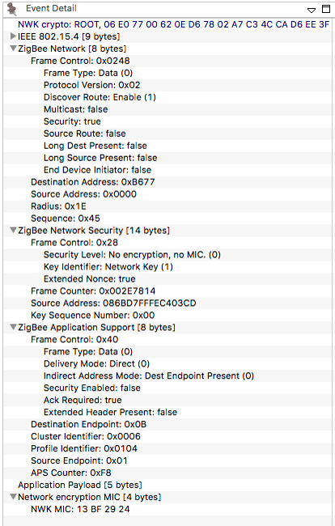
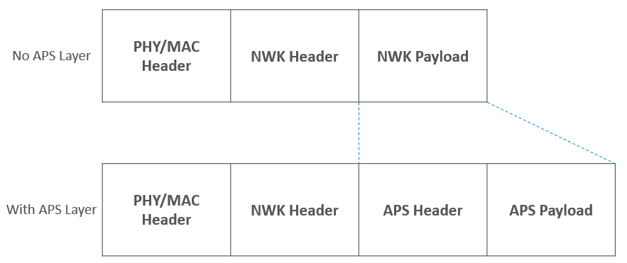
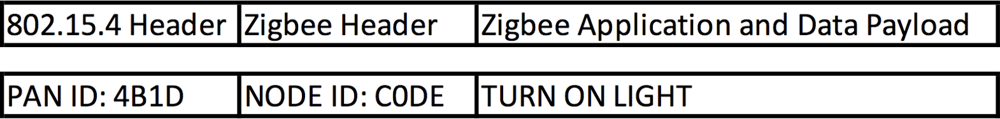
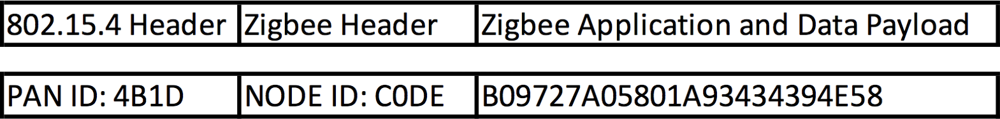
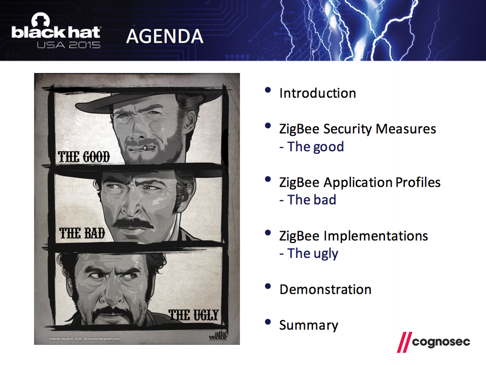
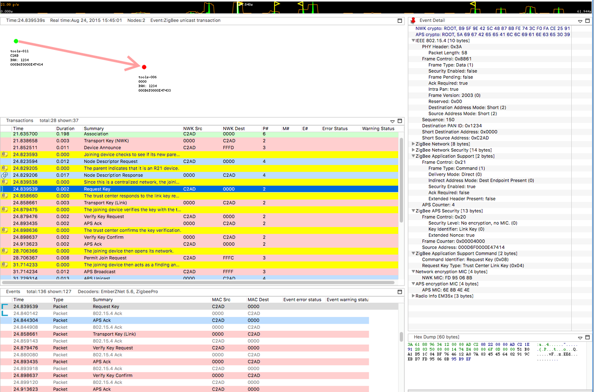

# Zigbee 3.0 Security

## The need for Security with Zigbee

So why is there such a big need for Zigbee Security?

When you are just talking about a few light bulbs, is security that big of a deal? They can flash some lights, but is that really a big issue? Pranks, sure, but beyond that it doesn’t seem that big of a deal.

How about when you have a __Zigbee enabled thermostat__? A little larger target (heating-cooling-air handler), but again, really just a prank level target.

But what about __Smart Energy__? Now we are talking about the potential of introducing some issues with power and gas delivery. Potentially costing you a lot of money.

If you have smart shades, you give people the means of opening your shades. This could be a minor inconvenience to potentially letting burglars know you are not home.

What about devices that give __Zigbee Home Automation access__? You start tying these all together. Now any or all of these become issues.

And finally we have __Zigbee locks and devices__ that can be used to give people direct access to your home. Now all of a sudden we are talking about a major security issue, because compromising your Zigbee network potentially compromises your home’s security.

So as you see as Zigbee becomes a bigger piece of the smart home, security can’t just be an afterthought in designs, but needs to be a major consideration to help protect not just networks but our customers as well.

## Zigbee Network Security

One of the first things we should look at within Zigbee is network security. Zigbee operates under the __open trust__ model. This means that all devices that are joined to the network are “trusted” and data between them can be encrypted. Within the Zigbee spec, all traffic is encrypted. Zigbee utilizes AES-128 for the encryption.



AES-128 is the 128 bit variant of the Advanced Encryption Standard, it is based on the Rijndael (PRONOUNCED - Rhine Dahl) block cypher. Rijndael is a symmetric key algorithm, this means that there is only 1 key for both encryption and decryption. Rijndael allows for variable block size (the base element of the data to be encrypted) or key size, so long as they are multiples of 32. AES uses a subset of Rijndael which has a fixed block length of 128 bits (16 bytes) and variable key sizes of 128 (used here, hence AES-128), 192 or 256 bits. AES is an extremely strong encryption standard and as of now considered uncrackable (current computing would take billions of years to brute force).

The key for decoding network traffic is called the Network Key. It is a 128 bit value which. When your network is first created, the network key is chosen, at random, by the device creating the network, the coordinator. This network key can be changed by the coordinator and then must be distributed to all devices on the network before nodes switch to the new network key. Zigbee additionally has some mechanisms in place in which the key should be changed.

### Zigbee Packet Format

A Zigbee packet is basically a modified 802.15.4 packet. And 802.15.4 packet has a header and payload section.



Zigbee takes the 15.4 payload and uses it for a Zigbee header and payload or data.

If you have additional Application Support Sublayer (APS) data, then the APS header and payload are stored as part of the Zigbee payload.

### Packet Encryption

So simplifying our Zigbee packet down to just the 802.15.4 header, Zigbee header and payload, we can see how encryption of a Zigbee packet works.



So here we have a packet, which is for PAN ID 4B1D (four-B-one-D), heading to node C0DE (C-zero-D-E), with the command TURN ON LIGHT. But since this is a Zigbee packet and encrypted over the air (OTA) this packet will look like this



The PAN ID is visible because the network needs to quickly know if the packet is meant for it’s network, without trying to decode the packet. The same is for node data so that nodes can quickly relay packets along the network without decoding them. But the payload is encrypted, when it reaches its destination, then the packet is decoded.

If you send the same command every time, you are susceptible to replay attacks. Zigbee makes use of Frame counters to defeat replay attacks. The Frame counter is incremented each command you send. As nodes recieve messages from different nodes, the frame counter is recorded. If subsequent message from the node do not have a higher frame counter than the previous message, the message is ignored. 


### Other Network Security Considerations

As noted a there is a single network key. This under open trust, any device has the ability to see all traffic on the network. This means that:

It’s important to keep rogue devices off the network, and certainly try to only admit trusted devices to join the network.
Make use of other security (APS Security) can be used for additional encryption
Protect the joining process – as we saw in our example, if devices get the network key when they join, you can spot the network key, if you know where and how to look for the key.

## APS Security

Application Layer (APS) Security is used as additional encryption between nodes. It is used to protect data from the rest of the network.

Using link keys, traffic between nodes can be additional encrypted, using similar techniques as network layer encryption, but in this case primarily on APS payload data.


Just like Network encryption, this is an additional layer of AES-128 security. And in the case of Link keys, every device starts with a pre-chosen one and they can be changed at any time.

__What are the uses for APS Encryption?__

Securing data from point to point. While some of the message can be decoded by other nodes, the APS payload cannot. This means your data is secure along your whole route.

Within Smart Energy, this is the standard message sending method.

This is compatible with older Zigbee Pro and current Zigbee 3.0. EmberZNet allows for different layers of encryption. All traffic can be APS encrypted or it can be done on a packet by packet basis, choosing only some packets to be APS encrypted.

## Joining and Rejoining Process

### Joining process

A device joining a Zigbee network is a basic 3 step process:

- __The Association__ – This is the process of a node requesting access to the network and the network responding with a decision to join or not. In most cases this will be YES.

- __Transport Key__ – This is the step when a device is sent the current network key

- __Device Announce__ – This is when the device broadcasts to the network that it has joined and ready to operate. At this time other nodes will see the message and can start inquiring about functionality and the like.


Because as you can see below – in your key transport packet, the Network key is visible (see the line 5 from the bottom - that Is the network key).


Now we will throw some security on this. Because this is potentially visible to the world, this packet is encrypted using APS security, which is noted on the top of the event details box. Now under older Zigbee Pro/HA security, this utilized a well known link key “ZigbeeAlliance09”. This key was part of the Zigbee spec, so it was easy for all to read. And while it was understood that publishing this key made it vulnerable, it was also seen as momentary and not deterministic. So while a sniffer could see the key if they got this packet, this packet was just 1 out of so many packets. Plus it was not easy to know when a join process was taking place.

### Rejoining process

Because of the end device – parent relationship, end devices occasionally need to rejoin their networks. Rejoining is the process in which a device which has all of the network information, but somehow loses contact with the network, gets back on the network. This is just for end devices which must maintain some link with the network and their parent to remain in device tables.

The first type of rejoin is a __Secure Rejoin__. In this step a device uses a network encrypted message to request to be readmitted to the network. If the nodes parent doesn’t have an issues with this (IE, the device still remains in it’s child table), then it will send a message to the trust center that a device is alive and it will let the node back into the network. In this case the whole process is encrypted.


Secure Rejoins only happen for a set duration or number of failures. But as they fail enough or should a parent have forgotten about a device (it ages out of it’s child table), then an end device will roll back to a __Trust Center Rejoin__. In this case it will send an unencrypted rejoin request, the response to this will also be unencrypted. The device will also be send the network key, just in case, encrypted with the devices link key. In Zigbee Pro/HA this was again just the well known link key.


## Joining/Rejoining Security

Joining was always seen as the weakest link in joining devices to the network. Now let’s take a history lesson along from Zigbee Pro to the discovered Vulnerabilities and how Zigbee 3.0 came to be.

- Zigbee HA 1.2

- Zigbee utilized a single link key for most processes

    - ZigbeeAlliance09

    - 5A 69 67 42 65 65 41 6C 6C 69 61 6E 63 65 30 39

    - Key was published as part of the Zigbee specification

- Other link keys were allowed, but rarely used

The use of the default key was seen as a risk, as sniffing the network key transfer packet would reveal the network key. But this risk was seen as minor as joining or rejoining processes were not predictable and the window of joining was so small.

That was until Black Hat 2015, where Cognosec Gmbh presented an exploit in which they were able use some tools to gain access to a Zigbee network in a very deterministic way. They called their presentation The Good, the Bad, and The Ugly.



### Zigbee Unsecure rejoin outlined at the Black Hat USA 2015

Discovered by Cognosec security engineers Tobias Zillner and Sebastian Strobl

Process:

- Hacker has a jammer and a sniffer

- ZED is jammed long enough that it loses connection with parent network and attempts a secure network rejoin and the process fails.

- Once the secure rejoins fail the ZED attempt to join using the Zigbee default key – thus exposing the network key to the sniffer

- Hacker could then read all network traffic

- Hacker could do a secure rejoin and get a rogue device onto the network

### Zigbee 3.0

This cause Zigbee 3.0 to be created. The basic idea was to do everything to get customers away from the well known link key.

They would leave a caveat for using ZigbeeAlliance09, but as a whole you wanted to use a new link key.
Ideally customers would move to unique codes that was just for joining.

Along with this, changing link keys became mandatory on devices. When a Zigbee 3.0 device joined a network, it would check that the network had the facility to issue new link keys and if so, request a new one.

Finally a new idea was introduced, that of a single use joining install code. This was a which could be derived from a some other value, these keys would be unique for joining and then changed out. They would be shared with the network in some out of band way, just as a computer, mobile device or web interface. The idea was that with these single use derived codes the joining process became much more secure.

Looking at the below picture, you see the 3 old joining steps: Associating, Transport of the network Key and the device announce.



But now after that you have a few more necessary steps.

- First after the Device Announce comes a standard __Node Descriptor Request__. This happened before under Zigbee Pro, but now the Node Descriptor Response has a new field – Stack Compliance Revision. If this value is R21 or greater (the revision of the Zigbee Spec in which Zigbee 3.0 was introduced), then a joining device knows it’s joining a new Zigbee 3.0 network and the new joining process will continue

- __Request Key__ – Once R21 compliance is determined, the the joining device will request a new link key from the trust center.

- __Transport Key__ (Link) - The trust center will generate a new link key and sends  it to the joining device.

- __Verify Key Request__ – Using the old link key, the node will request that the network verify the new link key

- __Verify Key Confirm__ – Here the trust center will use the new link key to send a message to the joining node. If this message is ACKed, then the Link Key is considered updated and the joining process is complete.

Taking a closer look a different types of keys and their support within EmberZNet, we have the following.

First, you see that a trust center needs to support at a minimum two keys: the well-known key for backwards compatibility and a slot to hold install code derived keys.

Since there is a key table and keys must be saved across reboots and the like, the key table must be stored in non-volatile memory, this is tokens in EmberZNet.

There is also a transient key table for keys which have a temporary life span. Any key which is placed in the transient key table will time out at some time in the future.

To conserve memory, EmberZnet utilizes a feature called hashed link keys which are keys hashed from the EUI64 of the other node and a secret key which only the Trust Center knows. This is beneficial all around as it utilizes no memory or token space and the impact on computations is minimal.

At the bottom here we show how the Gateway or other joining device within the EmberZnet stack utilize the preconfigured key slots within their own memory when they update their own link key table.

Below is the key table from a gateway. Note the Network key (line 4), The TC Link Key and the Link Key table (lines 8, 11 and 12). As well as the transient key table. It also notes packet buffer usage of the transient key table.

```

Gateway>keys print

EMBER_SECURITY_LEVEL: 05
NWK Key out FC: 0000000B
NWK Key seq num: 0x00
NWK Key: 4B F8 EB DF C1 92 09 3C  5A D9 FD C7 77 36 B3 9F
Link Key out FC: 00000000

TC Link KeyIndex IEEE Address         In FC     Type  Auth  Key
-     (>)0800000000000000  00000000  L     y     46 F8 4B 89 13 F2 FC 6E  D8 4F B0 94 50 DA 6D DF

Link Key Table
Index IEEE Address         In FC     Type  Auth  Key
0     (>)001F023DCB5A7F22  00000000  L     y     74 68 69 73 20 69 73 20  73 69 78 74 65 65 6E 20
1     (>)6569676874793830  00000000  L     y     6F 6E 65 74 77 6F 74 68  72 65 65 66 6F 75 72 66
2/4 entries used.

Transient Key TableIndex IEEE Address         In FC     TTL(s) Flag    Key
0     (>)0600000000000000  00000000  0x00B4 0x0000  5A 69 67 42 65 65 41 6C  6C 69 61 6E 63 65 30 39
1 entry consuming 1 packet buffer.

```

Below is the key table of a __non-coordinator__ device. Note it only has it’s own Link key as well as the network key.

```
Joiner>keys print

EMBER_SECURITY_LEVEL: 05
NWK Key out FC: 00003014
NWK Key seq num: 0x00
NWK Key: 4B F8 EB DF C1 92 09 3C  5A D9 FD C7 77 36 B3 9F
Link Key out FC: 00003002

TC Link Key
Index IEEE Address         In FC     Type  Auth  Key
-     (>)0800000000000000  00000005  L     y     83 A3 6E 78 23 D7 A0 85  9D B2 0F 80 15 0D 88 F6

Link Key Table
Index IEEE Address         In FC     Type  Auth  Key
0/0 entries used.

Transient Key TableIndex IEEE Address         In FC     TTL(s) Flag    Key
0 entry consuming 0 packet buffer.
```

Summarizing, there are three places a link key is stored on a device

- Preconfigured key slot – persisted (token)

- Transient key table – RAM

- Key Table – persisted (token)

Furthermore, since the stack is well versed in these key values, there is a well defined state machine within the stack which determines the order in which encrypting and decrypting take place and with what key.

## Additional Security Considerations

Most of the security topics we have discussed had to do with security considerations within EmberZNet and primarily with network security. But there are other issues which reside outside the stack. This is some details on an “IoT worm” which was created by some researchers in Israel and Canada. They were able to exploit two bugs within Phillips bulbs which allowed them to spread a virus across Phillips Hue bulbs. 

First they exploiting a bug in Atmel’s ZLL implementation they were able to touchlink to a bulb from hundreds of meters away (a process that generally needs to be within a few centimeters). Doing so, they could “steal” the light bulbs from it’s network to their own network. Then they further exploited the fact that Phillips didn’t require signed bootload images to install their own hacked firmware within the lights. This allowed them to spread a self propogating worm.

This demonstrates not just the need for companies like Phillips to consider security as they make their devices, but also vendors, like even Silicon Labs, to make sure they properly test their stacks and don’t have bugs like this in their code.

### ZigDiggity

Out on the internet right now you can download a utility called ZigDiggity by BishopFox. They call it a hacking toolkit. The primary feature of ZigDiggity is to steal Zigbee devices from networks. Utilizing a beacon storm, ZigDiggity is able to then use this in conjunction with an ACK attack to cause devices to jump from their own network to the network of ZigDiggity. So clearly there are tools out there which you must be careful about.

BishopFox: https://www.bishopfox.com

ZigDiggity on github: https://github.com/BishopFox/zigdiggity

And this brings us to the internet as a whole. There are a ton of resource out there on the internet from hackers and hobbyists. These people are seeing what they can do to exploit security and Zigbee.

Silicon Labs and their customers need to be aware that these people are watching and are ready to exploit any bug which they discover. So we need to make sure there are as few for them to find.

IOT is going to be here to stay. And unless the creators work to protect everyone, they are going to leave major exploits for all to use.
