# Tutorial Overview

This tutorial is intended for Silicon Labs Zigbee users who are already familiar with the Light and Switch example, but have not progressed further into the domain. As the Zigbee Light/Switch example has network creation and joining built in, it does not provide the user with context on how to create a Zigbee application. Using the ZigbeeMinimalSoc project, this example builds a Zigbee application showing how to create a network from scratch. The example will also demonstrate some generic application code to use with the network.

This example assumes the reader is already familiar with the Light and Switch example, as well as basic EmberZNet functionalities such as callbacks and tokens.

# Required Materials
-3x Wireless Starter Kit Main Board

-3x EFR32MG12 Radio Board

-Simplicity Studio v5

# Creating the Projects

## Coordinator
Under Simplicity Studio, select Silicon Labs AppBuilder project.


Select Silicon Labs Zigbee.

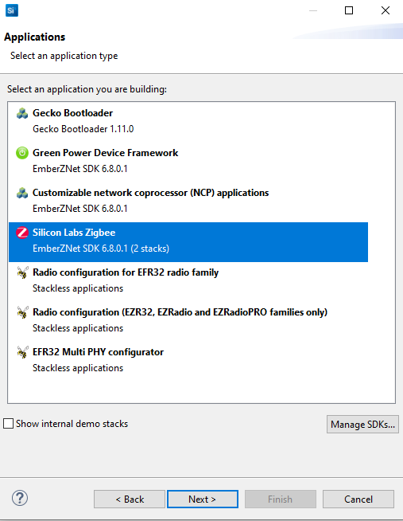


Select EmberZNet GA SoC

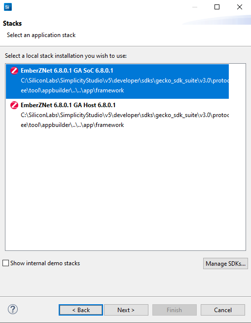

Select ZigbeeMinimal.

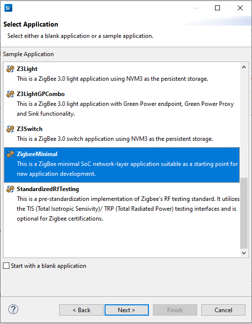

Name your project Coordinator, click Next, verify that the correct board and part numbers are listed, and click Finish.

In the ZCL Clusters tab, under ZCL device type, select HA Home Gateway.

## Stack Settings

Under the Zigbee Stack tab, set the ZigBee Device Type to "Coordinator or Router", ensure security type is "ZigBee 3.0 Security".

## Plugins:

The following plugins will need to be enabled. Navigate to the plugins tab and activate these if they are not already activated by default.

#### Common Clusters

* Basic Server Cluster: Ember implementation of Basic server cluster.  

* Identify Cluster: Ember implementation of Identify cluster.

Note: if these options are greyed out, in the ZCL Clusters tab, under ZCL device type, select HA Home Gateway and the plugins will be available.

#### HAL

* Antenna Stub: Stub implementation of the antenna configuration APIs for devices that do not support antenna configuration.

* Debug JTAG: Allows debugging through JTAG.

* HAL Library: Standard HAL library.

* NVM3 Library: Provides a mean to store and retrieve objects from the flash.

* Simulated EEPROM version 2 to NVM3 Upgrade Stub: This library provides stub functionality for the sim-eeprom2-to-nvm3-upgrade library.

#### I/O

* Serial: Allows us to use the Serial interface to communicate with the board.

#### Network Form and Join

* Scan Dispatch: This plugin allows there to be multiple consumers of the stack 802.15.4 scan results.

#### Printing

* Ember Minimal Printf: Allows us to use debug printing to console in our application.

#### RAIL

* RAIL Library: This plugin provides core RAIL library.

* Radio Coexistence Stub: Stub implementation of the radio coexistence API for devices that do not use coexistence.

#### Stack Libraries

* Binding Table Library: Implements the binding table for us instead of having to do it manually.

* Debug Basic Library: Provides basic debug functionality.

* End Device Bind Library: Responds to ZDO End Device Bind requests.

* Packet Validate Library: Validates all IEEE 802.15.4, ZigBee NWK and ZigBee APS layer messages.

* Security Link Keys Library: The Security Link Keys library provides managament of APS link keys in the key table.

* Source Route Library: The Source route library provides functionality for infrastructure devices.

* Zigbee PRO Stack Library: The main ZigBee PRO Stack library for parsing, processing, generating and managing the ZigBee PRO stack messages and functionality.

#### Testing

* Stack Diagnostics: Provides some debug features such as printing child, neighbor, and routing tables.

#### Utility

* CCM* Encryption: Provides encryption through mbed TLS framework.

* Concentrator Support: Code that handles periodically broadcasting a many-to-one-route-request (MTORR) so that the device will act as a concentrator (sink) in the network. Leave settings at default of LowRamConcentrator.

* Simple Main: Supplies a main() function instead of having to define our own.

* Strong Random: Plugin provides apis for generating cryptographically strong random numbers.  

* ZCL Framework Core: This plugin contains all the core functionality to build ZCL applications.

* mbed TLS: Implementation of cryptographic librairies.

### Zigbee 3.0

* Network Creator: Allows device to create a network.

* Network Creator Security: Allows device to manage network security.

### Generate and Build

Finally, generate and build the Coordinator.

## Door Lock Controller
Make a new ZigbeeMinimalSoc project as a base to work from, as you did for the Coordinator.

Name your project Door_Lock_Controller.

In the ZCL Clusters tab, under ZCL device type, select HA Door Lock Controller.

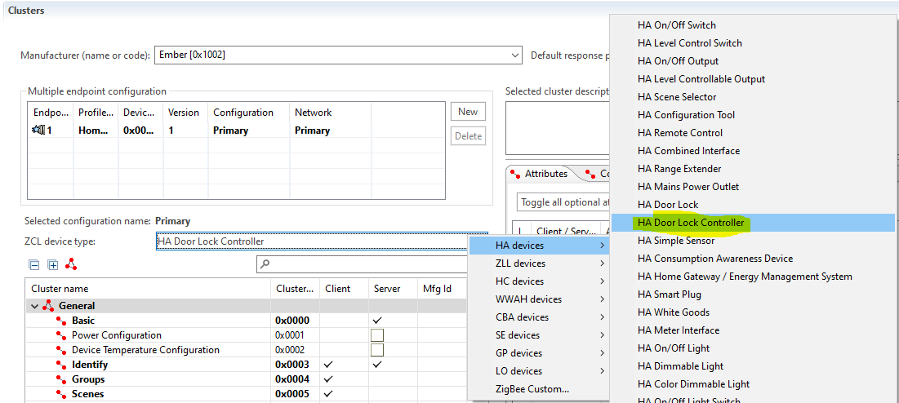

## Stack Settings

Under the Zigbee Stack tab, set the ZigBee Device Type to "Router", ensure security type is "ZigBee 3.0 Security".

### Plugins:

The following plugins will need to be enabled. Navigate to the plugins tab and activate these if they are not already activated by default.

#### Common Clusters

* Identify Cluster: Ember implementation of Identify cluster.

#### HAL

* Antenna Stub: Stub implementation of the antenna configuration APIs for devices that do not support antenna configuration.

* Debug JTAG: Allows debugging through JTAG.

* HAL Library: Standard HAL library.

* NVM3 Library: Provides a mean to store and retrieve objects from the flash.

* Simulated EEPROM version 2 to NVM3 Upgrade Stub: This library provides stub functionality for the sim-eeprom2-to-nvm3-upgrade library.

#### I/O

* Serial: Allows us to use the Serial interface to communicate with the board.

#### Network Form and Join

* Scan Dispatch: This plugin allows there to be multiple consumers of the stack 802.15.4 scan results.

#### Printing

* Ember Minimal Printf: Allows us to use debug printing to console in our application.

#### RAIL

* RAIL Library: This plugin provides core RAIL library.

* Radio Coexistence Stub: Stub implementation of the radio coexistence API for devices that do not use coexistence.

#### Stack Libraries

* Binding Table Library: Implements the binding table for us instead of having to do it manually.

* Debug Basic Library: Provides basic debug functionality.

* End Device Bind Library: Responds to ZDO End Device Bind requests.

* Install Code Library: The Install code library provides an initial link key based upon an install code manufacturering token in the device

* Packet Validate Library: Validates all IEEE 802.15.4, ZigBee NWK and ZigBee APS layer messages.

* Security Link Keys Library: The Security Link Keys library provides managament of APS link keys in the key table.

* Source Route Library: The Source route library provides functionality for infrastructure devices.

* Zigbee PRO Stack Library: The main ZigBee PRO Stack library for parsing, processing, generating and managing the ZigBee PRO stack messages and functionality.

#### Utility

* CCM* Encryption: Provides encryption through mbed TLS framework.

* Simple Main: Supplies a main() function instead of having to define our own.

* Strong Random: Plugin provides apis for generating cryptographically strong random numbers.  

* ZCL Framework Core: This plugin contains all the core functionality to build ZCL applications.

* mbed TLS: Implementation of cryptographic librairies.

#### Zigbee 3.0

* Find and Bind Initiator: Allows us to use the binding feature as an initiator. This will be discussed later in the document. 

* Network steering: Performs the steps to join the network of any Zigbee profile.

* Update TC Link Key: This plugin provides the functionality to update the trust center link key. Used after joining with install code.

### Clusters and Callbacks

In the ZCL clusters tab, for Closures->Door Lock, ensure that the Client box is checked.

In the right-hand tab, ensure the following Command names are checked in the In column:

* LockDoorResponse 
* UnlockDoorResponse
* SetPinResponse
* GetPinResponse
* ClearPinResponse


Under the Callbacks tab, ensure that the following callbacks are enabled:

* Clear Pin Response
* Get Pin Response
* Lock Door Response
* Set Pin Response
* Unlock Door Response

Make sure to check the "Generate project-specific callbacks file" box. This will save you a few linker errors and from having to manually create the functions in the callbacks file. Note that since we will be doing all of the controller operations from CLI, we won't actually implement these functions, but will rather leave the stubs in place. We will however have to make a small modification to the stubs to avoid a Default Response with status "Unsupported Command".

### Generate, Configure, and Build

Finally, generate the code the Door Lock Controller. 

As mentioned in the Cluster and Callbacks section, we will have to make small modifications to the stubs generated in the Door_Lock_Controller_callbacks.c file.

We simply need to modify the stubs for the Door Lock Cluster Callbacks to return "TRUE" instead of "FALSE". Do so for the following functions:

* emberAfDoorLockClusterLockDoorResponseCallback
* emberAfDoorLockClusterUnlockDoorResponseCallback
* emberAfDoorLockClusterGetPinResponseCallback
* emberAfDoorLockClusterClearPinResponseCallback
* emberAfDoorLockClusterSetPinResponseCallback

We need to do this because if the functions return "FALSE", this tells the stack that the received messages have not been handled properly, and as such it will send a "Default Response" indicating an error. Because we are doing all handling via CLI, we will assume that we correctly handle it in every case.

Do NOT modify the emberAfStackStatus function.

Finally, build the Door Lock Controller.

## Door Lock
Make a new ZigbeeMinimalSoc project as a base to work from, as you did for the Coordinator.

Name your project Door_Lock.

In the ZCL Clusters tab, under ZCL device type, select HA Door Lock

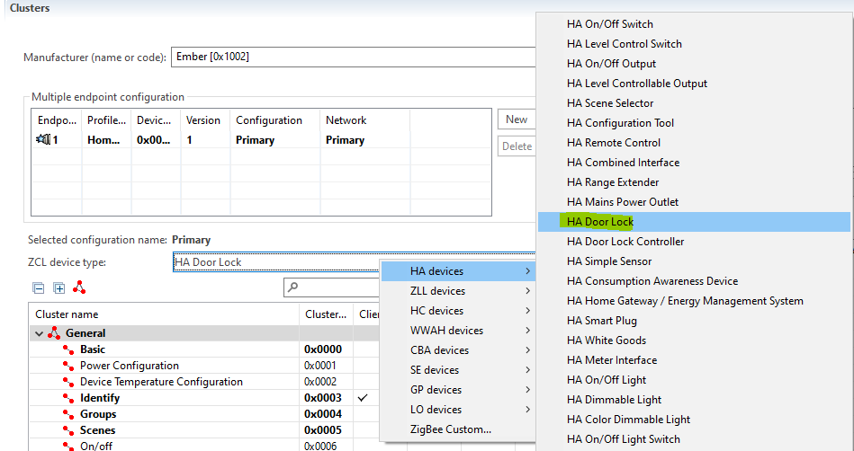

## Stack Settings

Under the Zigbee Stack tab, set the ZigBee Device Type to "End Device", ensure security type is "ZigBee 3.0 Security".

### Plugins:

The following plugins will need to be enabled. Navigate to the plugins tab and activate these if they are not already activated by default.

#### Common Clusters

* Identify Cluster: Ember implementation of Identify cluster.

#### HAL

* Antenna Stub: Stub implementation of the antenna configuration APIs for devices that do not support antenna configuration.

* Debug JTAG: Allows debugging through JTAG.

* HAL Library: Standard HAL library.

* NVM3 Library: Provides a mean to store and retrieve objects from the flash.

* Simulated EEPROM version 2 to NVM3 Upgrade Stub: This library provides stub functionality for the sim-eeprom2-to-nvm3-upgrade library.

#### I/O

* Serial: Allows us to use the Serial interface to communicate with the board.

#### Network Form and Join

* Scan Dispatch: This plugin allows there to be multiple consumers of the stack 802.15.4 scan results.

#### Printing

* Ember Minimal Printf: Allows us to use debug printing to console in our application.

#### RAIL

* RAIL Library: This plugin provides core RAIL library.

* Radio Coexistence Stub: Stub implementation of the radio coexistence API for devices that do not use coexistence.

#### Stack Libraries

* Binding Table Library: Implements the binding table for us instead of having to do it manually.

* Debug Basic Library: Provides basic debug functionality.

* End Device Bind Library: Responds to ZDO End Device Bind requests.

* Install Code Library: The Install code library provides an initial link key based upon an install code manufacturering token in the device

* Packet Validate Library: Validates all IEEE 802.15.4, ZigBee NWK and ZigBee APS layer messages.

* Security Link Keys Library: The Security Link Keys library provides managament of APS link keys in the key table.

* Source Route Library: The Source route library provides functionality for infrastructure devices.

* Zigbee PRO Leaf Library:  This library includes stubs for parent and routing code, since end devices do not need this functionality. You will have to explicitly remove the ZigBee PRO Stack Library or you will get a generate error.

#### Utility

* CCM* Encryption: Provides encryption through mbed TLS framework.

* End Device Support: Allows configuring of End Device polling.

* Simple Main: Supplies a main() function instead of having to define our own.

* Strong Random: Plugin provides apis for generating cryptographically strong random numbers.  

* ZCL Framework Core: This plugin contains all the core functionality to build ZCL applications.

* mbed TLS: Implementation of cryptographic librairies.


#### Zigbee 3.0

* Find and Bind Target: Allows us to use the binding feature as a target. This will be discussed later in the document. 

* Network steering: Performs the steps to join the network of any Zigbee profile.

* Update TC Link Key: This plugin provides the functionality to update the trust center link key. Used after joining with install code.


### Enabling Callbacks

The following callbacks will need to be enabled. Navigate to the callbacks tab and activate these if they are not already activated by default. More detail about the purpose and implementation of each callback will be provided later in the document. Finally, check the "Generate project-specific callbacks file" box as this will eliminate the need to manually copy the headers to the Door_Lock_callbacks.c file.

#### Non-cluster related

* Cluster Init

* Stack Status

#### Closures: Door Lock Cluster

* Clear Pin

* Get Pin

* Lock Door

* Set Pin

* Unlock Door

# Implementing the Door Lock
## Overview
In this example we will simulate the lock by having an LED set to ON when the door is locked, and OFF when the door is unlocked. The Door Lock may require a pin code to unlock the door, and the Door Lock Controller can enable/disable the pin as well as specifying its value. If the pin is disabled, we require the lock/unlock commands to succeed. If the pin is enabled, we require the lock/unlock commands to succeed if and only if the pin sent along with the command is the correct pin. 

In this context, the Door Lock Controller will serve as the ZCL Door Lock Client, and the Door Lock will be the ZCL Door Lock Server.

The Door Lock Controller will send ZCL commands to the Door Lock via CLI commands. When the Door Lock receives the command, callbacks and tokens will be used to carry out the functions required to update the state of the LED.

The Door Lock Controller will use the following commands, and the Door Lock will react accordingly to these commands.

There are 3 mandatory ZCL attributes for the Door Lock:

1. Door Lock State: Our application will implement the logic to configure this attribute
2. Door Lock Type: As we are using a Wireless Starter Kit and have no actual door lock hardware, we will set this to the default value of Dead Bolt.
3. Actuator Enabled: As we are using a Wireless Starter Kit and have no actual door lock hardware, we will set this to the default value of FALSE.

In addition, we will make use of the optional attributes Send Pin Over the Air, Max PIN Length, and Min Pin Length.

## Enabling the Attributes

In the ZCL Clusters tab, select the Closures: Door Lock cluster. Ensure that the Server box is checked. In the right hand tab, select Attributes. You should see that Lock State, Lock Type, and Actuator are enabled.

Enable the following by checking the box on in the left-hand column:

* Max pin length
* Min pin length
* Send pin over the air

You will notice check boxes appear on the right for each attribute as you enable them, leave these unchecked. 


## Enabling the Commands

In the ZCL Clusters tab, select the Closures: Door Lock cluster. In the right hand tab, select Commands. You should see that LockDoorResponse and UnlockDoorResponse are enabled. Select the following in the Out column:

* SetPinResponse
* GetPinResponse
* ClearPinResponse

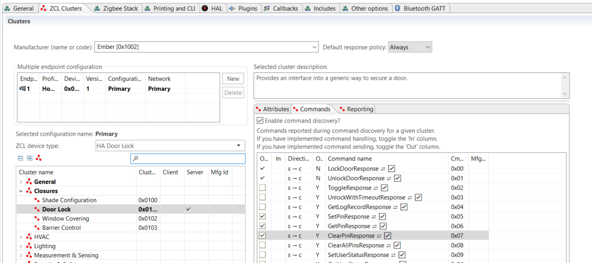

## Setting up the Door Lock

First, you should generate the code for the Door Lock, in the upper-right on the project settings. This will generate the source files necessary, and we will continue the implementations in these files.

### Tokens

Add a file on the Door Lock named custom-token.h. Note that this file has been included with this project as an example. _The final contents of the file can be seen in the custom-token.h file in the example at Door_Lock/src._

In the Door_Lock.isc, in the includes tab, you will need to add the file to the "Custom app token header" field. It's best to use a "Relative to project" path to facilitate future reuse. 

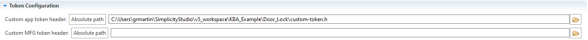

In the file you, will need to define the types used for the tokens. Before filling in this file, regenerate the code.

#### Door Lock Pin

In order to store the Door Lock Pin through the life of the application and through power cycles, we will define a token to store the value of the PIN.

First, we need to define the actual token at the beginning of the file

```C
#define NVM3KEY_DOOR_LOCK_PIN (NVM3KEY_DOMAIN_USER | 0x0001)
```

This will tell EmberZNet to allocate a token named DOOR_LOCK_PIN in the user domain.

We must therefore define our pin length and the default pin. As the pin will not be used until the user specifies the value of the pin, this doesn't matter, so we can set it to an initializer list placeholder for for now. (This is technically a valid pin, but we will consider it as a placeholder until the user specifies a 4-to-8 digit numeric PIN). In the defined(DEFINETYPES) preprocessor block we can add the following.

```C
#define DOOR_LOCK_PIN_STRING_MAX_LENGTH 9 // Set max length to 9 since first String character is length
#define DOOR_LOCK_DEFAULT_PIN { 8, 'X', 'X', 'X', 'X', 'X', 'X', 'X', 'X' } // Set first character to '8' to specify String length of 8
```

Next, we can define our pin type. For simplicity's sake, we will just define an int8u array as our pin (in the defined(DEFINETYPES) preprocessor block):

```C
typedef int8u doorLockPin_t[DOOR_LOCK_PIN_STRING_MAX_LENGTH];

````

In the DEFINETOKENS preprocessor macro block, you can add the line

```C
DEFINE_BASIC_TOKEN(DOOR_LOCK_PIN,
                   doorLockPin_t,
                   DOOR_LOCK_DEFAULT_PIN)
```

This will tell EmberZNet to define a token named DOOR_LOCK_PIN of type doorLockPin_t, with the default value of DOOR_LOCK_DEFAULT_PIN.

#### Door Lock Pin In Use

We will also need to store a boolean variable as a flag to determine if the pin should be used or not. We will define the Door Lock Pin In Use for this purpose. As above, we first define the token in the user domain. This declaration should be at the line after the definition of NVM3KEY_DOOR_LOCK_PIN.

```C
#define NVM3KEY_DOOR_LOCK_PIN_IN_USE  (NVM3KEY_DOMAIN_USER | 0x0002)
```

Finally, since no typedef is needed, we will directly define the token in the DEFINETOKENS preprocessor block and assign a default value of FALSE.

```C
DEFINE_BASIC_TOKEN(DOOR_LOCK_PIN_IN_USE,
                   boolean,
                   FALSE)
```

### Utilities

#### Check Door Lock Pin Helper Function

The only helper function we will need is a function to verify the PIN. This function will take as input an int8u array (the input pin) and it will check it against the stored pin token. This function should also check the value of isPinInUse to ensure that the pin has been set by the user. If it has not, the function will return TRUE no matter what the input PIN is. We can define the function as below. This should be added to the Door_Lock_Callbacks.c file, don't forget to add the function prototype at the beginning of the file.

```C
/** @brief Check Door Lock Pin
 *
 * This function checks if the door lock pin is correct. It will return TRUE if
 * the pin is correct or the pin token is set to the default pin and FALSE if
 * the pin is not correct.
 *
 * @param PIN
 */
boolean checkDoorLockPin(int8u* PIN)
{
  bool isPinCorrect = FALSE;
  bool isPinInUse = FALSE;
  uint8_t maxPinLength;
  uint8_t minPinLength;

  halCommonGetToken(&isPinInUse, TOKEN_DOOR_LOCK_PIN_IN_USE);

  // If no pin is initialized, we will return TRUE
  if (isPinInUse == TRUE)
  {
      //Get the max pin length
      emberAfReadServerAttribute(DOOR_LOCK_ENDPOINT,
                                 ZCL_DOOR_LOCK_CLUSTER_ID,
                                 ZCL_MAX_PIN_LENGTH_ATTRIBUTE_ID,
                                 &maxPinLength,
                                 sizeof(maxPinLength));

      //Get the min pin length
      emberAfReadServerAttribute(DOOR_LOCK_ENDPOINT,
                                 ZCL_DOOR_LOCK_CLUSTER_ID,
                                 ZCL_MIN_PIN_LENGTH_ATTRIBUTE_ID,
                                 &minPinLength,
                                 sizeof(minPinLength));

      doorLockPin_t storedPin;

      // Get the Pin from the token
      halCommonGetToken(&storedPin, TOKEN_DOOR_LOCK_PIN);

      // First check that the PIN is not longer than the max length
      if ((storedPin[0] <= maxPinLength) && (storedPin[0] >= minPinLength))
      {
          // Check the input pin against the stored pin
          int8_t result = memcmp(storedPin, PIN, storedPin[0]);

          if (0 == result)
          {
              isPinCorrect = TRUE;
          }
      }

  }
  else
  {
      isPinCorrect = TRUE;
  }

  return isPinCorrect;
}
```

#### Defines and Typedefs

For practicality and reuse, we will assume that we are using endpoint 1 for the Door Lock. These code snippets can be added to Door_Lock_Callbacks.c.

```C
#define DOOR_LOCK_ENDPOINT 1 // We will use endpoint 1 for this example
```

We will assume that the minimum pin length is 4.

```C
#define DOOR_LOCK_PIN_STRING_MIN_LENGTH 4 // Set min pin length to 4
```

We will also assume that our lock is a deadbolt, and has no actuator. The values assigned to these defines can be found in the ZCL specification. Note that the attribute IDs are already defined in the file attribute-id.h, but we can use constants for certain values of those attributes.

```C
// ZCL Attributes
#define DOOR_LOCK_TYPE_DEAD_BOLT 0x00 // Per ZCL, dead bolt is 0x00
#define DOOR_LOCK_ACTUATOR_DISABLED FALSE // Per ZCL, actuator disabled is FALSE/0x00
```

We will also need to define an enum for the values of the ZCL attribute Door Lock State.

```C
typedef enum {
  DOOR_NOT_FULLY_LOCKED = 0x00,
  DOOR_LOCKED = 0x01,
  DOOR_UNLOCKED = 0x02,
  DOOR_UNDEFINED=0xFF
} doorLockState_t;
```

### Implementing the Callbacks

#### Preamble

These callbacks make use of the EmberZNet API to read attributes, write attributes, construct messages, and send messages.

The EmberAfFill.... macro definitions can be found in the client-command-macro.h file.

Documentation for the functions used in this example, as well as the entire EmberZNet API version 6.8 can be found at https://docs.silabs.com/zigbee/latest/af/

As mentioned in the Enabling the Callbacks section, if you checked the "Generate project-specific callbacks file" in the Callbacks tab before generating the Door Lock code, you will notice that you already have the blank functions ready to be implemented.

#### emberAfDoorLockClusterLockDoorCallback
 
This function is called by the application framework when the node receives a Lock Door Command.

This function will lock the door if the pin is correct or there is no pin defined, as well as send a Door Lock Response with status SUCCESS if the lock operation is successful. If the pin is incorrect, it will not lock the door and send a Door Lock Response with status FAILURE.

We can implement this function as below:

```C
/** @brief Door Lock Cluster Lock Door
 * This function is called by the application framework when the node
 * receives a Lock Door Command.
 *
 * In this callback, we will implement the logic to "lock the door"
 * by checking the PIN, setting the LED, and sending the appropriate
 * response command.
 * @param PIN   Ver.: since ha-1.2-05-3520-29
 */
boolean emberAfDoorLockClusterLockDoorCallback(int8u* PIN)
{
  doorLockState_t doorLockStatus;

  // Check if the pin is correct
  boolean isPinCorrect = checkDoorLockPin(PIN);

  if (isPinCorrect == TRUE)
  {
      doorLockStatus = DOOR_LOCKED;

      // We will set the Door Lock State attribute to "Locked"
      emberAfWriteServerAttribute(DOOR_LOCK_ENDPOINT,
                                           ZCL_DOOR_LOCK_CLUSTER_ID,
                                           ZCL_LOCK_STATE_ATTRIBUTE_ID,
                                           &doorLockStatus,
                                           ZCL_ENUM8_ATTRIBUTE_TYPE);

      // Turn on the LED to simulate the door locking
      halSetLed(1);

      // Send a Door Lock Response with status success
      emberAfFillCommandDoorLockClusterLockDoorResponse(EMBER_ZCL_STATUS_SUCCESS);
      emberAfSendResponse();
  }
  else
  {
    // If the pin is incorrect, send a Door Lock Response with status failure
    emberAfFillCommandDoorLockClusterLockDoorResponse(EMBER_ZCL_STATUS_FAILURE);
    emberAfSendResponse();
  }

  return TRUE;
}
```

#### emberAfDoorLockClusterUnlockDoorCallback

This function is called by the application framework when the node receives an Unlock Door Command.

This function will unlock the door if the pin is correct or there is no pin defined, as well as send a Door Unlock Response with status SUCCESS if the lock operation is successful. If the pin is incorrect, it will not unlock the door and send a Door Unlock Response with status FAILURE.

We can implement this function as below:

```C
/** @brief Door Lock Cluster Unlock Door
 * This function is called by the application framework when the node
 * receives an Unlock Door Command.
 *
 * In this callback, we will implement the logic to "unlock the door"
 * by checking the PIN, clearing the LED, and sending the appropriate
 * response command.
 * @param PIN   Ver.: since ha-1.2-05-3520-29
 */
boolean emberAfDoorLockClusterUnlockDoorCallback(int8u* PIN)
{
  doorLockState_t doorLockStatus;

  // Check if the pin is correct
  boolean isPinCorrect = checkDoorLockPin(PIN);

  if (TRUE == isPinCorrect) {
      doorLockStatus = DOOR_UNLOCKED;

      // We will set the Door Lock State attribute to "Unlocked"
      emberAfWriteServerAttribute(DOOR_LOCK_ENDPOINT,
                                           ZCL_DOOR_LOCK_CLUSTER_ID,
                                           ZCL_LOCK_STATE_ATTRIBUTE_ID,
                                           &doorLockStatus,
                                           ZCL_ENUM8_ATTRIBUTE_TYPE);

      // Turn off the LED to simulate the door unlocking
      halClearLed(1);

      // Send a Door Lock Response with status success
      emberAfFillCommandDoorLockClusterUnlockDoorResponse(EMBER_ZCL_STATUS_SUCCESS);
      emberAfSendResponse();
  }
  else
  {
      // If the pin is incorrect, send a Door Lock Response with status failure
      emberAfFillCommandDoorLockClusterUnlockDoorResponse(EMBER_ZCL_STATUS_FAILURE);
      emberAfSendResponse();
  }

  return TRUE;
}
```

#### emberAfDoorLockClusterSetPinCallback

In this function we implement the logic to set and store the received pin,
 as well as sending the appropriate ZCL response.

 We will check if the Send Pin Over The Air attribute allows the pin to be send over the air. 
 
 If the pin can be sent over the air, we will update the pin and pin in use tokens. We will then send a Set Pin Response with status SUCCESS.

 If the pin cannot be sent over the air, we will respond with a Set Pin Response with status FAILURE.

 We can implement this functionality as below:

 ```C
/** @brief Door Lock Cluster Set Pin
 * This function is called by the application framework when the node
 * receives an Set Pin Command.
 *
 * In this function we implement the logic to set and store the received pin,
 * as well as sending the appropriate ZCL response.
 *
 * @param userId   Ver.: always
 * @param userStatus   Ver.: always
 * @param userType   Ver.: always
 * @param pin   Ver.: always
 */
boolean emberAfDoorLockClusterSetPinCallback(int16u userId,
                                             int8u userStatus,
                                             int8u userType,
                                             int8u* pin)
{
  uint8_t sendPinOverTheAirRead;
  bool sendPinOverTheAir;

  // Check if the pin can be sent over the air
  emberAfReadServerAttribute(DOOR_LOCK_ENDPOINT,
                                       ZCL_DOOR_LOCK_CLUSTER_ID,
                                       ZCL_SEND_PIN_OVER_THE_AIR_ATTRIBUTE_ID,
                                       &sendPinOverTheAirRead,
                                       sizeof(sendPinOverTheAirRead));

  uint8_t maxPinLength;
  uint8_t minPinLength;

  sendPinOverTheAir = (bool) sendPinOverTheAirRead;

  //Get the max pin length
  emberAfReadServerAttribute(DOOR_LOCK_ENDPOINT,
                             ZCL_DOOR_LOCK_CLUSTER_ID,
                             ZCL_MAX_PIN_LENGTH_ATTRIBUTE_ID,
                             &maxPinLength,
                             sizeof(maxPinLength));

  //Get the min pin length
  emberAfReadServerAttribute(DOOR_LOCK_ENDPOINT,
                             ZCL_DOOR_LOCK_CLUSTER_ID,
                             ZCL_MIN_PIN_LENGTH_ATTRIBUTE_ID,
                             &minPinLength,
                             sizeof(minPinLength));

  if ((sendPinOverTheAir == TRUE) && (pin[0] <= maxPinLength) && (pin[0] >= minPinLength))
  {
      boolean isPinInUse = TRUE;

      // Set the pin tokens
      halCommonSetToken(TOKEN_DOOR_LOCK_PIN, pin);
      halCommonSetToken(TOKEN_DOOR_LOCK_PIN_IN_USE, &isPinInUse);

      // If the pin is incorrect, send a Set Pin Response with status success
      emberAfFillCommandDoorLockClusterSetPinResponse(EMBER_ZCL_STATUS_SUCCESS);
      emberAfSendResponse();
  }
  else
  {
      // If the pin is incorrect, send a Set Pin Response with status failure
      emberAfFillCommandDoorLockClusterSetPinResponse(EMBER_ZCL_STATUS_NOT_AUTHORIZED);
      emberAfSendResponse();
  }

  return TRUE;
}
```


#### emberAfDoorLockClusterGetPinCallback

 In this function we implement the logic to return the value of the pin.

 We will check if the pin is in use and if the pin can be sent over the air. If there is no pin in use, we will send a default response with status INVALID_FIELD. If the pin is in use but cannot be sent over the air, we will send a default response with status NOT_AUTHORIZED.

 If both conditions are met, we will get the stored pin token, and send that value in a Get Pin Response.

 The function can be implemented as below:

```C
/** @brief Door Lock Cluster Get Pin
 *
 * This function is called by the application framework when the node
 * receives a Get Pin Command.
 *
 * In this function we implement the logic to return the value of the pin
 * to the original sender.
 *
 * @param userId   Ver.: always
 */
boolean emberAfDoorLockClusterGetPinCallback(int16u userId)
{


  uint8_t sendPinOverTheAir;
  bool isPinInUse = FALSE;

  halCommonGetToken(&isPinInUse, TOKEN_DOOR_LOCK_PIN_IN_USE);

  // Check if the pin can be sent over the air
  emberAfReadServerAttribute(DOOR_LOCK_ENDPOINT,
                                       ZCL_DOOR_LOCK_CLUSTER_ID,
                                       ZCL_SEND_PIN_OVER_THE_AIR_ATTRIBUTE_ID,
                                       &sendPinOverTheAir,
                                       sizeof(sendPinOverTheAir));

  if (isPinInUse == TRUE)
  {
      if (sendPinOverTheAir == TRUE)
      {
          doorLockPin_t storedPin;

        // Put the stored pin into a buffer to send
        halCommonGetToken(&storedPin, TOKEN_DOOR_LOCK_PIN);

        // Send the Get Pin response containing the pin
        emberAfFillCommandDoorLockClusterGetPinResponse(0,
                                                        0,
                                                        0,
                                                        storedPin);
        emberAfSendResponse();
      }
      else
      {
          // Send the Default Response with status "Not Authorized"
          emberAfSendImmediateDefaultResponse(EMBER_ZCL_STATUS_NOT_AUTHORIZED);
          emberAfSendResponse();
      }
  }
  else
  {
      // Send the Default Response with status "Invalid Field"
      emberAfSendImmediateDefaultResponse(EMBER_ZCL_STATUS_INVALID_FIELD);
      emberAfSendResponse();
  }

  return TRUE;
}
```

#### emberAfDoorLockClusterClearPinCallback

This function will clear the pin and the 'in use' flag for the pin. Following a successful execution of this function, the pin is no longer in use and the user can freely lock and unlock the door.

The function checks that the user ID is 0, as this is the only permitted user. It also checks that the Send Pin Over The Air attribute is set to TRUE. If either condition is not met, it sends a Clear Pin Response with status NOT_AUTHORIZED.

The function is successful, it sends a Clear Pin Response with status SUCCESS.

The function can be implemented as below:

```C
/** @brief Door Lock Cluster Clear Pin
 *
 * In this function we implement the logic to clear the value of the pin.
 *
 * @param userId   Ver.: always
 */
boolean emberAfDoorLockClusterClearPinCallback(int16u userId)
{
  uint8_t sendPinOverTheAir;

  // Check if the pin can be sent over the air
  emberAfReadServerAttribute(DOOR_LOCK_ENDPOINT,
                                       ZCL_DOOR_LOCK_CLUSTER_ID,
                                       ZCL_SEND_PIN_OVER_THE_AIR_ATTRIBUTE_ID,
                                       &sendPinOverTheAir,
                                       sizeof(sendPinOverTheAir));

  if ((sendPinOverTheAir == TRUE) && (userId == 0))
  {
      doorLockPin_t newPin = DOOR_LOCK_DEFAULT_PIN;
      boolean isPinInUse = FALSE;

      // Set the pin tokens
      halCommonSetToken(TOKEN_DOOR_LOCK_PIN, &newPin);
      halCommonSetToken(TOKEN_DOOR_LOCK_PIN_IN_USE, &isPinInUse);

      // If the pin is incorrect, send a Clear Pin Response with status success
      emberAfFillCommandDoorLockClusterClearPinResponse(EMBER_ZCL_STATUS_SUCCESS);
      emberAfSendResponse();
  }
  else
  {
      // If the pin is incorrect, send a Clear Pin Response with status not authorized
      emberAfFillCommandDoorLockClusterClearPinResponse(EMBER_ZCL_STATUS_NOT_AUTHORIZED);
      emberAfSendResponse();
  }

  return TRUE;
}

```

#### emberAfClusterInitCallback

This function will be used to set the values of certain attributes that will remain invariant, as well as to set the state of the LED to indicate if the door is "locked" at initialization.

This callback is called after the Main function during the intiialization of each cluster. We will only apply changes to the Door Lock cluster.

We will set the mandatory attributes to their default values, as well as reading the Door Lock State attribute to set the LED accordingly.

This function can be implemented as below:

```C
/** @brief Cluster Init
 *
 * This function is called when a specific cluster is initialized. It gives the
 * application an opportunity to take care of cluster initialization procedures.
 * It is called exactly once for each endpoint where cluster is present.
 *
 * We will use this function to get and initialize the values for the
 * Door Lock cluster attributes.
 *
 * @param endpoint   Ver.: always
 * @param clusterId   Ver.: always
 */
void emberAfClusterInitCallback(int8u endpoint,
                                EmberAfClusterId clusterId)
{

  if (clusterId == ZCL_DOOR_LOCK_CLUSTER_ID)
    {
      uint8_t lockType = DOOR_LOCK_TYPE_DEAD_BOLT;
      uint8_t actuatorEnabled = DOOR_LOCK_ACTUATOR_DISABLED;
      uint8_t maxPinLength = DOOR_LOCK_PIN_STRING_MAX_LENGTH;
      uint8_t minPinLength = DOOR_LOCK_PIN_STRING_MIN_LENGTH;
      uint8_t sendPinOverTheAir = TRUE;

      // Set the Lock Type to Dead Bolt
      emberAfWriteServerAttribute(DOOR_LOCK_ENDPOINT,
                                           ZCL_DOOR_LOCK_CLUSTER_ID,
                                           ZCL_LOCK_TYPE_ATTRIBUTE_ID,
                                           &lockType,
                                           ZCL_ENUM8_ATTRIBUTE_TYPE);

      // Set the Actuator Enabled to FALSE
      emberAfWriteServerAttribute(DOOR_LOCK_ENDPOINT,
                                           ZCL_DOOR_LOCK_CLUSTER_ID,
                                           ZCL_ACTUATOR_ENABLED_ATTRIBUTE_ID,
                                           &actuatorEnabled,
                                           ZCL_BOOLEAN_ATTRIBUTE_TYPE);

      // Set the Max Pin Length to DOOR_LOCK_PIN_STRING_MAX_LENGTH
      emberAfWriteServerAttribute(DOOR_LOCK_ENDPOINT,
                                           ZCL_DOOR_LOCK_CLUSTER_ID,
                                           ZCL_MAX_PIN_LENGTH_ATTRIBUTE_ID,
                                           &maxPinLength,
                                           ZCL_DATA8_ATTRIBUTE_TYPE);

      // Set the Min Pin Length to DOOR_LOCK_PIN_STRING_LENGTH
      emberAfWriteServerAttribute(DOOR_LOCK_ENDPOINT,
                                                 ZCL_DOOR_LOCK_CLUSTER_ID,
                                                 ZCL_MIN_PIN_LENGTH_ATTRIBUTE_ID,
                                                 &minPinLength,
                                                 ZCL_DATA8_ATTRIBUTE_TYPE);

      // Set the Send Pin Over the Air to TRUE
      emberAfWriteServerAttribute(DOOR_LOCK_ENDPOINT,
                                                 ZCL_DOOR_LOCK_CLUSTER_ID,
                                                 ZCL_SEND_PIN_OVER_THE_AIR_ATTRIBUTE_ID,
                                                 &sendPinOverTheAir,
                                                 ZCL_BOOLEAN_ATTRIBUTE_TYPE);

      doorLockState_t lockStatus;

      // Read the Door Lock State
      emberAfReadServerAttribute(DOOR_LOCK_ENDPOINT,
                                           ZCL_DOOR_LOCK_CLUSTER_ID,
                                           ZCL_LOCK_STATE_ATTRIBUTE_ID,
                                           &lockStatus,
                                           sizeof(lockStatus));

      // Set the LED accordingly
      if (DOOR_LOCKED == lockStatus)
      {
          halSetLed(1);
      }
      else
      {
          halClearLed(1);
      }
    }
}
```

### Build and Flash the Door Lock

Now that everything is correctly set up, build and flash the Coordinator, the Door Lock Controller, and the Door Lock, and we can proceed to the next steps.

# Creating and Joining the Network

## Install Code

An install code is used to create a preconfigured, link key. The install code is transformed into a link key by using the AES-MMO hash algorithm, and the derived Zigbee link key will be known only by the Trust Center and the joining device. This is done so the Trust Center can use that key to securely transport the Zigbee network key to the device. Once the device has the network key, it can communicate at the network layer to the Zigbee network.

Install codes will be used for both the Door Lock and Door Lock Controller.

To program the install codes on the Door Lock and Door Lock Controller, we can create a batch file with the value of the install code, and use it to write the install code into the manufacturing area of the nodes with Simplicity Commander.

```
@echo off
  
  
:: THIS FILE IS USED FOR PROGRAMMING INSTALLATION CODE AUTOMATICALLY.
  
:: use PATH_SCMD env var to override default path for Simplicity Commander
if "%PATH_SCMD%"=="" (
  set COMMANDER="C:\SiliconLabs\SimplicityStudio\v4\developer\adapter_packs\commander\commander.exe"
) else (
  set COMMANDER=%PATH_SCMD%\commander.exe
)
  
:: default file extension of GCC and IAR
set DEFAULT_INSTALL_CODE="%1"
  
:: change the working dir to the dir of the batch file, which should be in the project root
cd %~dp0
  
if not exist "%COMMANDER%" (
  echo Error: Simplicity Commander not found at '%COMMANDER%'
  echo Use PATH_SCMD env var to override default path for Simplicity Commander.
  pause
  goto:eof
)
  
echo **********************************************************************
echo Program the default installation code to the specified device
echo 1. Erase the Installation Code if existing
echo 2. Program the Installation Code into the Manufacturing Area of the specified Device
echo 3. Check the Stored Installation Code
echo **********************************************************************
echo.
%COMMANDER% flash --tokengroup znet --token "Install Code: !ERASE!" --serialno %2
echo.
%COMMANDER% flash --tokengroup znet --token "Install Code:%DEFAULT_INSTALL_CODE%" --serialno %2
echo.
%COMMANDER% tokendump --tokengroup znet --token TOKEN_MFG_INSTALLATION_CODE --serialno %2
```
  
The script takes two arguments:

The first argument is the install code value, you can use the following suggested values

Door Lock: 83FED3407A939723A5C639B26916D505

Door Lock Controller: 88776655443322111122334455667788

The second argument is the USB serial ID, this can be found in the Simplicity Studio Debug Adapter tab, under ID:

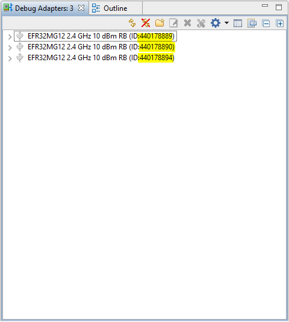

The batch file can be executed as follows:
```
program_install_code.bat <Install Code> <USB Serial ID>
```

For example:

```
program_install_code.bat 83FED3407A939723A5C639B26916D505 440178889
The output of the script should look like the following:
```

When you have successfully run the script, note the 2-byte CRC value listed after the install code, as this will be needed to generate the link key.

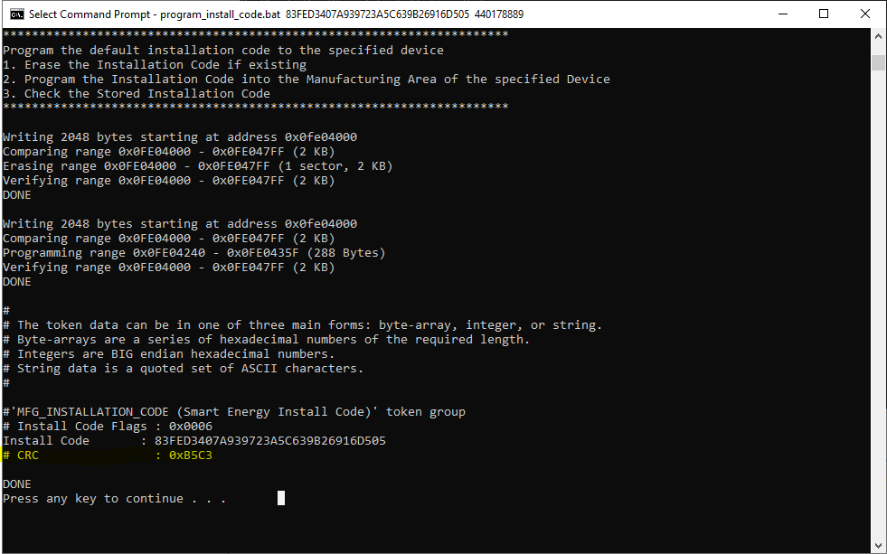

You will need to run the script twice in total, once to program the install code on the Door Lock and note the CRC, and again for the Door Lock Controller

## Deriving the Network Link Keys
Once you have successfully programmed the two install codes, we can now derive the link keys.

First, we will need to provide the install codes to the coordinator. To connect to the CLI, right click on your device in the "Debug Adapters" tab, and click "Launch Console", select the "Serial 1" tab. We will execute the following command on the coordinator: Note that the 2-byte CRC is in big endian, i.e. the byte order will need to be reversed from the console output, so 0xB5C3 will become C3 B5.


```
option install-code <link key table index> {<Joining Node's EUI64>} {<16-byte install code + 2-byte CRC>}
```


The EUI64 value can be found by executing the "info" command on the given node.

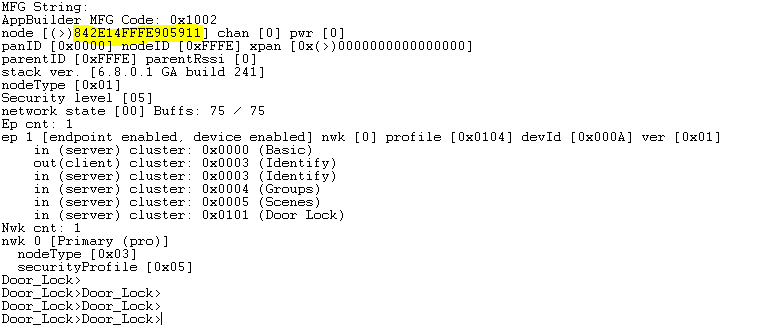

In the case of the nodes used for this example, first we provide the Door Lock install code (example, you will need to replace the EUI64 with that of your device for all commands requiring EUI64 as an argument):

```
option install-code 0 { 84 2E 14 FF FE 90 59 11 } { 83 FE D3 40 7A 93 97 23 A5 C6 39 B2 69 16 D5 05 C3 B5 }
```

Followed by the Door Lock Controller, note we need to use table index 1 for this node to avoid overwriting the Door Lock in the table.

```
option install-code 1 { 84 2E 14 FF FE 90 58 9F } { 88 77 66 55 44 33 22 11 11 22 33 44 55 66 77 88 D4 90 }
```

You should get the following output for each execution of the command:

```
Success: Set joining link key
```

Once you have done both, you can execute the command

```
keys print
```

You will then be able to see the derived link keys. Note that the derived link keys have a 300 second timeout on the trust center, which can be observed in the TTL field of the "keys print" command. 

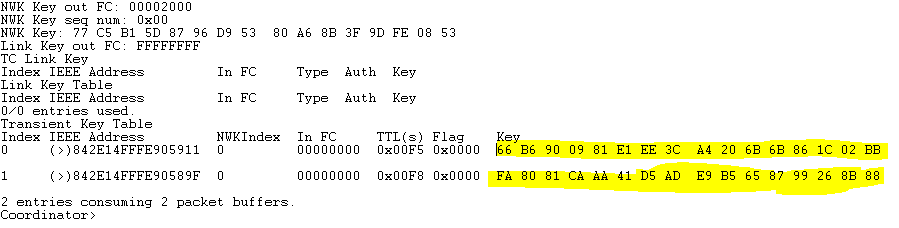

## Creating the Network
In the serial console, execute the following command on the coordinator.

```
plugin network-creator start 1
```

You can find the PAN ID using the following command.

```
network id
```

## Joining the Network

Before proceeding, note that it's a good idea to turn on Network Analyzer here, as it will be easier to obtain the network key and analyze the network in real-time. If you don't you'll have to get the network key from the keys print command and it in manually to Network Analyzer.

Once the Coordinator has created the network, we can join the Door Lock and Door Lock Controller. To be sure that we start from fresh network settings, or that the devices are not already on a network, run the following command on both devices (launch the CLI console similar to how you did on the Coordinator):

```
network leave
```

Now we can open the network to specific link keys using the following command:

```
plugin network-creator-security open-with-key {eui64 of your device} {linkkey}
```

You'll have to do this sequence:
* Open the network for the Door Lock
* Join the Door Lock
* Open the network for the Door Lock Controller
* Join the Door Lock Controller

On the Coordinator (example, you will need to replace the EUI64 with that of your device for all commands requiring EUI64 as an argument):

```
plugin network-creator-security open-with-key { 84 2E 14 FF FE 90 59 11 }  {66 B6 90 09 81 E1 EE 3C A4 20 6B 6B 86 1C 02 BB}
```

On the Door Lock:

```
plugin network-steering start 0
```

This starts the network steering process. The 0 option tells the switch to join with no additional options. The primary thing that this does is tell the joining device to change its install code after joining.

We can tell that joining is successful by seeing the "Update Link Key" prints as below.

```
Update TC Link Key: New key established: 0x03
Partner: B9 EF D8 FE FF 57 0B 00 
NWK Steering: Trust center link key update status: 0x03
Update TC Link Key: New key established: 0x65
Partner: B9 EF D8 FE FF 57 0B 00 
NWK Steering: Trust center link key update status: 0x65
```

Again on the Coordinator:

```
plugin network-creator-security open-with-key { 84 2E 14 FF FE 90 58 9F }  {FA 80 81 CA AA 41 D5 AD E9 B5 65 87 99 26 8B 88}
```

Finally, on the Door Lock Controller:  

```
plugin network-steering start 0
```

Once both devices have successfully joined the network, we can move on.

## Find and Bind

We need some sort of functionality to get our Door Lock Controller to look for and find our Door Lock and then join with the Door Lock so that it can easily send messages instead of needing to know the address. Additionally, the switch and light need some means of discovering if they share common clusters, like the on-off cluster. To assist with this, Zigbee provides finding & binding as a standard means of performing just this action.

We will use the Find and Bind plugin on the Door Lock Controller and Door Lock to achieve this. The plugin provides a shorthand way of allowing the devices to find and remember the addresses of other devices on the network that share common clusters.

The Door Lock will be the "target" as it will be the one eventually receiving commands from the controller. We can set the Door Lock to wait for find-and-bind messages by using the following command:

```
plugin find-and-bind target 1
```

The Door Lock Controller will be the "initiator" as it will be the one eventually sending commands to the lock. Using the following command, the Door Lock Controller will send out a message asking for nodes with common clusters that we can "bind" to to identify themselves. 

```
plugin find-and-bind initiator 1
```

There will be some traffic in the console. Successful operation will show the following line:

```
Find and Bind Initiator: Complete: 0x00
```

Once the find and bind is complete, you can execute the following command to see the binding table.

```
option binding-table print
```

The output will look something like this:

```
#  type   nwk  loc   rem   clus   node   eui
0: UNICA  0    0x01  0x01  0x0003 0x0816 (>)842E14FFFE905911
1: UNICA  0    0x01  0x01  0x0004 0x0816 (>)842E14FFFE905911
2: UNICA  0    0x01  0x01  0x0005 0x0816 (>)842E14FFFE905911
3: UNICA  0    0x01  0x01  0x0101 0x0816 (>)842E14FFFE905911
4: UNICA  0    0x01  0x01  0xFC00 0x0816 (>)842E14FFFE905911
5 of 10 bindings used
```

It displays which clusters for which nodes it has a binding. You should be able to identify the Door Lock Cluster (0x0101) in the "clus" column, as well as the node ID of the Door Lock in the "node" column. In our case, entry number 3 indicates that our Door Lock of Node ID 0x0816 has a binding on the Door Lock cluster.

## Note on ZCL Strings

The String data type is a special case in the ZCL. All strings are MSB with the first byte being the length byte for the string. There is no
null terminator or similar concept in the ZCL. Therefore a 5-byte string is actually 6 bytes long, with the first byte indicating the length of
the proceeding string. For example, “05 68 65 6C 6C 6F” is a ZCL string that says “hello.”

This means that the first character of the Door Lock PIN code will have to specify the length of the PIN.

## Running and Testing the Application

Now, from the Door_Lock_Controller, you can control the lock using CLI commands.

To execute a command, you must first construct the command, and then execute a second command to actually send the command. 

As no pin is yet defined, for now the door will freely lock and unlock. You can send a lock command by entering the following (note the "XXXX" is a placeholder as no pin is yet in use) to construct the command buffer:

```
zcl lock lock "XXXX"
```
Finally, to send the message, we use 
```
bsend 1
```
This will cause endpoint 1 to send the message to any bindings it has on the given cluster.

Following the execution of these commands, you should be able to observe the LED turning on.

In the Network Analyzer, we should see a Lock Door Command going from the Controller to the Lock, followed by a Lock Door Response going back to the Controller, followed by a Default Response going back to the Door Lock.


We can then subsequently send a Door Unlock Command to unlock the door. 

```
zcl lock unlock "XXXX"
```

The LED will turn off, and we will see the following flow in the network analyzer:


We can now set a pin code to secure the lock.

```
zcl lock set-pin 0 0 0 "4242"
```


Once the message is sent, we can try to lock the door again, but try using an incorrect pin. You should observe in the Network Analyzer that the Door Lock Response returns a status of 0x01 (FAILURE) instead of 0x00 (SUCCESS).


Using the command

```
zcl lock lock "4242"
```

The LED will turn back on. In the Network Analyzer we see that when using the correct pin, the Lock Door Response returns a status of 0x00 (SUCCESS).


You can also try the Get Pin command to query the value of the pin.

```
zcl lock get-pin 0
```

To disable the pin, use the following command.

```
zcl lock clear-pin 0
```

At this point, the Lock and Unlock commands will again succeed on each execution.

The lock state can be queried using the command 

```
zcl global read 0x0101 0x0000
```

Where the first parameter is the Cluster ID, and the second is the Attribute ID.


You can also use the "zcl global write" command to write the Send Pin Over the Air attribute, and see what happens when you try to modify the pin.
