# Tutorial Overview


This lab procedure demonstrates how to create Lock projects in Simplicity Studio 5.4 with the new Project Configurator interface. In this lab, the trainee will learn how to create a project, do some simple configurations, use events and tokens, as well as learn about how callbacks are structured within the EmberZNet 7.0.0 framework. 

### Hardware Requirements 

 

    ·3x WSTK (BRD4001)

    ·3x EFR32MG21 Radio Board (BRD4180B)


### Glossary 

 

    ·ZAP Tool: Zigbee Advanced Platform tool.  

    ·SLCP: File containing project configurations. 

    ·SLCC: File extension containing component configurations. 

    ·Component: Software component that can be installed/uninstalled. Is related to, but not exactly analogous to a plugin.


## Creating projects 
### Create a Zigbee-LockCoordinator-UC

    ·  Launch Simplicity Studio 

    ·  In the Launcher Tab choose the device of your choice and click "Start" 

    ·  Click on "Create New Project" 
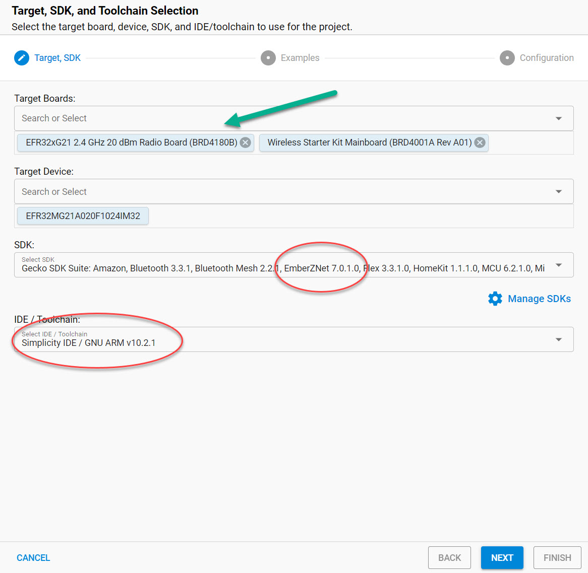

    ·  Click “Next”. 

    ·  Click on the "Zigbee" checkbox on the left 

    ·  Select the "ZigbeeMinimal" project and click "Next" 

    ·  Rename the project “Zigbee-LockCoordinator-UC” 

    ·  Click on "Finish" to create your project
### Create a Zigbee Controller and Zigbee Lock Device 
Follow the same steps above to create one application named Zigbee-LockController-UC and another application named Zigbee-Lock-UC.

## Using the Project Configurator to Configure the Projects
Here we will explore the Project Configurator interface and use it to configure the projects. We will need to set the Zigbee-LockCoordinator-UC project as a coordinator, which will require us to add a few additional components.  

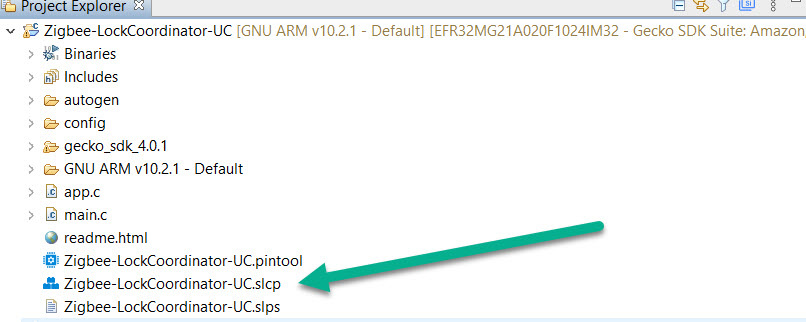

### Configure the Zigbee-LockCoordinator-UC as a Coordinator 

    ·  Expand the Zigbee-LockCoordinator-UC project inside the SV5 IDE 

    ·  Double click on the Zigbee-LockCoordinator-UC.slcp file to launch the Project Configurator 

    ·  In the Project Configurator click on "Software Components" to see all the components installed in the Zigbee-LockCoordinator-UC

    ·  In the search box type "Zigbee Device Config" and click on the Configure button in the Zigbee Device Config component 

 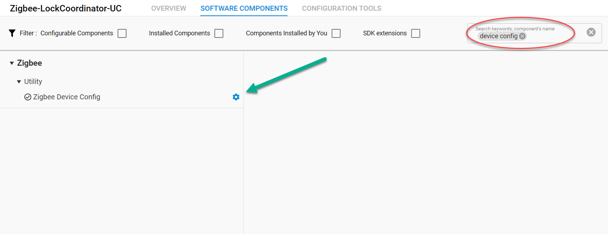

    · In the "Primary Network Device Type" select "Coordinator or Router"

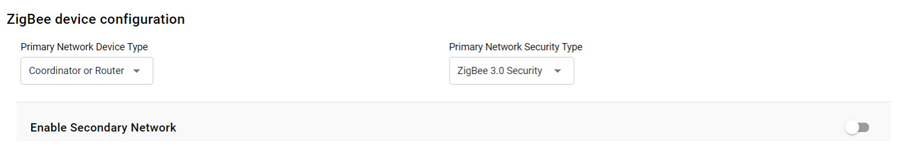

### Configure the Zigbee-LockCoordinator Endpoint 

Back to Zigbee-LockCoordinator-UC.slcp, select “CONFIGURATION TOOLS” box in the top bar, open “Zigbee Cluster Configurator”.

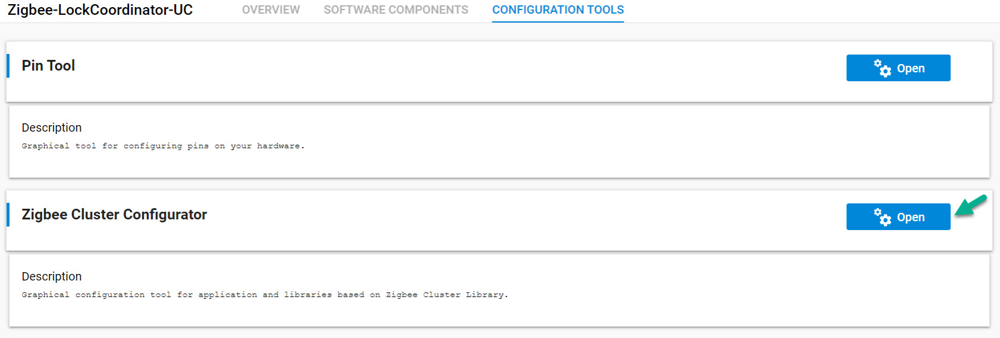

Select the Zigbee Cluster Configurator and click Open. 
Click on “EDIT ENDPOINT”. 

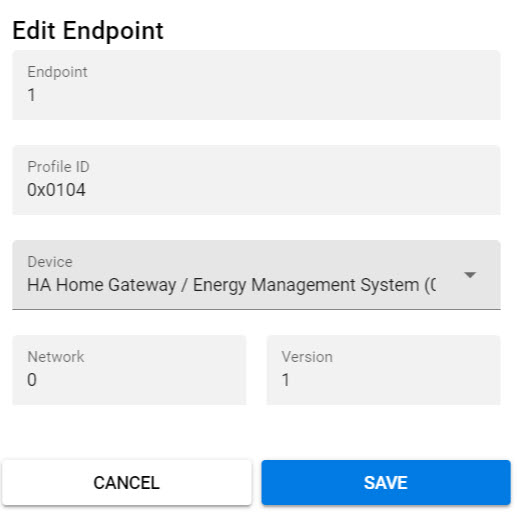

In the Device box, search “HA Home Gateway” and Click SAVE.


We have now successfully added an endpoint. In the main screen, click on the General dropdown to see the enabled clusters.

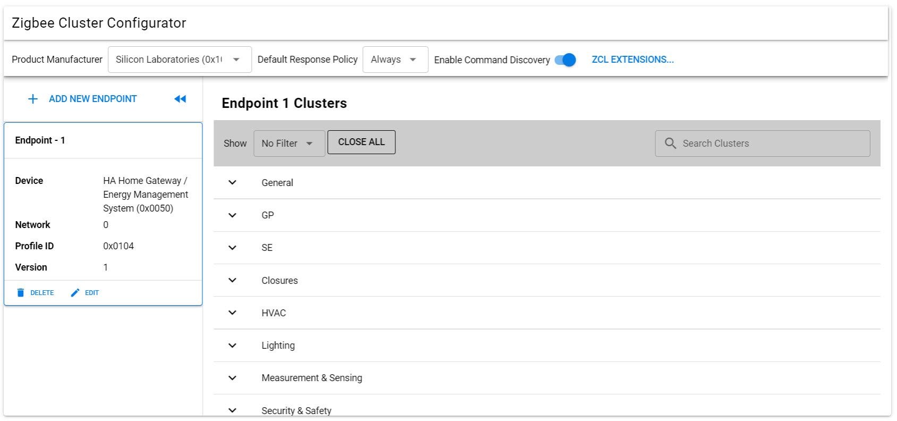

Notice the yellow exclamation points on the left of the clusters, these indicate that the component is not installed. Keep this default configuration because we will manually install the necessary component through the SLCP interface

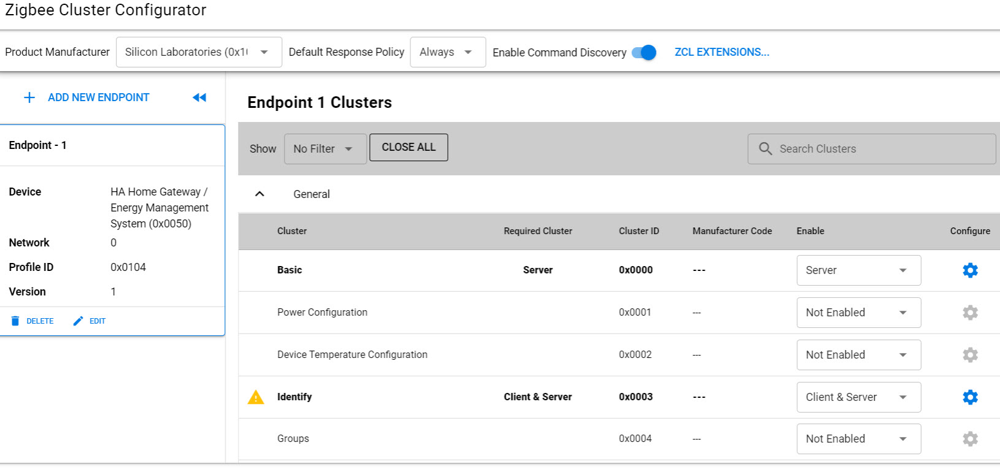

**important**: Once you have finished configuring the clusters in the ZAP Tool, make sure to SAVE the configuration. 


### Component Configuration

Back to Project Configurator click on "Software Components", type “Zigbee” in the search box.

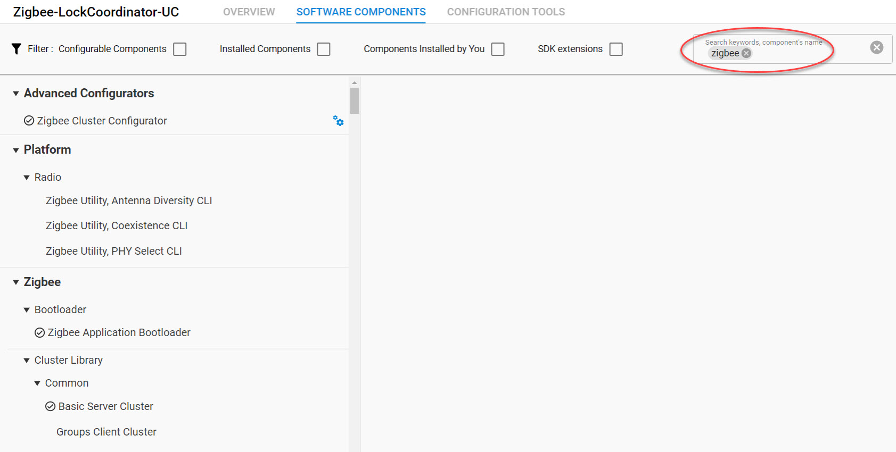

Check the following components are installed

Common Clusters

    ·   Basic Server Cluster: Ember implementation of Basic server cluster.

    ·   Identify Cluster: Ember implementation of Identify cluster.

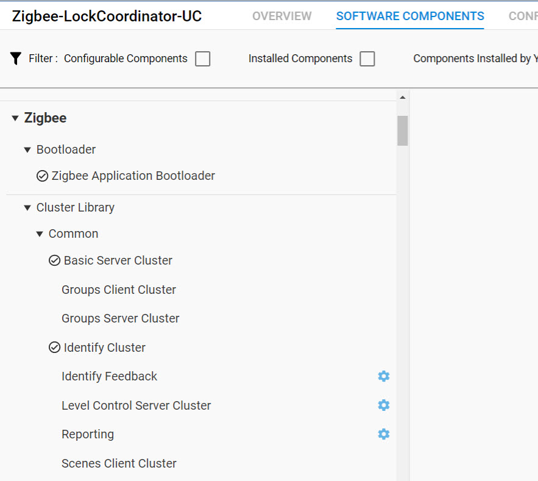

Network Form and Join

    ·   Scan Dispatch: This plugin allows there to be multiple consumers of the stack 802.15.4 scan results.

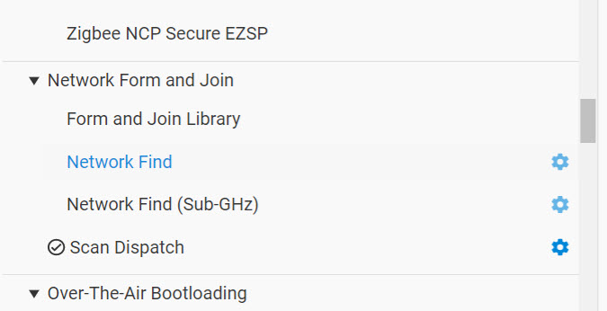


Stack Libraries

    ·  Binding Table Library: Implements the binding table for us instead of having to do it manually.

    ·  Debug Basic Library: Provides basic debug functionality.

    ·  End Device Bind Library: Responds to ZDO End Device Bind requests.

    ·  Packet Validate Library: Validates all IEEE 802.15.4, ZigBee NWK and ZigBee APS layer messages.

    ·  Security Link Keys Library: The Security Link Keys library provides management of APS link keys in the key table.

    ·  Source Route Library: The Source route library provides functionality for infrastructure devices.

    ·  Zigbee PRO Stack Library: The main ZigBee PRO Stack library for parsing, processing, generating and managing the ZigBee PRO stack messages and functionality.

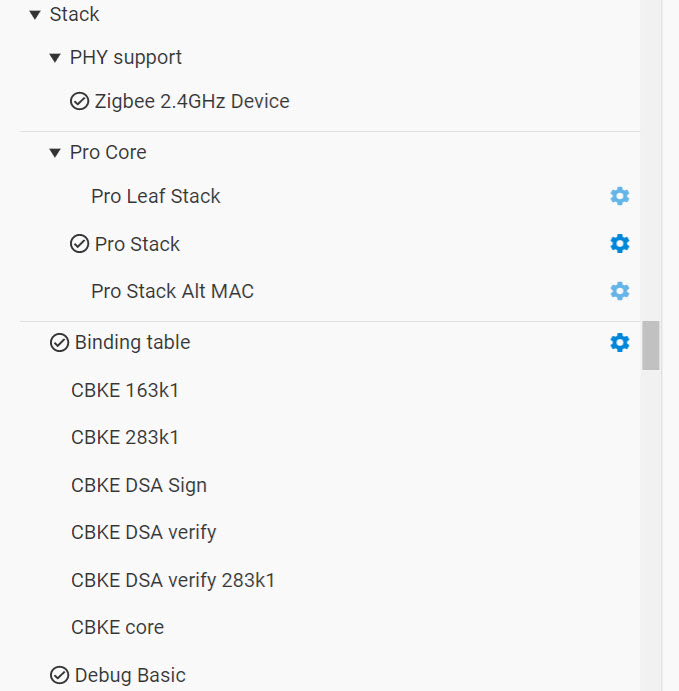
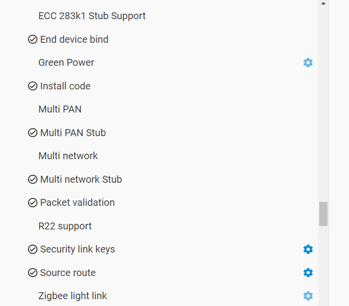

Zigbee 3.0

    ·  Network Creator: Allows device to create a network.

    ·  Network Creator Security: Allows device to manage network security.

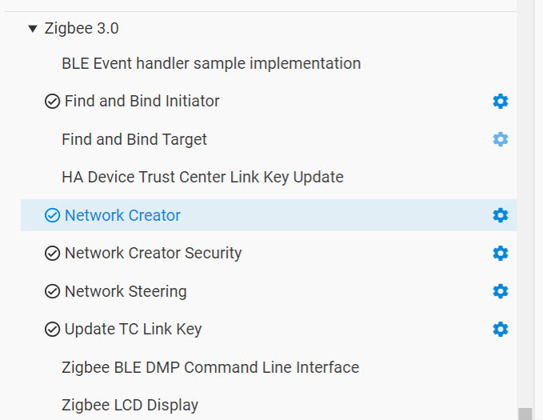

**Save the configurator**

**Build the Zigbee-Lock-Coordinator-UC**

### Configure the Zigbee-LockController-UC as a router


    ·  Expand the Zigbee-LockController-UC project inside the SV5 IDE 

    ·  Double click on the Zigbee-LockController-UC.slcp file to launch the UC interface 

    ·  Click on “CONFIGURATION TOOLS”, then open the Zigbee Cluster Configurator. Create Endpint-1 as “HA Door Lock Controller”

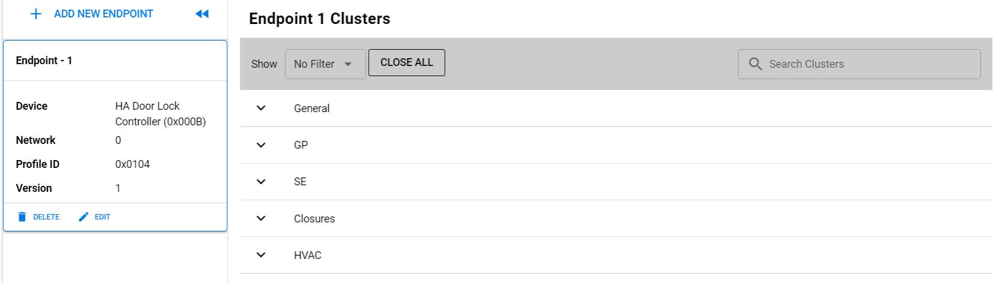

    ·  Expand “Closures”, then Click on the Gear of “Door Lock” to configure the proprieties.

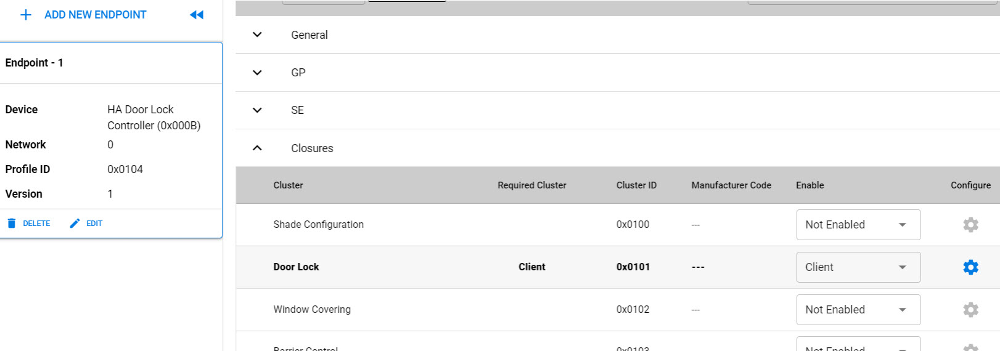

    ·  Click on “COMMANDS” , ensure that the “In” boxes are checked for the follows commands

    ·  LockDoorResponse

    ·  UnlockDoorResponse

    ·  SetPinResponse

    ·  GetPinResponse

    ·  ClearPinResponse

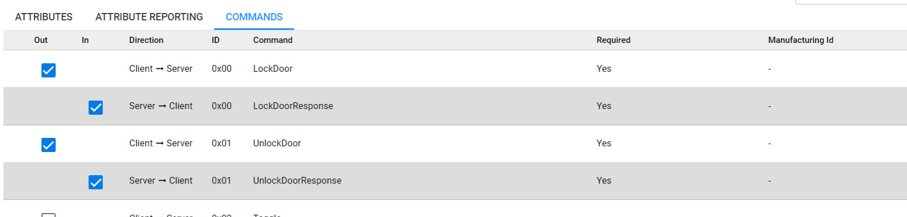
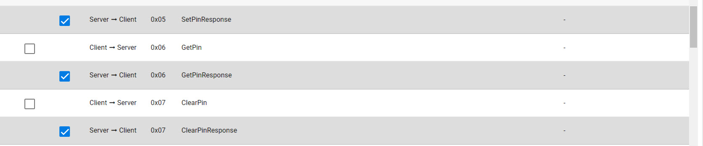

**Save the project.**

Back to the UC interface click on "Software Components" to see all the components installed in the Zigbee-LockController. 

The configurations are the same as Zigbee-LockCoordinator except some changes in Zigbee 3.0. the compoments “network creator” and “network creator security” must be uninstalled.

Zigbee 3.0

    ·  Find and Bind Initiator: Allows us to use the binding feature as an initiator. This will be discussed later in the document.

    ·  Network steering: Performs the steps to join the network of any Zigbee profile.

    ·  Update TC Link Key: This plugin provides the functionality to update the trust center link key. Used after joining with install code.

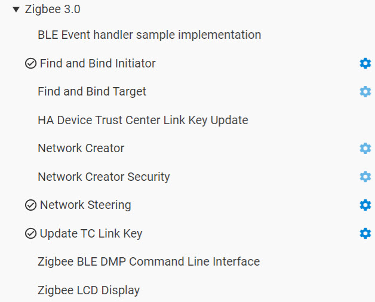

**Save and build the Zigbee-LockController-UC project.**

### Configure the Zigbee-Lock-UC as an end device

    ·  Expand the Zigbee-Lock-UC project inside the SV5 IDE 

    ·  Double click on the Zigbee-Lock-UC.slcp file to launch the UC interface. 

    ·  In the UC interface click on "Software Components" to see all the components installed in the Zigbee-Lock-UC. 

    ·  To set the Zigbee-Lock-UC as an End Device, we cannot directly modify the configuration of the Zigbee Device Config component as the configuration itself has some dependencies on some other components. 

    ·  In order to set the device as an End Device, we must first uninstall the Zigbee Pro Stack library component. 

    ·  We must then install the Zigbee Pro Leaf library component.

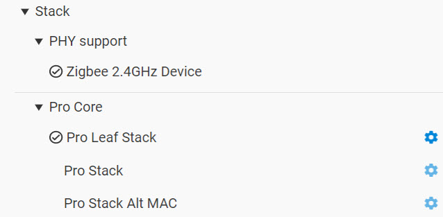

    ·  Once this is done, we can open the Zigbee Device Config component and click on the Configure button in the Zigbee Device Config component. 

    ·  In the "Primary Network Device Type" select "End Device”. 

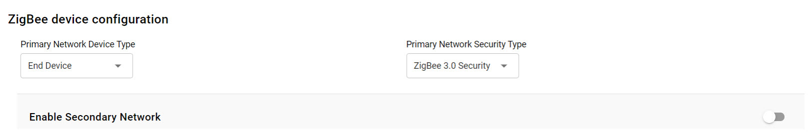

Configure the Zigbee-Lock-UC Endpoint 

    ·  In the Zigbee-Lock-UC.slcp tab click on "Configuration Tools" and open the Zigbee Cluster Configurator interface. 

    ·  This should launch the ZAP interface in the Zigbee-Lock-UC.zap tab. 

    ·  Select an endpoint on the left-hand side to configure the endpoint by adding a cluster to it. 

    ·  As with the Zigbee-Lock-UC, edit Endpoint 1. Configure it as an HA Door Lock. 

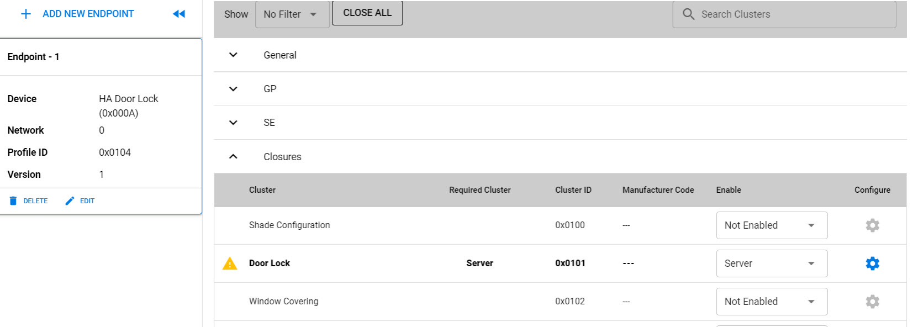


    ·  Click on gear to configure “Door Lock” cluster.
    ·  In the “ATTRIBUTES” table, enable “lock state”, “lock type”, “actuator enabled”, “max pin length”, “min pin length”, “send pin over the air”
    ·  In the “COMMANDS”, enable “LockDoor”, “unLockDoor”,”SetPin”, “GetPin”, “ClearPin” with their response commands.

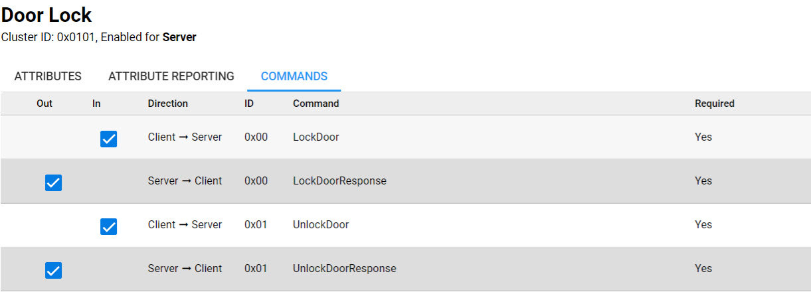
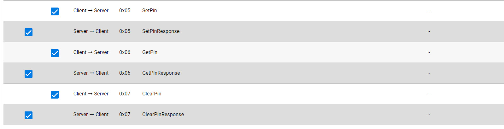

    ·  Once you have finished configuring the clusters in the ZAP Tool, make sure to SAVE the configuration. 
    ·  Back to the UC interface click on "Software Components" to see all the components installed in the Zigbee-Lock-UC. 

The configurations are the same as Zigbee-LockController except some changes in Zigbee 3.0. the components “network creator”, "End device Bind" and “network creator security” must be uninstalled and the “Find and Bind Target” must be installed.

**Zigbee 3.0**

    ·  Find and Bind Target: Allows us to use the binding feature as a target. This will be discussed later in the document.

    ·  Network steering: Performs the steps to join the network of any Zigbee profile.

    ·  Update TC Link Key: This plugin provides the functionality to update the trust center link key. Used after joining with install code.

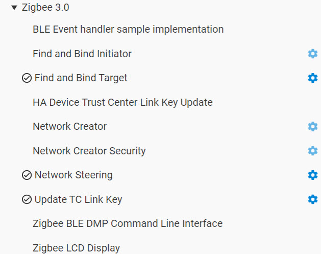

**important** To program the lock functions by ourself, please make sure the “Door Lock Server Cluster” component is not installed. uninstall if it is installed by default.

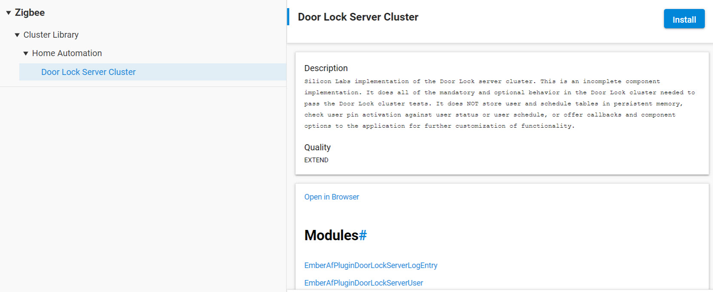

**Save the Zigbee-Lock-UC project.**

### Callbacks

For more detailed information on callbacks in EmberZNet 7.0, please see section 6 of UG491: Zigbee Application Framework Developer’s Guide for SDK 7.0 and Higher.  

In this lab, we will work with 5 separate functions.  

    ·   emberAfDoorLockClusterlockDoorCallback: The function will process the incoming lock cluster commands and then verify the pin, if the pin is correct, it will set the LED on and return a TRUE case.

    ·   emberAfDoorLockClusterUnlockDoorCallback: The function will process the unlock command, then verify the pin, if the pin is correct, it will set LED off and return a TRUE case.

    ·   emberAfDoorLockClusterSetPinCallback : The function will process the set pin command, then verify the pin length, if the pin is the min-max range, it will put pin in the token.

    ·   emberAfDoorLockClusterGetPinCallback: The function will process the get pin command, it will return the pin from the token.

    ·   emberAfDoorLockClusterClearPinCallback: The function will process the clear pin command, it will set default pin in the token and set no pin in use.

Note that all the code in this section will be added into the app.c file. 

**Subscribing to Specific Commands**

Before we can associate a callback with a specific command, we will need to “subscribe” to the command. This will ensure that the application “listens” for the command passed into the sl_zigbee_subscribe_to_zcl_commands function as an argument. 

 

We’ll need to include the zap-id.h  and sl_simple_led_instances.h files in our app.c file. These files contain the necessary ZCL macros. In the emberAfMainInitCallback function, we must add a call as follows: 
```c
  sl_zigbee_subscribe_to_zcl_commands(ZCL_DOOR_LOCK_CLUSTER_ID,

 

                                        0xFFFF,

 

                                        ZCL_DIRECTION_CLIENT_TO_SERVER,

 

                                        emberAfLockClusterServerCommandParse);
                                        
```

**Parsing the Lock cluster server Commands**

 We’ll need to write a function that will parse the incoming lock cluster commands and calls a separate processing function if we receive the “ZCL” command.  

The function receives a ZCL command and checks the command ID, and then it will pass it to the next callback in the chain. See the example implementation below. 

```c
uint32_t emberAfLockClusterServerCommandParse (sl_service_opcode_t opcode,
                                               sl_service_function_context_t *context)

{

 
  (void)opcode;

   bool wasHandled = false;

   uint8_t* PIN;

 

  EmberAfClusterCommand *cmd = (EmberAfClusterCommand *)context->data;

  uint16_t payloadOffset = cmd->payloadStartIndex;


  if (!cmd->mfgSpecific) {

      switch (cmd->commandId) {

        case ZCL_LOCK_DOOR_COMMAND_ID:
        {
           sl_led_turn_on(&sl_led_led0);

           PIN = emberAfGetString(cmd->buffer, payloadOffset, cmd->bufLen);

           wasHandled = emberAfDoorLockClusterlockDoorCallback(PIN);

           break;

         }

         case ZCL_UNLOCK_DOOR_COMMAND_ID:

         {

             PIN = emberAfGetString(cmd->buffer, payloadOffset, cmd->bufLen);

             wasHandled = emberAfDoorLockClusterUnlockDoorCallback(PIN);

             break;

          }

         case ZCL_SET_PIN_COMMAND_ID:

         {

             PIN = emberAfGetString(cmd->buffer, payloadOffset+4, cmd->bufLen);

             wasHandled = emberAfDoorLockClusterSetPinCallback(PIN);

             break;

         }

         case ZCL_GET_PIN_COMMAND_ID:

         {

            wasHandled = emberAfDoorLockClusterGetPinCallback(1);

            break;

         }

         case ZCL_CLEAR_PIN_COMMAND_ID:

         {

            wasHandled = emberAfDoorLockClusterClearPinCallback(1);
            break;
         }

      }
  }
      return ((wasHandled)

                ? EMBER_ZCL_STATUS_SUCCESS

                : EMBER_ZCL_STATUS_UNSUP_COMMAND);

}
```

**Cluster init Callback**

At the beginning of the program, we must initialize the cluster. It will write the maximum length and minimum length of the pin in the attributes.

```c
vvoid emberAfMainInitCallback(void)

{
  doorLockPin_t initPin = DOOR_LOCK_DEFAULT_PIN;
  boolean isPinInUse = FALSE;

  emberAfClusterInitCallback(DOOR_LOCK_ENDPOINT,
                             ZCL_DOOR_LOCK_CLUSTER_ID);


  // Set the pin tokens
  halCommonSetToken(TOKEN_DOOR_LOCK_PIN, &initPin);
  halCommonSetToken(TOKEN_DOOR_LOCK_PIN_IN_USE, &isPinInUse);

  sl_led_init(&sl_led_led0);
  sl_zigbee_subscribe_to_zcl_commands(ZCL_DOOR_LOCK_CLUSTER_ID,

                                        0xFFFF,

                                        ZCL_DIRECTION_CLIENT_TO_SERVER,

                                        emberAfLockClusterServerCommandParse);

} 

```

**Tokens**

With the new project configurator, we must now define tokens through the Token Manager component.

**Enabling Custom Tokens**

    ·   We will now add some custom tokens to the project in order to track the pin-in-use status and door-lock-pin. 
    ·   To do this, we must navigate to the Token manager component and define the token in here.

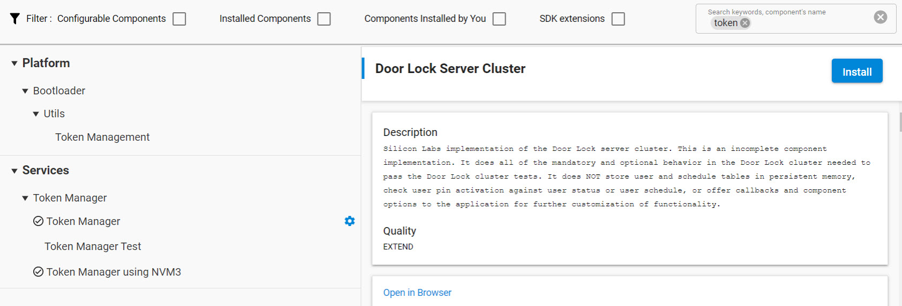

    ·   Next, we must enable custom tokens. To do so, click on the Configure button in the upper-right corner. 

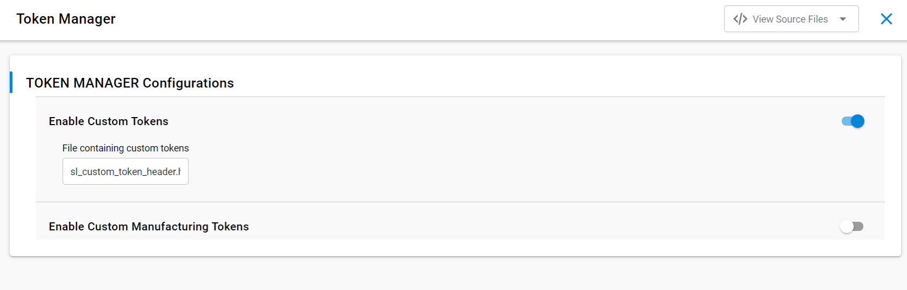

Note that we can choose in which file to define our custom tokens. In this case, we will leave the value as the default. 

The file can be found in the “config” folder of the project files.

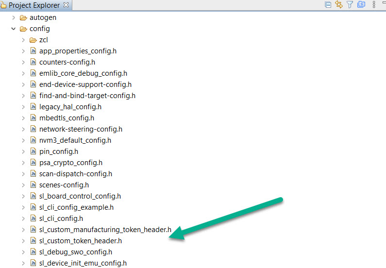

In the file, you will need to define the types used for the tokens.

**Door Lock Pin**

In order to store the Door Lock Pin through the life of the application and through power cycles, we will define a token to store the value of the PIN.

First, we need to define the actual token at the beginning of the file
```c
#define NVM3KEY_DOOR_LOCK_PIN (NVM3KEY_DOMAIN_USER | 0x0001)
```
This will tell EmberZNet to allocate a token named DOOR_LOCK_PIN in the user domain.

 

We must therefore define our pin length and the default pin. As the pin will not be used until the user specifies the value of the pin, this doesn't matter, so we can set it to an initializer list placeholder for for now. (This is technically a valid pin, but we will consider it as a placeholder until the user specifies a 1-to-8 digit numeric PIN). In the defined(DEFINETYPES) preprocessor block we can add the following.

```c
#define DOOR_LOCK_PIN_STRING_MAX_LENGTH 9 // Set max length to 9 since first String character is length

#define DOOR_LOCK_DEFAULT_PIN { 8, '0', '0', '0', '0', '0', '0', '0', '0' } // Set first character to '8' to specify String length of 8
```

Next, we can define our pin type. For simplicity's sake, we will just define an int8u array as our pin (in the defined(DEFINETYPES) preprocessor block):
```c
typedef int8u doorLockPin_t[DOOR_LOCK_PIN_STRING_MAX_LENGTH];
```
In the DEFINETOKENS preprocessor macro block, you can add the line

```c
DEFINE_BASIC_TOKEN(DOOR_LOCK_PIN,

                   doorLockPin_t,

                   DOOR_LOCK_DEFAULT_PIN)
```

This will tell EmberZNet to define a token named DOOR_LOCK_PIN of type doorLockPin_t, with the default value of DOOR_LOCK_DEFAULT_PIN.

**Door Lock Pin In Use**


We will also need to store a boolean variable as a flag to determine if the pin should be used or not. We will define the Door Lock Pin In Use for this purpose. As above, we first define the token in the user domain. This declaration should be at the line after the definition of NVM3KEY_DOOR_LOCK_PIN.
```c
#define NVM3KEY_DOOR_LOCK_PIN_IN_USE  (NVM3KEY_DOMAIN_USER | 0x0002)
```
Finally, since no typedef is needed, we will directly define the token in the DEFINETOKENS preprocessor block and assign a default value of FALSE.

```c
DEFINE_BASIC_TOKEN(DOOR_LOCK_PIN_IN_USE,

                   boolean,

                   FALSE)
```
For the complete version of the code, please refer to src/sl_custom_token_header.h
### Utilities

Check Door Lock Pin Helper Function
The only helper function we will need is a function to verify the PIN. This function will take as input an int8u array (the input pin) and it will check it against the stored pin token. 

This function should also check the value of isPinInUse to ensure that the pin has been set by the user. If it has not, the function will return TRUE no matter what the input PIN is. We can define the function as below. This should be added to the app.c file, don't forget to add the function prototype at the beginning of the file.

```c
/** @brief Check Door Lock Pin
 *
 * This function checks if the door lock pin is correct. It will return TRUE if
 * the pin is correct or the pin token is set to the default pin and FALSE if
 * the pin is not correct.
 *
 * @param PIN
 */
// function to check the input pin is the correct one
boolean checkDoorLockPin(int8u* PIN)
{
  bool isPinCorrect = FALSE;
  bool isPinInUse = FALSE;
  uint8_t maxPinLength;
  uint8_t minPinLength;
  doorLockPin_t storedPin;

  halCommonGetToken(&isPinInUse, TOKEN_DOOR_LOCK_PIN_IN_USE);

  if (isPinInUse)
    emberAfCorePrintln("Lock pin in use \n");
  else
    emberAfCorePrintln("Lock pin Not in use \n");

  // Get the Max Pin Length to DOOR_LOCK_PIN_STRING_MAX_LENGTH
  emberAfReadServerAttribute(DOOR_LOCK_ENDPOINT,
                              ZCL_DOOR_LOCK_CLUSTER_ID,
                              ZCL_MAX_PIN_LENGTH_ATTRIBUTE_ID,
                              &maxPinLength,
                              ZCL_DATA8_ATTRIBUTE_TYPE);

  // Get the Min Pin Length to DOOR_LOCK_PIN_STRING_LENGTH
  emberAfReadServerAttribute(DOOR_LOCK_ENDPOINT,
                             ZCL_DOOR_LOCK_CLUSTER_ID,
                             ZCL_MIN_PIN_LENGTH_ATTRIBUTE_ID,
                             &minPinLength,
                             ZCL_DATA8_ATTRIBUTE_TYPE);

  // If no pin is initialized, we will return TRUE
  if (isPinInUse == TRUE)
  {
      // Get the Pin from the token
      halCommonGetToken(&storedPin, TOKEN_DOOR_LOCK_PIN);

      // First check that the PIN is within the min and Max range
      if ((storedPin[0] <= maxPinLength) && (storedPin[0] >= minPinLength))
      {
          // Check the input pin against the stored pin
          int8_t result = memcmp(storedPin, PIN, storedPin[0]);

          if (result == 0)
          {
              isPinCorrect = TRUE;
          }
      }

  }
  else
  {
      isPinCorrect = TRUE;
  }

  return isPinCorrect;
}

```
**Defines and Typedefs**

For practicality and reuse, we will assume that we are using endpoint 1 for the Door Lock. These code snippets can be added to app.c.

```c
#define DOOR_LOCK_ENDPOINT 1 // We will use endpoint 1 for this example
```
We will also need to define an enum for the values of the ZCL attribute Door Lock State.
```c
typedef enum {
  DOOR_NOT_FULLY_LOCKED = 0x00,
  DOOR_LOCKED = 0x01,
  DOOR_UNLOCKED = 0x02,
  DOOR_UNDEFINED=0xFF
} doorLockState_t;
doorLockState_t doorLockStatus;
```
### Implementing the Callbacks

These callbacks make use of the EmberZNet API to read attributes, write attributes, construct messages, and send messages.

**emberAfDoorLockClusterLockDoorCallback**

This function is called by the application framework when the node receives a Lock Door Command.

This function will lock the door if the pin is correct or there is no pin defined, as well as send a Door Lock Response with status SUCCESS if the lock operation is successful. If the pin is incorrect, it will not lock the door and send a Door Lock Response with status FAILURE.

We can implement this function as below:
```c
/** @brief Door Lock command callback function
 *
 * This function lock the door if the door lock pin is correct.
 * It will return TRUE if the pin is correct or the pin token is set to
 * the default pin and FALSE if the pin is not correct.
 *
 * @param PIN
 */
boolean emberAfDoorLockClusterlockDoorCallback(int8u* PIN)
{


    // Check if the pin is correct
    boolean isPinCorrect = checkDoorLockPin(PIN);

    if (isPinCorrect == TRUE)
    {
        doorLockStatus = DOOR_LOCKED;
        //light on LED to simulate the lock
        sl_led_turn_on(&sl_led_led0);

        // We will set the Door Lock State attribute to "Locked"
        emberAfWriteServerAttribute(DOOR_LOCK_ENDPOINT,
                                             ZCL_DOOR_LOCK_CLUSTER_ID,
                                             ZCL_LOCK_STATE_ATTRIBUTE_ID,
                                             &doorLockStatus,
                                             ZCL_ENUM8_ATTRIBUTE_TYPE);


        // Send a Door Lock Response with status success
        emberAfFillCommandDoorLockClusterLockDoorResponse(EMBER_ZCL_STATUS_SUCCESS);
        emberAfSendResponse();
    }
    else
    {
      // If the pin is incorrect, send a Door Lock Response with status failure
      emberAfFillCommandDoorLockClusterLockDoorResponse(EMBER_ZCL_STATUS_FAILURE);
      emberAfSendResponse();
      return FALSE;
    }

    return TRUE;
}

```
**emberAfDoorLockClusterUnlockDoorCallback**

This function will unlock the door if the pin is correct or there is no pin defined, as well as send a Door Unlock Response with status SUCCESS if the lock operation is successful. If the pin is incorrect, it will not unlock the door and send a Door Unlock Response with status FAILURE.

We can implement this function as below:

```c
/** @brief Door unLock command callback function
 *
 * This function unlock the door if lock pin is correct. It will return TRUE if
 * the pin is correct or the pin token is set to the default pin and FALSE if
 * the pin is not correct.
 *
 * @param PIN
 */

boolean emberAfDoorLockClusterUnlockDoorCallback(int8u* PIN)
{

      doorLockState_t doorLockStatus;

      // Check if the pin is correct
      boolean isPinCorrect = checkDoorLockPin(PIN);

      if (isPinCorrect == TRUE)
      {
          doorLockStatus = DOOR_UNLOCKED;

          // LED off simulate door closed
          sl_led_turn_off(&sl_led_led0);
          // We will set the Door Lock State attribute to "unLocked"
          emberAfWriteServerAttribute(DOOR_LOCK_ENDPOINT,
                                               ZCL_DOOR_LOCK_CLUSTER_ID,
                                               ZCL_LOCK_STATE_ATTRIBUTE_ID,
                                               &doorLockStatus,
                                               ZCL_ENUM8_ATTRIBUTE_TYPE);


          // Send a Door Lock Response with status success
          emberAfFillCommandDoorLockClusterLockDoorResponse(EMBER_ZCL_STATUS_SUCCESS);
          emberAfSendResponse();
      }
      else
      {
        // If the pin is incorrect, send a Door Lock Response with status failure
        emberAfFillCommandDoorLockClusterLockDoorResponse(EMBER_ZCL_STATUS_FAILURE);
        emberAfSendResponse();
        return FALSE;
      }


    return TRUE;
}

```
**emberAfDoorLockClusterSetPinCallback**

In this function we implement the logic to set and store the received pin, as well as sending the appropriate ZCL response.

We can implement this functionality as below:

```c
boolean emberAfDoorLockClusterSetPinCallback(int8u* pin)
{
  uint8_t maxPinLength;
  uint8_t minPinLength;

  // Get the Max Pin Length to DOOR_LOCK_PIN_STRING_MAX_LENGTH
    emberAfReadServerAttribute(DOOR_LOCK_ENDPOINT,
                                ZCL_DOOR_LOCK_CLUSTER_ID,
                                ZCL_MAX_PIN_LENGTH_ATTRIBUTE_ID,
                                &maxPinLength,
                                ZCL_DATA8_ATTRIBUTE_TYPE);

    // Get the Min Pin Length to DOOR_LOCK_PIN_STRING_LENGTH
    emberAfReadServerAttribute(DOOR_LOCK_ENDPOINT,
                               ZCL_DOOR_LOCK_CLUSTER_ID,
                               ZCL_MIN_PIN_LENGTH_ATTRIBUTE_ID,
                               &minPinLength,
                               ZCL_DATA8_ATTRIBUTE_TYPE);

   if ((pin[0] <= maxPinLength) && (pin[0] >= minPinLength))
   {
       boolean isPinInUse = TRUE;

       // Set the pin tokens
       halCommonSetToken(TOKEN_DOOR_LOCK_PIN, pin);
       halCommonSetToken(TOKEN_DOOR_LOCK_PIN_IN_USE, &isPinInUse);

       // If the pin is incorrect, send a Set Pin Response with status success
       emberAfFillCommandDoorLockClusterSetPinResponse(EMBER_ZCL_STATUS_SUCCESS);
       emberAfSendResponse();
   }
   else
   {
       // If the pin is incorrect, send a Set Pin Response with status failure
       emberAfFillCommandDoorLockClusterSetPinResponse(EMBER_ZCL_STATUS_NOT_AUTHORIZED);
       emberAfSendResponse();
       return FALSE;
   }

   return TRUE;
}

```
**emberAfDoorLockClusterGetPinCallback**

In this function we implement the logic to return the value of the pin. We will get the stored pin token, and send that value in a Get Pin Response.
The function can be implemented as below:

```c
boolean emberAfDoorLockClusterGetPinCallback(int16u userId)
{
    bool isPinInUse = FALSE;
    doorLockPin_t storedPin;

    halCommonGetToken(&isPinInUse, TOKEN_DOOR_LOCK_PIN_IN_USE);


    // Put the stored pin into a buffer to send
    halCommonGetToken(&storedPin, TOKEN_DOOR_LOCK_PIN);

    // Send the Get Pin response containing the pin
    emberAfFillCommandDoorLockClusterGetPinResponse(0,
                                                    0,
                                                    0,
                                                    storedPin);
    emberAfSendResponse();

    return TRUE;
}

```

**emberAfDoorLockClusterClearPinCallback**

This function will clear the pin and the 'in use' flag for the pin. Following a successful execution of this function, the pin is no longer in use and the user can freely lock and unlock the door.
The function can be implemented as below:

```c
boolean emberAfDoorLockClusterClearPinCallback(int16u userId)
{

    if (userId == 1)
    {
        doorLockPin_t newPin = DOOR_LOCK_DEFAULT_PIN;
        boolean isPinInUse = FALSE;

        // Reset the pin and tokens
        halCommonSetToken(TOKEN_DOOR_LOCK_PIN, &newPin);
        halCommonSetToken(TOKEN_DOOR_LOCK_PIN_IN_USE, &isPinInUse);

        // If the pin is incorrect, send a Clear Pin Response with status success
        emberAfFillCommandDoorLockClusterClearPinResponse(EMBER_ZCL_STATUS_SUCCESS);
        emberAfSendResponse();
    }
    else
    {
        // If the pin is incorrect, send a Clear Pin Response with status not authorized
        emberAfFillCommandDoorLockClusterClearPinResponse(EMBER_ZCL_STATUS_NOT_AUTHORIZED);
        emberAfSendResponse();
    }

    return TRUE;
}

```
**emberAfClusterInitCallback**

This function will be used to set the values of certain attributes that will remain invariant, as well as to set the state of the LED to indicate if the door is "locked" at initialization.

This callback is called after the Main function during the intiialization of each cluster. We will only apply changes to the Door Lock cluster.

We will set the mandatory attributes to their default values, as well as reading the Door Lock State attribute to set the LED accordingly.

This function can be implemented as below:

```c
/** @brief Cluster Init
 *
 * This function is called when a specific cluster is initialized. It gives the
 * application an opportunity to take care of cluster initialization procedures.
 * It is called exactly once for each endpoint where cluster is present.
 *
 * @param endpoint   Ver.: always
 * @param clusterId   Ver.: always
 */
void emberAfClusterInitCallback(int8u endpoint,
                                EmberAfClusterId clusterId)
{
  if (clusterId == ZCL_DOOR_LOCK_CLUSTER_ID)
      {
        uint8_t maxPinLength = DOOR_LOCK_PIN_STRING_MAX_LENGTH;
        uint8_t minPinLength = DOOR_LOCK_PIN_STRING_MIN_LENGTH;


        // Set the Max Pin Length to DOOR_LOCK_PIN_STRING_MAX_LENGTH
        emberAfWriteServerAttribute(DOOR_LOCK_ENDPOINT,
                                             ZCL_DOOR_LOCK_CLUSTER_ID,
                                             ZCL_MAX_PIN_LENGTH_ATTRIBUTE_ID,
                                             &maxPinLength,
                                             ZCL_DATA8_ATTRIBUTE_TYPE);

        // Set the Min Pin Length to DOOR_LOCK_PIN_STRING_LENGTH
        emberAfWriteServerAttribute(DOOR_LOCK_ENDPOINT,
                                                   ZCL_DOOR_LOCK_CLUSTER_ID,
                                                   ZCL_MIN_PIN_LENGTH_ATTRIBUTE_ID,
                                                   &minPinLength,
                                                   ZCL_DATA8_ATTRIBUTE_TYPE);

        // Read the Door Lock State
        emberAfReadServerAttribute(DOOR_LOCK_ENDPOINT,
                                             ZCL_DOOR_LOCK_CLUSTER_ID,
                                             ZCL_LOCK_STATE_ATTRIBUTE_ID,
                                             &doorLockStatus,
                                             sizeof(doorLockStatus));

        // Set the LED on for locked, off for unlock
        if (doorLockStatus == DOOR_LOCKED)
        {
            sl_led_turn_on(&sl_led_led0);
        }
        else
        {
            sl_led_turn_off(&sl_led_led0);
        }
      }
}

```
For the complete version of the code, please refer to the src/app.c.
### Build and Flash the Door Lock
Now that everything is correctly set up, build and flash the Coordinator, the Door Lock Controller, and the Door Lock, and we can proceed to the next steps.

## Creating and Joining the Network

### Install Code

An install code is used to create a preconfigured, link key. The install code is transformed into a link key by using the AES-MMO hash algorithm, and the derived Zigbee link key will be known only by the Trust Center and the joining device. This is done so the Trust Center can use that key to securely transport the Zigbee network key to the device. Once the device has the network key, it can communicate at the network layer to the Zigbee network.

Install codes will be used for both the Door Lock and Door Lock Controller.

To program the install codes on the Door Lock and Door Lock Controller, we can create a batch file with the value of the install code, and use it to write the install code into the manufacturing area of the nodes with Simplicity Commander.


```
@echo off
  
  
:: THIS FILE IS USED FOR PROGRAMMING INSTALLATION CODE AUTOMATICALLY.
  
:: use PATH_SCMD env var to override default path for Simplicity Commander
if "%PATH_SCMD%"=="" (
  set COMMANDER="C:\SiliconLabs\SimplicityStudio\v4\developer\adapter_packs\commander\commander.exe"
) else (
  set COMMANDER=%PATH_SCMD%\commander.exe
)
  
:: default file extension of GCC and IAR
set DEFAULT_INSTALL_CODE="%1"
  
:: change the working dir to the dir of the batch file, which should be in the project root
cd %~dp0
  
if not exist "%COMMANDER%" (
  echo Error: Simplicity Commander not found at '%COMMANDER%'
  echo Use PATH_SCMD env var to override default path for Simplicity Commander.
  pause
  goto:eof
)
  
echo **********************************************************************
echo Program the default installation code to the specified device
echo 1. Erase the Installation Code if existing
echo 2. Program the Installation Code into the Manufacturing Area of the specified Device
echo 3. Check the Stored Installation Code
echo **********************************************************************
echo.
%COMMANDER% flash --tokengroup znet --token "Install Code: !ERASE!" --serialno %2
echo.
%COMMANDER% flash --tokengroup znet --token "Install Code:%DEFAULT_INSTALL_CODE%" --serialno %2
echo.
%COMMANDER% tokendump --tokengroup znet --token TOKEN_MFG_INSTALLATION_CODE --serialno %2


```
The script takes two arguments:
The first argument is the install code value, you can use the following suggested values

```
Door Lock: 83FED3407A939723A5C639B26916D505

Door Lock Controller: 88776655443322111122334455667788
```
The second argument is the USB serial ID, this can be found in the Simplicity Studio Debug Adapter tab, under ID:

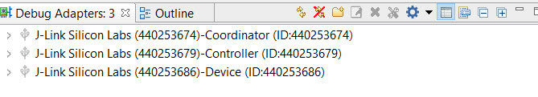

The batch file can be executed as follows:
```
program_install_code.bat <Install Code> <USB Serial ID>
```
For example:
```
program_install_code.bat 83FED3407A939723A5C639B26916D505 440253686
```
The output of the script should look like the following:
When you have successfully run the script, note the 2-byte CRC value listed after the install code, as this will be needed to generate the link key

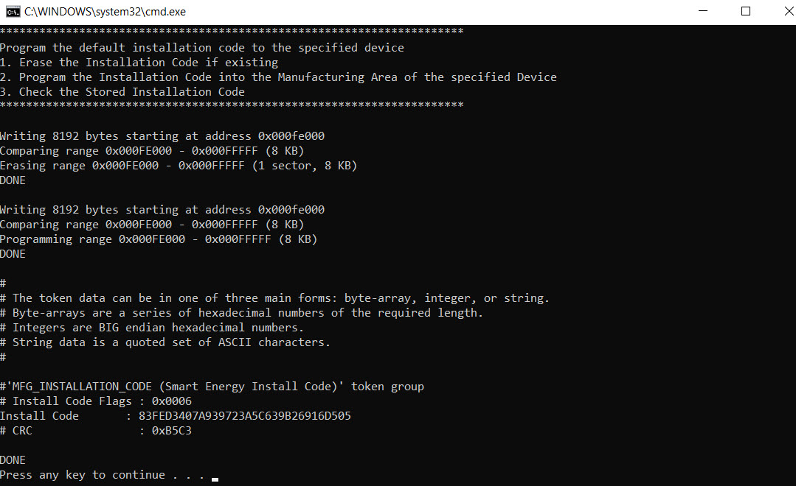

You will need to run the script twice in total, once to program the install code on the Door Lock and note the CRC, and again for the Door Lock Controller

### Deriving the Network Link Keys

Once you have successfully programmed the two install codes, we can now derive the link keys.
First, we will need to provide the install codes to the coordinator. To connect to the CLI, right click on your device in the "Debug Adapters" tab, and click "Launch Console", select the "Serial 1" tab. We will execute the following command on the coordinator: 
Note that the 2-byte CRC is in big endian, i.e. the byte order will need to be reversed from the console output, so 0xB5C3 will become C3 B5.

```
option install-code <link key table index> {<Joining Node's EUI64>} {<16-byte install code + 2-byte CRC>}
```
The EUI64 value can be found by executing the "info" command on the given node.

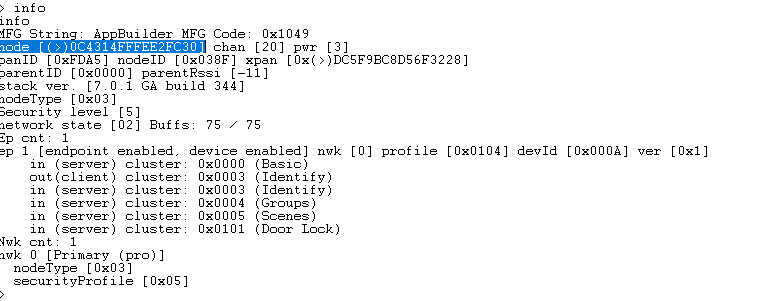

In the case of the nodes used for this example, first we provide the Door Lock install code (example, you will need to replace the EUI64 with that of your device for all commands requiring EUI64 as an argument):

```
option install-code 0 { 0C 43 14 FF FE E2 FC 30 } { 83 FE D3 40 7A 93 97 23 A5 C6 39 B2 69 16 D5 05 C3 B5 }
```
Followed by the Door Lock Controller, note we need to use table index 1 for this node to avoid overwriting the Door Lock in the table.
```
option install-code 1 { CC 86 EC FF FE 7D BE 31 } { 88 77 66 55 44 33 22 11 11 22 33 44 55 66 77 88 D4 90 }

```
You should get the following output for each execution of the command:
```
Success: Set joining link key
```
Once you have done both, you can execute the command:
```
keys print
```
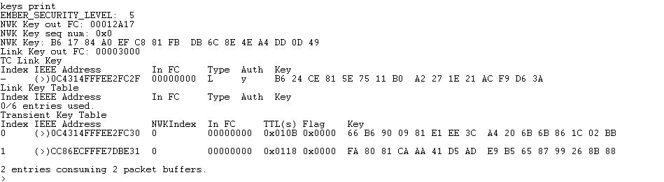
### Creating the Network
In the serial console, execute the following command on the coordinator.
```
plugin network-creator start 1
```
You can find the PAN ID using the following command.
```
network id
```
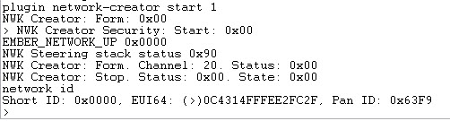

### Joining the Network

Before proceeding, note that it's a good idea to turn on Network Analyzer here, as it will be easier to obtain the network key and analyze the network in real-time. If you don't, you'll have to get the network key from the keys print command and put it in manually to Network Analyzer.

Once the Coordinator has created the network, we can join the Door Lock and Door Lock Controller. To be sure that we start from fresh network settings, or that the devices are not already on a network, run the following command on both devices (launch the CLI console similar to how you did on the Coordinator):
```
network leave
```
Now we can open the network to specific link keys using the following command:
```
plugin network-creator-security open-with-key {eui64 of your device} {linkkey}
```
You'll have to do this sequence:

    •	Open the network for the Door Lock
    •	Join the Door Lock
    •	Open the network for the Door Lock Controller
    •	Join the Door Lock Controller

On the Coordinator (example, you will need to replace the EUI64 with that of your device for all commands requiring EUI64 as an argument):

```
plugin network-creator-security open-with-key {0C 43 14 FF FE E2 FC 30}  {66 B6 90 09 81 E1 EE 3C  A4 20 6B 6B 86 1C 02 BB}
```
On the Door Lock:
```
plugin network-steering start 0
```
This starts the network steering process. The 0 option tells the switch to join with no additional options. The primary thing that this does is tell the joining device to change its install code after joining.

We can tell that joining is successful by seeing the "Network Steering completed : Join Success (0x00)" prints as below.

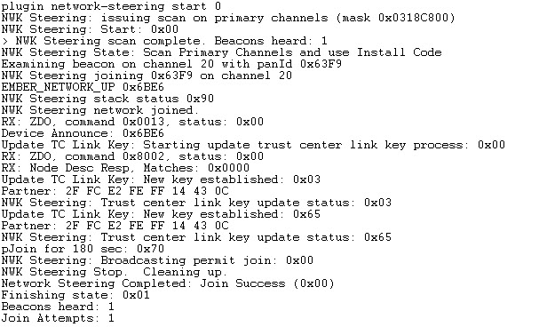

Again, on the Coordinator:
```
plugin network-creator-security open-with-key { CC 86 EC FF FE 7D BE 31}  {FA 80 81 CA AA 41 D5 AD  E9 B5 65 87 99 26 8B 88}
```
Finally, on the Door Lock Controller:
```
plugin network-steering start 0
```
Once both devices have successfully joined the network, we can move on.

### Find and Bind
We need some sort of functionality to get our Door Lock Controller to look for and find our Door Lock and then join with the Door Lock so that it can easily send messages instead of needing to know the address. Additionally, the switch and light need some means of discovering if they share common clusters, like the on-off cluster. To assist with this, Zigbee provides finding & binding as a standard means of performing just this action.

We will use the Find and Bind plugin on the Door Lock Controller and Door Lock to achieve this. The plugin provides a shorthand way of allowing the devices to find and remember the addresses of other devices on the network that share common clusters.

The Door Lock will be the "target" as it will be the one eventually receiving commands from the controller. We can set the Door Lock to wait for find-and-bind messages by using the following command:

```
plugin find_and_bind target 1
```
The Door Lock Controller will be the "initiator" as it will be the one eventually sending commands to the lock. Using the following command, the Door Lock Controller will send out a message asking for nodes with common clusters that we can "bind" to to identify themselves.
```
plugin find_and_bind initiator 1
```
There will be some traffic in the console. Successful operation will show the following line:
```
Find and Bind Initiator: Complete: 0x00
```
Once the find and bind is complete, you can execute the following command to see the binding table.
```
option binding-table print
```

The output will look something like this:

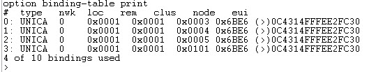

It displays which clusters for which nodes it has a binding. You should be able to identify the Door Lock Cluster (0x0101) in the "clus" column, as well as the node ID of the Door Lock in the "node" column. In our case, entry number 3 indicates that our Door Lock of Node ID 0x6BE6 has a binding on the Door Lock cluster.

**Note on ZCL Strings**

The String data type is a special case in the ZCL. All strings are MSB with the first byte being the length byte for the string. There is no null terminator or similar concept in the ZCL. Therefore a 5-byte string is actually 6 bytes long, with the first byte indicating the length of the proceeding string. For example, “05 68 65 6C 6C 6F” is a ZCL string that says “hello.”

This means that the first character of the Door Lock PIN code will have to specify the length of the PIN.

## Running and Testing the Application

Now, from the Door Lock Controller, you can control the lock using CLI commands.

To execute a command, you must first construct the command, and then execute a second command to actually send the command.
As no pin is yet defined, for now the door will freely lock and unlock. You can send a lock command by entering the following to construct the command buffer:

```
zcl door-lock lock "101"
```
Finally, to send the message, we use
```
bsend 1
```
This will cause endpoint 1 to send the message to any bindings it has on the given cluster.

Following the execution of these commands, you should be able to observe the LED turning on. From the network analyzer, you can see command received correctly:

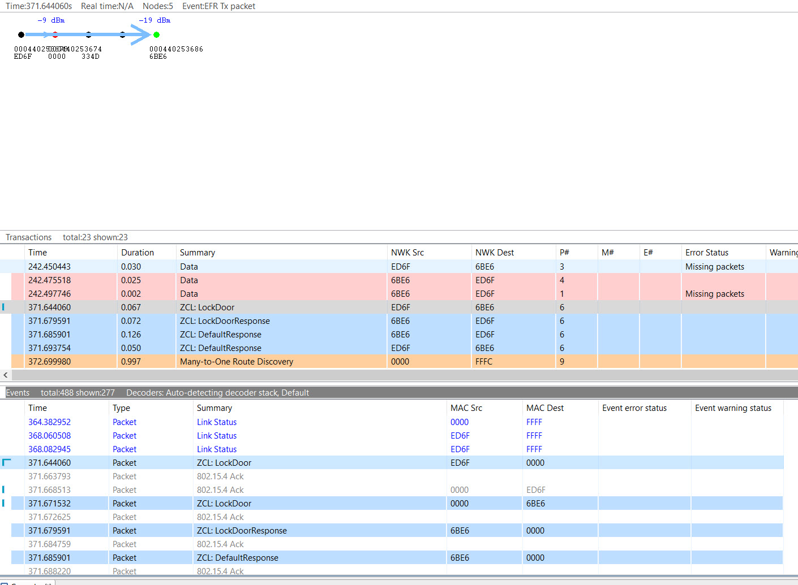

We can then subsequently send a Door Unlock Command to unlock the door.

```
zcl door-lock unlock "101"
```
The LED will turn off.
We can now set a pin code to secure the lock. 
```
zcl door-lock set-pin 0 0 0 "101"
```

Once the message is sent, we can try to lock the door again, but try using an incorrect pin. For example:
```
zcl door-lock lock "10111100"
```
The LED will not be turning on.
Using the command:
```
zcl door-lock lock "101"
```
The LED will turn back on. In the Network Analyzer we see that when using the correct pin, the Lock Door Response returns a status of 0x00 (SUCCESS). 

You can also try the Get Pin command to query the value of the pin.
```
zcl door-lock get-pin 0
```
To disable the pin, use the following command:
```
zcl door-lock clear-pin 0
```
At this point, the Lock and Unlock commands will again succeed on each execution.
