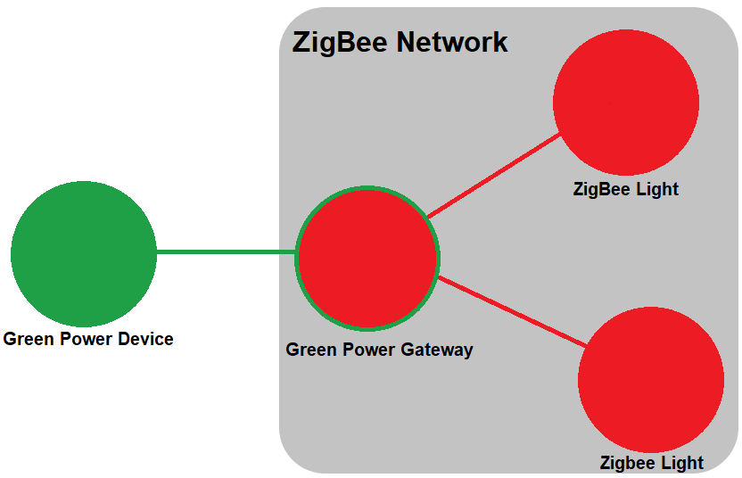

# Green Power gateway example


## 1. Summary
The following article will demonstrate how to create a Green Power gateway using the Z3GatewayHost and NCP sample applications. The gateway's interface gives the user the option to choose the target of the Green Power message (that is coming from an e.g. Green Power On/Off switch). Targets can be devices that are connected to the gateway's ZigBee network as shown in the picture below. This sample works with ZigBee devices that have On/Off cluster and Find-and-Bind target plugin (e.g. a Z3Light), however, it can be expanded easily. This KBA will desmonstrate how to configure the sample applications step-by-step.



## 2. Gecko SDK version
Gecko SDK Suite 2.7.8 or later
## 3. Hardware Required
* 3x Wireless Starter Kit Main Board 
* 3x BRD4162A
## 4. Connections Required
Connect the radio boards to the WSTK mainboards. Connect your desired gateway device via serial connection to either to a Linux computer, or use a Linux-like environment in Windows, such as [Cygwin](https://www.silabs.com/community/wireless/zigbee-and-thread/knowledge-base.entry.html/2017/04/13/setting_up_cygwinfo-CA2n "Cygwin").
## 6. Setting up the NCP
Create a **NCP UART HW** sample application and make the following modifications:

* On the **Plugins** tab enable **Green Power Stack Library** and disable **Green Power Stack Stub Library** plugins.
* In the settings of the **Green Power Stack Library** plugin, change the sink table size to a number greater than 0.

This NCP configuration is demonstrated in the GP_Gateway_NCP.sls file.
## Setting up the Host
Create a **Z3Gateway** sample application and make the following modifications:

* On the **ZCL Clusters** tab:
    
    * On the Green Power endpoint, change the device type to **GP Combo basic**.
    * On your endpoint 1, make sure you have **On/Off Client**, **Groups Server**, and **Groups Client** clusters enabled.
* On the **Plugins** tab, make the following modifications:
    * Add **Groups Server Cluster**, **Green Power Server**, **AES-CMAC**, **AES Software**, and **CCM* Encryption** plugins.
    * Disable **EZ-Mode Commissioning** plugin, and use **Find-and-Bind Initiator** plugin instead. The gateway will send the toggle messages through binding table. We are going to make bindings with this plugin.
* On the Callbacks tab – under **Plugin Specific Callbacks** check **Green Power Cluster GP Notification Forward Callback.
* Generate your project.
* Change the sink table size to the same value you used in your NCP application by modifying the following macro in your projectname.h file.
```C
#define EMBER_GP_SINK_TABLE_SIZE 0
```
* In your *projectname_callback.c* file, you have to implement the *emberAfGreenPowerClusterGpNotificationForwardCallback()* function, which is being called whenever the gateway receives a Green Power message. When this function is being called, you should forward the message by sending a toggle command to the selected node, acting like a normal On/Off Switch. If the target devices are already in the gateway's binding table you only need their nodeID to send the command. (If you are not using binding table, you also need to know (and set) the targets' endpoint number with On/Off cluster.) Before sending the message, the nodeID can be set with an e.g. custom CLI command. The implemented callback function and the custom CLI command that sets the target can be found in the *GP_Gateway_Host_callbacks.c* file included with this README.
* Build your project. (Note: As of this writing, there is a known build issue with the Z3Gateway Green Power configuration, see section 10, Appendix for workaround)

This Gateway configuration is demonstrated in the GP_Gateway_Host.sls file.

## 5. Running the Applications
Build and flash the Gateway application to your board. On your Linux, build the Host project. Open a terminal and run the executable.

Build and flash a Green Power On/Off Switch application to one of your boards.

Build and flash the Z3Light sample application to the rest of your boards.

## Using the Application
* Form a network on your gateway by issuing the plugin network-creator start 1 CLI command.
* Commission your GP switch to the gateway by running the following command on the Gateway 
```
plugin green-power-server commission 9 0 0 1
```

* Then, on the GP switch, press PB0 4 times, waiting one second between each press, this will commission the device.
* Open the gateway's network by issuing the following command 
```
plugin network-creator-security open-network
```
* Prepare to join the lights to the gateway's ZigBee network. Before joining, make the lights leave their network by running the following command
```
network leave
```
* Now joining can be done by running the following command on the Z3Light devices 
```
plugin network-steering start 0
```
* Perform the find-and-bind process: in the lights' CLI run the following command 
```
plugin find-and-bind target 1
``` 
* In the gateway's CLI run the command
```
plugin find-and-bind initiator 1
```
* Now you are able to set the target of the Green Power message by running the following custom command in the gateway's CLI
```
custom set-target <0xnodeid>
```
* To find the node ID to use, you can use the command 
```
network id
```
* Sending toggle commands with your GPD by using PB1 and observe the lights turning on/off.

## Use with Other Clusters
The gateway can be configured to work with other clusters. Ensure there is an endpoint with the desired cluster, modify the *emberAfGreenPowerClusterGpNotificationForwardCallback()* function to send the cluster-specific command. You can even use Green Power messages with payload, since the function gets the payload as an input parameter. You can also use multiple clusters at the same time.

## 7. .sls Projects Used
Project | Comment
-|-|
GP_Gateway_NCP.sls | gateway NCP application
GP_Gateway_Host.sls | gateway Host Application
## 8. How to Port to Another Part
Open GP_Gateway_NCP's .isc file. On General tab, click „Edit Architecture” and select the desired board.
## 9. References
[UG103.15: Silicon Labs Green Power Fundamentals](https://www.silabs.com/documents/public/user-guides/ug103-15-green-power-fundamentals.pdf "UG103.15: Silicon Labs Green Power Fundamentals")

[UG392: Using Silicon Labs Green Power with EmberZNet PRO](https://www.silabs.com/documents/public/user-guides/ug392-using-sl-green-power-with-ezp.pdf "UG392: Using Silicon Labs Green Power with EmberZNet PRO")

## 10. Appendix
You will need to download the following files from the GNU Lib Github. Note that these are third-party files and Silicon Labs does not support them, this is only a workaround.

* rijndael-alg-fst.c: https://github.com/coreutils/gnulib/blob/master/lib/rijndael-alg-fst.c
* rijndael-api-fst.c: https://github.com/coreutils/gnulib/blob/master/lib/rijndael-api-fst.c

Copy them into the following SDK directory:

C:\SiliconLabs\SimplicityStudio\v4\developer\sdks\gecko_sdk_suite\v2.7\platform\base\hal\micro\generic\aes

The build should now be functional.