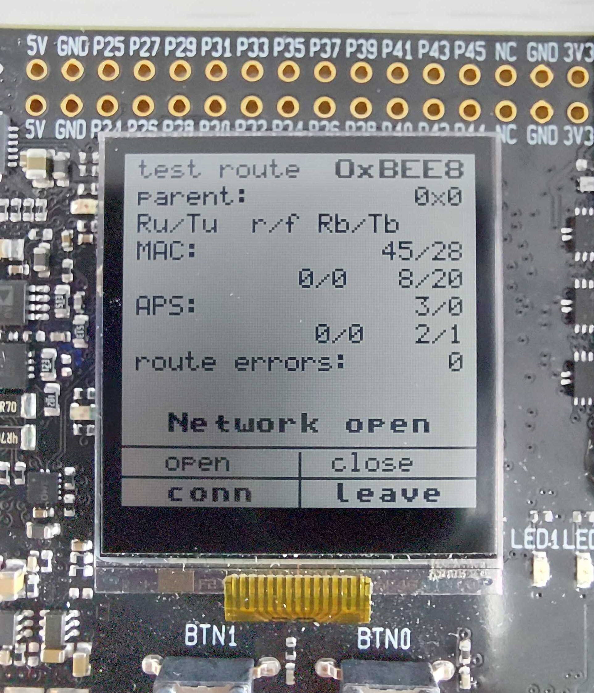

# Large Network Testing guidelines

When developing Zigbee devices, many challenges and problems don't occur with only a few nodes on the network. As you join more and more devices, new problems can arise. This example code aims to provide a large network testing framework to help you test your application in a dense environment.

## Read before starting

The code example helps you test your application, but it doesn't really help to understand if something is wrong. It gives you the tools, but cannot do the debugging for you, so becoming familiar with the following topics and reading the connected documentation is recommended. Also, a general understanding of wireless communications, mesh networks, Zigbee and some experience in EmberZNet PRO is recommended.

### Application Notes and User Guides

- [AN1138: Zigbee Mesh Network Performance](https://www.silabs.com/documents/login/application-notes/an1138-zigbee-mesh-network-performance.pdf): Performance limits of ZigBee networks
- [UG103.2: ZigBee Fundamentals](https://www.silabs.com/documents/public/user-guides/ug103-02-fundamentals-zigbee.pdf): Mesh networking concepts and basics of routing
- [UG103.3: Software Design Fundamentals](https://www.silabs.com/documents/public/user-guides/ug103-03-fundamentals-design-choices.pdf): Understanding Host-NCP and SoC architectures
- [UG391: Zigbee Application Framework Developer’s Guide](https://www.silabs.com/documents/public/user-guides/ug391-zigbee-app-framework-dev-guide.pdf): Understanding ZCL and generated project files

### Knowledge Base Articles

- [How are different tables managed in EmberZNet?](https://community.silabs.com/s/article/how-are-different-tables-managed-in-emberznet-x?language=en_US)
- [What logic does the stack use to determine how to route unicast messages?](https://community.silabs.com/s/article/what-logic-does-the-stack-use-to-determine-how-to-route-unicast-messages-x?language=en_US)
- [Why do many-to-one route requests take more than one hop, even though all of my nodes are in close range?](https://community.silabs.com/s/article/why-do-many-to-one-route-requests-take-more-than-one-hop-even-though-all-of-my?language=en_US)
- [Guidelines for Large/Dense Networks with EmberZNet PRO](https://community.silabs.com/s/article/guidelines-for-large-dense-networks-with-emberznet-pro?language=en_US)
- [How to create custom CLI commands in EmberZNet?](https://community.silabs.com/s/article/how-to-create-custom-cli-commands-in-emberznet-x?language=en_US)

## Setup

The test setup is the following:

- Gateway application in Host-NCP mode for easier remote access and automation
- Router SoC devices populating the network

The router devices have the functionality to send stack diagnostics info over-the-air via a custom cluster:

- Neighbor table entries
- Child table entries
- Routing table entries
- Stack counters

The gateway can query this diagnostics info. It also can initiate a random unicast ZCL message sequence, which will send ZCL On/Off toggle commands to randomly chosen devices. To achieve a relatively good randomness, the host utilizes the `/dev/urandom` file, that achieves a sufficient entropy. For this, you need an Unix-like system, if you don't have one, you can replace the random generation with other methods.

## Creating the gateway - Host application

Start with a blank ZigbeeMinimalHost project, and add the source files of the folder `host_src` by simply dragging it to the project's folder in Simplicity Studio's project explorer. When asked, choose to copy the files instead of linking, to make your project more portable. The source files contain the custom ZCL commands' code in a source file and a header. To build the project, you will need to include these new files to the build, more about that later. Open your callbacks file (by default `ZigbeeMinimalHost_callbacks.c`) and include the header file:

```c
#include "host_src/commands.h"
```

### Adding custom ZCL to the host

To add the custom ZCL functionality to the host, follow these steps:

1. On the ZCL Clusters tab in AppBuilder, choose `Zigbee Custom` and choose HA On/off switch from HA Devices as a template. This will add the on-off toggling ZCL functionality to the gateway. 
2. On the Zigbee Stack tab, on the bottom, add the custom ZCL cluster by clicking `Add` and choosing the attached configuration file: `large-network-diagnostics.xml`.
3. Go back to the ZCL Clusters tab, and you will see the custom cluster (Large network diagnostics) added to the library under the category `Ember`. Enable the client side, and on the Commands tab, enable all commands's `Out` checkbox. This indicates that the device will implement the command sending code of that specific command. All sending code is implemented in the commands' source file. 
4. Also, enable the `In` checkboxes for the responses. This will tell the stack that the device is capable of receiving these commands. The command handler code is implemented in the command's source file.
5. Checking the `In` checkboxes will also enable the client commands' response callbacks, which you can check in the Callbacks tab, under the `Ember` category. These are the callbacks that handle the incoming responses from the routers, they are implemented in the attached source files. 
6. By adding this cluster and enabling its functionalities, the files `call-command-handler.c` and `client-command-macro.h` will be adjusted. The first will make sure that the appropriate callbacks are called by the stack if the device gets a message from this custom cluster, the second one provides the command buffer filling macros for the cluster's ZCL commands.

### Plugins configuration

The gateway's host application doesn't need anything special on the plugins side. You can make sure that the following diagnostics plugins are enabled (they should be by default):

- Stack Diagnostics
- Counters

### Adding custom CLI commands

For a convenient way of querying diagnostics info from the routers, we will add some custom CLI commands. If you are not familiar with how to do that, please revisit [this article](https://community.silabs.com/s/article/how-to-create-custom-cli-commands-in-emberznet-x?language=en_US). Make sure you enable the `Add Custom CLI sub-menu` checkbox on the CLI panel of the Printing and CLI tab in AppBuilder. The custom CLI commands are implemented in the attached `commands.c` file, and are the following:

- `custom get-table <remoteShortId> "neighbor"`: ask for neighbor table entries of remote device (via ZCL command)
- `custom get-table <remoteShortId> "child"`: ask for child table entries of remote device (via ZCL command)
- `custom get-table <remoteShortId> "routing"`: ask for routing table entries of remote device (via ZCL command)
- `custom get-counters <remoteShortId>`: ask for stack counters of remote device (via ZCL command)

### Adding automated test functionality

As a test, we want to send On/off toggle commands to the routers automatically and in a random sequence. If we want to include all devices in the network and send the test messages to all of them, we need to have an inventory of all joined test devices and their short IDs. The easiest way to achieve this is to log every device on join and keep the short IDs in a list. A node's short ID can be obtained when it joins the network, through the callback `emberAfTrustCenterJoinCallback`. Once the nodes are saved, when the host starts up, it will attempt to read an already established inventory. The callback that runs on startup is `emberAfMainInitCallback`.

On the host:

1. Enable `emberAfTrustCenterJoinCallback` under the name of `Trust Center Join` in the callbacks tab
2. Enable `emberAfMainInitCallback` under the name of `Main Init` from the stack callbacks in the callbacks tab

In order to keep the design pluggable, analogous callbacks are implemented in `automated-test.c`, and should be called from the EmberZNet Application Framework's callback functions. Implement these functions in your callbacks file as follows:

```c
void emberAfTrustCenterJoinCallback(EmberNodeId new_node_id,
                                    EmberEUI64 newNodeEui64,
                                    EmberNodeId parentOfNewNode,
                                    EmberDeviceUpdate status,
                                    EmberJoinDecision decision)
{
    sl_large_network_testing_trust_center_join_callback(new_node_id, status);
}

void emberAfMainInitCallback(void)
{
    sl_large_network_testing_main_init_callback();
}
```

This pluggable design allows you to include any other functionality in the callbacks as required. The custom callback implementations can be found in the `automated_test.c` file.

The code will keep a file in your file system called `nodes.txt` that keeps the joined nodes' IDs. You can customize the filename and location by adjusting the `SL_NODES_FILE` define in the header file of the automated test (`automated-test.h`).

### Adding events

The host utilizes an event that you have to add to your project in the Includes tab of AppBuilder, by clicking Add new on the Event Configuration tab. Please add the following command and its callback:

| Event                | Callback                    |
| -------------------- | --------------------------- |
| `sl_custom_traffic_event` | `sl_custom_traffic_event_handler` |

### Build the host

Generate the project in AppBuilder. In order for the custom files you copied previously to be part of the build process, add the following liles to your `Makefile`, to the section of `APPLICATION_FILES`:

```
./host_src/commands.c \
./host_src/automated_test.c \
```

Open up a terminal, navigate to the host project's base folder, and build the host with the command:

```
make
```

## Creating the gateway - NCP application

On the NCP side nothing special is needed. You can go ahead with an empty NCP project, generate, build and flash it to a board. Make sure you build this project with the exact same stack version as the host to avoid any EZSP version conflicts. Also, make sure that you choose the communication line appropriate for your project: hardware or software flow control UART, or SPI, and if you have a suitable bootloader flashed to your chip.

## Creating the test device

Start with the ZigbeeMinimal SoC application. The stack version does not need to match your gateway's version, but it is recommended to use the latest available version. Also, add the attached source files to the project by dragging it to the project folder in Simplicity Studio's Project Explorer (provided in the folder `router_src` - you can drag the whole folder). When asked, choose to copy the files instead of linking, to make your project more portable.

- `custom_graphics.c`, `custom_graphics.h` - middleware for custom graphics functionality
- `gui.c`, `gui.h` - application level code for the GUI
- `queries.c`, `queries.h` - ZCL commands' handler functions

### Stack configuration

In the Zigbee Stack tab, make sure the device type is set to `Router`.

### Adding custom ZCL

The process is almost the same as with the host, add the same custom cluster from the Zigbee Stack tab. Now start with `HA On/Off Light` as the template for your Zigbee Custom config, and enable the server side of the Large network diagnostics cluster. Check all checkboxes in the commands tab, also for incoming and outgoing messages. The difference here will be that the commands are incoming, and the responses are outgoing, which is the other way as in the host. In the Callbacks tab, the appropriate server commands' callbacks should be auto-enabled.

### Plugins

The test device uses the display of the WSTK board, for which you will have to enable the following plugins:

- Graphics Library
- WSTK Display Driver - this plugin enables SPIDISPLAY in hardware configurator, make sure it gets auto-enabled

For the diagnostics and automated test part, you will need the following plugins:

- Stack Diagnostics
- Counters
- On/Off Server Cluster

Depending on your setup, you might want to increase the scanning power of the device. If your gateway is further away, you might need to increase the default radio output power in the Network Steering plugin.

### Callbacks

For the test device to function properly, enable the following callbacks on the Callbacks tab of AppBuilder:

- Main Init (emberAfMainInitCallback)
- Complete (emberAfPluginNetworkSteeringCompleteCallback)
- Hal Button Isr (emberAfHalButtonIsrCallback)
- Stack Status (emberAfStackStatusCallback)

Open the callbacks file of the project, and add the following lines to it (replace the existing implementations of the stack status and the network steering callbacks):

```c
#include "router_src/queries.h"
#include "router_src/gui.h"

bool emberAfStackStatusCallback(EmberStatus status)
{
  sl_large_network_testing_gui_stack_status_callback(status);
  return false;
}

void emberAfMainInitCallback()
{
  sl_large_network_testing_gui_init();
}

void emberAfPluginNetworkSteeringCompleteCallback(EmberStatus status,
                                                  uint8_t totalBeacons,
                                                  uint8_t joinAttempts,
                                                  uint8_t finalState)
{
  emberAfCorePrintln("%p network %p: 0x%X", "Join", "complete", status);
  sl_large_network_testing_gui_network_steering_complete_callback(status);
}

void emberAfHalButtonIsrCallback(int8u button, int8u state)
{
  sl_large_network_testing_gui_button_isr_callback(button, state);
}
```

This is a pluggable design and enables the developer to use the stack callbacks while also using this example's test. Make sure to include the GUI header and the ZCL commands' header (`gui.h` and `queries.h`). The former already contains the lower-level graphics library, `custom_graphics.h`.

### Events configuration

Just like the gateway, the test device also utilizes some events. Please add the following events and their handlers in the Includes tab:

| Event                                 | Callback                                     |
| ------------------------------------- | -------------------------------------------- |
| `sl_next_neighbor_table_send_event`          | `sl_send_next_neighbor_table_entry`                 |
| `sl_next_child_table_send_event`             | `sl_send_next_child_table_entry`                    |
| `sl_next_route_table_send_event`             | `sl_send_next_route_table_entry`                    |
| `sl_large_network_testing_gui_button_check`   | `sl_large_network_testing_gui_button_check_handler`   |
| `sl_large_network_testing_gui_button_pressed` | `sl_large_network_testing_gui_button_pressed_handler` |
| `sl_large_network_testing_gui_counters_print` | `sl_large_network_testing_gui_counters_print_handler` |

### Build the test device

Generate and build the project. The project should build without errors. Flash it to your device, after booting you should see the simple GUI on the device, displaying counter information as well as providing network functions on button presses, like join or leave. Also, make sure that you device has a suitable bootloader flashed.

### Using the GUI

The graphical user interface has four buttons:

- connect
- leave
- open
- close

The ones that are bold, need to be long-pressed to take effect. The ones with normal font need to be short-pressed. For a long press, the button needs to be pressed at least for a time period that is set by `SL_BUTTON_SL_LONG_PRESS_TRESHOLD_MS` in `router_src/gui.h`, which defaults to `400 ms`. A short press is a press shorter than this threshold. 

&nbsp;

<p align="center">
  
</p>
<center>Figure 1. Router GUI</center>

&nbsp;

## Putting it all together

### Hardware

This test device project is intended to be used in a radio board plugged into a WSTK, therefore, to test this application you need multiple radio boards and WSTKs. To achieve a large enough network to see the effects caused by the density, you should use at least 15-20 devices. You can power the WSTKs from USB, or from pins. You don't need serial connecton, unless you want to use the CLI or see a more verbose debug print. The GUI interface is enough to form a testing network.

### Network setup and testing

When laying your network, make sure you approximate the conditions you want to test. If you want to test a scenario where the devices are barely in range, you can place the devices far from each other. On the other hand, if you want to test a more dense scenario, pack the WSTKs as close as you can. First, start the host app, create and open a network (you might need to leave the previous one):

```
plugin network-creator start 1
plugin network-creator-security open-network
```

Now you can join with your devices. Long-press the `conn`  button to connect. The result should be printed to the screen as a status message.

A common problem is that the joining fails with code `0xAB`. This stands for `EMBER_NO_BEACONS` and means that the device didn't see the gateway's network. Make sure the gateway still has its network open (if needed, issue `plugin network-creator-security open-network` again). It's also possible that the joining device is out-of range for the gateway, in this case try to move a bit closer.

If connected successfully, the GUI should show the short ID, parent ID, many of the stack counters, and a status message indicating that the joining was successful. The counters are printed in a sequence, and use the following abbreviations:

| GUI Abbreviation | Stack counter                              |
|------------------|--------------------------------------------|
| Ru/Tu            | received unicast / transmitted unicast     |
| r/f              | retry / fail                               |
| Rb/Tb            | received broadcast / transmitted broadcast |

When a device joins, as it is a router, it will copy the network state from the coordinator, meaning it will also open the network for joining. To close the network on a specific device, press the `close` button. To join a device to a specific router, open the network for joining on the coordinator with `plugin network-creator-security open-network`, then explicitly prohibit joining *on the coordinator* with the command `net pjoin 0`. This will keep the trust center in a state where it doesn't permit joining directly to it, but will allow relayed joining requests. You can also open and close joining on specific routers individually. An opened sate lasts for 120 seconds before closing automatically. Also, note that a device join can be controlled on two levels:

- `plugin network-creator-security open-network`: allow joining on the trust center - this is the application layer part, without which no device can join. This also automatically opens the network on the coordinator and all routers.
- `net pjoin 120` or the `conn` button: allow joining on the specific device - this is the network layer part, which is needed but not sufficient before a complete join

As you keep joining devices, the list of devices should be kept up-to-date. If you issue the command `custom start` in the coordinator, the coordinator should start to send on-off toggle commands to random devices on the network. You can investigate the mesh topology and routing by observing network captures.

## Remote access

If you want to capture for a long time, you might want to set up a headless testing environment that you can leave running for several days without the need for a work PC. The easiest to do this is with a Raspberry Pi or any Unix based lab computer.

### Using ssh and screen to keep app running

If you are running headless on a system, chances are high that you alreay use an ssh connection to access the terminal of the computer. Problems arise when you close the ssh terminal, because the host app running on the headless system will also terminate, as the shell that was used logs out. To overcome this, you can use a terminal multiplexer, like *screen*. On a Debian based system (like Debian, Ubuntu, Raspbian), you can install *screen* with the following commands:

```
sudo apt update
sudo apt install screen
```

After a successful installation, simply run the command `screen`. You will be given a welcome message, press space to continue. Now you have a terminal that will persist even if you close your ssh connection. Start the host in this terminal window, start the test and press `Ctrl+A` then immediately `D` to detach from the terminal. You will notice that you have your "normal" terminal back. To list the running terminals, issue the command `screen -ls`. This will give you something like:

```
There are screens on:
        11694.pts-1.raspberry        (02/12/21 13:44:57)     (Detached)
        12036.pts-1.raspberry        (11/11/21 15:05:40)     (Detached)
2 Sockets in /run/screen/S-pi.
```

Now you can reattach to a terminal with the following command. Use your own socket number:

```
screen -r 11694
```

You can notice that the host app is still running. This would also be the case if you would have closed and reopened the ssh connection. To terminate a session, simply exit the shell as you would normally, for example with `exit` or `Ctrl+D`.

### Headless network capture

To also capture the network traffic, you can use the [`Silicon Labs Java Pakcet Trace Library`](https://github.com/SiliconLabs/java_packet_trace_library). Please follow the instructions in its Github repository on how to build and set up this tool. To connect to the WSTK over IP, you will need to plug in your gateway's WSTK to an IP network that is reachable from your capturing headless computer. After building, navigate to the `build/libs/` folder in your install, and use this command to start a capture (adjusting the version number, the IP address and the capture file according to your needs):

```
java -jar ./silabs-pti-1.2.2.jar -ip=10.150.12.196 -format=log -out=~/capture.isd
```

It's recommended to run this command also from a *screen* terminal, so it keeps running. You can use any SFTP client to transfer your capture to your working PC. If you want to capture also from your working PC, you can do that from Simplicity Studio, by connecting to the WSTK via its IP address.
