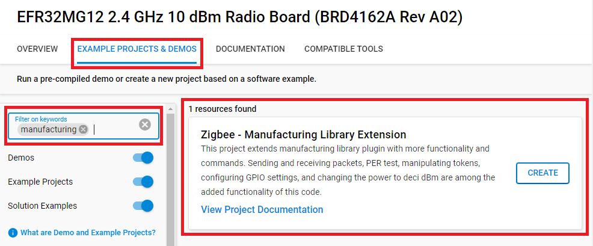
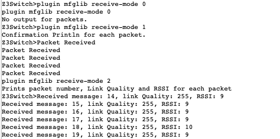
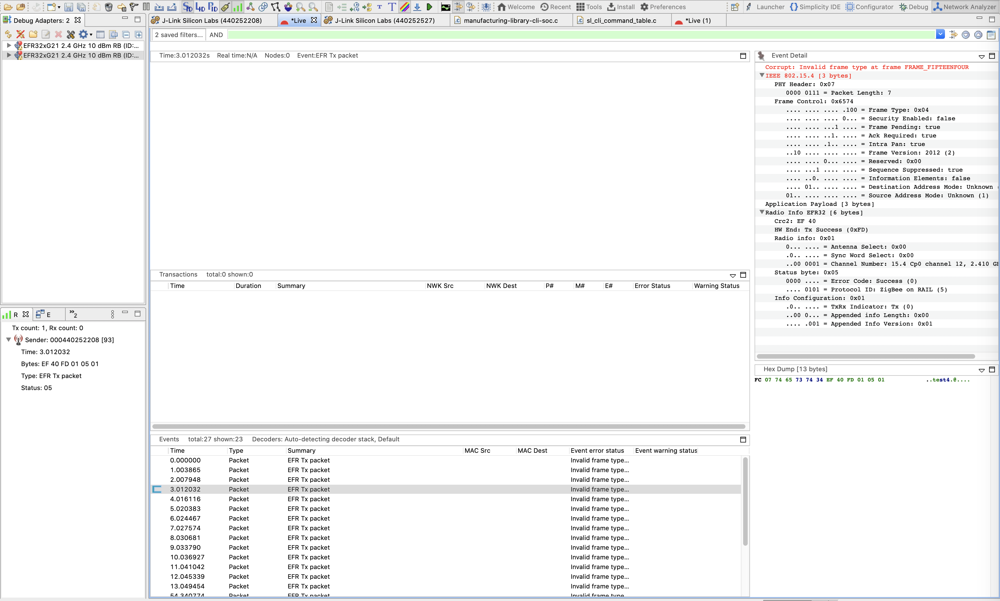
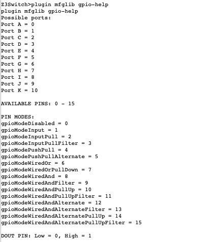

# Manufacturing Library Extension #

## Description ##

While there is a currently function manufacturing library plugin, the following code extends this library with more functionality and commands. Sending and receiving packets, PER test, manipulating tokens, configuring GPIO settings, and changing the power to deci dBm are among the added functionality of this code. This project was built and tested on the Wireless Starter Kit Main Board (BRD4001) and EFR32MG12 2.4 GHz 10 dBm Radio Board (BRD4162A) in Studio v5 with SDK 7.x. This tutorial assumes these are the boards being used. This code can be built on any EFR32 board but may require adjustments.


| Command  	| Command Description 	| API Function  | Argument: 	|  	|  		|  
| ------------- | ------------- 	| ------ 	|  ----- 	| --- 	| --- 		|
|	|	     	|	|**Name** |**Type**	|**Description**|
|clear-rx-packets|Reset the number of received packets to 0.|emAfMfglibClearPackets	|N/A	|N/A|	|
|set-deci-dbm	|Sets the power of radio transmissions(deci-dBm).	|emAfMfglibSetPower	|powerLevel|INT32S|The power in deci-dBm|
|get-deci-dbm	|Gets the power of radio transmissions(deci-dBm).	|emAfMfglibGetPower	|N/A	|N/A	|	 |
|set-cca	|Sets the temporary register value of the CCA threshold.	|emAfMfglibSetCcaThresholdReg	|threshold	|INT8S	|The temporary register value|
|get-cca	|Gets the temporary register value of the CCA threshold.	|emAfMfglibGetCcaThresholdReg	|N/A |N/A	|	|
|get-ctune-reg	|Gets the temporary register of the CTUNE value.	|emAfMfglibGetCtuneValueReg	|N/A	|N/A	| 	|
|set-ctune-reg	|Sets the temporary register of the CTUNE value. |Use the Ctune register to control the crystal's capacitance load which can adjust the frequency.	|emAfMfglibSetCtuneValueReg	|tune	|INT16U	|The temporary register value|
|get-cca-tok	|Gets the token value of the CCA threshold.	|emAfMfglibGetCcaThresholdTok	|N/A	|N/A	| 	|
|set-cca-tok	|Sets the token value of the CCA threshold. The default CCA threshold of 2.4GHz is -75dBm. The CCA (clear channel assessment)  listens for RF transmissions at the physical layer to see if the medium is idle or not.	|emAfMfglibSetCcaThresholdTok	|threshold_new	|INT16U	|CCA Threshold token value|
|get-ctune-tok|Gets the token of the CTUNE value.	|emAfMfglibGetCtuneValueTok	|N/A	|N/A	|	|
|set-ctune-tok	|Sets the token of the CTUNE value. |This token is for tuning the EFR32 system XTAL and consequently also tunes the radio synthesizer frequency.	|emAfMfglibSetCtuneValueTok	|value_new	|INT16U	|CTUNE token value|
|mode-set-gpio |Sets various GPIO(general-purpose input/output) settings.	|emAfMfglibModeSetGpio	|port	|GPIO_Port_TypeDef| Available ports: 0-10 |
|	|								|			|pin	|INT32U			|Available pins: 0-15|
|	|								|			|mode	|GPIO_Mode_TypeDef	|Available modes: 0-15|
|	|								|			|out	|INT32U			|Available outs: 0-1|
|mode-get-gpio	|Gets GPIO mode at a specified GPIO port and pin.	|emAfMfglibModeGetGpio	|port	|GPIO_Mode_TypeDef	|Available ports: 0-10|
|	|								|			|pin	|INT32U			|Available pins: 0-15|
|set-gpio | Sets GPIO output value at a specified GPIO port and pin.	|emAfMfglibSetGpio	|port	|GPIO_Port_TypeDef| Available ports: 0-10 |
|	|								|			|pin	|INT32U			|Available pins: 0-15|
|	|								|			|out	|INT32U			|Available outs: 0-1|
|get-gpio	| Gets GPIO input value at a specified GPIO port and pin.	|emAfMfglibGetGpio	|port	|GPIO_Mode_TypeDef	|Available ports: 0-10|
|	|								|			|pin	|INT32U			|Available pins: 0-15|
|gpio-help	|Gives information of GPIO command inputs.		|emAfMfglibGpioHelp	|N/A	|N/A			| |
|tok-dump	|Dumps all tokens.					|emAfMfglibTokDump	|N/A	|N/A			|  |
|set-sleep	|Enters the specified sleep mode.			|emAfMfglibSleepTest	|mode	|INT8U			|Available modes: 0-5*|
|enter-bl	|Enters the bootloader mode.				vemAfMfglibEnterBootloader	|N/A	|N/A	|	|
|per-test	|Sends specified # of packets at  to all devices on the same network set to receive;PER is displayed on the receiving device	|emAfMfglibPERtest	|packets	|INT16U	|Number of packets to send|
|	|	|	|interval	|INT16U	|Interval in milliseconds between packet transmissions|
|contPack-start	|Starts sending continuous packets at a 1000 millisecond interval	|emAfMfglibContinuousPacket	|N/A	|N/A	|	|
|contPack-stop	|Stops sending continuous packets	|emAfMfglibStopContinuous	|N/A	|N/A	|	|
|receive-mode	|Sets the print mode for incoming packets	|emAfMfglibReceiveMode	|mode	|INT8	|Packet receive mode 0-2*|	|
|receivePER-start	|Sets up receive mode for PER test by clearing packets and setting # of incoming packets	|emAfMfglibReceiveStart	|expected	|INT16U	|Number of expected packets|
|receivePER-stop	|Stops receive mode and prints out PER data	|emAfMfglibReceiveStop |	N/A	|N/A	|	|
|clear-tx-packets	|Clears the packet Counter(number of transmitted packets)|emAfMfglibClearPacketCounter	|N/A	|N/A	|	|
|get-tx-packets	|Prints packet Counter(number of transmitted packets)	|emAfMfglibGetPackets	|N/A	|N/A	|	|

set-sleep modes
- 0: Everything is active and running.In practice this mode is not used, but it is defined for completeness of information.
-  1: Only the CPU is idled. The rest of the chip continues running normally. The chip will wake from any interrupt. 
- 2: The sleep timer clock sources remain running. The RC is always running and the 32kHz XTAL depends on the board header. Wakeup is possible from both GPIO and the sleep timer. System time is maintained.
- 3: THe sleep timer clock sources remain running. The RC is always running and the 32kHz XTAL depends on the board header. Wakeup is possible from the only GPIO. System time is maintained. NOTE:This mode is not available on EM2XX chips.
- 4: The sleep timer clock sources(both RC and XTAL ) are turned off. Wakeup is possible from onl GPIO. System time is lost.
- 5: This maps to EM4 Hibernate on the EFM32/EFR32 devices. TAM is not retained in SLEEPMODE_HIBERNATE so waking up from this sleepmode will behave like a reset. NOTE: This mode is only available on EFM32/EFR32.

receive-mode modes
- 0: no print out
- 1: confirmation printout
- 2: printout with data and messages

## Gecko SDK version ##

- GSDK v4.2.2

## Hardware Required ##

- Wireless Starter Kit Main Board (BRD4001)
- EFR32MG12 2.4 GHz 10 dBm Radio Board (BRD4162A).
- For the PER test, a set of two boards are required in order for one to act as the receiver and one as the transmitter.

**NOTE:**

- Any EFR32 radio board can be used to create project from .slcp file. Tested boards for working with this example:

| Board ID | Description  |
| ---------------------- | ------ |
| BRD4162A | [EFR32MG12 2.4 GHz 10 dBm Radio Board (BRD4162A)](https://www.silabs.com/documents/public/reference-manuals/brd4162a-rm.pdf)    |

## Connections Required ##

For this project, connect a radio board to a mainboard, and connect to computer through USB. 

For example:
Connect the BRD4162A radio board to the BRD4001 WSTK mainboard.

Connect the BRD4001 WSTK mainboard to the PC through the USB.

Refer to QSG 180 for a more detailed description. https://www.silabs.com/documents/public/quick-start-guides/qsg180-zigbee-emberznet-7x-quick-start-guide.pdf 

## Setup ##

To test this application, you can create a project based on an example project.

### Create a project based on an example project ###

1. From the Launcher Home, add the your hardware to My Products, click on it, and click on the **EXAMPLE PROJECTS & DEMOS** tab. Find the example project with filter "Manufacturing".

2. Click **Create** button on the **Zigbee - Manufacturing Library Extension** example. Example project creation dialog pops up -> click Create and Finish and Project should be generated.


3. Build and flash this example to the board.

## How it Works ##

### Extend the mfglib CLI ###

In this example, in order to make it compatible with the mfglib extension example in former SDK version, we create a slcp project to extend the mfglib CLI. In the [zigbee_mfglib_extension.slcp](SimplicityStudio/zigbee_mfglib_extension.slcp) file we add the following definition for various mfgilb extension under template_contribution section. All the additional codes are placed in [manufacturing-library-cli-soc-extend.c](src/manufacturing-library-cli-soc-extend.c) file.

```C
template_contribution:
  - name: cli_command
    value:
      group: mfglib
      name: per-test
      handler: emAfMfglibPERTest
      help: Sends specified # of packets at the specified interval to all devices on the same network set to receive; PER is displayed on the receiving device.
      argument:
      - type: uint16 
        help: The number of packets to send.
      - type: uint16 
        help: The length of the interval between packets in microseconds.

  - name: cli_command
    value:
      group: mfglib
      name: contPack-start
      handler: emAfMfglibContinuousPacket
      help: Starts sending continuous packets at a 1000 millisecond interval.

  - name: cli_command
    value:
      group: mfglib
      name: contPack-stop
      handler: emAfMfglibStopContinuous
      help: Stops sending continuous packets.

  - name: cli_command
    value:
      group: mfglib
      name: receive-mode
      handler: emAfMfglibReceiveMode
      help: Sets the print mode for incoming packets.
      argument:
      - type: int8
        help: The Mode.

  - name: cli_command
    value:
      group: mfglib
      name: receivePER-start
      handler: emAfMfglibReceiveStart
      help: Sets up receive mode for PER test by clearing packets and setting # of incoming packets.
      argument:
      - type: uint16 
        help: The number of expected incoming packets.

  - name: cli_command
    value:
      group: mfglib
      name: receivePER-stop
      handler: emAfMfglibReceiveStop
      help: Stops receive mode and prints out PER data.

  - name: cli_command
    value:
      group: mfglib
      name: clear-tx-packets
      handler: emAfMfglibClearPacketCounter
      help: Clears the packet Counter(number of transmitted packets).

  - name: cli_command
    value:
      group: mfglib
      name: get-tx-packets
      handler: emAfMfglibGetPackets
      help: Prints packet Counter(number of transmitted packets).
```

### How to change packet print outs ###

The "plugin mfglib receive-mode <int8_t>" allows the user to get different print outs for each packet. Some packets have messages attached, often numbers. Some do not or have random data, which will show up as scrambled characters.   

Modes:  
	Mode 0: no printout  
	Mode 1: "Packet Received" printed for each received packet  
	Mode 2: "Received message: <string>:, link Quality: <int>, RSSI: <int>"  
	
Example: 
	

	
### How to navigate packet counters ###

Because the code can set up your board to both receive and send packets, there is a transmitting (tx) packet counter and a receiving (rx) packet counter. 

When your board is set to receive packets, use the following commands:

```C
plugin mfglib status //Will print out information, including the number of received packets
plugin mfglib clear-rx-packets //Will clear the received packet Counter
```  
 
When it is sent to send packets, use the following commands:

```C
plugin mfglib get-tx-packets //Prints out the number of transmitted packets(packet Counter)
Plugin mfglib clear-tx-packets //Clears the transmitted packet Counter
```

### How to use the continuous packet test ###

Flash project to two boards. One will be the transmitter, one will be the receiver. 

On the receiver board, connect and launch console. Go to serial 1 tab. enter the following commands :

```C
network leave
plugin mfglib start 1 //this command is needed to start receiving packets
plugin mfglib set-channel 12
Plugin mfglib set-power 18 1
plugin mfglib receive-mode 0 //see 6.1 for details on this command
```

Flash to second board and enter following commands into serial 1 tab, enter the following commands will start the continous packet test:

```C
network leave //when testing mfglib, it is important that the device is not on a network. 
plugin mfglib start 0 //this command is needed to start sending packets
plugin mfglib set-channel 12 //channels can be set to 11-26. The default channel is 11.
plugin mfglib set-power 18 1  //sets power and mode. NOTE: this is different from set-deci-dbm
plugin mfglib contPack-start //this commands start automatically sending a packet per second. MY_DELAY_IN_MS is defined in the code and can be set to a different interval
```

Once you are done with the continuous packet test, enter this command in the transmitter console to stop it:

```C
plugin mfglib contPack-stop
```

See 6.2 for details on clearing and getting packet counts(both on transmitter and receiver sides)

To see more information, right click on the board and click “start capture” 


### How to use the PER test ###

Flash project to two boards. One will be the transmitter, one will be the receiver. 

On the receiver board, connect and launch console. Go to serial 1 tab. enter the following commands:

```C
network leave //when testing mfglib, it is important that the device is not on a network. 
plugin mfglib start 1 //this command is needed to start receiving packets
plugin mfglib set-channel 12 //channels can be set to 11-26. The default channel is 11.
plugin mfglib set-power 18 1  //sets power and mode. NOTE: this is different from set-deci-dbm
plugin mfglib receive-mode 0 //see 6.1 for details on this command
plugin mfglib receivePER-start 100
```
The parameter to receivePER-start is how many packets you would like to send. In the example, 100 are sent. This set of commands sets up the receiver to accurately count the number of packets.

On the transmitter board, connect and launch console. Go to serial 1 tab. enter the following commands:

```C
network leave
plugin mfglib start 0 //this command is needed to start sending packets
plugin mfglib set-channel 12
plugin mfglib set-power 18 1
plugin mfglib per-test 100 1500
```
There are two arguments to per-test, the first one indicates how many packets should be sent. This must match the value passed into receivePER-start for accurate results. The second parameter is the delay between packets in microseconds. 

See [How to navigate packet counters](#how-to-navigate-packet-counters) section for details on clearing and getting packet counts(both on transmitter and receiver sides)

In the receiver console, you will see printouts for each of the received packets. Once no new packets are being received (this should happen quickly, since the delay is in microseconds), use the following command:

```C
plugin mfglib receivePER-stop //will print out the expected # of packets, received # of packets, and PER.
```

To see more information, right click on the board and click “start capture” 


### How to configure CCA Threshold and CTUNE ###

Both CCA Threshold and CTUNE can be configured temporarily, or by setting their tokens. 

During testing, you may want to frequently change the token. To set temporarily, use the following commands:

```C
plugin mfglib set-cca -75 //will set the temporary CCA Threshold value to -75
plugin mfglib get-cca //will show what the current CCA Threshold is

plugin mfglib set-ctune-reg 135 //will set the temporary Ctune value to 135
plugin mfglib get-ctune-reg //will show what the current Ctune value is

```

To set these values more permanently, you can set the token using the following commands:

```C
plugin mfglib set-cca-tok -75 //will set the CCA Threshold token to -75
plugin mfglib get-cca-tok //will show what the CCA Threshold token value is

plugin mfglib set-ctune-tok 135 //will set the Ctune token to 135
plugin mfglib get-ctune-tok //will show what the Ctune token value is

```

Note that you cannot set tokens thats have already been set. You will get an error if you try to set a token that already has a value. In order to wipe the tokens and get a new value, use the following commands in commander:

```C
commander readmem --range 0x0FE00000:+1024 //this will read out the token data, so you can see the token values you may be deleting

commander device pageerase --range 0x0FE00000:+1024 //this will erase all tokens
```
NOTE: This will wipe ALL the tokens, not just ctune or cca threshold.
More on tokens and commander can be found here: https://www.silabs.com/documents/public/user-guides/ug162-simplicity-commander-reference-guide.pdf

### How to configure GPIO ###  

The manufacturing library extension provides function to configure the GPIO for test. By entering "plugin mfgilb gpio-help", detailed information of how to set GPIO is shown.  
  

The commands below show an example about setting PB01 to high, which is conected to the GREEN LED on xg21.
```C
plugin mfglib gpio-help //get information of GPIO command inputs.

plugin mfglib set-gpio 1 1 4 1 // will set PB01 to gpioModePushPull mode with High value
plugin mfglib get-gpio 1 1 //will get PB01 pin mode
```

## Additional Information ##

### Warnings ###

This code is not validated for certification testing over the air; it is intended for informal pre-certification manufacturing testing only.