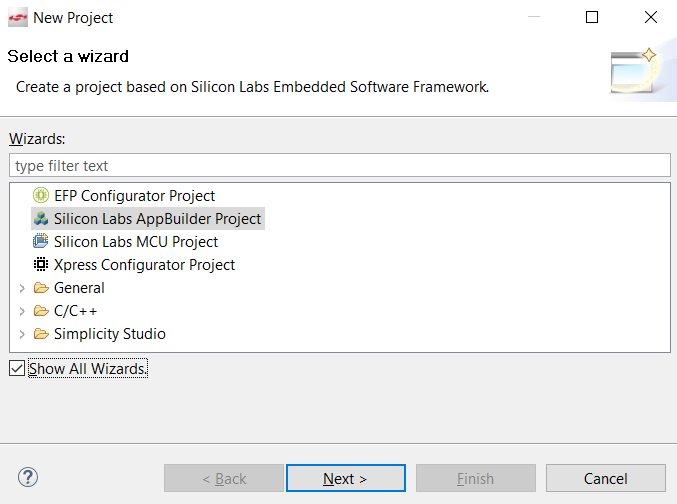
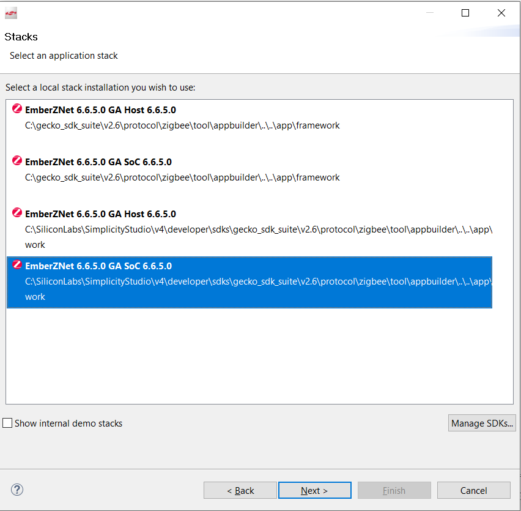
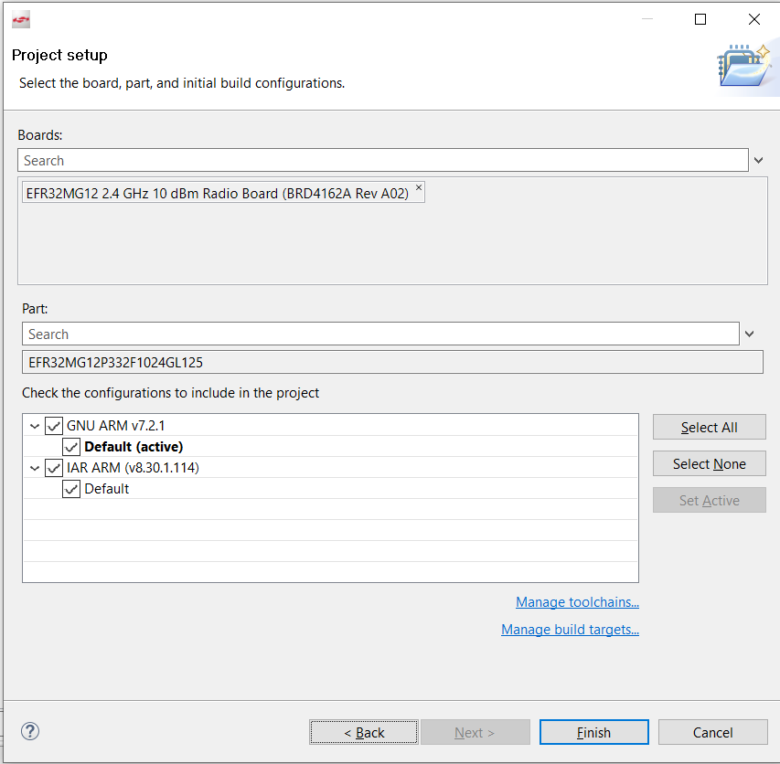
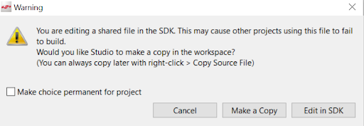
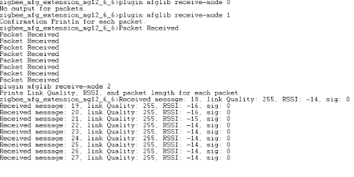
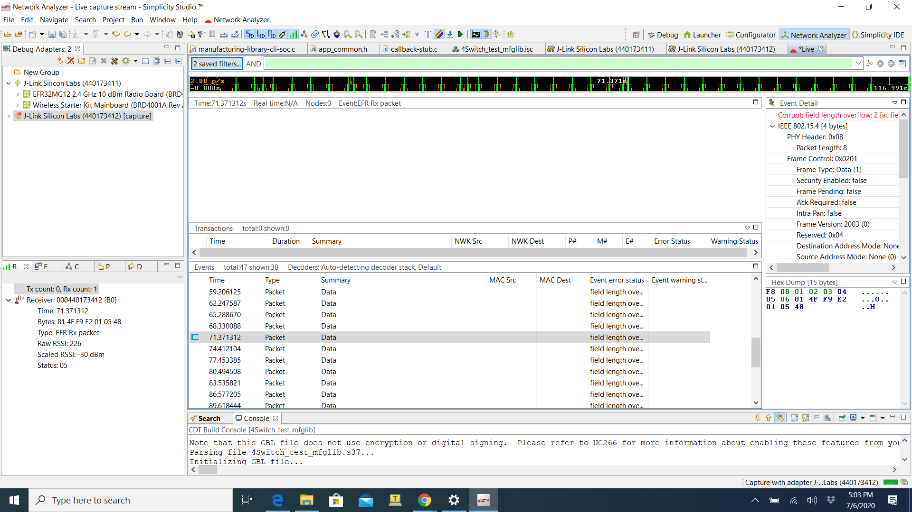

# Manufacturing Library Extension #

## 1. Summary ##

While there is a currently function manufacturing library plugin, the following code extends this library with more functionality and commands. Sending and receiving packets, PER test, manipulating tokens, configuring GPIO settings, and changing the power to deci dBm are among the added functionality of this code. This project was built and tested on the Wireless Starter Kit Main Board (BRD4001) and EFR32MG12 2.4 GHz 10 dBm Radio Board (BRD4162A) in Studio v4. This tutorial assumes these are the boards being used. This code can be built on any EFR32 board but may require adjustments. 

| Command  	| Command Description 	| API Function  | Argument: 	|  	|  		|  
| ------------- | ------------- 	| ------ 	|  ----- 	| --- 	| --- 		|
|	|	     	|	|**Name** |**Type**	|**Description**|
|clear-rx-packets|Reset the number of received packets to 0.|emAfMfglibClearPackets	|N/A	|N/A|	|
|set-deci-dbm	|Sets the power of radio transmissions(deci-dBm).	|emAfMfglibSetPower	|powerLevel|INT32S|The power in deci-dBm|
|get-deci-dbm	|Gets the power of radio transmissions(deci-dBm).	|emAfMfglibGetPower	|N/A	|N/A	|	 |
|set-cca	|Sets the temporary register value of the CCA threshold.	|emAfMfglibSetCcaThresholdReg	|threshold	|INT8S	|The temporary register value|
|get-cca	|Gets the temporary register value of the CCA threshold.	|emAfMfglibGetCcaThresholdReg	|N/A |N/A	|	|
|get-ctune-reg	|Gets the temporary register of the CTUNE value.	|emAfMfglibGetCtuneValueReg	|N/A	|N/A	| 	|
|set-ctune-reg	|Sets the temporary register of the CTUNE value. |Use the Ctune register to control the crystal's capacitance load which can adjust the frequency.	|emAfMfglibSetCtuneValueReg	|tune	|INT16U	|The temporary register value|
|get-cca-tok	|Gets the token value of the CCA threshold.	|emAfMfglibGetCcaThresholdTok	|N/A	|N/A	| 	|
|set-cca-tok	|Sets the token value of the CCA threshold. The default CCA threshold of 2.4GHz is -75dBm. The CCA (clear channel assessment)  listens for RF transmissions at the physical layer to see if the medium is idle or not.	|emAfMfglibSetCcaThresholdTok	|threshold_new	|INT16U	|CCA Threshold token value|
|get-ctune-tok|Gets the token of the CTUNE value.	|emAfMfglibGetCtuneValueTok	|N/A	|N/A	|	|
|set-ctune-tok	|Sets the token of the CTUNE value. |This token is for tuning the EFR32 system XTAL and consequently also tunes the radio synthesizer frequency.	|emAfMfglibSetCtuneValueTok	|value_new	|INT16U	|CTUNE token value|
|set-gpio |Sets various GPIO(general-purpose input/output) settings.	|emAfMfglibSetGpio	|port	|GPIO_Port_TypeDef| Available ports: 0-10 |
|	|								|			|pin	|INT32U			|Available pins: 0-15|
|	|								|			|mode	|GPIO_Mode_TypeDef	|Available modes: 0-15|
|	|								|			|out	|INT32U			|Available outs: 0-1|
|get-gpio	|Gets GPIO mode at a specified GPIO port and pin.	|emAfMfglibGetGpio	|port	|GPIO_Mode_TypeDef	|Available ports: 0-10|
|	|								|			|pin	|INT32U			|Available pins: 0-15|
|gpio-help	|Gives information of GPIO command inputs.		|emAfMfglibGpioHelp	|N/A	|N/A			| |
|tok-dump	|Dumps all tokens.					|emAfMfglibTokDump	|N/A	|N/A			|  |
|set-sleep	|Enters the specified sleep mode.			|emAfMfglibSleepTest	|mode	|INT8U			|Available modes: 0-5*|
|enter-bl	|Enters the bootloader mode.				vemAfMfglibEnterBootloader	|N/A	|N/A	|	|
|per-test	|Sends specified # of packets at  to all devices on the same network set to receive;PER is displayed on the receiving device	|emAfMfglibPERtest	|packets	|INT16U	|Number of packets to send|
|	|	|	|interval	|INT16U	|Interval in milliseconds between packet transmissions|
|contPack-start	|Starts sending continuous packets at a 1000 millisecond interval	|emAfMfglibContinuousPacket	|N/A	|N/A	|	|
|contPack-stop	|Stops sending continuous packets	|emAfMfglibStopContinuous	|N/A	|N/A	|	|
|receive-mode	|Sets the print mode for incoming packets	|emAfMfglibReceiveMode	|mode	|INT8	|Packet receive mode 0-2*|	|
|receivePER-start	|Sets up receive mode for PER test by clearing packets and setting # of incoming packets	|emAfMfglibReceiveStart	|expected	|INT16U	|Number of expected packets|
|receivePER-stop	|Stops receive mode and prints out PER data	|emAfMfglibReceiveStop |	N/A	|N/A	|	|
|clear-tx-packets	|Clears the packet Counter(number of transmitted packets)|emAfMfglibClearPacketCounter	|N/A	|N/A	|	|
|get-tx-packets	|Prints packet Counter(number of transmitted packets)	|emAfMfglibGetPackets	|N/A	|N/A	|	|

set-sleep modes
- 0: Everything is active and running.In practice this mode is not used, but it is defined for completeness of information.
-  1: Only the CPU is idled. The rest of the chip continues running normally. The chip will wake from any interrupt. 
- 2: The sleep timer clock sources remain running. The RC is always running and the 32kHz XTAL depends on the board header. Wakeup is possible from both GPIO and the sleep timer. System time is maintained.
- 3: THe sleep timer clock sources remain running. The RC is always running and the 32kHz XTAL depends on the board header. Wakeup is possible from the only GPIO. System time is maintained. NOTE:This mode is not available on EM2XX chips.
- 4: The sleep timer clock sources(both RC and XTAL ) are turned off. Wakeup is possible from onl GPIO. System time is lost.
- 5: This maps to EM4 Hibernate on the EFM32/EFR32 devices. TAM is not retained in SLEEPMODE_HIBERNATE so waking up from this sleepmode will behave like a reset. NOTE: This mode is only available on EFM32/EFR32.

receive-mode modes
- 0: no print out
- 1: confirmation printout
- 2: printout with data and messages

## 2. Gecko SDK versions ##

 Gecko SDK Suite 2.6 
 Gecko SDK Suite 2.7 

## 3. Hardware Required ##

- Wireless Starter Kit Main Board (BRD4001)
- Any EFR32 radio board. A EFR32MG12 2.4 GHz 10 dBm Radio Board (BRD4162A) is needed to create the project from the .sls file. 
- For the PER test, a set of two boards are required in order for one to act as the receiver and one as the transmitter. 


## 4. Connections Required ##

For this project, connect a radio board to a mainboard, and connect to computer through USB. 

For example:
Connect the BRD4162A radio board to the BRD4001 WSTK mainboard.

Connect the BRD4001 WSTK mainboard to the PC through the USB.

Refer to QSG 106 section 2 for a more detailed description. https://www.silabs.com/documents/public/quick-start-guides/qsg106-efr32-zigbee-pro.pdf

## 5. Software Setup ##

The simplest way to create this project is to import the .sls file. Pull or download the file to your computer. Then in Simplicity Studio, go to File --> import and open the file. Build the file and then flash to your device. Note that this will only work if you have the same hardware. If you want to make changes and need to regenerate the .isc, copy the code in the manufacturing-library-cli.c and znet-cli.c files first or choose not to overwrite them. 
IMPORTANT: Note that the you may have to change the Generation directory under the General tab in the isc file in order to get the correct paths if you choose to regenerate the project. 

This project is built using the Z3 Zigbee Switch application. In Simplicity Studio, go to new→ project→ Silicon labs appbuilder project.


Select Silicon labs zigbee.
Then select EmberZNet (version) SoC. Either 2.6.6 or 2.6.7 will work. 


Choose the Z3Switch
Choose a name
Make sure you have correct boards and compiler (I used GNU ARM v7.2.1, hit finish. If a board does not show up, select it manually. )



Go to the .isc file for next steps

Plugins

- Stack Library → Manufacturing library

- Utility → Manufacturing Library CLI

Includes

-Under Event Configuration, Add New. Use packetSend and packetSendHandler, NOTE: if you rename this, you will have to change where it is called in the manufacturing library file.


Next click generate, but don't build the project yet. 
It may ask to overwrite a .hwconf file. You can choose to overwrite or not. 
There are two ways to add the code. If you have built the project as described above, simply copying over the files and compiling will work. If you have added additional plugins or used a different sample app, it may make sense to copy over chunks of code. Note that there are seperate files for stack versions 2.6.6 and 2.6.7. Under the Simplicity studio folder in git, there is an .sls for both stack versions. Under the src folder in git, there is a 6.7 and 6.6 folder with the correct manufacturing-library-cli-soc.c and znet-cli.c files in it. 

To add entire files, copy the entire folder or file over existing ones. For these files, you will have to overwrite or merge with existing files and folders.

To add specific pieces of code, copy the chunks of codes noted for each file. This is separated by comments in the files. "..." Indicates that there is additional code in that space. You will have to open the file and copy the code over to the file in your project. The added code is the same for the 2.6 and 2.7 stacks.  In the manufacturing-library-cli-soc.c file, you will get a warning asking if you would like to edit the file in the sdk or make a copy. Do NOT edit in the sdk. You must make a copy of the file.



NOTE: When copying the files, they should be copied into the entire project folder in studio, so that older files are overwritten. manufacturing-library-cli-soc.c needs to be added to the manufacturing-library-cli folder specifically. 

-manufacturing-library-cli-soc.c 

Add the following code after the includes. This block of code has includes, defines, and variables

```C
//MFG UPDATED CODE START-------------------------------------------------------
#include "rail.h"

uint8_t txData[504] = { 0x0F, 0x0E, 0x11, 0x22, 0x33, 0x44, 0x55, 0x66, 0x77,
		0x88, 0x99, 0xAA, 0xBB, 0xCC, 0xDD, 0xEE, };
uint16_t txDataLen = 16;
// Data Management
RAIL_DataConfig_t railDataConfig = { .txSource = TX_PACKET_DATA, .rxSource =
		RX_PACKET_DATA, .txMethod = PACKET_MODE, .rxMethod = PACKET_MODE, };

uint32_t rxOverflowDelay = 10 * 1000000; // 10 seconds
RAIL_CsmaConfig_t *csmaConfig = NULL;

extern RAIL_Handle_t emPhyRailHandle;


#define MY_DELAY_IN_MS 1000 //1000 ms = 1 second
static int packetCounter = 0; //used for sent packets
static boolean contPacket = FALSE;
static boolean MODE1 = FALSE;
static boolean MODE2 = FALSE;
static boolean PERtest = FALSE;

static int8_t tempThresh = NULL;
static uint16_t expectedPackets = 0;
//MFG UPDATED CODE END-------------------------------------------------------
```
Copy paste this function over the existing mfglibRxHandler function

```C
//MFG UPDATED CODE START------------------------------------------------------------------------------------------------------------
static void mfglibRxHandler(uint8_t *packet, uint8_t linkQuality, int8_t rssi) {

	uint8_t packetNumStr[10];

	// This increments the total packets for the whole mfglib session
	// this starts when mfglibStart is called and stops when mfglibEnd
	// is called.
	//additional code for emAfMfglibreceivePER
	uint8_t *sig = "test";
	uint8_t *str = packet + 4;


	mfgTotalPacketCounter++;
	mfgCurrentPacketCounter++;
	if (MODE1) {
		emberAfCorePrintln("Packet Received");
	}
	if (MODE2) {
		emberAfCorePrintln(
						"Received meCHCK1ssage: %s, link Quality: %u, RSSI: %d, sig: %d",
						packet + 4, linkQuality, rssi, strncmp(sig, packet, 4));

	}

	// If this is the first packet of a transmit group then save the information
	// of the current packet. Don't do this for every packet, just the first one.
		if (!inReceivedStream) {
			inReceivedStream = TRUE;
			mfgCurrentPacketCounter = 1;
			savedRssi = rssi;
			savedLinkQuality = linkQuality;
			savedPktLength = *packet;
			MEMMOVE(savedPkt, (packet + 1), savedPktLength);
	}
}
//MFG UPDATED CODE END-------------------------------------------------------
```
Add all the additional functions to the bottom of the file. Since there are several hundred lines of code, it is not all included here("..." indicates the missing code). The rest of the code can be found at the bottom of the manufacturing-library-cli-soc.c file. 

```C
/MFG UPDATED CODE START------------------------------------------------------------------------------------

//Send set number of packets(set from argument) with message indicating the number sent
//sent in microseconds
void emAfMfglibPERTest(void) {
	uint16_t numPackets = (uint16_t) emberUnsignedCommandArgument(0);
	uint16_t interval = (uint16_t) emberUnsignedCommandArgument(0);
	uint8_t str[5];
....
void emAfMfglibEnterBootloader() {

	halInternalSysReset(RESET_BOOTLOADER_BOOTLOAD);
}

```

-znet-cli.c

Command Tables and function declarations
NOTE: This chunk inclues the emberCommandPluginMfglibTable, which has already been defined in the generated file and must be deleted to avoid duplication defintition errors. To get all the code, you will have to copy it from the znet-cli.c file. The "..." indicates that there is additional code between the snippets.
```C
////MFG UPDATED CODE START -----------------------------------------------------------------------------------------------------------------
void emAfMfglibClearPackets(void);
void emAfMfglibSetPower(void); ////
#if defined(EMBER_COMMAND_INTEPRETER_HAS_DESCRIPTION_FIELD)
static const char * const pluginMfglibSetPowerArguments[] = {
  "The power level",
  NULL
};
#endif
...
  emberCommandEntryActionWithDetails("receivePER-stop",emAfMfglibReceiveStop, "", "Stops receive mode and prints out PER data", NULL),
  emberCommandEntryActionWithDetails("clear-tx-packets",emAfMfglibClearPacketCounter, "", "Clears the packet Counter(number of transmitted packets)", NULL),
  emberCommandEntryActionWithDetails("get-tx-packets",emAfMfglibGetPackets, "", "Prints packet Counter(number of transmitted packets)", NULL),
  emberCommandEntryTerminator(),
};
//MFG UPDATED CODE END----------------------------------------------------
```

Finally, build the project. All functions should be ready to use.
Flash project to preferred board and go to network analyzer to use functions.
To flash, in the Simplicity IDE perspective go to project_name and open binaries. Left click project_name.s37 and select "Flash to Device". Pick a board and then choose "Program".

## 6. Examples ##

### 6.1 How to change packet print outs ###

The "plugin mfglib receive-mode <int8_t>" allows the user to get different print outs for each packet. Some packets have messages attached, often numbers. Some do not or have random data, which will show up as scrambled characters. 
Modes:
	Mode 0: no printout
	Mode 1: "Packet Received" printed for each received packet
	Mode 2: "Received message: <string>:, link Quality: <int>, RSSI: <int>, sig: <int>"
	
Example: 
	

	
### 6.2 How to navigate packet counters ###

Because the code can set up your board to both receive and send packets, there is a transmitting (tx) packet counter and a receiving (rx) packet counter. When your board is set to receive packets, use the following commands:

```C
plugin mfglib status //Will print out information, including the number of received packets
plugin mfglib clear-rx-packets //Will clear the received packet Counter
```
When it is sent to send packets, use the following commands:

```C
plugin mfglib get-tx-packets //Prints out the number of transmitted packets(packet Counter)
Plugin mfglib clear-tx-packets //Clears the transmitted packet Counter
```

### 6.3 How to use the continuous packet test ###

Flash project to two boards. One will be the transmitter, one will be the receiver. 

On the transmitter board, connect and launch console. Go to serial 1 tab. enter the following commands :

```C
network leave //when testing mfglib, it is important that the device is not on a network. 
plugin mfglib start 0 //this command is needed to start sending packets
plugin mfglib set-channel 12 //channels can be set to 11-26. The default channel is 11.
plugin mfglib set-power 18 1  //sets power and mode. NOTE: this is different from set-deci-dbm
plugin mfglib contPack-start //this commands start automatically sending a packet per second. MY_DELAY_IN_MS is defined in the code and can be set to a different interval
```
This will start the continous packet test. 

Flash to second board and enter following commands into serial 1 tab:

```C
network leave
plugin mfglib start 1 //this command is needed to start receiving packets
plugin mfglib set-channel 12
Plugin mfglib set-power 18 1
plugin mfglib receive-mode 0 //see 6.1 for details on this command
```
Once you are done with the PER test, enter this command in the transmitter console to stop it:

```C
plugin mfglib contPack-stop
```


See 6.2 for details on clearing and getting packet counts(both on transmitter and receiver sides)

To see more information, right click on the board and click “start capture” 


### 6.4 How to use the PER test ###

Flash project to two boards. One will be the transmitter, one will be the receiver. 

On the receiver board, connect and launch console. Go to serial 1 tab. enter the following commands:

```C
network leave //when testing mfglib, it is important that the device is not on a network. 
plugin mfglib start 1 //this command is needed to start receiving packets
plugin mfglib set-channel 12 //channels can be set to 11-26. The default channel is 11.
plugin mfglib set-power 18 1  //sets power and mode. NOTE: this is different from set-deci-dbm
plugin mfglib receive-mode 0 //see 6.1 for details on this command
plugin mfglib receivePER-start 100
```
The parameter to receivePER-start is how many packets you would like to send. In the example, 100 are sent. This set of commands sets up the receiver to accurately count the number of packets.

On the transmitter board, connect and launch console. Go to serial 1 tab. enter the following commands:

```C
network leave
plugin mfglib start 0 //this command is needed to start sending packets
plugin mfglib set-channel 12
plugin mfglib set-power 18 1
plugin mfglib per-test 100 1500
```
There are two arguments to per-test, the first one indicates how many packets should be sent. This must match the value passed into receivePER-start for accurate results. The second parameter is the delay between packets in microseconds. 

See 6.2 for details on clearing and getting packet counts(both on transmitter and receiver sides)

In the receiver console, you will see printouts for each of the received packets. Once no new packets are being received (this should happen quickly, since the delay is in microseconds), use the following command:

```C
plugin mfglib receivePER-stop //will print out the expected # of packets, received # of packets, and PER.
```


To see more information, right click on the board and click “start capture” 


### 6.5 How to configure CCA Threshold and CTUNE ###

Both CCA Threshold and CTUNE can be configured temporarily, or by setting their tokens. 

During testing, you may want to frequently change the token. To set temporarily, use the following commands:

```C
plugin mfglib set-cca -75 //will set the temporary CCA Threshold value to -75
plugin mfglib get-cca //will show what the current CCA Threshold is

plugin mfglib set-ctune-reg 390 //will set the temporary Ctune value to 390
plugin mfglib get-ctune-reg //will show what the current Ctune value is

```

To set these values more permanently, you can set the token using the following commands:

```C
plugin mfglib set-cca-tok -75 //will set the CCA Threshold token to -75
plugin mfglib get-cca-tok //will show what the CCA Threshold token value is

plugin mfglib set-ctune-tok 390 //will set the Ctune token to 390
plugin mfglib get-ctune-tok //will show what the Ctune token value is

```
Note that you cannot set tokens thats have already been set. You will get an error if you try to set a token that already has a value. In order to wipe the tokens and get a new value, use the following commands in commander:

```C
commander readmem --range 0x0FE00000:+1024 //this will read out the token data, so you can see the token values you may be deleting

commander device pageerase --range 0x0FE00000:+1024 //this will erase all tokens
```
NOTE: This will wipe ALL the tokens, not just ctune or cca threshold.
More on tokens and commander can be found here: https://www.silabs.com/documents/public/user-guides/ug162-simplicity-commander-reference-guide.pdf

## 7. Additional Information ##

### 7.1 Warnings ###

This code is not validated for certification testing over the air; it is intended for informal pre-certification manufacturing testing only.
