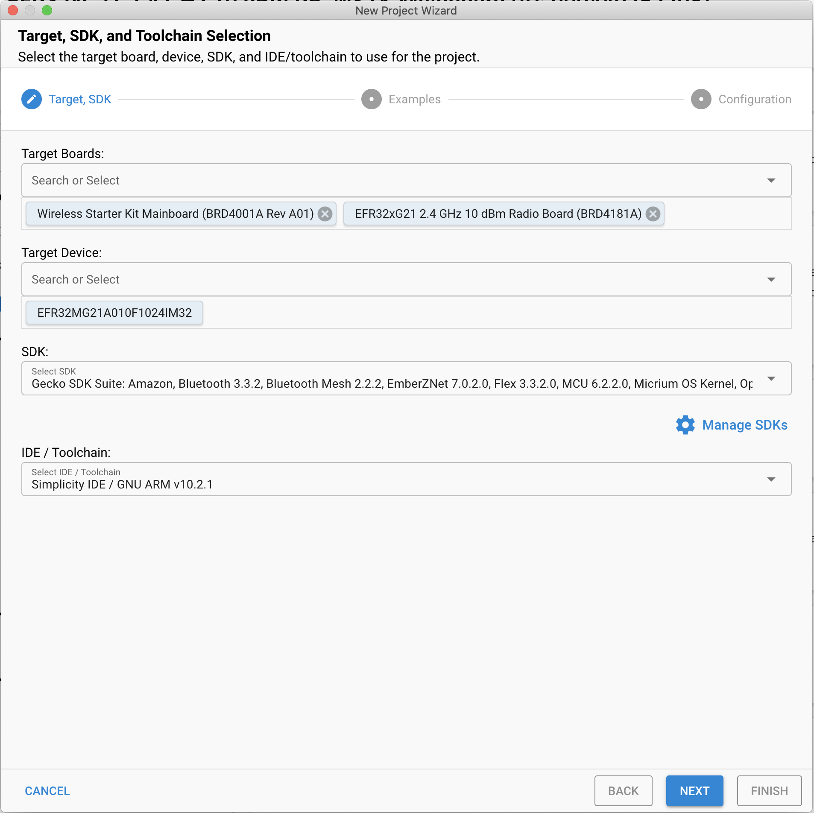
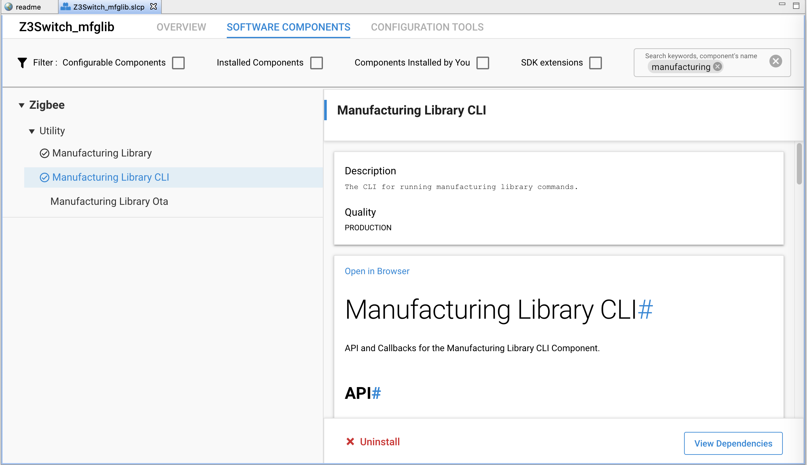
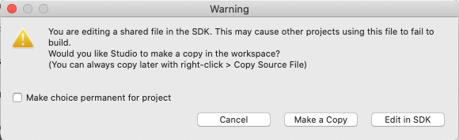
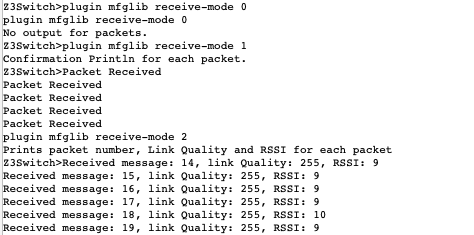
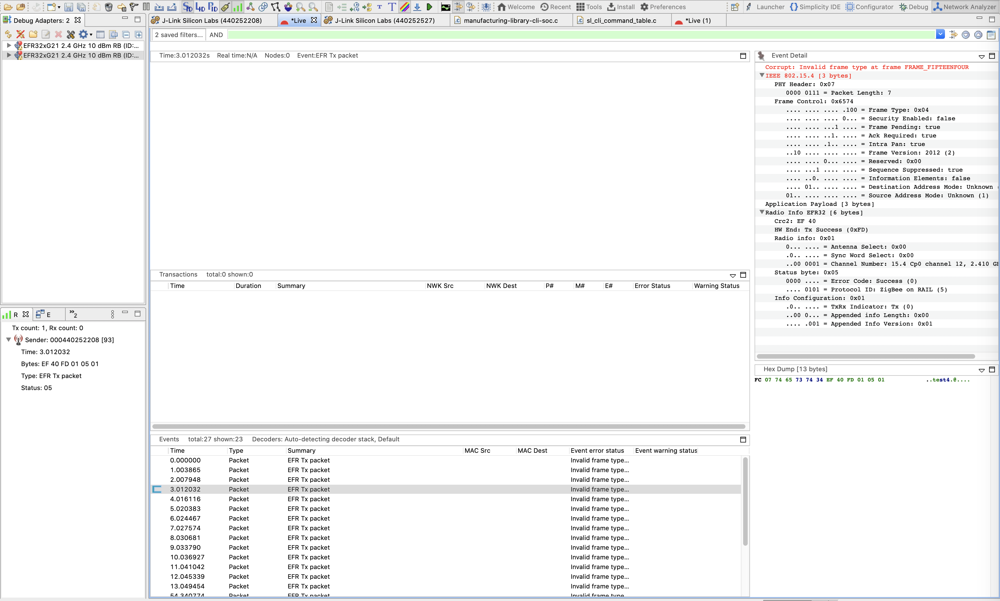
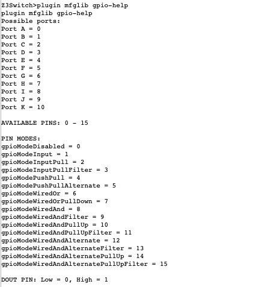

# Manufacturing Library Extension #

## 1. Summary ##

While there is a currently function manufacturing library plugin, the following code extends this library with more functionality and commands. Sending and receiving packets, PER test, manipulating tokens, configuring GPIO settings, and changing the power to deci dBm are among the added functionality of this code. This project was built and tested on the Wireless Starter Kit Main Board (BRD4001) and EFR32MG21 2.4 GHz 10 dBm Radio Board (BRD4181A) in Studio v5 with SDK 7.x. This tutorial assumes these are the boards being used. This code can be built on any EFR32 board but may require adjustments. 


| Command  	| Command Description 	| API Function  | Argument: 	|  	|  		|  
| ------------- | ------------- 	| ------ 	|  ----- 	| --- 	| --- 		|
|	|	     	|	|**Name** |**Type**	|**Description**|
|clear-rx-packets|Reset the number of received packets to 0.|emAfMfglibClearPackets	|N/A	|N/A|	|
|set-deci-dbm	|Sets the power of radio transmissions(deci-dBm).	|emAfMfglibSetPower	|powerLevel|INT32S|The power in deci-dBm|
|get-deci-dbm	|Gets the power of radio transmissions(deci-dBm).	|emAfMfglibGetPower	|N/A	|N/A	|	 |
|set-cca	|Sets the temporary register value of the CCA threshold.	|emAfMfglibSetCcaThresholdReg	|threshold	|INT8S	|The temporary register value|
|get-cca	|Gets the temporary register value of the CCA threshold.	|emAfMfglibGetCcaThresholdReg	|N/A |N/A	|	|
|get-ctune-reg	|Gets the temporary register of the CTUNE value.	|emAfMfglibGetCtuneValueReg	|N/A	|N/A	| 	|
|set-ctune-reg	|Sets the temporary register of the CTUNE value. |Use the Ctune register to control the crystal's capacitance load which can adjust the frequency.	|emAfMfglibSetCtuneValueReg	|tune	|INT16U	|The temporary register value|
|get-cca-tok	|Gets the token value of the CCA threshold.	|emAfMfglibGetCcaThresholdTok	|N/A	|N/A	| 	|
|set-cca-tok	|Sets the token value of the CCA threshold. The default CCA threshold of 2.4GHz is -75dBm. The CCA (clear channel assessment)  listens for RF transmissions at the physical layer to see if the medium is idle or not.	|emAfMfglibSetCcaThresholdTok	|threshold_new	|INT16U	|CCA Threshold token value|
|get-ctune-tok|Gets the token of the CTUNE value.	|emAfMfglibGetCtuneValueTok	|N/A	|N/A	|	|
|set-ctune-tok	|Sets the token of the CTUNE value. |This token is for tuning the EFR32 system XTAL and consequently also tunes the radio synthesizer frequency.	|emAfMfglibSetCtuneValueTok	|value_new	|INT16U	|CTUNE token value|
|set-gpio |Sets various GPIO(general-purpose input/output) settings.	|emAfMfglibSetGpio	|port	|GPIO_Port_TypeDef| Available ports: 0-10 |
|	|								|			|pin	|INT32U			|Available pins: 0-15|
|	|								|			|mode	|GPIO_Mode_TypeDef	|Available modes: 0-15|
|	|								|			|out	|INT32U			|Available outs: 0-1|
|get-gpio	|Gets GPIO mode at a specified GPIO port and pin.	|emAfMfglibGetGpio	|port	|GPIO_Mode_TypeDef	|Available ports: 0-10|
|	|								|			|pin	|INT32U			|Available pins: 0-15|
|gpio-help	|Gives information of GPIO command inputs.		|emAfMfglibGpioHelp	|N/A	|N/A			| |
|tok-dump	|Dumps all tokens.					|emAfMfglibTokDump	|N/A	|N/A			|  |
|set-sleep	|Enters the specified sleep mode.			|emAfMfglibSleepTest	|mode	|INT8U			|Available modes: 0-5*|
|enter-bl	|Enters the bootloader mode.				vemAfMfglibEnterBootloader	|N/A	|N/A	|	|
|per-test	|Sends specified # of packets at  to all devices on the same network set to receive;PER is displayed on the receiving device	|emAfMfglibPERtest	|packets	|INT16U	|Number of packets to send|
|	|	|	|interval	|INT16U	|Interval in milliseconds between packet transmissions|
|contPack-start	|Starts sending continuous packets at a 1000 millisecond interval	|emAfMfglibContinuousPacket	|N/A	|N/A	|	|
|contPack-stop	|Stops sending continuous packets	|emAfMfglibStopContinuous	|N/A	|N/A	|	|
|receive-mode	|Sets the print mode for incoming packets	|emAfMfglibReceiveMode	|mode	|INT8	|Packet receive mode 0-2*|	|
|receivePER-start	|Sets up receive mode for PER test by clearing packets and setting # of incoming packets	|emAfMfglibReceiveStart	|expected	|INT16U	|Number of expected packets|
|receivePER-stop	|Stops receive mode and prints out PER data	|emAfMfglibReceiveStop |	N/A	|N/A	|	|
|clear-tx-packets	|Clears the packet Counter(number of transmitted packets)|emAfMfglibClearPacketCounter	|N/A	|N/A	|	|
|get-tx-packets	|Prints packet Counter(number of transmitted packets)	|emAfMfglibGetPackets	|N/A	|N/A	|	|

set-sleep modes
- 0: Everything is active and running.In practice this mode is not used, but it is defined for completeness of information.
-  1: Only the CPU is idled. The rest of the chip continues running normally. The chip will wake from any interrupt. 
- 2: The sleep timer clock sources remain running. The RC is always running and the 32kHz XTAL depends on the board header. Wakeup is possible from both GPIO and the sleep timer. System time is maintained.
- 3: THe sleep timer clock sources remain running. The RC is always running and the 32kHz XTAL depends on the board header. Wakeup is possible from the only GPIO. System time is maintained. NOTE:This mode is not available on EM2XX chips.
- 4: The sleep timer clock sources(both RC and XTAL ) are turned off. Wakeup is possible from onl GPIO. System time is lost.
- 5: This maps to EM4 Hibernate on the EFM32/EFR32 devices. TAM is not retained in SLEEPMODE_HIBERNATE so waking up from this sleepmode will behave like a reset. NOTE: This mode is only available on EFM32/EFR32.

receive-mode modes
- 0: no print out
- 1: confirmation printout
- 2: printout with data and messages

## 2. Gecko SDK versions ##

 Gecko SDK Suite v4.0.2  
 EmberZNet v7.0.2.0

## 3. Hardware Required ##

- Wireless Starter Kit Main Board (BRD4001)
- Any EFR32 radio board. A EFR32MG21 2.4 GHz 10 dBm Radio Board (BRD4181A) is needed to create the project from the .sls file. 
- For the PER test, a set of two boards are required in order for one to act as the receiver and one as the transmitter. 


## 4. Connections Required ##

For this project, connect a radio board to a mainboard, and connect to computer through USB. 

For example:
Connect the BRD4181A radio board to the BRD4001 WSTK mainboard.

Connect the BRD4001 WSTK mainboard to the PC through the USB.

Refer to QSG 180 for a more detailed description. https://www.silabs.com/documents/public/quick-start-guides/qsg180-zigbee-emberznet-7x-quick-start-guide.pdf 

## 5. Software Setup ##

The following steps describe how to extend mfglib capabilities in an sample project provided from the SDK. Similarly, you can extend the mfglib capabilities from any of your existing project with the steps below. 

1. Create a "Z3Switch" example for specific part number. In Simplicity Studio, go to new→ Silicon Labs Project Wizard...



2. Install mfglib related components through SOFTWARE COMPONENTS tab under .slcp file. Typing "manufacturing" on the search bar in the upper right corner can filter out the software components.


	- Zigbee → Utility → Manufacturing library

	- Zigbee → Utility → Manufacturing Library CLI

	Install these two components mentioned above. Save the .slcp file, Simplicity Studio automatically update the required project files when you make changes to the project configuration. Till now, you will be able to check the mfglib related CLI from sl_cli_command_table.c under autogen folder from the project. 
	
	To extend the mfglib capabilities, it is not recommended to add Command Lines in this sl_cli_command_table.c directly, as changes made through Project Configurator will update and overwrite the files under the autogen folder. User can add the customized CLI groups to extend the CLI functions. For more details, please refer to https://docs.silabs.com/gecko-platform/4.0/service/cli/overview.

	In this example, in order to make it compatible with the mfglib extension example in former SDK version, we modify the source code in the SDK to extend the mfglib CLI. 
	
	Open zigbee_manufacturing_library_cli.slcc with text editor under SimplicityStudio\SDKs\gecko_sdk\protocol\zigbee\app\framework\component. Add the following definition for various mfgilb extension under template_contribution section. 

	```C
	- name: cli_command
		value:
		group: mfglib
		name: clear-rx-packets
		handler: emAfMfglibClearPackets
		help: Reset the number of received packets to 0.
	- name: cli_command
		value:
		group: mfglib
		name: set-deci-dbm
		handler: emAfMfglibSetPower
		help: Sets the power of radio transmissions(deci-dBm).
		argument:
		- type: int32
			help: The power level.

		...

	- name: cli_command
		value:
		group: mfglib
		name: get-tx-packets
		handler: emAfMfglibGetPackets
		help: Prints packet Counter(number of transmitted packets).
	```

	The "..." indicates that there are additional codes between the snippets. To get all the code, please copy it from the zigbee_manufacturing_library_cli.slcc file attached in the example. The simplest way is to copy it and overwrite the source file proivded by the SDK.

	To make it functions, please close the Simplicity Studio and re-open it, you can check that the extension mfglib CLI are added to the sl_cli_command_table.c now.

3. Add additional codes to extend manufacturing library plugin

	The complete modified source file is attached in the example as well, you can copy it from manufacturing-library-cli-soc.c and overwrite the default source file.

	```Note: When modifying the shared file in the SDK, it will prompt up a warning tab to indicate that a shared file is being modified. Please select "Make a Copy" to prevent these file are changed in SDK.```  
	

	A step-by-step guideline about how to make changes in manufacturing-library-cli-soc.c is provided as below.
	Find the manufacturing-library-cli-soc.c source file under project_name/gecko_sdk_4.x/protocol/zigbee/app/framework/plugin/manufacturing-library-cli, add the following code at the beginning of the file. This block of code has includes, defines, and variables definitions.  

	```C
	//MFG UPDATED CODE START-------------------------------------------------------
	#include "rail.h"

	#define MY_DELAY_IN_MS 1000 //1000 ms = 1 second
	static int packetCounter = 0; //used for sent packets
	static boolean contPacket = FALSE;
	static boolean MODE1 = FALSE;
	static boolean MODE2 = FALSE;
	static boolean PERtest = FALSE;

	static int8_t tempThresh = 0;
	static uint16_t expectedPackets = 0;

	typedef uint8_t SleepModes;
	enum
	{
	SLEEPMODE_RUNNING = 0U,
	SLEEPMODE_IDLE = 1U,
	SLEEPMODE_WAKETIMER = 2U,
	SLEEPMODE_MAINTAINTIMER = 3U,
	SLEEPMODE_NOTIMER = 4U,
	SLEEPMODE_HIBERNATE = 5U,
	SLEEPMODE_RESERVED = 6U,
	SLEEPMODE_POWERDOWN = 7U,
	SLEEPMODE_POWERSAVE = 8U,
	};

	extern RAIL_Handle_t emPhyRailHandle;

	void halInternalSleep(SleepModes sleepMode);
	void packetSendHandler(void);

	sl_zigbee_event_t packetSend;
	//MFG UPDATED CODE END-------------------------------------------------------
	```  

	Event configuration functionality is no longer in the Simplicity Studio interface in EmberZNet v7.x, but now is done in the Zigbee stack event system, by initializing the events in code. 

	In this example, the custom event is initialized in manufacturing-library-cli-soc.c file. Add the following code in emAfPluginManufacturingLibraryCliInitCallback function.

	```C
	void emAfPluginManufacturingLibraryCliInitCallback(SLXU_INIT_ARG)
	{	

  		... 

		//MFG UPDATED CODE START -------------------------------------------------------
		slxu_zigbee_event_init(&packetSend, packetSendHandler);
		//MFG UPDATED CODE START -------------------------------------------------------
	}
	```  

	Copy paste this function over the existing mfglibRxHandler function.  
	
	```C
	//MFG UPDATED CODE START-------------------------------------------------------
	static void mfglibRxHandler(uint8_t *packet, uint8_t linkQuality, int8_t rssi) 
	{
		// This increments the total packets for the whole mfglib session
		// this starts when mfglibStart is called and stops when mfglibEnd
		// is called.
		// additional code for emAfMfglibreceivePER
		mfgTotalPacketCounter++;
		mfgCurrentPacketCounter++;
		if (MODE1) {
			emberAfCorePrintln("Packet Received");
		}
		if (MODE2) {
			// It is expected to get packet number from offset 5,
			// as 1 byte for length and 4 bytes for the "test" string.
			emberAfCorePrintln(
					"Received message: %s, link Quality: %u, RSSI: %d",
					packet + 5, linkQuality, rssi);
		}

		// If this is the first packet of a transmit group then save the information
		// of the current packet. Don't do this for every packet, just the first one.
		if (!inReceivedStream) {
			inReceivedStream = TRUE;
			mfgCurrentPacketCounter = 1;
			savedRssi = rssi;
			savedLinkQuality = linkQuality;
			savedPktLength = *packet;
			MEMMOVE(savedPkt, (packet + 1), savedPktLength);
		}
	}
	//MFG UPDATED CODE END-------------------------------------------------------
	```

	Add all the additional functions to the bottom of the file.   
	Since there are several hundred lines of code, it is not all included here. Please get the rest of the code from the bottom of the manufacturing-library-cli-soc.c file.
	```C
	//MFG UPDATED CODE START-------------------------------------------------------

	//Send set number of packets(set from argument) with message indicating the number sent
	void emAfMfglibPERTest(sl_cli_command_arg_t *arguments) 
	{
	    uint16_t numPackets = sl_cli_get_argument_uint16(arguments, 0);
		uint16_t interval = sl_cli_get_argument_uint16(arguments, 1);

	...

	void emAfMfglibEnterBootloader() 
	{
		halInternalSysReset(RESET_BOOTLOADER_BOOTLOAD);
	}

	//MFG UPDATED CODE END-------------------------------------------------------
	```

Finally, build the project and flash it to preferred board. All functions should be ready to use.
To flash, in the Simplicity IDE perspective go to project_name and open binaries. Left click project_name.s37 and select "Flash to Device". Pick a board and then choose "Program".
Launch Console to use these CLI, and you can capture the packets through Network Analyzer.


## 6. Examples ##

### 6.1 How to change packet print outs ###

The "plugin mfglib receive-mode <int8_t>" allows the user to get different print outs for each packet. Some packets have messages attached, often numbers. Some do not or have random data, which will show up as scrambled characters.   

Modes:  
	Mode 0: no printout  
	Mode 1: "Packet Received" printed for each received packet  
	Mode 2: "Received message: <string>:, link Quality: <int>, RSSI: <int>"  
	
Example: 
	

	
### 6.2 How to navigate packet counters ###

Because the code can set up your board to both receive and send packets, there is a transmitting (tx) packet counter and a receiving (rx) packet counter. 

When your board is set to receive packets, use the following commands:

```C
plugin mfglib status //Will print out information, including the number of received packets
plugin mfglib clear-rx-packets //Will clear the received packet Counter
```  
 
When it is sent to send packets, use the following commands:

```C
plugin mfglib get-tx-packets //Prints out the number of transmitted packets(packet Counter)
Plugin mfglib clear-tx-packets //Clears the transmitted packet Counter
```

### 6.3 How to use the continuous packet test ###

Flash project to two boards. One will be the transmitter, one will be the receiver. 

On the receiver board, connect and launch console. Go to serial 1 tab. enter the following commands :

```C
network leave
plugin mfglib start 1 //this command is needed to start receiving packets
plugin mfglib set-channel 12
Plugin mfglib set-power 18 1
plugin mfglib receive-mode 0 //see 6.1 for details on this command
```

Flash to second board and enter following commands into serial 1 tab, enter the following commands will start the continous packet test:

```C
network leave //when testing mfglib, it is important that the device is not on a network. 
plugin mfglib start 0 //this command is needed to start sending packets
plugin mfglib set-channel 12 //channels can be set to 11-26. The default channel is 11.
plugin mfglib set-power 18 1  //sets power and mode. NOTE: this is different from set-deci-dbm
plugin mfglib contPack-start //this commands start automatically sending a packet per second. MY_DELAY_IN_MS is defined in the code and can be set to a different interval
```

Once you are done with the continuous packet test, enter this command in the transmitter console to stop it:

```C
plugin mfglib contPack-stop
```

See 6.2 for details on clearing and getting packet counts(both on transmitter and receiver sides)

To see more information, right click on the board and click “start capture” 


### 6.4 How to use the PER test ###

Flash project to two boards. One will be the transmitter, one will be the receiver. 

On the receiver board, connect and launch console. Go to serial 1 tab. enter the following commands:

```C
network leave //when testing mfglib, it is important that the device is not on a network. 
plugin mfglib start 1 //this command is needed to start receiving packets
plugin mfglib set-channel 12 //channels can be set to 11-26. The default channel is 11.
plugin mfglib set-power 18 1  //sets power and mode. NOTE: this is different from set-deci-dbm
plugin mfglib receive-mode 0 //see 6.1 for details on this command
plugin mfglib receivePER-start 100
```
The parameter to receivePER-start is how many packets you would like to send. In the example, 100 are sent. This set of commands sets up the receiver to accurately count the number of packets.

On the transmitter board, connect and launch console. Go to serial 1 tab. enter the following commands:

```C
network leave
plugin mfglib start 0 //this command is needed to start sending packets
plugin mfglib set-channel 12
plugin mfglib set-power 18 1
plugin mfglib per-test 100 1500
```
There are two arguments to per-test, the first one indicates how many packets should be sent. This must match the value passed into receivePER-start for accurate results. The second parameter is the delay between packets in microseconds. 

See 6.2 for details on clearing and getting packet counts(both on transmitter and receiver sides)

In the receiver console, you will see printouts for each of the received packets. Once no new packets are being received (this should happen quickly, since the delay is in microseconds), use the following command:

```C
plugin mfglib receivePER-stop //will print out the expected # of packets, received # of packets, and PER.
```

To see more information, right click on the board and click “start capture” 


### 6.5 How to configure CCA Threshold and CTUNE ###

Both CCA Threshold and CTUNE can be configured temporarily, or by setting their tokens. 

During testing, you may want to frequently change the token. To set temporarily, use the following commands:

```C
plugin mfglib set-cca -75 //will set the temporary CCA Threshold value to -75
plugin mfglib get-cca //will show what the current CCA Threshold is

plugin mfglib set-ctune-reg 135 //will set the temporary Ctune value to 135
plugin mfglib get-ctune-reg //will show what the current Ctune value is

```

To set these values more permanently, you can set the token using the following commands:

```C
plugin mfglib set-cca-tok -75 //will set the CCA Threshold token to -75
plugin mfglib get-cca-tok //will show what the CCA Threshold token value is

plugin mfglib set-ctune-tok 135 //will set the Ctune token to 135
plugin mfglib get-ctune-tok //will show what the Ctune token value is

```

Note that you cannot set tokens thats have already been set. You will get an error if you try to set a token that already has a value. In order to wipe the tokens and get a new value, use the following commands in commander:

```C
commander readmem --range 0x0FE00000:+1024 //this will read out the token data, so you can see the token values you may be deleting

commander device pageerase --range 0x0FE00000:+1024 //this will erase all tokens
```
NOTE: This will wipe ALL the tokens, not just ctune or cca threshold.
More on tokens and commander can be found here: https://www.silabs.com/documents/public/user-guides/ug162-simplicity-commander-reference-guide.pdf

### 6.6 How to configure GPIO ###  

The manufacturing library extension provides function to configure the GPIO for test. By entering "plugin mfgilb gpio-help", detailed information of how to set GPIO is shown.  
  

The commands below show an example about setting PB01 to high, which is conected to the GREEN LED on xg21.
```C
plugin mfglib gpio-help //get information of GPIO command inputs.

plugin mfglib set-gpio 1 1 4 1 // will set PB01 to gpioModePushPull mode with High value
plugin mfglib get-gpio 1 1 //will get PB01 pin mode
```

## 7. Additional Information ##

### 7.1 Warnings ###

This code is not validated for certification testing over the air; it is intended for informal pre-certification manufacturing testing only.

