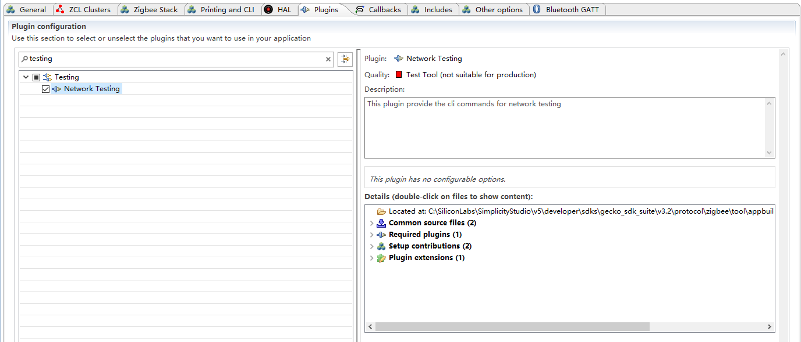
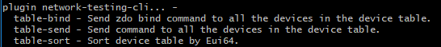

# Zigbee Network Testing Plugin #

## Summary ##
This plugin provides the cli commands for network testing on Host application. It is not avaiable on SOC project.

plugin network-testing-cli... 

* table-bind - Send zdo bind command to all the devices in the device table

	<uint8_t>  endpoint of the device

    
    <uint16_t>  Cluster Id
	
*  table-send - Send command to all the devices in the device table. Test Round means the number of times the messages are sent. the command payload can be filled with [zcl cli command](https://docs.silabs.com/zigbee/6.10/zigbee-af-api/zcl-global)

    <uint8_t>  destination endpoint

    <uint16_t>  Test Round
	
 * table-sort - Sort device table by Eui64.

## Gecko SDK version ##

Gecko SDK Suite 3.2

## Hardware Required ##

* Wireless Starter Kit Main Board (BRD4001)
* Any EFR32 radio board.

## How to use ##
1. Copy the network-testing-cli folder to C:\SiliconLabs\SimplicityStudio\v5\developer\sdks\gecko_sdk_suite\v3.2\protocol\zigbee\app\framework\plugin-host.
2. Launch the Simplicity Studio V5 and generate a Z3GatewayHost project.
3. Network Testing plugin will be shown in Plugins window.

4. Enable the plugin, you will see the following cli commands.                

5. Send the toggle command to the devices in device table with following cli commands.
    
    * zcl on-off toggle
    * plugin network-testing-cli table-send  1 1
