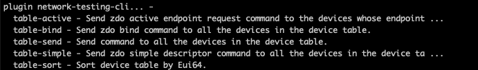

# Zigbee Source Routing Repair Plugin #

## Summary ##
This plugin provide the cli commands for network testing.

plugin network-testing-cli... 

* table-bind - Send zdo bind command to all the devices in the device table

	<uint8_t>  endpoint of the device

    
    <uint16_t>  Cluster Id
	
*  table-send - Send command to all the devices in the device table. the command payload can be filled with [zcl cli command](https://docs.silabs.com/zigbee/6.10/zigbee-af-api/zcl-global)

    <uint8_t>  destination endpoint

    <uint16_t>  Test Round
	
 * table-sort - Sort device table by Eui64.

## Gecko SDK version ##

Gecko SDK Suite 3.2

## Hardware Required ##

* Wireless Starter Kit Main Board (BRD4001)
* Any EFR32 radio board.

## How to use ##
1. Place the network-testing-cli folder to C:\SiliconLabs\SimplicityStudio\v5\developer\sdks\gecko_sdk_suite\v3.2\protocol\zigbee\app\framework\plugin.
2. Lanuch the Simplicity Studio V5 and generate a Zigbee project.
3. Network Testing plugin will be shown in Plugins window.

4. Enable the plugin, you will see the following cli commands.

