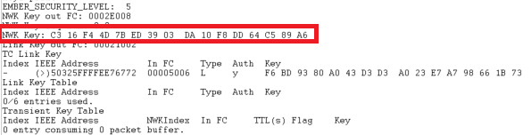

# Network Key Update

## 1. Summary
In order to make sure that every device doesn't reach the maximum value of the frame counter, the TC need to perform a NWK key update. 
This update should be done periodically at long intervals. The case of SED is very specific. For example, if a SED is the sleep state, it is not going to receive any message and therefore miss the NWK key Update. It then needs to perform a rejoin to the NWK. 

## 2. Gecko SDK version
Gecko SDK Suite 4.1.0 or later
## 3. Hardware Required
* 3x Wireless Starter Kit Main Board 
* 3x BRD4180A
## 4. Connections Required
Connect the radio boards to the WSTK mainboards. Connect your desired gateway device via serial connection to a computer. 

## 5. Running the Applications
Build and flash the nwkKeyUpdate_CO application to one board (coordinator).
Build and flash the nwkKeyUpdate_Ro application to another one (Router).
Build and flash the nwkKeyUpdate_SED application to the last one (SED).

## Using the Application
* Form the network on the coordinator by sending **form** through the serial.
* If you want to capture packets, use **keys print** to get the NWK key and add it to your keys.
* Use **open** to Open the network
* Send **join** to both the Router and SED to allow them to join the network
* On the Coordinator (TC), send **updateNwk** in order to update the key when your 2 devices joined the network

## Interpretation
After doing the whole process, it is possible to see that the Trust Center and the router updated their NWK key.\
**Before the NWK Key Update on the TC**\
\
**After the NWK Key Update on the TC**\
\
**After the NWK Key Update on the SED**\
\
From what we can see, the SED missed the NWK Update. It will need to perform a rejoin process in order to get the NWK Key.

## 6. Traces & other documents
This directory also contains trace captures on Network Analyzer and Wireshark directly in the repositories
* trace_nwk_key_update.isd : Capture for NA
* trace_nwk_key_update.pcapng : Capture for Wireshark   

**To use Wireshark Capture**
You need to add the well-known key to your wireshark keys to decode packets.\
Go to : [Edit -> Preferences -> Protocols -> ZigBee -> Edit] and add :
**5A:69:67:42:65:65:41:6C:6C:69:61:6E:63:65:30:39** as the well-known key\

To get more informations : [AN1233: Zigbee Security](https://www.silabs.com/documents/public/application-notes/an1233-zigbee-security.pdf)\
[UG391: Zigbee Application Framework dev guide](https://www.silabs.com/documents/public/user-guides/ug391-zigbee-app-framework-dev-guide.pdf)
