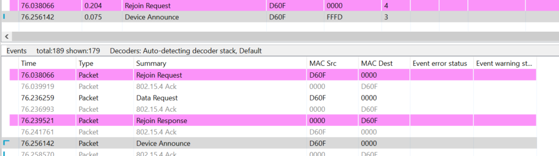
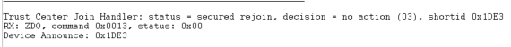

# Secured Rejoining :  with Sleepy-End Device

## 1. Summary
When a device looses its parent, or miss a network key update, it needs to do a rejoining process. This rejoining process can be two types : Secured Rejoining or Unsecured rejoined.
This project shows the Secured Rejoining in the case an End-device is aged out of the child table of its parent.

## 2. Gecko SDK version
Gecko SDK Suite 4.1.0 or later
## 3. Hardware Required
* 3x Wireless Starter Kit Main Board 
* 3x BRD4180A
## 4. Connections Required
Connect the radio boards to the WSTK mainboards. Connect your desired gateway device via serial connection to a computer. 

## 5. Running the Applications
Build and flash the rejoinSecured_CO application to one board (coordinator).
Build and flash the rejoinSecured_Ro application to another one (Router).
Build and flash the rejoinSecured_SED application to the last one (SED).

## Setup of the aging out
In order to speed up the aging out of the SED, we set the value EMBER_END_DEVICE_POLL_TIMEOUT to SECONDS_10. Each end device that is not polling in this period is aged out of the child table and then need to perform a rejoining. We are using the emberRejoinNetwork() to launch the process.
## Using the Application
* Form the network on the coordinator by sending **form** through the serial.
* If you want to capture packets, use **keys print** to get the NWK key and add it to your keys.
* Use **open** to Open the network
* Send **join** to both the Router and SED to allow them to join the network
* Wait for approximately 15 seconds and then the rejoin event is triggered.

## Interpretation
The rejoin process is composed of 3 messages which are Rejoin Request, Rejoin response and device announce
as you can see on the following capture.\
\
On the TC, the rejoin is successful.\

## 6. Traces & other documents
This directory also contains trace captures on Network Analyzer and Wireshark directly in the repositories
* trace_nwk_key_update.isd : Capture for NA
* trace_nwk_key_update.pcapng : Capture for Wireshark   

**To use Wireshark Capture**
You need to add the well-known key to your wireshark keys to decode packets.\
Go to : [Edit -> Preferences -> Protocols -> ZigBee -> Edit] and add :
**5A:69:67:42:65:65:41:6C:6C:69:61:6E:63:65:30:39** as the well-known key\

To get more informations : [AN1233: Zigbee Security](https://www.silabs.com/documents/public/application-notes/an1233-zigbee-security.pdf)\
[UG391: Zigbee Application Framework dev guide](https://www.silabs.com/documents/public/user-guides/ug391-zigbee-app-framework-dev-guide.pdf)
