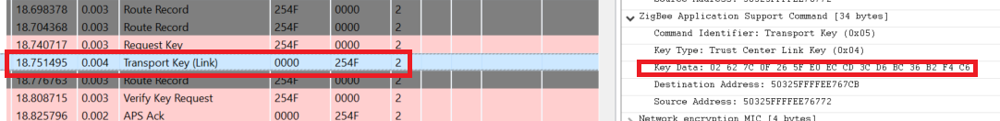
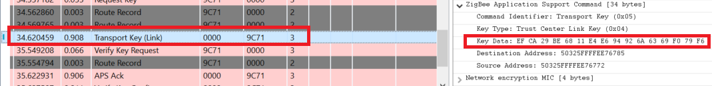
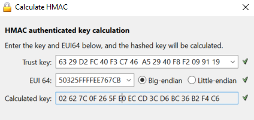

# TC Policies : Hashed Link Key

## 1. Summary
When joining a network and to be allowed to communicate end-to-end with the trust center, each node requires a TC Link key. This link key can be unique, hashed link key based on a global key which is hashed by the ID of the corresponding node, or the same link key for every node which means the "end-to-end" communication can be decrypted by every node of the network. In this project, we are using hashed link keys. It has a lot of advantages to use this method, it requires less RAM since it only need to store one unique link key.

## 2. Gecko SDK version
Gecko SDK Suite 4.1.0 or later
## 3. Hardware Required
* 3x Wireless Starter Kit Main Board 
* 3x BRD4180A
## 4. Connections Required
Connect the radio boards to the WSTK mainboards. Connect your desired gateway device via serial connection to a computer. 

## 5. Running the Applications
Build and flash the hashedTCLink_CO application to one board (coordinator).
Build and flash the hashedTCLink_Ro application to another one (Router).
Build and flash the hashedTCLink_SED application to the last one (SED).

## Using the Application
* Form the network on the coordinator by sending **form** through the serial.
* If you want to capture packets, use **keys print** to get the NWK key and add it to your keys.
* Use **open** to Open the network
* Send **join** to both the Router and SED to allow them to join the network

## Interpretation
It is possible to see in the traces that we have two keys that are different for the router and SED. 

**For the router** :

**For the SED** : 

In order to check that the key are the Trust key hashed by the EUI64 of the node, you can use the tool Calculate HMAC present in the Preferences window > Network Analyzer > Decoding > Security keys. 

You need to enter the **Trust Key** which is located in the TC Link key table when you use the **keys print** command and the eui64 of the node.
For the router, we have the following result :
\
It matches with the one found in the trace ! 

## 6. Traces & other documents
This directory also contains trace captures on Network Analyzer and Wireshark directly in the repositories
* trace_hashed_link_keys.isd : Capture for NA
* trace_hashed_link_keys.pcapng : Capture for Wireshark   

**To use Wireshark Capture**
You need to add the well-known key to your wireshark keys to decode packets.\
Go to : [Edit -> Preferences -> Protocols -> ZigBee -> Edit] and add :
**5A:69:67:42:65:65:41:6C:6C:69:61:6E:63:65:30:39** as the well-known key\

To get more informations : [AN1233: Zigbee Security](https://www.silabs.com/documents/public/application-notes/an1233-zigbee-security.pdf)