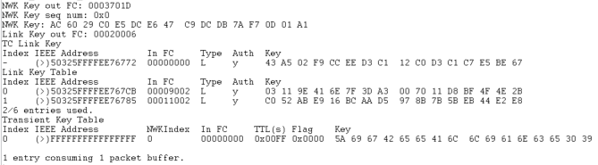

# TC Policies : Unique Link Key

## 1. Summary
When joining a network and to be allowed to communicate end-to-end with the trust center, each node requires a TC Link key. This link key can be unique, hashed link key based on a global key which is hashed by the ID of the corresponding node, or the same link key for every node which means the "end-to-end" communication can be decrypted by every node of the network.\ 
In this project, we are using unique link keys. Basically, each device is going to get a random TC Link key to communicate with the Trust Center. This TC Link key is unique for each device in the network. It seems more secure to use this method but it requires more RAM to store all the keys.

## 2. Gecko SDK version
Gecko SDK Suite 4.1.0 or later
## 3. Hardware Required
* 3x Wireless Starter Kit Main Board 
* 3x BRD4180A
## 4. Connections Required
Connect the radio boards to the WSTK mainboards. Connect your desired gateway device via serial connection to a computer. 

## 5. Running the Applications
Build and flash the uniqueTCLink_CO application to one board (coordinator).
Build and flash the uniqueTCLink_Ro application to another one (Router).
Build and flash the uniqueTCLink_SED application to the last one (SED).

## Using the Application
You can change the variable emberTrustCenterLinkKeyRequestPolicy present in trust-center.h directly to the desired value. To use unique link key, you can set this variable to EMBER_ALLOW_TC_LINK_KEY_REQUEST_AND_GENERATE_NEW_KEY
Then, the APS layer is encrypted after the Verify Key Confirm with the Trust center unique link key. 
You can find unique link key in the link key table of the TC.
Devices store their unique link key in the TC Link key table. This encryption allows you to do end-to-end communication between a node and the coordinator (TC).

* Form the network on the coordinator by sending **form** through the serial.
* If you want to capture packets, use **keys print** to get the NWK key and add it to your keys.
* Use **open** to Open the network
* Send **join** to both the Router and SED to allow them to join the network

## Interpretation
After doing the whole process, it is possible to see that all TC Link keys are stored into the link key table of the trust center.

## 6. Traces & other documents
This directory also contains trace captures on Network Analyzer and Wireshark directly in the repositories
* trace_tc_unique_linkkey.isd : Capture for NA
* trace_tc_unique_linkkey.pcapng : Capture for Wireshark   

**To use Wireshark Capture**
You need to add the well-known key to your wireshark keys to decode packets.\
Go to : [Edit -> Preferences -> Protocols -> ZigBee -> Edit] and add :
**5A:69:67:42:65:65:41:6C:6C:69:61:6E:63:65:30:39** as the well-known key\

To get more informations : [AN1233: Zigbee Security](https://www.silabs.com/documents/public/application-notes/an1233-zigbee-security.pdf)