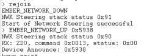
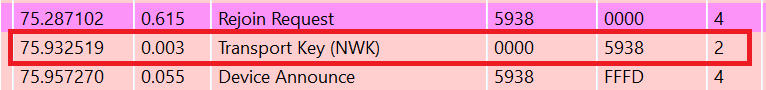
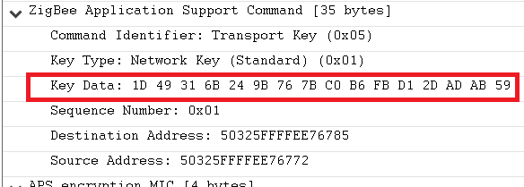

# UNSecured/TC Rejoin:  with Sleepy-End Device

## 1. Summary
When a device looses its parent, or miss a network key update, it needs to do a rejoining process. This rejoining process can be two types : Secured Rejoining or Unsecured rejoined.
This project shows the **UN**Secured Rejoining in the case a SED missed a NWK Key Update.
This rejoin type is also called TC Rejoin.
For this project, we use the TC unique link keys.

## 2. Gecko SDK version
Gecko SDK Suite 4.1.0 or later
## 3. Hardware Required
* 3x Wireless Starter Kit Main Board 
* 3x BRD4180A
## 4. Connections Required
Connect the radio boards to the WSTK mainboards. Connect your desired gateway device via serial connection to a computer. 

## 5. Running the Applications
Build and flash the rejoinUNSecured_CO application to one board (coordinator).
Build and flash the rejoinUNSecured_Ro application to another one (Router).
Build and flash the rejoinUNSecured_SED application to the last one (SED).

## Using the Application
* Form the network on the coordinator by sending **form** through the serial.
* If you want to capture packets, use **keys print** to get the NWK key and add it to your keys.
* Use **open** to Open the network
* Send **join** to both the Router and SED to allow them to join the network
* When both the Router and SED joined the network, send **updateNwk** on the TC to launch update NWK Key
* Wait 10 to 20 seconds for the updateNwk to finish, until Switch Key packet is sent
* Send **rejoin** on the SED side to launch the process. You should see in the console the following message.\

## Interpretation
The rejoin process is composed of 4 messages which are Rejoin Request, Rejoin response, NWK Key and device announce.\
\
We can see that the NWK Key is send to the device. The message is unencrypted at the NWK layer and
crypted at the APP Layer using the unique TC Link key.\
\
WARNING : You can't perform a unsecured rejoin while using only hashed TC Link keys and well-known key for joining. You need to use unique keys or install-code in order for the TC to accept an 
unsecured-rejoin. This is done in order to increase security of the network.

## 6. Traces & other documents
This directory also contains trace captures on Network Analyzer and Wireshark directly in the repositories
* trace_unsecured_rejoining.isd : Capture for NA
* trace_unsecured_rejoining.pcapng : Capture for Wireshark   

**To use Wireshark Capture**
You need to add the well-known key to your wireshark keys to decode packets.\
Go to : [Edit -> Preferences -> Protocols -> ZigBee -> Edit] and add :
**5A:69:67:42:65:65:41:6C:6C:69:61:6E:63:65:30:39** as the well-known key\

To get more informations : [AN1233: Zigbee Security](https://www.silabs.com/documents/public/application-notes/an1233-zigbee-security.pdf)\
[UG391: Zigbee Application Framework dev guide](https://www.silabs.com/documents/public/user-guides/ug391-zigbee-app-framework-dev-guide.pdf)