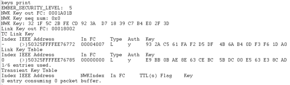
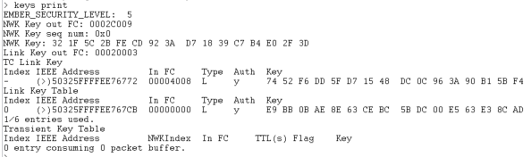

# Application Link Keys


## 1. Summary
Zigbee can also use an additional security feature for end-to-end communication between 2 devices
on the same network by using **Application Link Keys**. This key is going to encrypt the APS layer between 2 nodes on the network, and and also decrypt when receiving data. Only the 2 nodes are aware of this Link key, even the Trust Center does not have access to it. The trust center has only the role to give the keys to the two nodes.

## 2. Gecko SDK version
Gecko SDK Suite 4.1.0 or later
## 3. Hardware Required
* 3x Wireless Starter Kit Main Board
* 3x BRD4180A
## 4. Connections Required
Connect the radio boards to the WSTK mainboards. Connect your desired gateway device via serial connection to a computer.

## 5. Running the Applications
Build and flash the appLinkKey_CO application to one board (coordinator).
Build and flash the appLinkKey_Ro application to another one (Router).
Build and flash the appLinkKey_SED application to the last one (SED).

## Using the Application
To use app link key, you must set the variable emberAppLinkKeyRequestPolicy to EMBER_ALLOW_APP_LINK_KEY_REQUEST in order to allow app link key requests. You also need to install the "security link keys" component to enable link key table.
Devices store their APP link keys into the link key table. This encryption allows you to do end-to-end communication between two nodes in the same network.

* Form the network on the coordinator by sending **form** through the serial.
* If you want to capture packets, use **keys print** to get the NWK key and add it to your keys.
* Use **open** to Open the network. This is going to open the network to join with well-known key.
* Send **join** to both the Router and SED to allow them to join the network
* On the SED, send **appLKey {eui64 of router}** to request a key.
Additional Information :\
In order to receive the APP Link key on a SED, you must enable the fast polling mode or poll at a high rate. It is done in appLinkKey :
```
Waiting for the APS Link Key
currentTask = EMBER_AF_FORCE_SHORT_POLL;
emberAfAddToCurrentAppTasks(currentTask);
emberAfSetWakeTimeoutBitmaskCallback(currentTask);
```
## Interpretation
After doing the whole process, it is possible to see that all APP Link keys are stored into the link key table of the 2 nodes involved in the end-to-end communication with this key.\



## 6. Traces & other documents
This directory also contains trace captures on Network Analyzer and Wireshark directly in the repositories
* trace_app_link_key.isd : Capture for NA
* trace_app_link_key.pcapng : Capture for Wireshark

**To use Wireshark Capture**
You need to add the well-known key to your wireshark keys to decode packets.
Go to : [Edit -> Preferences -> Protocols -> ZigBee -> Edit] and add :
**5A:69:67:42:65:65:41:6C:6C:69:61:6E:63:65:30:39** as the well-known key

To get more informations : [AN1233: Zigbee Security](https://www.silabs.com/documents/public/application-notes/an1233-zigbee-security.pdf)\
[UG391: Zigbee Application Framework dev guide](https://www.silabs.com/documents/public/user-guides/ug391-zigbee-app-framework-dev-guide.pdf)
