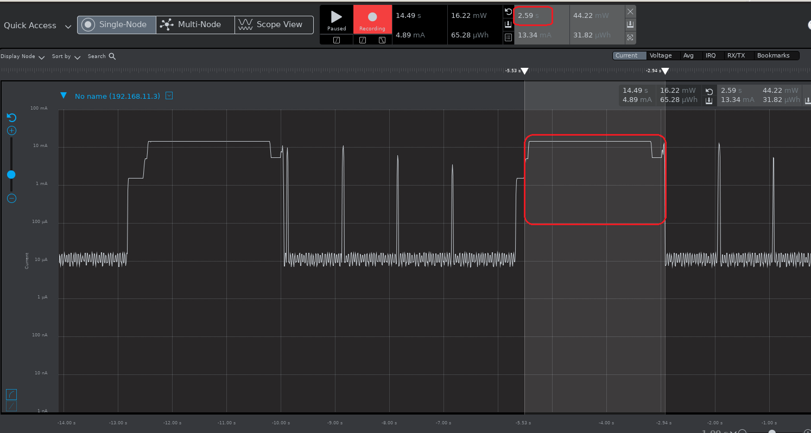
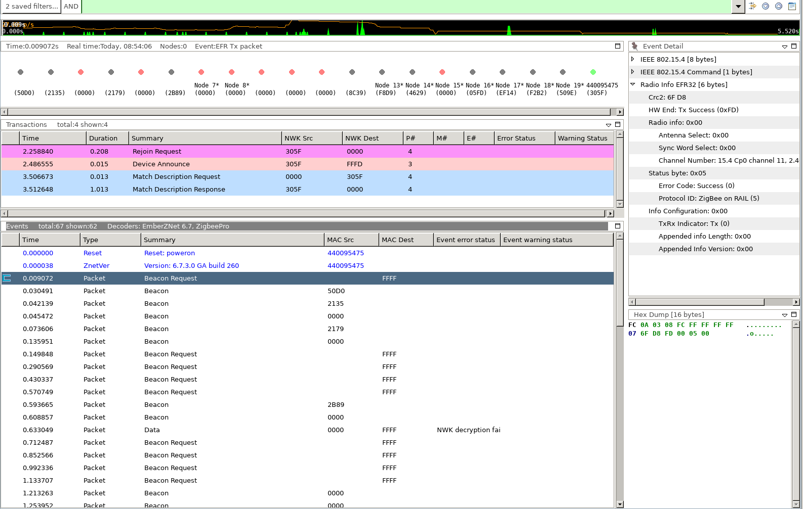
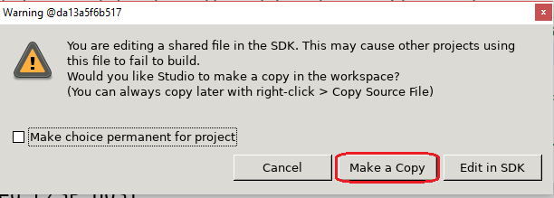
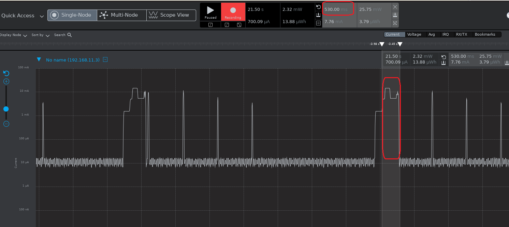
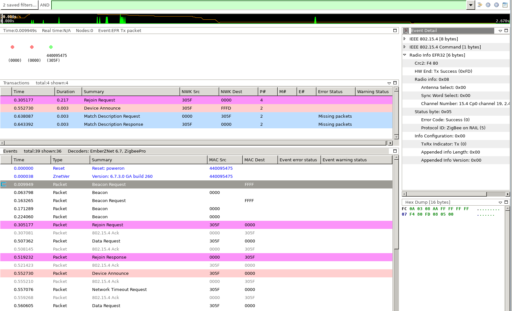
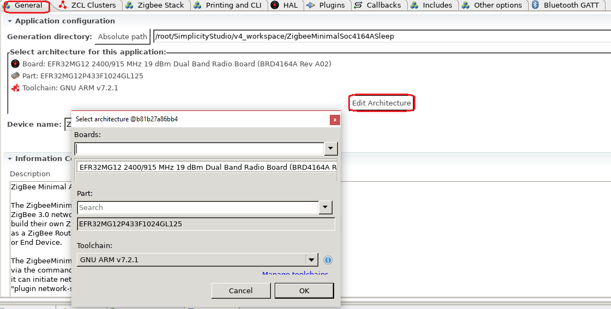

# Optimize Boot-up Rejoin


## 1. Summary ##
According to Zigbee 3.0 BDB spec, Zigbee end devices and sleepy end devices need to attempt to rejoin the network when they boot up. This is very important for Zigbee end devices, especially for sleepy end devices as the PAN ID, channel or network key might have changed when they are absent or sleeping. 

Currently, in EmberZnet, we will perform an active scan on all channels, from channel 11 to channel 26. The scan duration is set to 3 as recommended in Zigbee spec D.7. Therefore, in the worst case, it will take:
```
16 (channels) * 960 (symbols) * 16 (us/symbol) * (2^3 + 1) = 2, 211, 840 us
```
to finish the rejoin. In this case, when a sleepy end device reset, it might keep awake for about 2.2 seconds before falling asleep again.



From the [sniffer](doc/Bootup-Rejoin-Sniffer.isd), we can see that the sleepy end device scaned from channel 11 to channel 26, then rejoined after it found the network.



As the working channel is less likely to be changed, if we can start the scanning on the current channel and then rejoin if the network is found, we save save a lot of time by skipping the channels before the current channel. For example, if the current channel is at 18 and when we start scanning from 11, the scanning time cost on 11 to 17 is wasted. 

Assuming the current channel is 18, we can compare the scanning time between the current solution with the optimized solution:

|solution|scan channel number|time cost|
|:-|:-|:-|
|Current|11,12,13,4,15,16,17, total 7|967680 ns|
|Optimized|18, total 1|138240 ns|


## 2. Gecko SDK version ##
Gecko SDK Suite 2.7.

## 3. Hardware Required ##
- Wireless Starter Kit Main Board (BRD4001)
- EFR32MG12 2400/915 MHz 19 dBm Dual Band Radio Board (BRD4164A)

## 4. Connections Required ##
Join the sleepy end device into a Zigbee network.

## 5. Setup ##
Below is the steps of setup this project:
1. Create a ZigbeeMinimal project, set the device type to "sleepy end device";
2. Enable plugin "Idle/Sleep", and check the option "Stay awake when NOT joined";
3. Enable plugin "Packet Handoff", and keep it's options as default;
4. Enable callback "Main Init" and "Incoming Packet Filter";
5. Add a custom event "customEventData" and its handler "customEventHandler";
6. Generate the project;
7. Modify the function **emAfNetworkInit** in source file **zcl-framework-core/af-main-common.c**, so that the original boot-up rejoin implemented by the stack will be disabled. As this source file is linked into the SDK, there will be a pop-up warning windows like below. If you see it, **please always select "Make a Copy"**.



This function is called when the network is initialized. The inner function emberNetworkInit is provided by the stack. By default, the option "EMBER_NETWORK_INIT_END_DEVICE_REJOIN_ON_REBOOT" is enabled in the input parameter "networkInitStruct". With this option, the stack will start to scan on all channels from channel 11 to channel 26 and then rejoin the network found by the scanning. We will disable this option here and use our optimized scanning and rejoin.

``` C
void emAfNetworkInit(void)
{
  uint8_t i;
  for (i = 0; i < EMBER_SUPPORTED_NETWORKS; i++) {
    bool initialize = true;
    emberAfPushNetworkIndex(i);
    emAfClearNetworkCache(i);
    if (emAfProIsCurrentNetwork()) {
      EmberNodeType nodeType;
      if (emAfCurrentZigbeeProNetwork->nodeType == EMBER_COORDINATOR) {
        zaTrustCenterSecurityPolicyInit();
      }
      if (emberAfGetNodeType(&nodeType) == EMBER_SUCCESS
          && (nodeType != emAfCurrentZigbeeProNetwork->nodeType
              && (emAfCurrentZigbeeProNetwork->nodeType != EMBER_COORDINATOR
                  || nodeType != EMBER_ROUTER))) {
        initialize = false;
      }
    }
    if (initialize) {
//      EmberNetworkInitStruct networkInitStruct = { EMBER_AF_CUSTOM_NETWORK_INIT_OPTIONS };
    	EmberNetworkInitStruct networkInitStruct = {EMBER_NETWORK_INIT_PARENT_INFO_IN_TOKEN | EMBER_NETWORK_INIT_NO_OPTIONS};
      emberNetworkInit(&networkInitStruct);
    }
    emberAfPopNetworkIndex();
  }
}
```

1. Add the following source code into **\<projectname\>_callbacks.c**, so that we can implement the boot-up rejoin by ourselves.
``` C
typedef enum
{
	REJOIN_ON_BOOT_STATE_IDLE,
	REJOIN_ON_BOOT_STATE_CURRENT_CH,
	REJOIN_ON_BOOT_STATE_ALL_CH,
	REJOIN_ON_BOOT_STATE_DONE,
}REJOIN_ON_BOOT_STATE;

REJOIN_ON_BOOT_STATE g_rejoin_on_boot_state = REJOIN_ON_BOOT_STATE_IDLE;
uint8_t g_currentch = 0xFF;

EmberEventControl customEventData;
void customEventHandler()
{
	EmberStatus status;

	emberEventControlSetInactive(customEventData);

	if (REJOIN_ON_BOOT_STATE_CURRENT_CH == g_rejoin_on_boot_state) {
		status = emberFindAndRejoinNetworkWithReason(1, // Network Key is known
												   1 << g_currentch,
												   EMBER_REJOIN_DUE_TO_END_DEVICE_REBOOT);
		emberAfCorePrintln("[%d] status=%X", __LINE__, status);

		g_rejoin_on_boot_state = REJOIN_ON_BOOT_STATE_ALL_CH;

		if (EMBER_SUCCESS == status) {
			emberEventControlSetDelayMS(customEventData, 500);
		} else {
			emberEventControlSetActive(customEventData);
		}
	} else if (REJOIN_ON_BOOT_STATE_ALL_CH == g_rejoin_on_boot_state) {
		status = emberFindAndRejoinNetworkWithReason(true, // Network Key is known
													EMBER_ALL_802_15_4_CHANNELS_MASK,
												   EMBER_REJOIN_DUE_TO_END_DEVICE_REBOOT);
		emberAfCorePrintln("[%d] status=%X", __LINE__, status);
	} else {
		//unreachable branch
	}
}

void emberAfMainInitCallback(void)
{
    tokTypeStackNodeData data;
    EmberNodeType nodeType = EMBER_UNKNOWN_DEVICE;
    EmberStatus status;

    status = emberAfGetNodeType(&nodeType);
    if (status != EMBER_SUCCESS) {
      return;
    }

    // only end device need rejoin
    if (EMBER_SLEEPY_END_DEVICE != nodeType && EMBER_END_DEVICE != nodeType) {
    	return;
    }

    memset(&data, 0xFF, sizeof(data));
    halCommonGetToken(&data, TOKEN_STACK_NODE_DATA);

    if (data.panId != 0 && data.panId != 0xFFFF
    		&& data.zigbeeNodeId != 0xFFFF && data.zigbeeNodeId != 0xFFFE) {

    	g_rejoin_on_boot_state = REJOIN_ON_BOOT_STATE_CURRENT_CH;
    	g_currentch = data.radioFreqChannel;
    	emberEventControlSetActive(customEventData);
    }
}

EmberPacketAction emberAfIncomingPacketFilterCallback(EmberZigbeePacketType packetType,
                                                      int8u* packetData,
                                                      int8u* size_p,
                                                      void* data)
{
	uint8_t cmd;
	uint8_t status;
	EmberNodeId nodeID;

	if (EMBER_ZIGBEE_PACKET_TYPE_NWK_COMMAND != packetType) {
		return EMBER_ACCEPT_PACKET;
	}

//	emberAfCorePrintln("[%d] %X %X %X %X", __LINE__, packetData[0], packetData[1], packetData[2], packetData[3]);

	cmd = packetData[0];
	nodeID = packetData[2] << 8 | packetData[1];
	status = packetData[3];
	if (7 == cmd && 0 == status && emberGetNodeId() == nodeID) {  // cmd=7 means rejoin response
		g_rejoin_on_boot_state = REJOIN_ON_BOOT_STATE_DONE;
		emberEventControlSetInactive(customEventData);
	}

	return EMBER_ACCEPT_PACKET;
}
```

## 6. How It Works ##
1. Disable the boot-up rejoin implemented by the stack. This is done by changing function emAfNetworkInit;
2. When sleepy end device boots up, read the network info from tokens. Try to rejoin on the current channel. As the channel is less likely to change, there is bigger chance that the sleepy device rejoins successfully. 
3. Use an event as a timer here. In case the device fails to rejoin on the current channel, start to perform a full channel scanning and rejoining.

Below is the optimized waveform when the channel is not changed:



Below is the [sniffer](doc/Optimized-Bootup-Rejoin-Sniffer.isd):



We can see that the device rejoins successfully for the first attempt. Therefore, it saves much time.

## 7. .sls Projects Used ##
zigbee_minimal_soc_sleep_mg12.sls

## 8. How to Port to Another Part ##
This example can be used on any parts. Below are the steps of porting it to other part:
- Import the .sls file into Simplicity Studio
- Open the .isc file of each project, turn to "General" tab, hit button "Edit Architecture", then select the board and part.



## 9. Special Notes ##
N/A
