# <center> Philips HUE with Home Assistant OS </center>

## Summary

This project demonstrates how to set up a **Raspberry Pi** as a **ZigBee RCP HOST** to control a remote **Philips HUE bulb** via the **EFR32xG24 Radio Board as the RCP target**. Home Assistant is an open-source software for home automation, integrating commonly used IoT protocols and platforms such as Bluetooth, ZigBee, Thread, Wi-Fi, MQTT, and Apple HomeKit.

## Gecko SDK Version

Gecko SDK 4.3.2

## Hardware Used

1. Raspberry Pi 4 Model B
2. Philips Hue Gen 3 Smart Light E27 Color Ambiance 9W Bulb (Model Number 9WE27WACA)
3. EFR32xG24B-BRD4187C radio board
4. Wireless Pro Kit Mainboard (BRD4002A Rev A06)

## System Overview

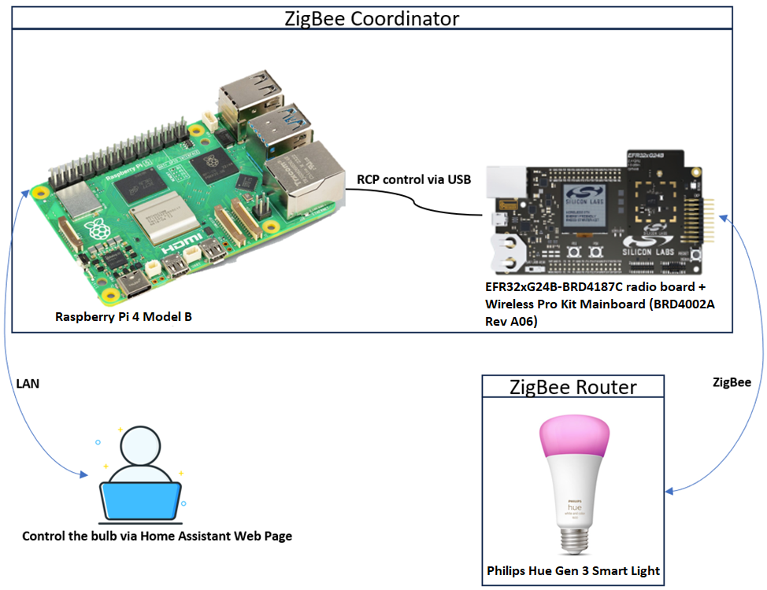

The ZigBee Coordinator consists of a ZigBee EFR radio board and a Raspberry Pi connected via a USB cable. The Raspberry Pi acts as the RCP host, while the EFR32xG24 Radio Board serves as the RCP target. The Philips HUE bulb joins the coordinator using a ZigBee well-known key. Home Assistant OS is downloaded to the Raspberry Pi, allowing the user to interact with the joined devices via the Home Assistant web page hosted on the same network as the Raspberry Pi.

## Setup

### Setting up the Raspberry Pi

1.  Download and install the Raspberry Pi Imager on your computer from <https://www.raspberrypi.com/software/>.
2.  Open the Raspberry Pi Imager and select your Raspberry Pi device.
3.  Choose the operating system:
    1. Select **Choose OS**.
    2. Select **Other specific-purpose OS** > **Home assistants and home automation** > **Home Assistant**.
    3. Choose the Home Assistant OS that matches your hardware (RPi 3, RPi 4, or RPi 5).
4.  Choose the storage:
    1. Insert the SD card into the computer (note: the contents of the card will be overwritten).
    2. Select your SD card.
5.  Write the installer onto the SD card:
    1. Select **Next** to start the process.
    2. Wait for the Home Assistant OS to be written to the SD card.
    3. Eject the SD card.
6.  Start up your Raspberry Pi:

    1.  Insert the SD card into your Raspberry Pi.
    2.  Plug in an Ethernet cable and ensure the Raspberry Pi is connected to the same network as your computer and to the internet.
    3.  Connect an HDMI cable from the Raspberry Pi to a monitor to see the logs and access the superviser console.
    4.  Connect the power supply to start the device.

> **WARNING**

> If you’re prompted with an error that states: "Home Asssitant CLI is not running! Jump into emergency console..." as shown in the image below:

> 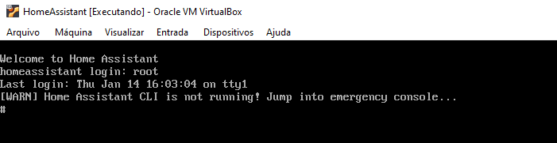

> **TIP**

   > Check the startup logs; it's probably because the Kernel was not able to synchronize the time:

   > 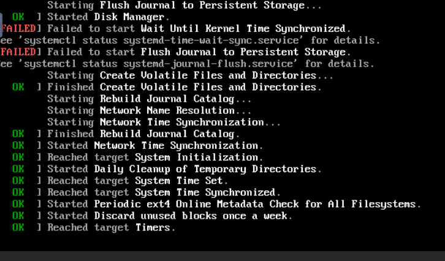
   
   > 1. The reason for this error is that your network does not allow your Raspberry Pi to set the time using the internet.
   > 2. In this case, you will have to set the time manually using the following command on the emergency console:
   > 3. **```sudo date -s 'yyyy-mm-dd hh:mm:ss' ```**
   > 4. Replace **`yyyy-mm-dd hh:mm:ss`** with the current date and time.

7.  If no error appears, you'll be able to access Home Assistant OS a few minutes after connecting the Raspberry Pi.
   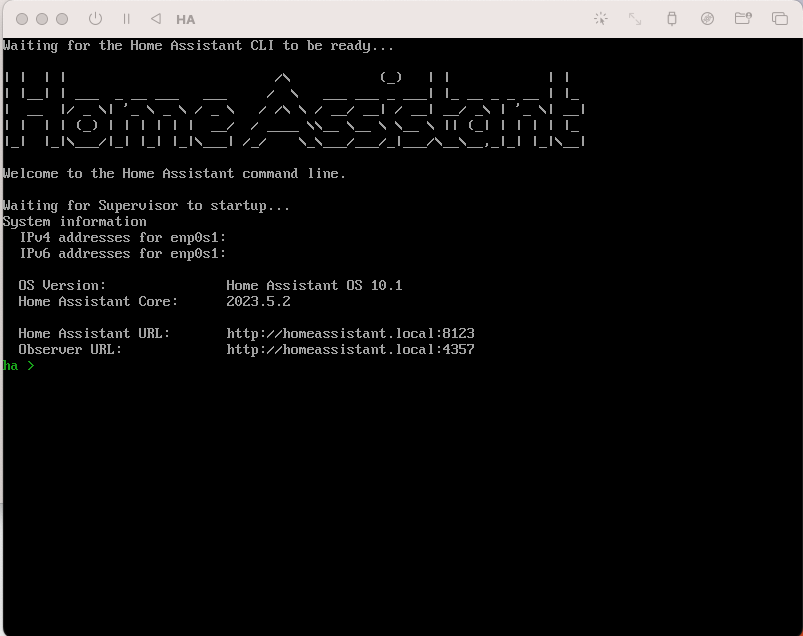

> **IMPORTANT**  

> Home Assistant offers four different installation methods; Home Assistant Operating System, Home Assistant Container, Home Assistant Core, Home Assistant Supervised. For this demonstration, we recommend using Home Assistant Operating System

> **WARNING**  

> Do NOT use Home Assistant Container as installing add-ons is not allowed using Docker container.
> 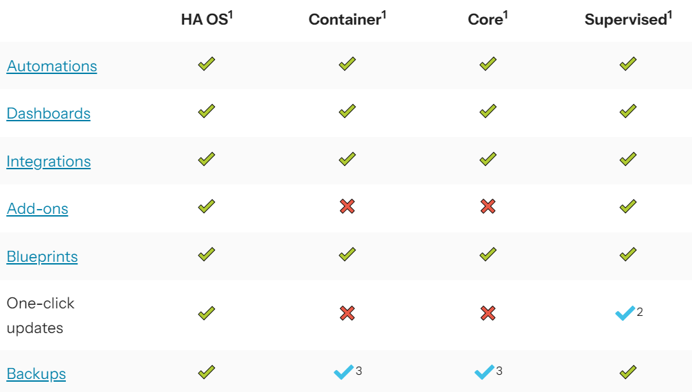

### Accessing Home Assistant

1. In your desktop system's browser, enter http://homeassistant.local:8123. You will see the following screen:
   
1. After the setup is complete, you will be prompted with the following screen:
   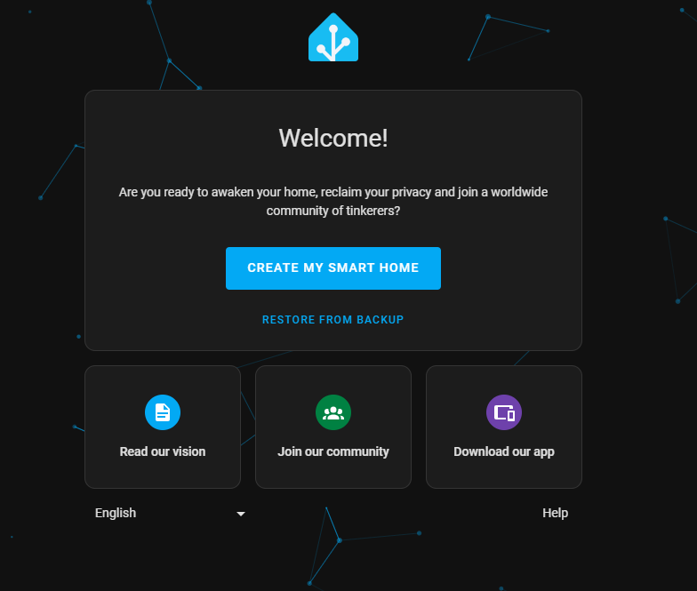
   1. Click on **Create My Smart Home** and proceed with signing up for Home Assistant OS.
   2. Select your Home Assistant OS location for sunrise and sunset automations on the Philips Hue bulb.
1. After completing the setup, you will be prompted with the following page:
   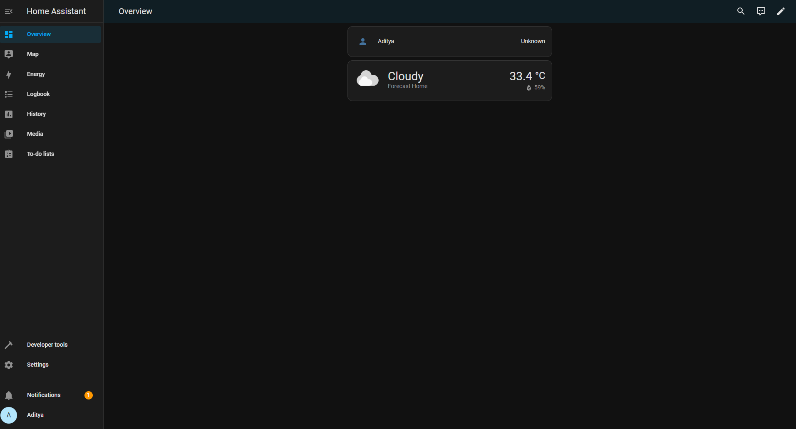
1. Navigate to your profile and under User settings, choose your preferred settings for Time and Date zones and format.
1. Enable the Advanced mode under the same User profile settings tab.
   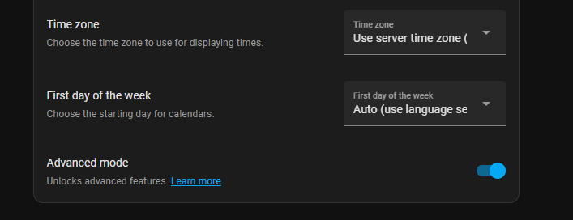
1. Navigate to your Home Assistant frontend to **Settings > Add-ons > Add-on Store**.
1. Find the **Silicon Labs Multiprotocol** add-on and click on it.
1. Click on the **Install** button.
1. After the installation is complete, we are done setting up our RCP host, i.e., Raspberry Pi.

### Setting up the RCP environment

1. Connect EFR32xG24B-BRD4187C radio board with BRD4002A (Wireless Pro Kit Mainboard).
2. Launch Simplicity Studio 5 in Launcher perspective.
   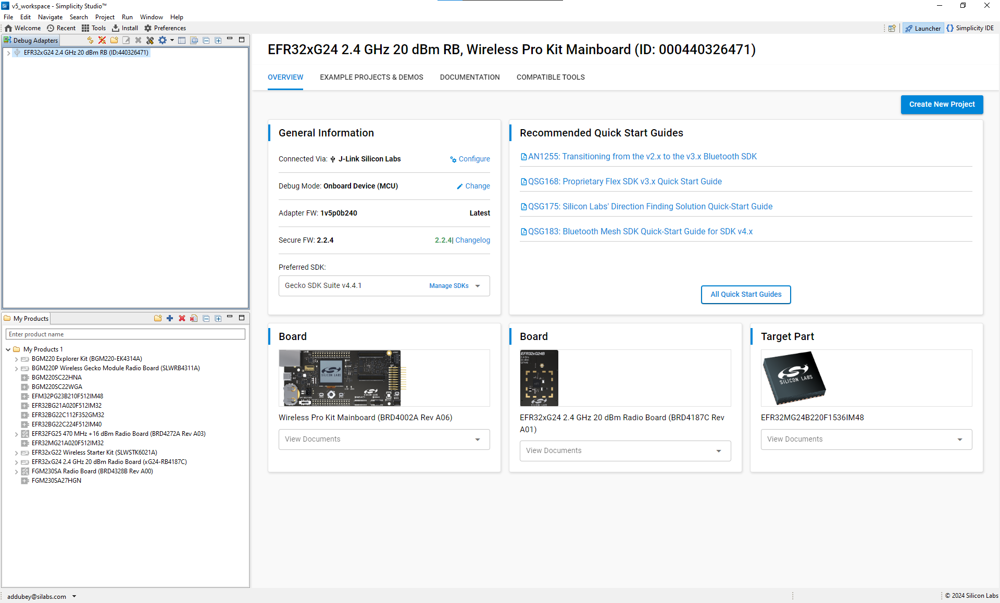
3. Navigate to **File > New > Silicon Labs Project Wizard**.
   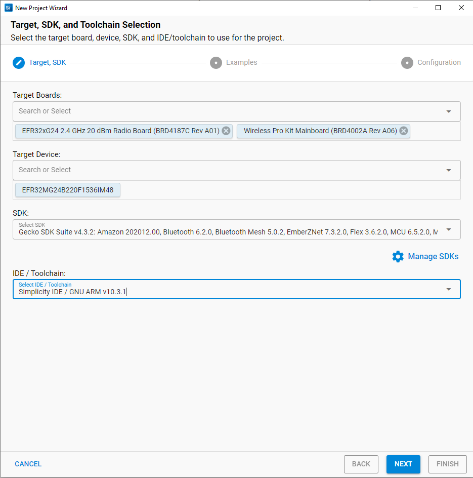
4. Ensure you are using **Gecko SDK v4.3.2** and **GNU ARM v.10.3.x** as the toolchain.
5. Click **Next** and search for **Bootloader – SoC Internal Storage bootloader**.
   
6. Click **Next** and type in a project name and click **Finish**.
7. Build the bootloader and flash the built image to the connected radio board.
8. Head back to the **Launcher** perspective in Simplicity Studio 5.
9. Navigate to **File > New > Silicon Labs Project Wizard** and keep the same SDK and Toolchain settings as we did before and click on **Next**.
10. Search for **Multiprotocol (OpenThread+Zigbee) – RCP (UART)**, Click **Next** and type in a project name and click **Finish**.
11. Navigate to the project’s .slcp file and search for the software component **CPC Security**. Uninstall this component and install the **CPC Security None** Software component instead.
    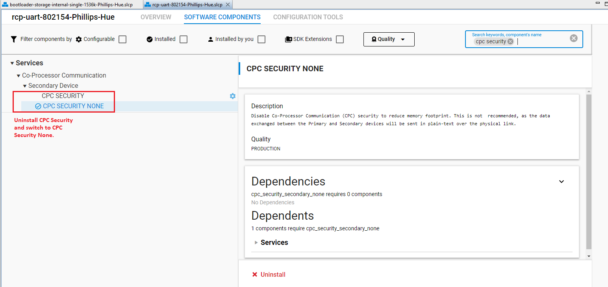
12. Build the project and flash the built image to the connected radio board.
13. Use Simplicity Commander to verify the images are flashed successfully.
    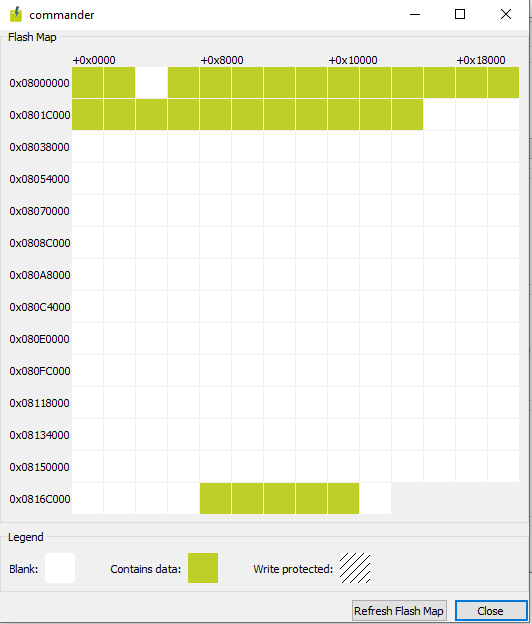
14. Disconnect the WSTK from your PC and connect it to the Raspberry Pi running Home Assistant OS.
15. Navigate to the Silicon Labs Multiprotocol Configuration tab and select the device. It might be named something like: **`/dev/serial/by-id/usb-Silicon\_Labs\_J-Link\_Pro\_OB\_<serial_no._of_the_device>-xxxx`**.
    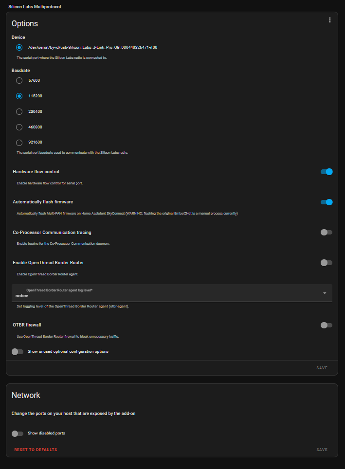
16. Set the **Baudrate** to **115200**.
17. You can leave the other settings in this tab and the **Network** tab as default, and then click on **Save**.
18. Navigate to the **Info** tab of Silicon Labs Multiprotocol add-on and start the add-on.
19. Navigate to the **Log** tab and check if everything is initialized correctly. The correct log should look something like this:
    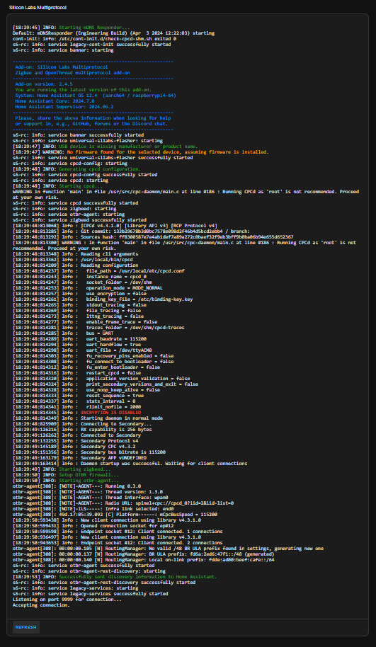
20. Navigate to **Devices & services** tab in Home Assistant Settings page and click on **Integrations** tab.
21. Click on **Add integration** button.
22. Add the **Zigbee Home Automation (ZHA)** integration to Home Assistant Core
23. When asked for the Serial Device Path, choose Enter Manually.
24. Choose **EZSP** as Radio type.
25. As serial path, enter **`socket://<Hostname_of_Silicon_Labs_Mltiprotocol_Addon>:9999`**.
    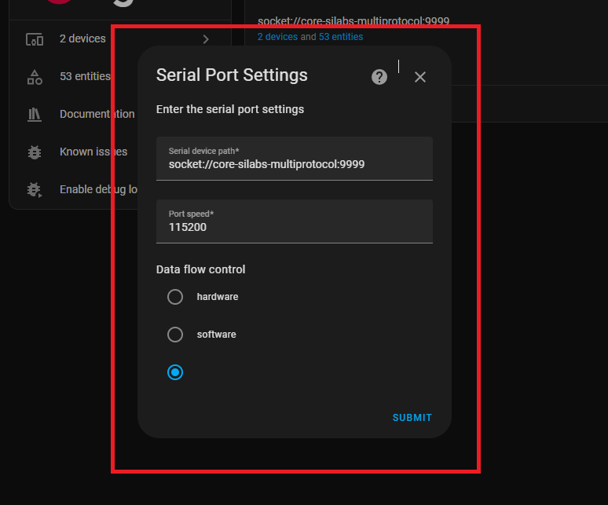

26. Click on **Submit**. Adding ZHA should succeed, and you should be able to use ZHA as if using any other supported radio type.
27. Click on **Create a new network** on the next screen and enter the name of the area and floor _optional_, this will help you recognize devices from different areas when your network grows.
28. After completion of all the steps, you will be prompted with the following page:
    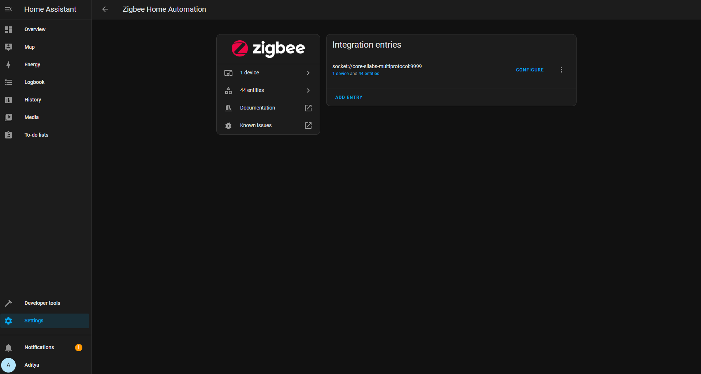
29. Currently there’s only one device on this network, i.e., the coordinator (RCP target EFR32xG24 and Raspberry Pi as RCP host). It must be named as **Silicon Labs EZSP**.

## Adding the Philips Hue Bulb to the network.

1. Power your Philips Hue bulb using the correct power supply and socket.
2. Navigate to the **Integration entries** section and click on the **1 device** hyperlink. You will be prompted with the following page:
   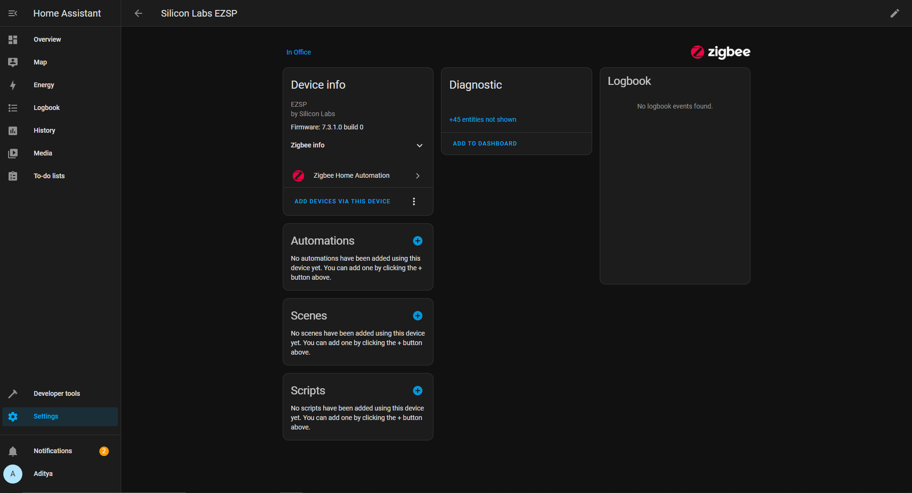
3. Click on **Add devices via this Device**. The Philips Hue bulb will join the network using the Zigbee Alliance 09 key, and the initialization will be completed by the ZHA integration. If everything goes well, you will be prompted with the following screen.
   
   1. You can keep any device name here; I have used **Philips Hue Bulb Office** as an example.
4. Add this device to an area, and the setup is complete. After it has joined the network, you can go to the **Visualization** tab to see the network’s topology.
   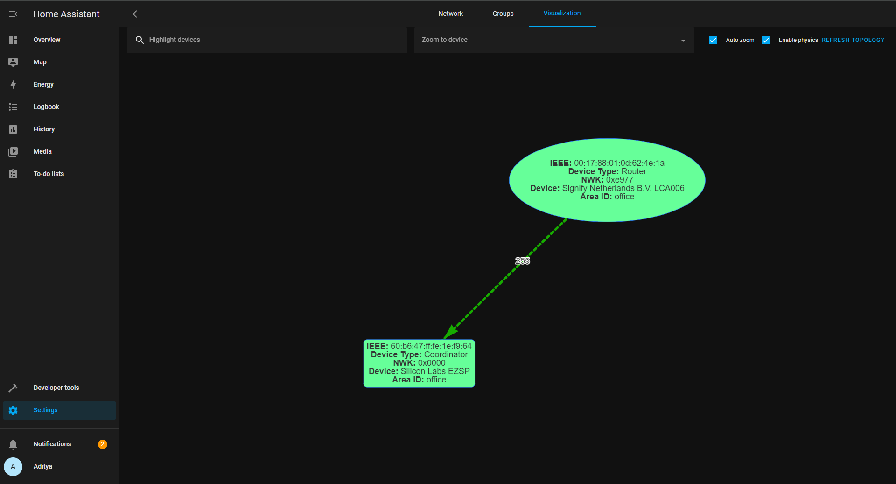
   1. Here, you can see that **Philips Hue bulb** has established a connection with the network coordinator, **Silicon Labs EZSP**.
5. You can navigate to the **Devices** tab and see various settings available, such as **Controls**, **Configuration**, and **Diagnostic**.
   1. You can use **Controls** to control the Lamp’s brightness, saturation, hue, etc.
      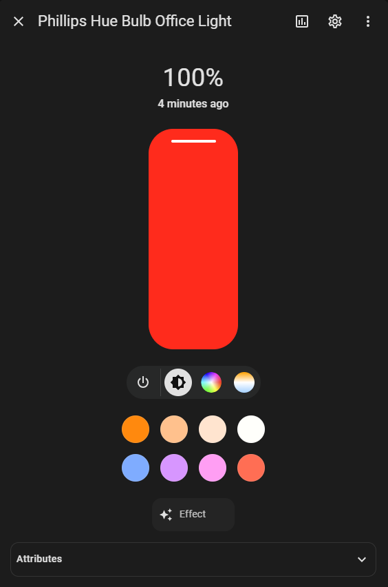
   1. You can use **Configurations** to tweak startup behavior.
      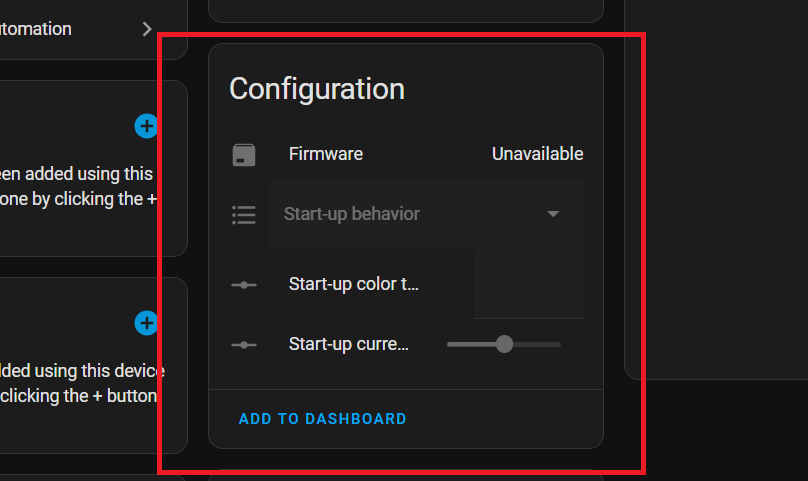
   1. You can use **Diagnostic** to identify which device you’re working with. It’s helpful when you have a lot of devices on the network.
      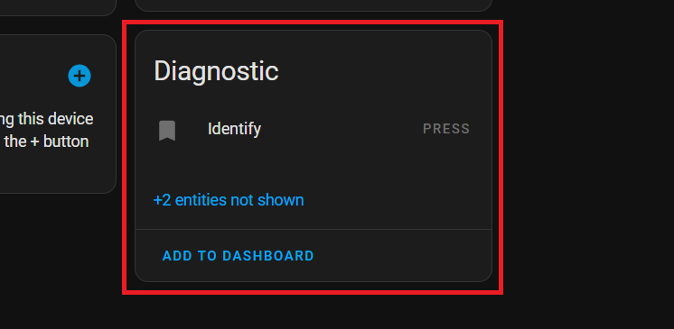

### Adding entities, scenes, and automations to Philips Hue Bulb

#### Creating Entities (optional)

**Entities are the basic building blocks to hold data in Home Assistant. An entity represents a sensor, actor, or function in Home Assistant. Entities are used to monitor physical properties or to control other entities. An entity is usually part of a device or a service. Entities have states. Entities are used to group different devices to perform various operations on them as a group. For example, you can have an entity named ‘Backyard Lights’ containing devices in your backyard.**

In this section, we will create an entity, just to demonstrate how you can add different devices under one umbrella. Although we only have only one device, but this feature is useful when we have more devices in our network.

1. Navigate to **Add-ons store** and search for **File Editor** and install it.
   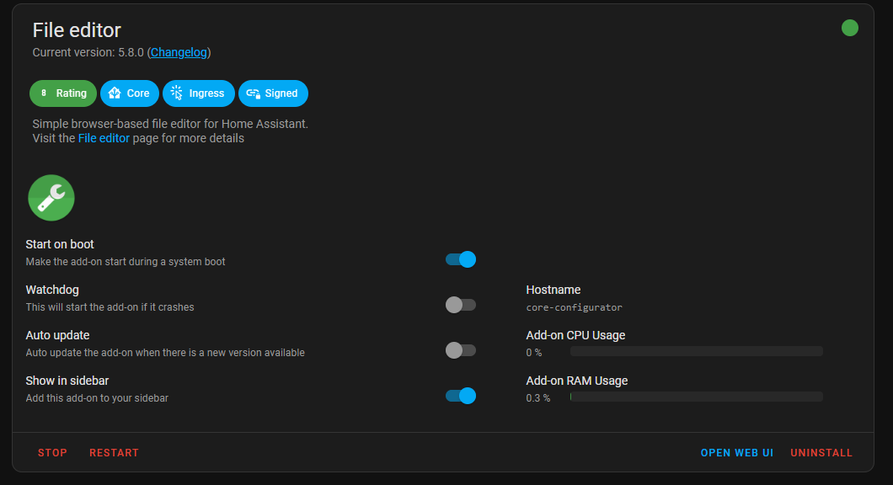
   1. Enable the **Start on boot** and **Show in sidebar** options.
   2. You will now see **File editor** in the sidebar menu of the Home Assistant OS.
2. Navigate to **File Editor**, click on the folder icon in the top left corner, and open the `configuration.yaml` file.
   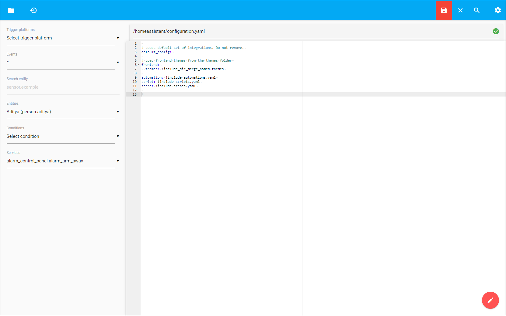
3. Add the following code to the file so that the created entity will be shown at required places.
   1. **`light: !include lights.yaml`**
      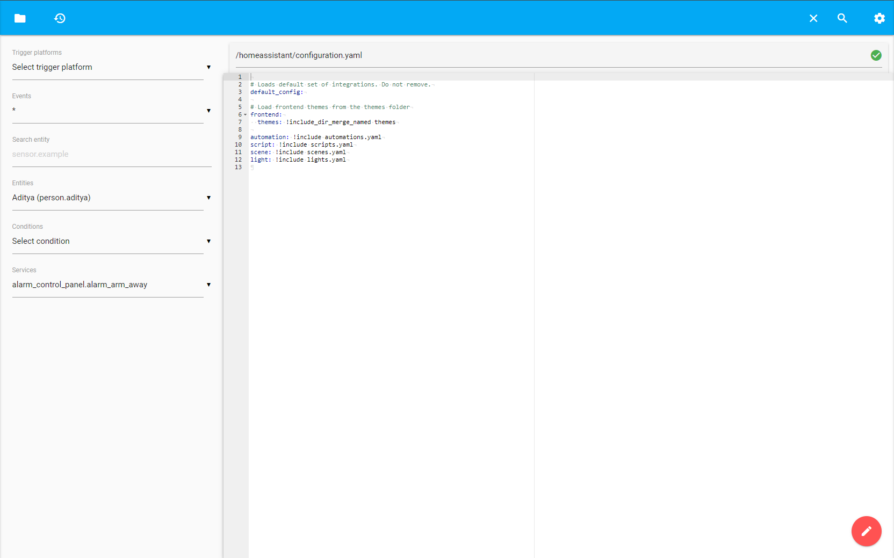
4. Save the file and navigate to the **folder** icon on the top left corner again.
5. Create a new file and name it **`lights.yaml`**. Make sure the file is created in **`/homeassistant/`** directory.
6. Navigate to **Settings > Devices & services > Entities**. Look for the Philips Hue Bulb in the list. Copy its Entity ID.
   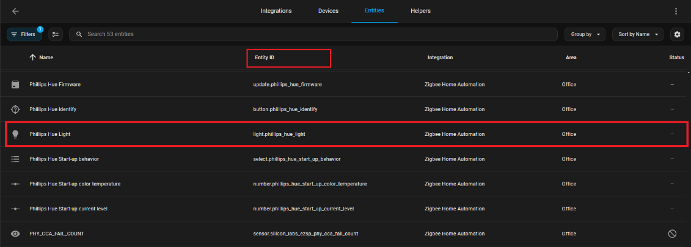
7. Open the **`lights.yaml`** file and add the following code to the file.
   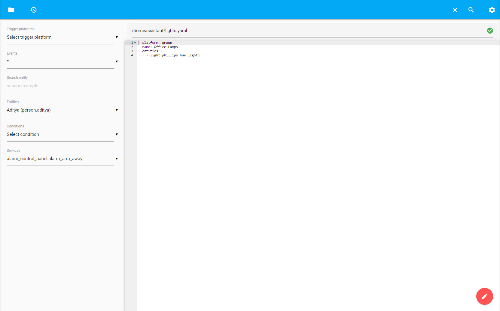
   ```
   – platform: group
     name: Office Lamps
     entities:
       - <your bulb’s entity ID>
   ```
8. Save the file and exit the **File Editor**.
9. Navigate to **Developer tools** and click on **Check Configuration** to ensure that the YAML configurations don’t contain any errors.
   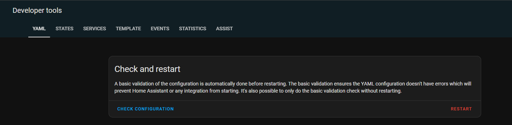
   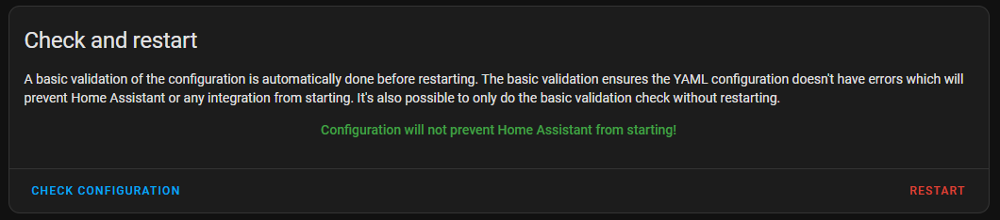
10. If the Configuration check was successful, **Restart** the home assistant server. After a successful restart you will see the entity listed on the **Overview** pane.
    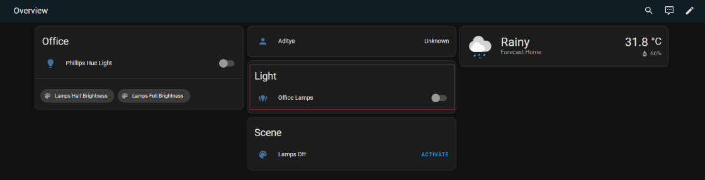

> **TIP**

   > There is a simpler way to create grouped entities in Home Assistant OS by using the GUI. You can easily add entities through the Helpers feature.

1. Go to the **Settings** page.
2. Navigate to the **Devices & Services** section.
3. Proceed to the **Helpers** tab.
   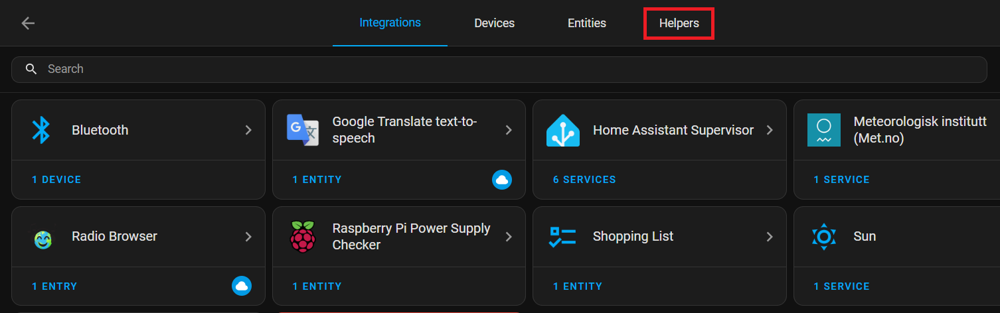
4. Click the **Create Helper** button in the bottom-right corner.
   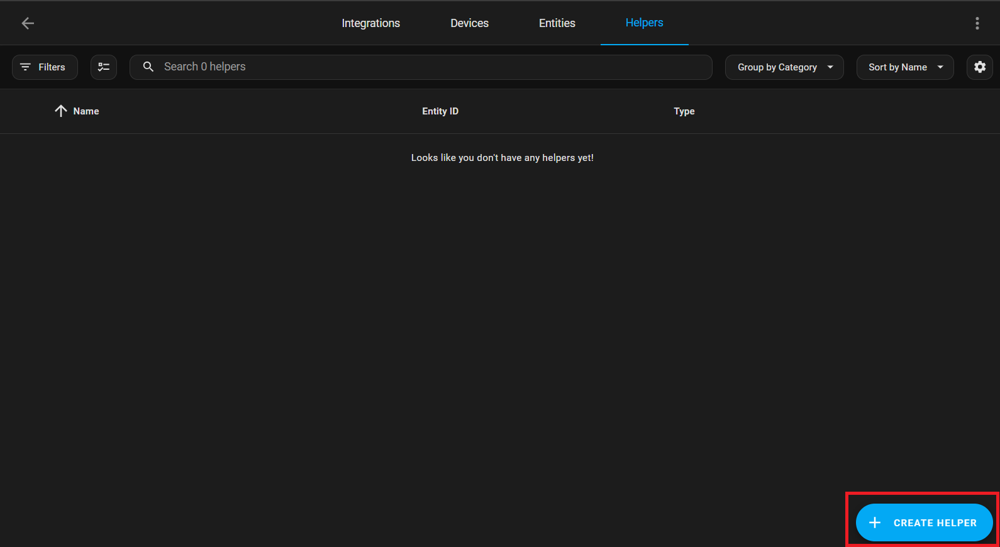
5. You'll see a selection of predefined helper types, such as **Groups**, **Schedules**, **Date and Time**, etc. For this example, we'll use **Group**.
   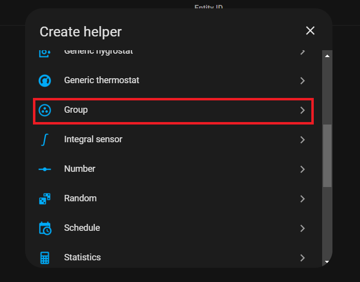
6. After selecting **Group**, choose the **Light group** option to create a new **Light group** entity group. This is equivalent to editing the YAML.
   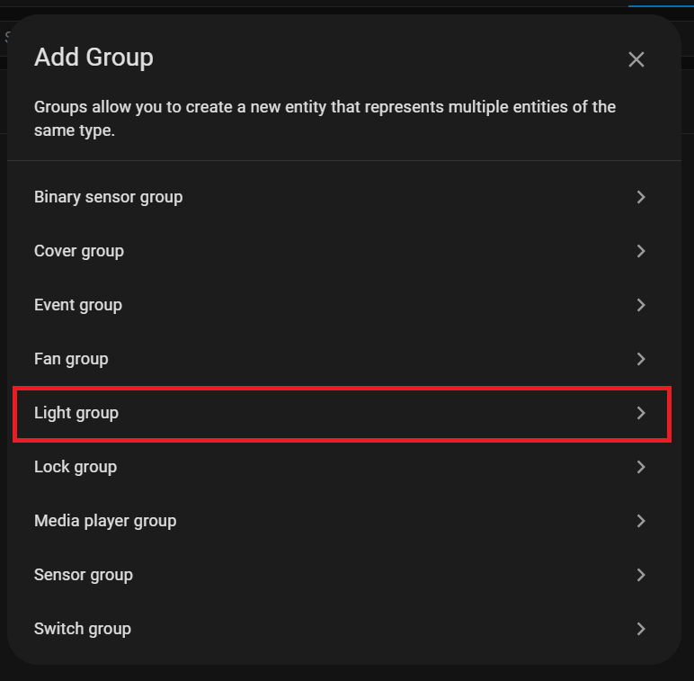
7. On the next screen, enter your preferred **Name** and select the **Philips Hue bulb** from the dropdown menu.
   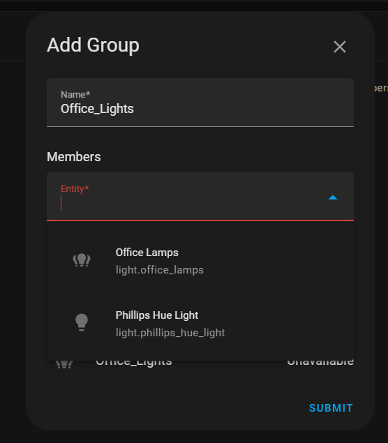

#### Creating Scenes (optional)

**You can create scenes that capture the states you want certain entities to be. For example, a scene can specify that light A should be turned on and light B should be bright red.**

In this section, we will create three scenes to make the bulb glow with full, half, and zero brightness.

1. Navigate to **Settings > Automations & scenes > Scenes**. Click on **Add scene** to create a new scene.
2. Type in the name of the scene, you can allot it an area as well as an icon of your choice.
   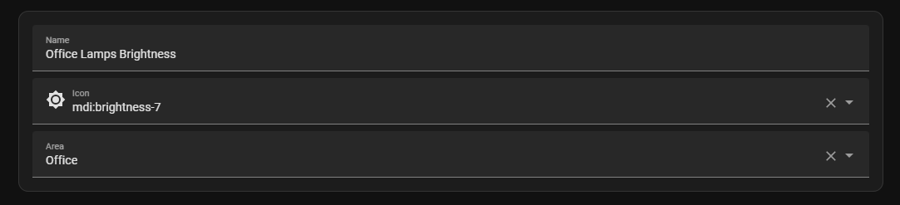
3. Now add a device or entity and set their parameters, i.e., (brightness, state, etc.).

   > **NOTE**
   > Here, I am adding my Philips Hue bulb as an entity. You can add it as either a device or an entity. The only difference is that if you add it as a device, the automations, scripts, and scenes will be visible on the device’s dedicated page.

4. After adding the entity, click on it and set the desired values of brightness, hue, and saturation.
   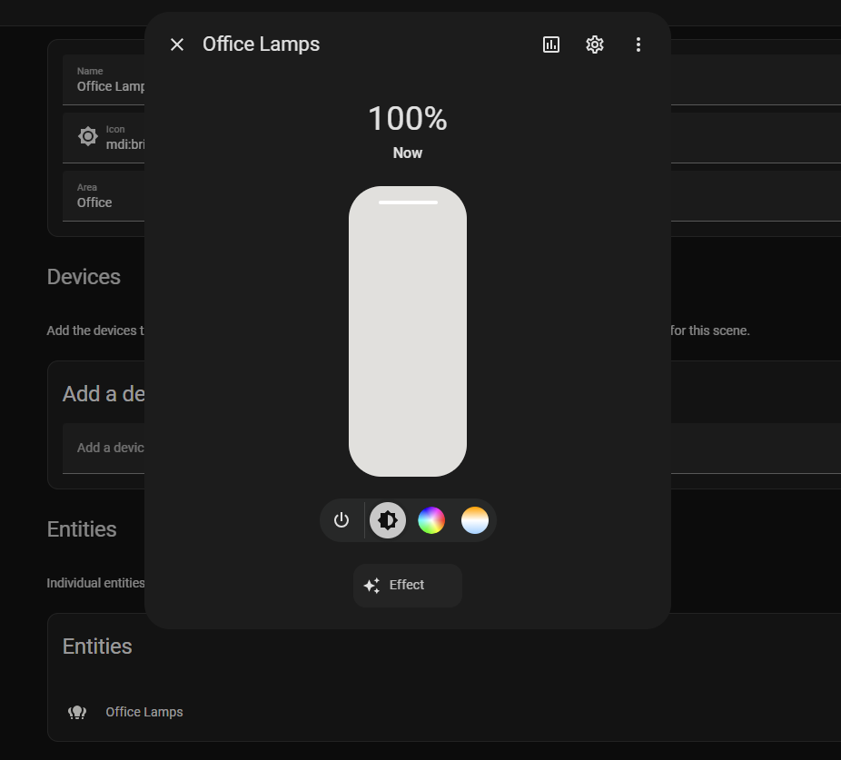
5. As this scene sets the brightness to 100%. You can create as many scenes as you wish with different states and configurations.
   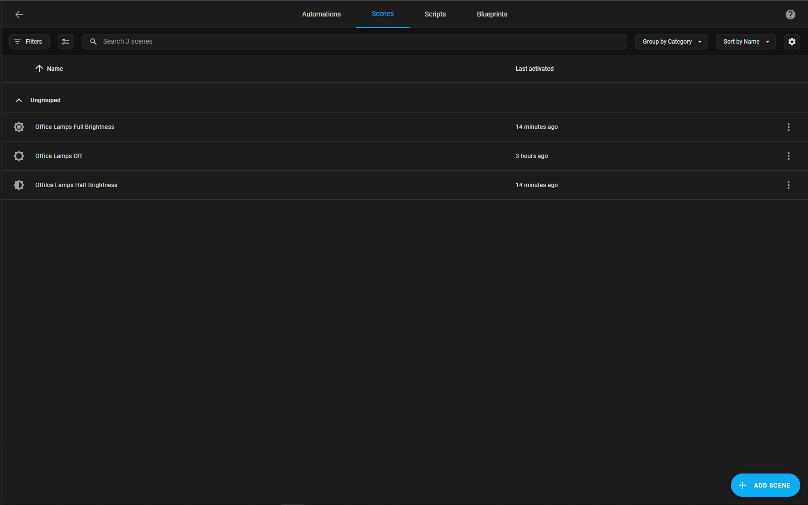

#### Creating Automations

**Automations in Home Assistant allow you to automatically respond to things that happen. For instance, you can turn the lights on at sunset or pause the music when you receive a call.**

In this section, we will create an automation that will turn on our Philips Hue bulb 15 minutes before sunset and turn it off 30 minutes after sunrise. This automation is for demonstration purposes only; you can adjust the specifics of the demonstration as desired.

1. Navigate to **Settings > Automation & scenes > Automations**. Click on **Create Automation** to create a new automation.
2. Select **Create new automation** from the three options presented.
   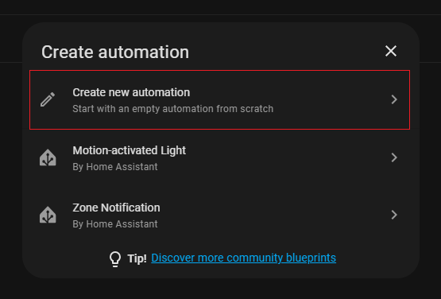
3. Here you will see three important sections **When**, **And if**, and **Then do**. These are self-explanatory. Here we have a choice to use the GUI or to edit this automation in YAML, and we will be choosing the second option for ease and understanding.
4. On the top right corner of the **New Automation** screen, click on the vertical ellipsis icon and then click on **Edit in YAML** option.
   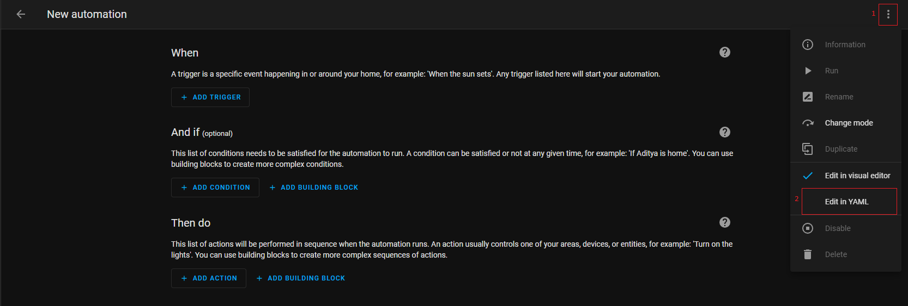
   1. In the YAML editor, paste the contents of the `automation.yaml` file. You can find this file in the `src` folder of this repository.

> **NOTE**
> YAML files are indentation-sensitive, so ensure proper formatting. Your YAML file should resemble the image shown below.
> 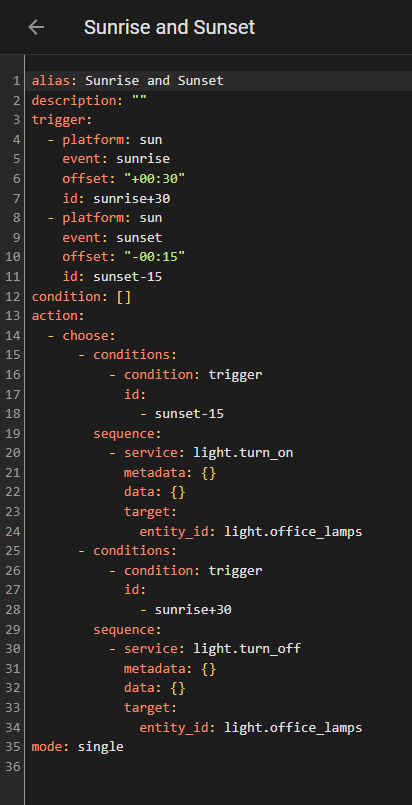

5. This automation turns the **Office Lamps** entity **ON** 15 minutes before sunset and turns the entity **OFF** 30 minutes after sunrise.
   
6. **Save** the automation YAML and leave the page. Now you should see that your Philips Hue Bulb automatically switches states as per sunrise and sunset.
7. You can see the logs of this automation being triggered in the **Logbook** menu or the **Device Info** logs of the entity/device.

## Special Precaution & Fix

This section addresses a situation where you might lose control of your Philips Hue bulb within the Zigbee Home Automation (ZHA) network.

1. **What to Avoid:** Refrain from deleting both the Philips Hue bulb from the ZHA network and subsequently deleting the entire Zigbee network without first creating a backup. This action severs the bulb's connection, leaving it stuck in its last state or displaying any random color.
2. **Reasoning:** Reconnecting the bulb requires a Philips Hue bridge to re-enter pairing mode. Bluetooth pairing might be an option (although functionality is untested).

If you've accidentally deleted the bulb and your Zigbee network, follow these steps to perform a hard reset on the bulb and bring it back into network steering mode (without using Bluetooth or a bridge):

Performing a hard reset can be finicky. Ensure you accurately count the "on" state for at least 5 seconds before turning it off again.

1. **Recovery Steps (if Bulb is Undiscoverable):**
   1. **Power Cycle the Bulb:** Quickly turn the bulb **on** (using the wall switch or lamp) and then **off**.
   1. **Cycle On-Off-On-Off-On:**
      1. Turn the bulb **on** and count **5 seconds** slowly.
      1. Turn the bulb **off** and count **2 seconds**.
      1. Repeat steps 3a(i) and 3a(ii) **four more times**, ending with the bulb **on**. So,
         1. On = 5 sec
         1. Off = 2 sec
         1. On = 5 sec
         1. Off = 2 sec
         1. On = 5 sec
         1. Off = 2 sec
         1. On = 5 sec
         1. Off = 2 sec
         1. Final On

If the reset is successful, the bulb will flash for approximately 5 seconds. You will find that the bulb is now again in pairing mode and can be added to a new Zigbee network without any issues.