# Zigbee RTC Time Synchronization #

## Summary ##
In a common Zigbee network, the gateway normally has the capability of connecting to the internet, so it can get the date and time through NTP. Therefore, the gateway can act as the time server to provide the time source for the other Zigbee devices. This example demonstrates how we synchronize the date and time in the Zigbee network. On the device side, the local date and time will be kept by the plugin **Simple Clock**. 

## Gecko SDK version ##
Gecko SDK Suite v4.4.0

## Hardware Required ##

- **Zigbee Gateway (host + NCP architecture)**
  - NCP: EFR32MG12 2.4GHz 19 dBm Radio Board (BRD4161A Rev A01)
  - Host: Linux 64 bit
    - For details regarding setting up Docker for windows, refer to the app note:
    [AN1389: Running Zigbee Host Applications in a Docker Container](https://www.silabs.com/documents/public/application-notes/an1389-running-host-applications-in-docker-containers.pdf)

- **Zigbee Devices (SoC architecture)**
  - EFR32MG12 2.4GHz 19 dBm Radio Board (BRD4161A Rev A01)

- Use of other radio boards or EFR32 development kits is possible. Modifications are required in terms of GPIO selection, **always refer to your development kit/radio board user guide for details**.

### NOTE: Tested boards for working with this example: ###

| Board ID | Description  |
| ---------------------- | ------ |
| BRD4161A | [EFR32MG12 2.4GHz 19 dBm Radio Board- BRD4161A](https://www.silabs.com/documents/public/user-guides/ug260-brd4161a-user-guide.pdf)    |
| BRD4180A | [EFR32xG21 2.4 GHz 20 dBm Radio Board-BRD4180A](https://www.silabs.com/documents/public/user-guides/ug385-brd4180a-user-guide.pdf) |

## Connections Required ##
The hardware connection is shown in the image below:
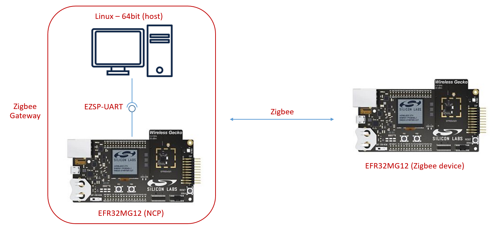

## Setup ##

### Zigbee Gateway - Time server ###

#### Create the zigbee NCP ####
1. From the Launcher Home, add your hardware to MyProducts, click on it, and click on the EXAMPLE PROJECTS & DEMOS tab. Find the example project with filter "ncp ncp-uart-hw".

2. Create a **Zigbee - NCP ncp-uart-hw** project in Simplicity Studio.

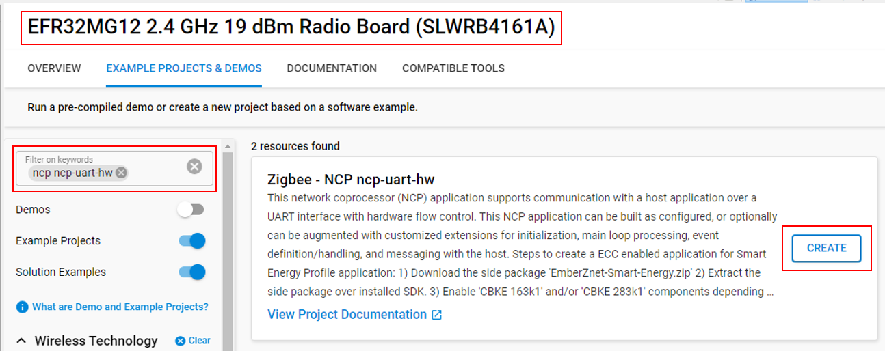

3. Build the project and flash it to your device.

#### Create the Zigbee host ####
1. From the Launcher Home, add "Linux - 64 bit" to MyProducts tabs, click on **Start**, and click on the EXAMPLE PROJECTS & DEMOS tab. Find the example project with the filter "host gateway".

2. Create a **Zigbee - NCP ncp-uart-hw** project in Simplicity Studio.

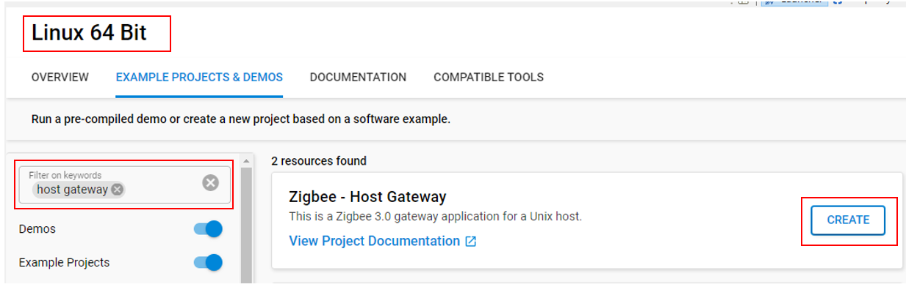

2. Copy all attached files in src folders into the project root folder (overwriting existing).
3. Open the .slcp file:
  - Select the **SOFTWARE COMPONENTS** tab and install these software components:
    - [Zigbee] → [Cluster Library] → [Common] → [Time Server Cluster]
  - Select the **CONFIGURATION TOOLS** tab and open **Zigbee Cluster Configurator**: 
    - enable the server side of the Time cluster.

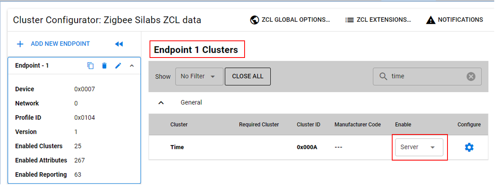

4. Save all the configurations.
5. In the project root folder, open the terminal and build with the following command:
    
    **make -f Z3Gateway.Makefile**

    *note: replace 'Z3Gateway.Makefile' with the makefile in your project*

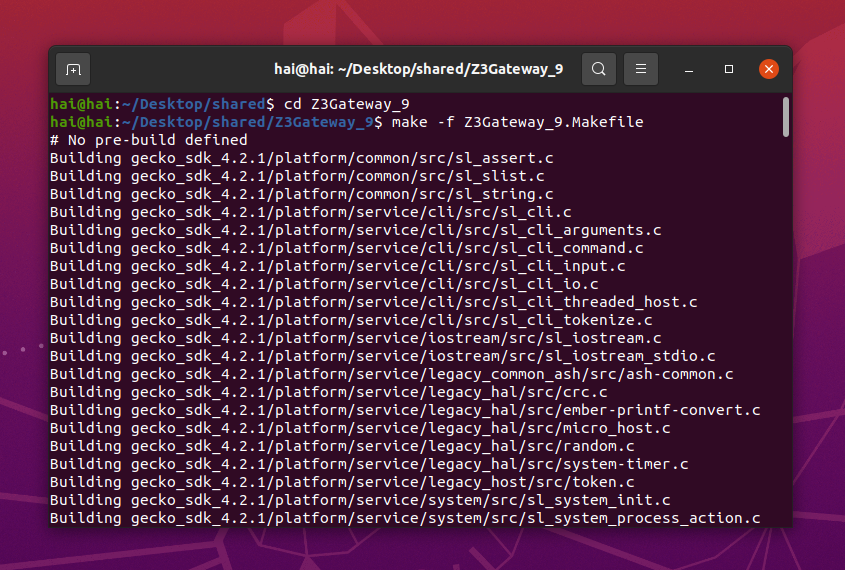

6. Run the Zigbee gateway device by connecting the Zigbee host to your NCP with the following command:

    **./build/debug/Z3Gateway -n 0 -p /dev/ttyACM0**

    *note: replace 'Z3Gateway' with the output file in your project*

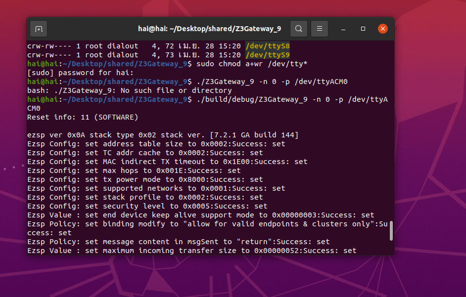

### Zigbee Device - Time Client ###

To create a Zigbee Device (time client), you can either create a project based on an example project or start with a "Zigbee - SoC ZigbeeMinimal" project based on your hardware.

### Create a Zigbee Device project based on an example project ###

1. From the Launcher Home, add your hardware to MyProducts, click on it, and click on the **EXAMPLE PROJECTS & DEMOS** tab. Find the example project with the filter "time sync".

2. Click **Create** button on the **Zigbee - Device RTC Time Synchronize** example. This example projects creation dialog pops up -> click Create and Finish and the project should be generated.
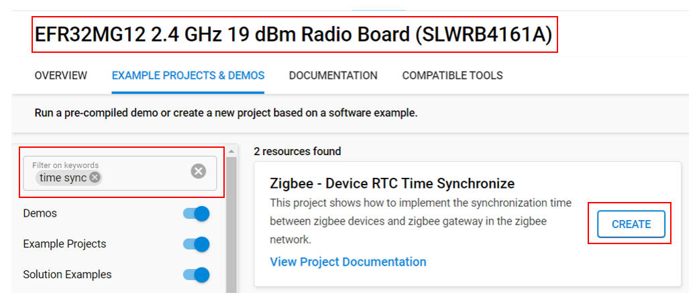

3. Build and flash this example to your boards.

### Create a Zigbee Device project with a "Zigbee - SoC ZigbeeMinimal" project ###

1. Create a **Zigbee - SoC ZigbeeMinimal** project in Simplicity Studio.

2. Copy all attached files in src folders into the project root folder (overwriting existing).
3. Open the .slcp file:
  - Select the **SOFTWARE COMPONENTS** tab and install these software components:
    - [Zigbee] → [Utility] → [Simple clock]
  - Select the **CONFIGURATION TOOLS** tab and open **Zigbee Cluster Configurator**:
    - change the device type of endpoint 1 to **Zigbee Custom → LO On/Off Light**, then enable the client side of the Time cluster.

4. Build and flash this project to your boards.

## How It Works ##

Firstly, form a centralized network with the Zigbee gateway and open the network.

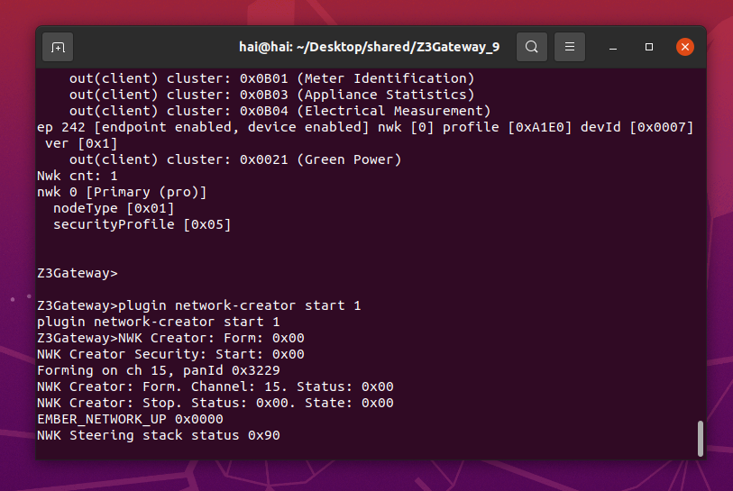
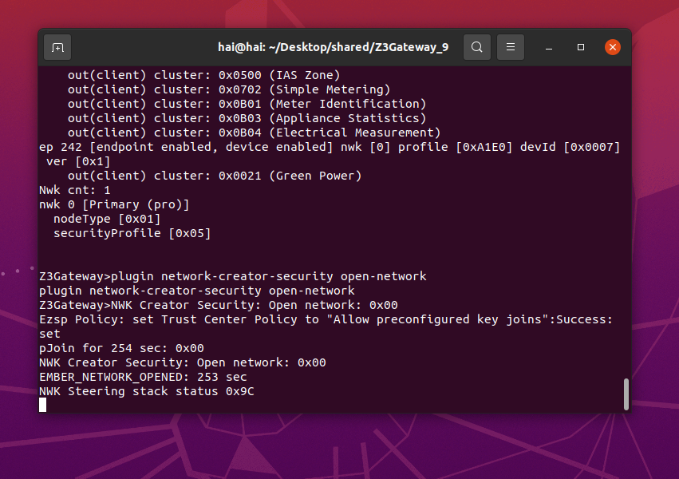

In the simplicity studio, launch console for Zigbee device

Start joining a network with a Zigbee device.

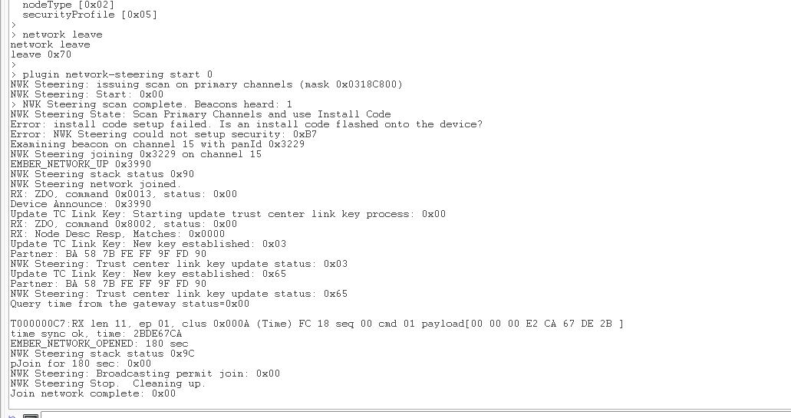

When the Zigbee device joins the network, it will query the time from the gateway after the network is up.

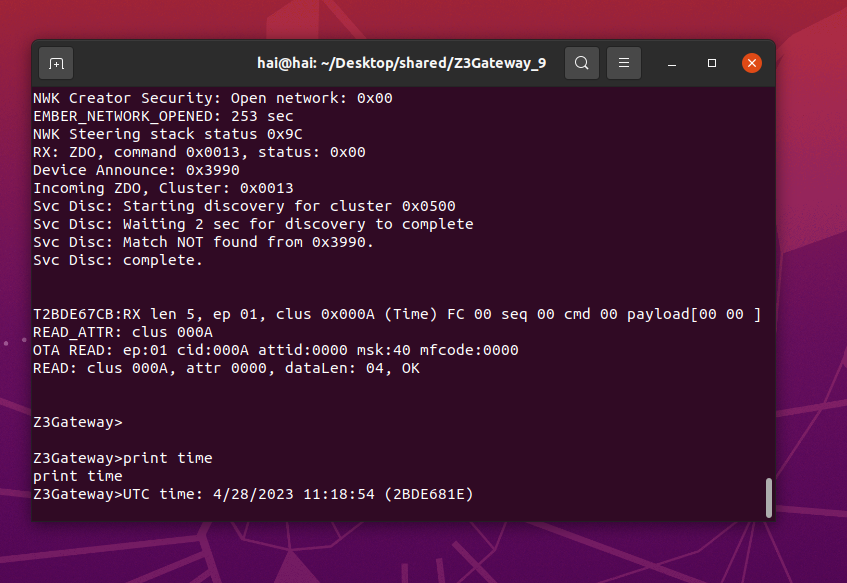

Then you can use the command **print time** to query the local time.

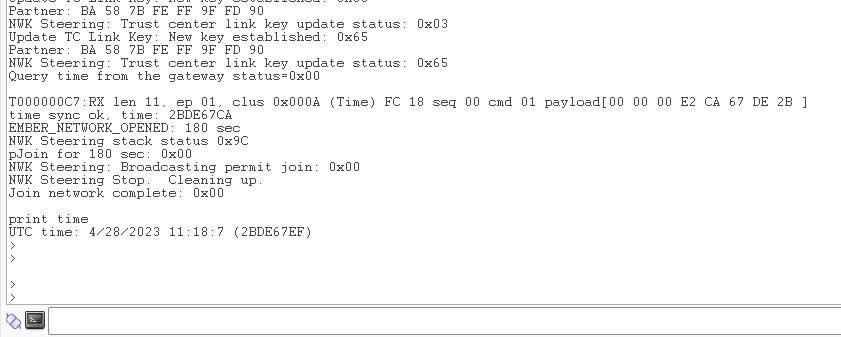
