# RHT Si7021 Zigbee Sleepy End-Device and Gateway example #

## Summary ##

This example's purpose is to showcase the EFR32xG24 Dev Kit Board RHT sensor and implement it in your Zigbee project in Simplicity Studio. The example uses 2 devices in a network, one acting as a coordinator (using a host + NCP architecture) and the other as a sleepy end-device (SoC architecture). The SED acts as an RHT sensor and periodically reports the measured values to the coordinator.

## Gecko SDK version ##

- GSDK: v4.1.3 (Simplciity Studio v5)
- Emberznet 7.1.3.0

## Hardware Required ##

- **Zigbee Coordinator (host + NCP architecture)**
  - NCP: EFR32xG24 Dev Kit (BRD2601B)
  - Host: Windows-based (Docker)
    - For details regarding setting up Docker for windows, refer to the app note:
    [AN1389: Running Zigbee Host Applications in a Docker Container](https://www.silabs.com/documents/public/application-notes/an1389-running-host-applications-in-docker-containers.pdf)
- **Zigbee SED (SoC architecture)**
  - EFR32xG24 Dev Kit (BRD2601B)

- Use of other radio boards or EFR32 development kits is possible. Modifications are required in terms of GPIO selection, **always refer to your development kit/radio board user guide for details**.

## Setup ##

You can import the provided .sls project in Simplicity folder:

- Host application
- NCP bootloader
- NCP application
- SED bootloader
- SED application

**If you want to create the projects from scratch for a different radio board or kit, follow these steps:** The relevant source code files for the custom application code of the Host and the SED RHT sensor are located in the [src](src/) folder.

### 1. Creating the projects ###

- Although the .sls project files are attached to this article, the following are the steps that you can follow to generate the host, NCP, and SED starting point project, especially useful if you're trying to replicate these instructions for a different platform:

  - Depending on the project that you're creating you'll have a different set of selections here:
    - **NCP project**
      - Create a **Zigbee - NCP ncp-uart-hw** project for the **EFR32xG24 Dev Kit (xG24-DK2601B)** using Simplicity Studio v5. Use the default project settings. Be sure to connect and select the **EFR32xG24 Dev Kit (xG24-DK2601B)** Board from the "Debug Adapters" on the left before creating a project
    - **SED project**:
      - Create a **Zigbee - SoC ZigbeeMinimal** project for the **EFR32xG24 Dev Kit (xG24-DK2601B)** using Simplicity Studio v5. Use the default project settings. Be sure to connect and select the **EFR32xG24 Dev Kit (xG24-DK2601B)** Board from the **Debug Adapters** on the left before creating a project
    - **Zigbee Gateway Host project**:
      - On the Simplicity Studio launcher add a product with name **Linux 32 Bit** from the **My Products** on the left side then create a **Zigbee - Host Gateway** project.

### 2. Configuring the projects ###

#### 2.1 Host project configuration ####

- The default cluster configuration is enough
- Select Z3Gateway.slcp and install the following component for device:
  - [Zigbee] → [Zigbee 3.0] → [Find and Bind Target]

#### 2.2 SED project configuration ####

- Select Z3Gateway.slcp and install the following components for device:
  - [Zigbee] → [Stack] → [Pro Core] → [Pro Leaf Stack] -> select option 1 (replace libaray) and uninstall [Pro Stack]
  - [Zigbee] → [Utility] → [Zigbee Device Config] and configure as Sleepy End Device
  - [Zigbee] → [Cluster Library] → [Common] -> [Identify Cluster]
  - [Zigbee] → [Cluster Library] → [Common] -> [Reporting]
  - [Zigbee] → [Utillity] → [End Device Support]
  - [Zigbee] → [Zigbee 3.0] → [Network Steering]
  - [Zigbee] → [Zigbee 3.0] → [Find and Bind Initiator]
  - [Platform] → [Driver] → [Button] → [Simple Button] → [btn0, btn1]
  - [Platform] → [Driver] → [LED] → [Simple LED] → [led0]
  - [Service] → [IO Stream] → [IO Stream: USART] → [vcom]
    - Configure **vcom** instance and disable the **"Restrict the energy mode to allow the reception."** option to ensure device can go to the EM2 mode

      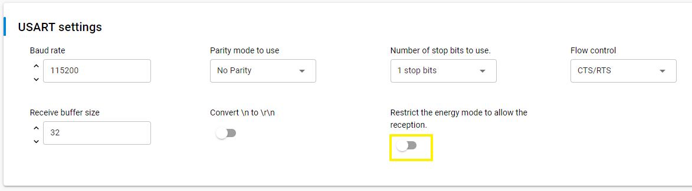
  - [Application] → [Sensor] → [Relative Humidity and Temperature sensor]

- In Cluster Configurator configure as shown below:
  - Make sure endpoint 1 has Device ID is 0xFFFF (Custom ZCL device) and Profile ID is 0x0104 (same Profile ID with the enpoint 1 of the Zigbee Gateway Host)
  - In the cluster list, extend the **General** clusters and enable the **Identify** as a **Client & Server**
  - In the cluster list, extend the **Measurement & Sensing** clusters and enable the **Temperature Measurement & Relative Humidity Measurement** clusters as a Server
  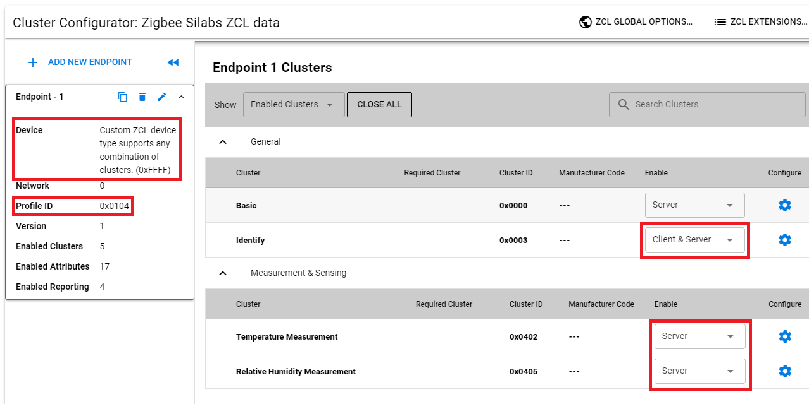

### 3. **Coding the application** ###

#### 3.1 Coding the host project ####

The Host project doesn't require any further modification either as all operations will be done through the CLI interface (See UG391 - Chapter 12). Nonetheless, the attached host project has a custom implementation of the emberAfReportAttributesCallback to format and print the received Temperature and RH data in the CLI. The following block shows the code implementation found in the **src/rht_zigbee_host_application/app.c** file:

#### 3.2 Coding the SED project ####

- The SED project will require custom code, and that is the purpose of this section of the article.

- For Zigbee applications, the underlying network operations are managed by the stack itself but custom interactions and operations should be added manually. This can be done in the **src/rht_zigbee_sed_application/app.c** file through the configurable callbacks or custom events. Further details about the available APIs in the EmberZnet framework can be consulted in docs.silabs.com (Zigbee block).

- The relevant custom code can be consulted in the file **app.c** found by importing the **rht_zigbee_sed_application.sls** attached project. Listing the implemented code blocks here would be long, still, a brief explanation for the different functions is provided:
  - **emberAfMainInitCallback**
    - Called inside the application's main function a single time before the clusters, plugin, and network initialization
    - Used to set the RHT sensor-enable signal for the Si7021 sensor
  - **leave_network_event_handler**
    - Clears the binding table and leaves the network
  - **network_steering_event_handler**
    - Called upon activation of networkSteeringEventControl, it evaluates the network status:
      - If not on a network, network steering begins to attempt to join an available network
      - If already in a network and binding has been performed already, the attributeReportEventControl is started (to send an RH and temperature attribute report), otherwise, findingAndBindingEventControl is started (to form binding with an available target)
  - **emberAfPluginNetworkSteeringCompleteCallback**
    - Called upon finalizing the network steering process, if successful it schedules the findingAndBindingEventControl to begin after a FIND_AND_BIND_DELAY_MS delay
  - **finding_and_binding_event_handler**
    - Called upon activation of findingAndBindingEventControl, it begins a "find an bind" initiator routine through the emberAfPluginFindAndBindInitiatorStart API
  - **emberAfPluginFindAndBindInitiatorCompleteCallback**
    - Called upon finalizing the "find and bind" process and evaluates if it was successful or not
  - **attribute_report_event_handler**
    - Called upon activation of attributeReportEventControl, it forces the SED to send a report to the coordinator through its binding table of the RH measured value and Temperature measured value attributes using a custom function: reportAttribute
  - **reportAttribute**
    - Used to report an attribute from a specified cluster. It retrieves the current attribute value (emberAfReadServerAttribute), fills a ZCL Global report attributes buffer (emberAfFillCommandGlobalServerToClientReportAttributes) and sends the report as a unicast through the binding table (emberAfSendCommandUnicastToBindings)

### 4. Compiling, flashing, and testing the applications ###

#### 4.1 Compiling the applications ####

Whether you're importing the attached .sls files or creating your host, NCP, and SED applications following the instructions before, the first step for testing the applications is building them. Building the SED and NCP application can be done in Simplicity Studio using the "Compile" hammer icon.

  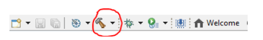

- The host application, it should be built on a Docker, for details regarding Docker for windows, refer to the app note:
[AN1389: Running Zigbee Host Applications in a Docker Container](https://www.silabs.com/documents/public/application-notes/an1389-running-host-applications-in-docker-containers.pdf)

#### 4.2 Flashing the applications ####

- After successfully building the applications we need to flash the NCP and the SED application to their corresponding devices, in this case:
  - NCP application - (BRD2601B)
  - SED application - (BRD2601B)

- Follow these steps to flash your applications:

  - Right-click on the .s37/.hex output file and select "Flash to device..."
  - This opens the "Flash programmer" window
  - Click on the "Advanced Setting..." option
  - In the pop-up window select the "Page Erase" option and click the "OK" button
    - This ensures that upon flashing the application only the pages to be programmed are erased, this is necessary to avoid unintendedly erasing the bootloader that is located in the main flash for Series 2 devices
  - Back in the "Flash programmer" window press the "Program" button

    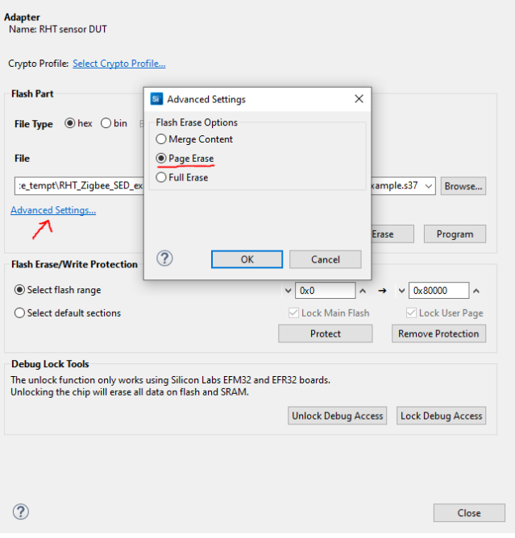

#### 4.3 Testing the application ####

##### 4.3.1 Network formation #####

First, we form a centralized network on the coordinator, details regarding Z3 network formation can be found in the following [KBA](https://community.silabs.com/s/article/how-to-form-zigbee-3-0-network-with-emberznet-stack-x?language=en_US). The following command can be used in the Docker command line:

> plugin network-creator start 1

After formation, you can use the info command to see the details of the network (EUI64, panID, nodeID, extended panID...) and the NCP endpoint configurations. The following image shows an example of the expected output for both commands:

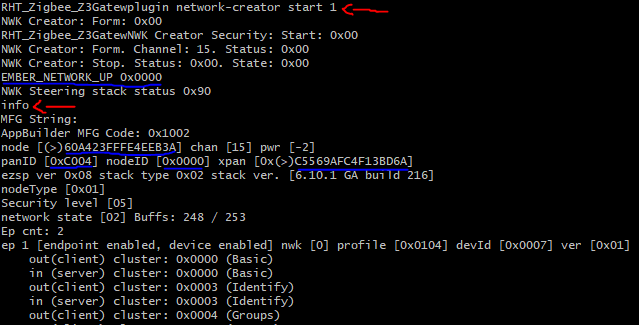

Now we need to open the network for other devices to join, we use the following command:

> plugin network-creator-security open-network

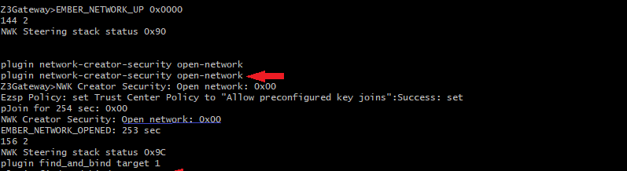

The network will automatically close after 180 seconds. Now we need to allow our coordinator to act as a "find and bind" target. This way our SED will add a binding entry to its table immediately. We use the following command:

> plugin find_and_bind target 1

##### 4.3.2. Joining the SED and observing reported measurements #####

Lastly, press button 0 in the WSTK of the SED, this will trigger the network steering process of the device allowing it to join the coordinator's network, identify the coordinator as a "find and bind" target and create a new binding entry in its binding table which as mentioned before is a requirement for the "Reporting" plugin. From this point onwards the SED sends a report to the coordinator for the measured Temperature and RH values from the sensor. The coordinators' application will parse the received payload and print the Temperature and RH values in the right format, this can be seen in the function emberAfReportAttributesCallback. The following picture shows the expected CLI output log from the host and SED:

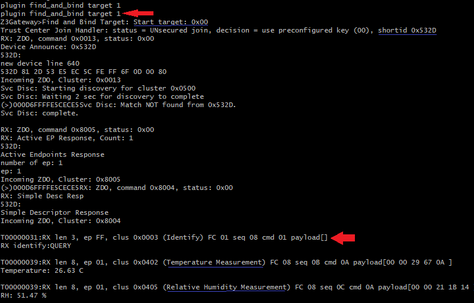

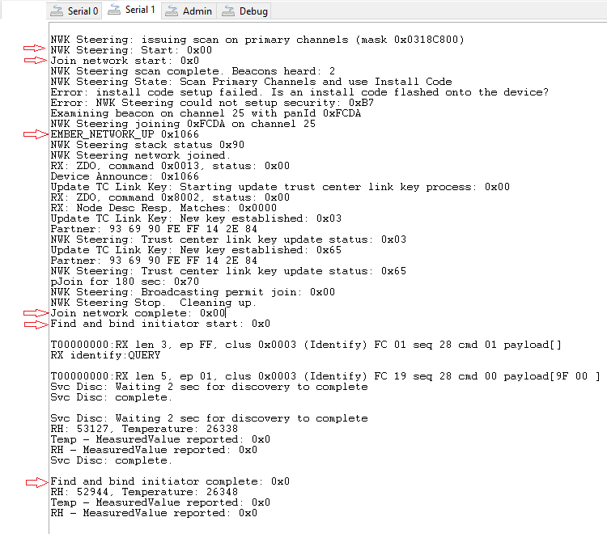

As mentioned before, the SED can report the RH and Temperature values on command by pressing Button 0 after joining and establishing bindings. You should get a similar output on the SED side:

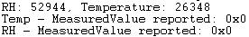

On the host side, the received messages output log will be the same as when the SED sends a scheduled report.

##### 4.3.3 Using network analyzer to see reported values #####

Simplicity Studio offers a tool called "Network Analyzer" that allows displaying the OTA (Over the Air) messages. This is an extremely useful tool enabled by our WSTKs to inspect the network and understand what is happening in terms of data sent between devices, especially when tracking the network status through CLI messages becomes cumbersome.

To set up a Network Analyzer capture follow these steps:

- Press button 1 on the SED WSTK so that the SED leaves the network
  - Only needed if you want to observe the OTA association and binding process, otherwise skip this step.

  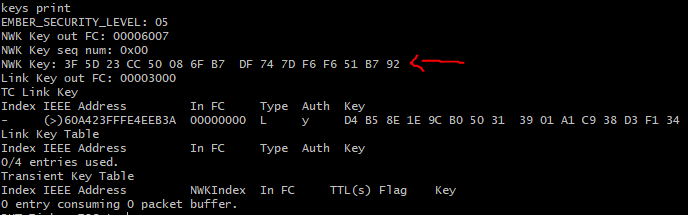

- In the Docker command line, type the command keys print and copy the network key (NWK Key)
  - We need to provide this key to the Network Analyzer so that it can decrypt the OTA messages
  - Make sure that you have already created the network on the coordinator as a new key is selected during network formation
Keys print command output

- In Simplicity Studio navigate to "Windows/Preferences", this opens the Preferences window
- Search for the items "Security Keys" (Located in "Network Analyzer/Decoding") and click on it
  - Here we can add new network keys to be used for decryption
- Press the "New" button, paste the previously copied network key and press the "Apply and close" button

  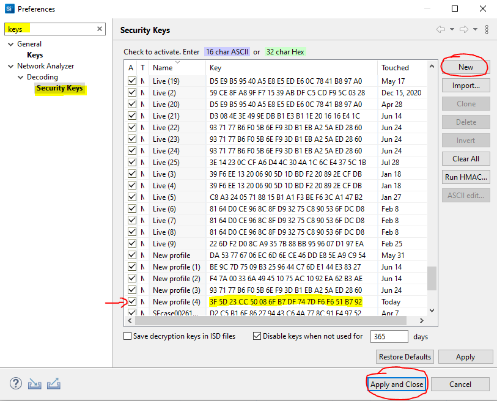

- Under the debug adapters window locate your NCP device, right-click on it and select "Connect"
- Right-click again and select "Start Capture", this will open the "Network Analyzer" perspective.
  - You'll see a red dot that represents the coordinator device (As we're performing the capture from the NCP perspective)
- If your SED is NOT part of the network then repeat the steps from sections 4.3.1 and 4.3.2 Start by opening the network, formation is no longer required on the Host side. You should see all the association messages and the joining process of the SED into the coordinator's network

- After the first attribute report, you'll find in the "Transactions" window, an entry called ZCL: ReportAttributes, which corresponds to the automatic reports.
  - The image below shows the expected Network Analyzer output for the association process and the first attributes report message

  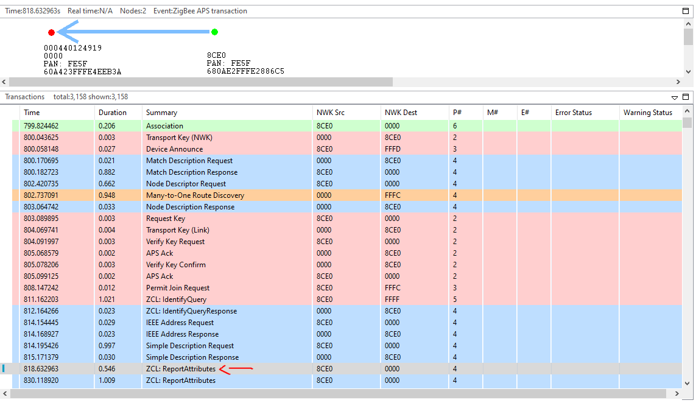

- Click on it and on the right pane you'll find a section called "Event Details" that describes the contents of the payload
  - The payload is subdivided in multiple groups. For this specific case the relevant components that we should focus can be seen in the figure below:

  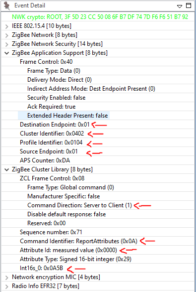

The image above highlights contents from 2 main groups ZigBee Application Support and ZigBee Cluster Library, in the first one we see information relevant to the device sending the attributes report and its destination including the source and target endpoint, the reporting device profile ID, and the cluster been used for communication (0x0402 - Temperature Measurement). In the second group, we see information specific to the ZCL message sent, in this case, a report attributes command, as well as its direction (server to client), the attribute been reported (0x0000 - "measured value") and the actual value reported as a 16 bit signed integer.

For further details regarding the ZCL itself, the commands supported and details regarding the different clusters please consult the [ZCL specification](https://zigbeealliance.org/wp-content/uploads/2019/12/07-5123-06-zigbee-cluster-library-specification.pdf) from the Connectivity Standards Alliance (CSA, previously known as ZigBee Alliance).

## How It Works ##

This example makes use of the Relative Humidity Measurement and Temperature Measurement ZCL clusters, through them the SED is capable of reporting to the coordinator of the network the updated RH and Temperature measurements. The host is also capable of reading this value directly from the sensor on demand.

On a lower level, the SED application communicates with the WSTK Si7021 RHT sensor and requests the RH and temperature values at a configurable interval. Once a new value is acquired the `humidity/temperature measured value` attributes are updated, also this value is cross-checked against the `humidity/temperature min/max measured value` to determine if they should be updated as well. The application is also capable of reporting these changes provided that a valid binding entry was created. All of this is achieved through the Appbuilder plugins namely:

- **I2C driver**
  - Low-level I2C communication for the RHT sensor.
- **Temperature Si70221**
  - Middleware driver for the RHT sensor with specific functions to retrieve temperature data.
- **Relative Humidity Si7021**
  - Middleware driver for the RHT sensor with specific functions to retrieve relative humidity data.
- **Relative Humidity Measurement Server Cluster**
  - ZCL implementation of the Relative Humidity Measurement Server Cluster.
- **Temperature Measurement Server Cluster**
  - ZCL implementation of the Temperature Measurement Server Cluster.
- **Reporting**:
  - Manages report sending when a ZCL attribute changes leveraging the binding table entries.

The SED implements a series of custom events to manage the WSTK button functionalities, network joining, finding and binding and, attribute reporting on-demand. These functionalities are implemented using the EmberZnet APIs and the details can be seen in the file: `rht_zigbee_sed_application_callbacks.c`. Regarding the WSTK buttons these are their functionalities:

- **Button 0**
  - When not part of a network it allows the device to perform network steering a join na available network.
  - When part of a network it forces a temperature and RH attributes report.
- **Button 1**
  - Used to leave the current network.

The host implements a custom reporting callback that formats the received temperature and RH attribute reports for easier reading while testing as seen in the file: `rht_zigbee_host_application_callbacks.c`

## .sls Projects Used ##

Project | Use
-|-|
[rht_zigbee_host_application.sls](SimplicityStudio/rht_zigbee_host_application.sls) | Host application
[rht_zigbee_ncp_bootloader.sls](SimplicityStudio/rht_zigbee_ncp_bootloader.sls) | BRD4181B NCP internal storage bootloader
[rht_zigbee_ncp_application.sls](SimplicityStudio/rht_zigbee_ncp_application.sls) | BRD4181B NCP application (UART SW flow control)
[rht_zigbee_sed_bootloader.sls](SimplicityStudio/rht_zigbee_sed_bootloader.sls)  | BRD4182A SED RHT sensor internal storage bootloader
[rht_zigbee_sed_application.sls](SimplicityStudio/rht_zigbee_sed_application.sls)  | BRD4182A SED RHT sensor application

## Special Notes ##

For in-depth details about the project structure, configuration, and testing, it's highly recommended that you refer to the following Community KBAs:

- [Evaluating the Si7021 RHT sensor - Main KBA][RHT_SENSOR_MAIN_KBA_LINK]
- [Evaluating the Si7021 RHT sensor - Zigbee sleepy end-device example][RHT_SENSOR_ZIGBEE_KBA_LINK]

[RHT_SENSOR_ZIGBEE_KBA_LINK]:https://community.silabs.com/s/article/Evaluating-the-Si7021-RHT-sensor-Zigbee-sleepy-end-device-example-Part-1?language=en_US
[RHT_SENSOR_MAIN_KBA_LINK]:https://community.silabs.com/s/article/Evaluating-the-Si7021-RHT-sensor-Main-KBA?language=en_US
