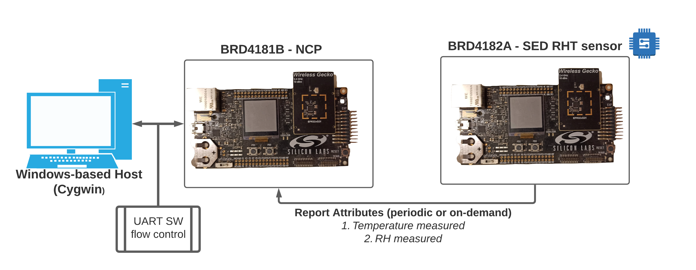

# RHT Si7021 Zigbee Sleepy End-Device and Gateway example #

## Summary ##

This example's purpose is to showcase the Wireless Starter Kit (WSTK) Si7021 RHT sensor and implement it in your Zigbee project using Appbuilder and its plugins in Simplicity Studio. The example uses 2 devices in a network, one acting as a coordinator (using a host + NCP architecture) and the other as a sleepy end-device (SoC architecture). The SED acts as an RHT sensor and periodically reports the measured values to the coordinator.

## Gecko SDK version ##

- GSDK: v3.2.x (Simplciity Studio v5)
- Emberznet 6.10.3

> This example was tested on the version above, porting to other versions of GSDK 3.x of even GSDK 2.x should be similar

## Hardware Required ##

- **Zigbee Coordinator (host + NCP architecture)**
  - NCP: BRD4181B (EFR32MG21) + WSTK mainboard
  - Host: Windows-based (Cygwin)
    - For details regarding setting up Cygwin for windows, refer to the following community [Knowledge-Based Article (KBA)][KBA_CYGWIN_MESH_LINK]
- **Zigbee SED (SoC architecture)**
  - BRD4182A (EFR32MG22) + WSTK mainboard

> Use of other radio boards or EFR32 development kits is possible. Modifications are required in terms of GPIO selection, **always refer to your development kit/radio board user guide for details**.

## Setup ##

If you're using this project with the hardware listed in the previous section, is enough to import the included [.sls](SimplicityStudio/rht_si7021_baremetal.sls) files into Simplicity Studio v5 (for details, see the [following site][SSV5_IMPORT_LINK]), build the projects, and flash them to your NCP and SED board and build the host application in Cygwin. The projects included are:

- Host application
- NCP bootloader
- NCP application
- SED bootloader
- SED application

**If you want to create the projects from scratch for a different radio board or kit, refer to the following [community KBA][RHT_SENSOR_ZIGBEE_KBA_LINK], it covers in detail the steps to recreate the projects, the custom code to be used, and steps for testing.** The relevant source code files for the custom application code of the Host and the SED RHT sensor are located in the [src](src/) folder.

## How It Works ##

This example makes use of the Relative Humidity Measurement and Temperature Measurement ZCL clusters, through them the SED is capable of reporting to the coordinator of the network the updated RH and Temperature measurements. The host is also capable of reading this value directly from the sensor on demand.

On a lower level, the SED application communicates with the WSTK Si7021 RHT sensor and requests the RH and temperature values at a configurable interval. Once a new value is acquired the `humidity/temperature measured value` attributes are updated, also this value is cross-checked against the `humidity/temperature min/max measured value` to determine if they should be updated as well. The application is also capable of reporting these changes provided that a valid binding entry was created. All of this is achieved through the Appbuilder plugins namely:

- **I2C driver**
  - Low-level I2C communication for the RHT sensor.
- **Temperature Si70221**
  - Middleware driver for the RHT sensor with specific functions to retrieve temperature data.
- **Relative Humidity Si7021**
  - Middleware driver for the RHT sensor with specific functions to retrieve relative humidity data.
- **Relative Humidity Measurement Server Cluster**
  - ZCL implementation of the Relative Humidity Measurement Server Cluster.
- **Temperature Measurement Server Cluster**
  - ZCL implementation of the Temperature Measurement Server Cluster.
- **Reporting**:
  - Manages report sending when a ZCL attribute changes leveraging the binding table entries.

The SED implements a series of custom events to manage the WSTK button functionalities, network joining, finding and binding and, attribute reporting on-demand. These functionalities are implemented using the EmberZnet APIs and the details can be seen in the file: `rht_zigbee_sed_application_callbacks.c`. Regarding the WSTK buttons these are their functionalities:

- **Button 0**
  - When not part of a network it allows the device to perform network steering a join na available network.
  - When part of a network it forces a temperature and RH attributes report.
- **Button 1**
  - Used to leave the current network.

The host implements a custom reporting callback that formats the received temperature and RH attribute reports for easier reading while testing as seen in the file: `rht_zigbee_host_application_callbacks.c`

## .sls Projects Used ##

Project | Use
-|-|
[rht_zigbee_host_application.sls](SimplicityStudio/rht_zigbee_host_application.sls) | Host application
[rht_zigbee_ncp_bootloader.sls](SimplicityStudio/rht_zigbee_ncp_bootloader.sls) | BRD4181B NCP internal storage bootloader
[rht_zigbee_ncp_application.sls](SimplicityStudio/rht_zigbee_ncp_application.sls) | BRD4181B NCP application (UART SW flow control)
[rht_zigbee_sed_bootloader.sls](SimplicityStudio/rht_zigbee_sed_bootloader.sls)  | BRD4182A SED RHT sensor internal storage bootloader
[rht_zigbee_sed_application.sls](SimplicityStudio/rht_zigbee_sed_application.sls)  | BRD4182A SED RHT sensor application

## Special Notes ##

For in-depth details about the project structure, configuration, and testing, it's highly recommended that you refer to the following Community KBAs:

- [Evaluating the Si7021 RHT sensor - Main KBA][RHT_SENSOR_MAIN_KBA_LINK]
- [Evaluating the Si7021 RHT sensor - Zigbee sleepy end-device example][RHT_SENSOR_ZIGBEE_KBA_LINK]

[KBA_CYGWIN_MESH_LINK]:https://community.silabs.com/s/article/setting-up-cygwin-for-mesh-development?language=en_US
[SSV5_IMPORT_LINK]:https://docs.silabs.com/simplicity-studio-5-users-guide/latest/ss-5-users-guide-about-the-simplicity-ide/import-and-export
[RHT_SENSOR_ZIGBEE_KBA_LINK]:https://community.silabs.com/s/article/Evaluating-the-Si7021-RHT-sensor-Zigbee-sleepy-end-device-example-Part-1?language=en_US
[RHT_SENSOR_MAIN_KBA_LINK]:https://community.silabs.com/s/article/Evaluating-the-Si7021-RHT-sensor-Main-KBA?language=en_US
