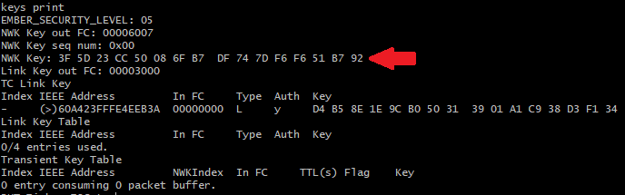

# Zigbee - RHT Si7021 Sleepy End-Device and Gateway #

## Description ##

This example's purpose is to showcase the EFR32xG24 Dev Kit Board RHT sensor and implement it in your Zigbee project in Simplicity Studio. The example uses 2 devices in a network, one acting as a coordinator (using a host + NCP architecture) and the other as a sleepy end-device (SoC architecture). The SED acts as an RHT sensor and periodically reports the measured values to the coordinator.

## Gecko SDK version ##

- GSDK v4.4.0

## Hardware Required ##

- **Zigbee Coordinator (host + NCP architecture)**

  - NCP: EFR32xG24 Dev Kit (BRD2601B).

  - Host: Windows-based (Docker).

    - For details regarding setting up Docker for Windows, refer to the app note:
    [AN1389: Running Zigbee Host Applications in a Docker Container](https://www.silabs.com/documents/public/application-notes/an1389-running-host-applications-in-docker-containers.pdf)

- **Zigbee SED (SoC architecture)**

  - EFR32xG24 Dev Kit (BRD2601B).

- Use of other radio boards or EFR32 development kits are possible. Modifications are required in terms of GPIO selection, **always refer to your development kit/radio board user guide for details**.

## Connections Required ##

The following picture shows the system view of how it works.

## Setup ##

To test this application, you can either create a project based on example projects.

### Create a project based on an extension example project ###

#### RHT Si7021 Sleepy End-Device ####

1. From the Launcher Home, add your hardware to **My Products**, click on it, and click on the **EXAMPLE PROJECTS & DEMOS** tab. Find the example project with the filter **"rht si7021"**.

2. Click Create button on the **Zigbee - RHT Si7021 Sleepy End-Device** example. Example project creation dialog pops up -> click Create and Finish and Project should be generated.

3. Build and flash this example to the board.

#### RHT Si7021 Host Gateway ####

1. From the Launcher Home, add **Linux 32 Bit** to **My Products**, click on it, and click on the **EXAMPLE PROJECTS & DEMOS** tab. Find the example project with the filter **"rht si7021"**.

2. Click Create button on the **Zigbee - RHT Si7021 Host Gateway** example. Example project creation dialog pops up -> click Create and Finish and Project should be generated.

3. To build and run this application, we will talk in a later section.

### Start with a basic example project ###

#### RHT Si7021 Sleepy End-Device ####

1. Create a **Zigbee - SoC Switch** project for your hardware using Simplicity Studio 5.

2. Copy all attached files in src folders into the project root folder (overwriting existing).

3. Copy **zcl_config.zap** in [this](config/zcl/rht_zigbee_sed_application) folder into the **config** folder in the project.

4. Open the .slcp file. Select the SOFTWARE COMPONENTS tab and change some features in the software components:

  - [Zigbee] → [Stack] → [Pro Core] → [Pro Leaf Stack] -> select option 1 (replace library) and uninstall [Pro Stack]
  - [Zigbee] → [Utility] → [Zigbee Device Config] and configure as Sleepy End Device
  
  - [Zigbee] → [Cluster Library] → [Common] -> [Identify Cluster]

  - [Zigbee] → [Cluster Library] → [Common] -> [Reporting]

  - [Zigbee] → [Utility] → [End Device Support]

  - [Zigbee] → [Zigbee 3.0] → [Network Steering]

  - [Zigbee] → [Zigbee 3.0] → [Find and Bind Initiator]

  - [Platform] → [Driver] → [Button] → [Simple Button] → [btn0, btn1]

  - [Platform] → [Driver] → [LED] → [Simple LED] → [led0]

  - [Service] → [IO Stream] → [IO Stream: USART] → [vcom]

    - Configure the **vcom** instance and disable the **"Restrict the energy mode to allow the reception."** option to ensure the device can go to the EM2 mode

        

  - [Application] → [Sensor] → [Relative Humidity and Temperature sensor]

#### RHT Si7021 Host Gateway ####

1. Create a **Zigbee - Host Gateway** project for your hardware using Simplicity Studio 5.

2. Copy all attached files in src folders into the project root folder (overwriting existing).

3. Copy **zcl_config.zap** in [this](config/zcl/rht_zigbee_host_application) folder into the **config** folder in the project.

4. Open the .slcp file. Select the SOFTWARE COMPONENTS tab and change some features in the software components:
    - [Zigbee] → [Zigbee 3.0] → [Find and Bind Target]

5. To build and run this application, we will talk in the next section.

#### NCP project ####

1. Create a **Zigbee - NCP ncp-uart-hw** project for the **EFR32xG24 Dev Kit (xG24-DK2601B)** using Simplicity Studio v5. Use the default project settings. Be sure to connect and select the **EFR32xG24 Dev Kit (xG24-DK2601B) Board** from the "My Products" on the left before creating a project.

**Note:**

- You need to create the bootloader project and flash it to the device before flashing the application. When flash the application image to the device, use the .hex or .s37 output file. Flashing the .bin files may overwrite (erase) the bootloader.

### Build and run the Host Gateway application ###

1. Before running the Host Gateway application, you have to install and config Silink, feel free to refer to section 2 in [AN1389: Running Zigbee Host Applications in a Docker Container](https://www.silabs.com/documents/public/application-notes/an1389-running-host-applications-in-docker-containers.pdf) document.

1. To setup Docker on Windows, refer to [this link](https://docs.docker.com/desktop/install/windows-install/)

2. In the root **RHT Si7021 Host Gateway** project directory, you need to create a new file and name it **Dockerfile** without any extension or suffix. And add the following commands:

        FROM gcc
        RUN apt-get update && apt-get -y install gcc-multilib socat
        RUN echo "socat -d TCP:host.docker.internal:4901 pty,raw,echo=0,link=/dev/ttySilink &" >> ~/.bashrc
        COPY . /usr/src/rht_zigbee_host_application
        WORKDIR /usr/src/rht_zigbee_host_application
        RUN make -f rht_zigbee_host_application.Makefile

    

3. Run the following commands on the console inside the project folder to build and start the container.

        docker build . -t rht_zigbee_host
        docker run -it rht_zigbee_host
        ./build/debug/rht_zigbee_host_application -n 0 -p /dev/ttySilink

    The following figure shows the desired output of these commands:

    

## How It Works ##

This example makes use of the Relative Humidity Measurement and Temperature Measurement ZCL clusters, through them the SED is capable of reporting to the coordinator of the network the updated RH and Temperature measurements. The host is also capable of reading this value directly from the sensor on demand.

On a lower level, the SED application communicates with the WSTK Si7021 RHT sensor and requests the RH and temperature values at a configurable interval. Once a new value is acquired the `humidity/temperature measured value` attributes are updated, also this value is cross-checked against the `humidity/temperature min/max measured value` to determine if they should be updated as well. The application is also capable of reporting these changes provided that a valid binding entry was created. All of this is achieved through the Appbuilder plugins namely:

- **I2C driver**
  - Low-level I2C communication for the RHT sensor.
- **Temperature Si70221**
  - Middleware driver for the RHT sensor with specific functions to retrieve temperature data.
- **Relative Humidity Si7021**
  - Middleware driver for the RHT sensor with specific functions to retrieve relative humidity data.
- **Relative Humidity Measurement Server Cluster**
  - ZCL implementation of the Relative Humidity Measurement Server Cluster.
- **Temperature Measurement Server Cluster**
  - ZCL implementation of the Temperature Measurement Server Cluster.
- **Reporting**:
  - Manages report sending when a ZCL attribute changes leveraging the binding table entries.

The SED implements a series of custom events to manage the WSTK button functionalities, network joining, finding and binding and, attribute reporting on demand. Regarding the WSTK buttons, these are their functionalities:

- **Button 0**
  - When not part of a network it allows the device to perform network steering a join an available network.
  - When part of a network it forces a temperature and RH attributes report.
- **Button 1**
  - Used to leave the current network.

## Testing the application ##

### Network formation ###

First, we form a centralized network on the coordinator, details regarding Z3 network formation can be found in the following [KBA](https://community.silabs.com/s/article/how-to-form-zigbee-3-0-network-with-emberznet-stack-x?language=en_US). The following command can be used in the Docker command line:

    plugin network-creator start 1

After formation, you can use the info command to see the details of the network (EUI64, panID, nodeID, extended panID...) and the NCP endpoint configurations. The following image shows an example of the expected output for both commands:

Now we need to open the network for other devices to join, we use the following command:

    plugin network-creator-security open-network

The network will automatically close after 180 seconds. Now we need to allow our coordinator to act as a "find and bind" target. This way our SED will add a binding entry to its table immediately. We use the following command:

    plugin find_and_bind target 1

### Joining the SED and observing reported measurements ###

Lastly, press button 0 in the WSTK of the SED, this will trigger the network steering process of the device allowing it to join the coordinator's network, identify the coordinator as a "find and bind" target and create a new binding entry in its binding table which as mentioned before is a requirement for the "Reporting" plugin. From this point onwards the SED sends a report to the coordinator for the measured Temperature and RH values from the sensor. The coordinators' application will parse the received payload and print the Temperature and RH values in the right format, this can be seen in the function emberAfReportAttributesCallback. The following picture shows the expected CLI output log from the host and SED:

As mentioned before, the SED can report the RH and Temperature values on command by pressing Button 0 after joining and establishing bindings. You should get a similar output on the SED side:

On the host side, the received messages output log will be the same as when the SED sends a scheduled report.

### Using Network analyzer to see reported values ###

Simplicity Studio offers a tool called "Network Analyzer" that allows displaying the OTA (Over the Air) messages. This is an extremely useful tool enabled by our WSTKs to inspect the network and understand what is happening in terms of data sent between devices, especially when tracking the network status through CLI messages becomes cumbersome.

To set up a Network Analyzer capture follow these steps:

- Press button 1 on the SED WSTK so that the SED leaves the network
  - Only needed if you want to observe the OTA association and binding process, otherwise skip this step.

  

- In the Docker command line, type the command keys print and copy the network key (NWK Key)
  - We need to provide this key to the Network Analyzer so that it can decrypt the OTA messages
  - Make sure that you have already created the network on the coordinator as a new key is selected during network formation
Keys print command output

- In Simplicity Studio navigate to "Windows/Preferences", this opens the Preferences window
- Search for the item "Security Keys" (Located in "Network Analyzer/Decoding") and click on it
  - Here we can add new network keys to be used for decryption
- Press the "New" button, paste the previously copied network key and press the "Apply and close" button

  

- Under the debug adapters window locate your NCP device, right-click on it and select "Connect"
- Right-click again and select "Start Capture", this will open the "Network Analyzer" perspective.
  - You'll see a red dot that represents the coordinator device (As we're performing the capture from the NCP perspective)
- If your SED is NOT part of the network then repeat the steps from sections 4.3.1 and 4.3.2 Start by opening the network, formation is no longer required on the Host side. You should see all the association messages and the joining process of the SED in the coordinator's network

- After the first attribute report, you'll find in the "Transactions" window, an entry called ZCL: ReportAttributes, which corresponds to the automatic reports.
  - The image below shows the expected Network Analyzer output for the association process and the first attributes report message.
  

- Click on it and in the right pane you'll find a section called "Event Details" that describes the contents of the payload
  - The payload is subdivided into multiple groups. For this specific case the relevant components that we should focus on can be seen in the figure below:

  

The image above highlights contents from 2 main groups ZigBee Application Support and ZigBee Cluster Library, in the first one we see information relevant to the device sending the attributes report and its destination including the source and target endpoint, the reporting device profile ID, and the cluster been used for communication (0x0402 - Temperature Measurement). In the second group, we see information specific to the ZCL message sent, in this case, a report attributes command, as well as its direction (server to client), the attribute has been reported (0x0000 - "measured value") and the actual value reported as a 16 bit signed integer.

For further details regarding the ZCL itself, the commands supported and details regarding the different clusters please consult the [ZCL specification](https://zigbeealliance.org/wp-content/uploads/2019/12/07-5123-06-zigbee-cluster-library-specification.pdf) from the Connectivity Standards Alliance (CSA, previously known as ZigBee Alliance).