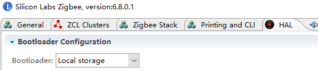
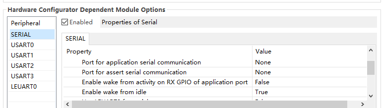
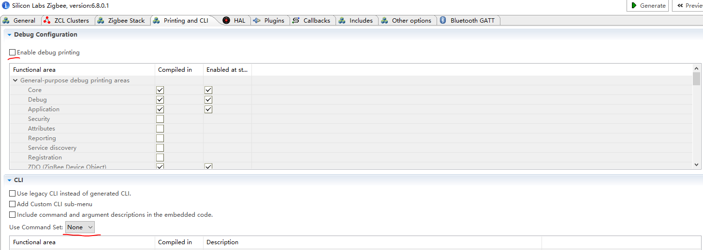
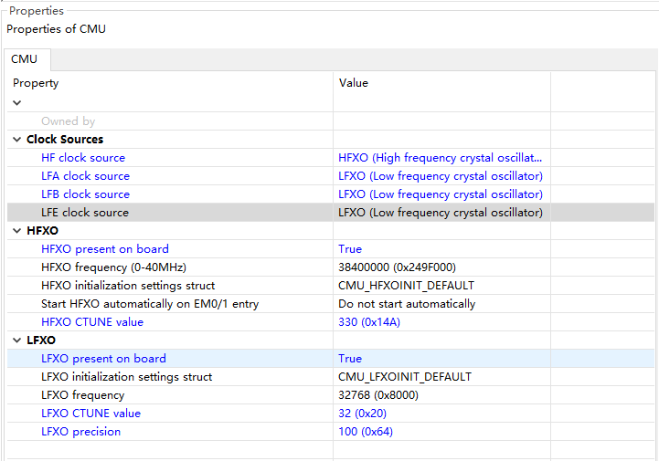
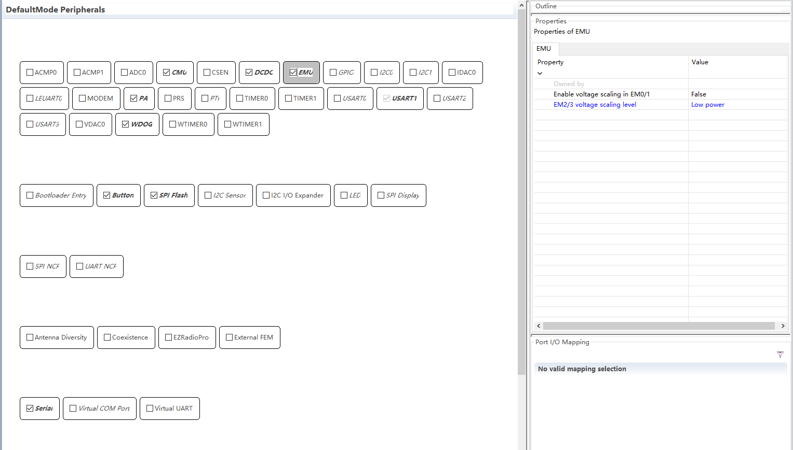
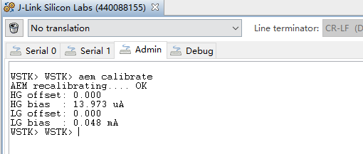
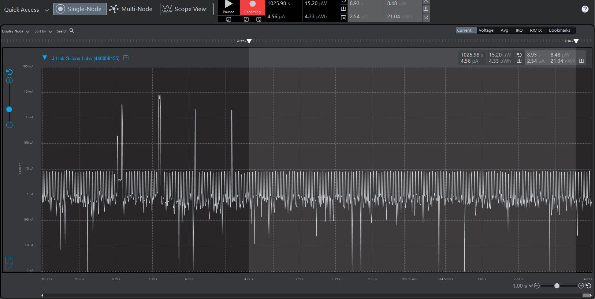

# Optimization on EM2 Current Consumption of the Sleepy Z3Swtich Example Project #

## Summary ##

A concrete guide to build a sleepy end device from the Z3Switch example project on radio board EFR32MG12 is provided in this article. Sample test results on EM2 current and essential troubleshooting approaches are included.

## Gecko SDK version ##

Gecko SDK Suite 3.0.

## Hardware Required ##

* Wireless Starter Kit Main Board (BRD4001)
* EFR32xG22 2.4GHz 10 dBm Radio Board (BRD4162A Rev A01)

## Connections Required ##

NA

## Setup ##

### Setup a Sleepy Z3Switch sample based on the BRD4162A  
1. Generate a Z3SwitchSoc sample for BRD4162A.
2. Change the device type to Sleepy end device.
3. Enable the EEPROM POWERDOWN Plugin to power down the external flash 
4. Select the Local storage bootloader. otherwise the code used to power down the external flash will not take effect.  
  
5. Disable the uart print funtion
    1. Set the "Port for application serial communication " to None, and disable the USART0.  
      
    2. Disable the "Enable Command Line For Legacy CLI" in ZCL Framework Core Plugin  
    3. Disable the "debug print" and "Command Set".  
      
6. Peripherals configuration
    1. Configurate the CMU,choose the LFXO as the LFA/B/E clock source.  
    
    2. Enable the DCDC, set the "Bypass DCDC" to False  
    3. Enable the EMU and set the "EM2/3 voltage scaling level" to Low Power
    4. Enable the SPI Flash, otherwise you will see the compile error after enabling EEPROM POWERDOWN Plugin.
    5. And then disable all of the unused Peripherals.  
      
7. Enable the Main Init callback in Callbacks Tab, and calling EMU_PeripheralRetention(emuPeripheralRetention_ALL, false); to enable "allow power down of the peripherals during EM2".  
For more information about the EM23 Peripheral Retention Disable, please refer to EFR32MG12 Reference Manual, Chapter 10.3.10 EM23 Peripheral Retention Disable.  
void emberAfMainInitCallback(void)  
{  
  EMU_PeripheralRetention(emuPeripheralRetention_ALL, false);  
}  
8. Generate the project and build.  

## How It Works ##

Energy Profiler is used to implement the EM2 current test. In accordance with "AEM Accuracy and Performance" section from [UG172](https://www.silabs.com/documents/public/user-guides/ug172-brd4320a-user-guide.pdf), when measuring currents below 250 uA, the accuracy is 1 uA. For more precise results, it is necessary to measure the current using a high-accuracy DC analyzer.  
Before current measurement, it is recommended to let the switch join a centralized network and pair with a light, further more, use command "aem calibrate" to run AEM calibration first.  
  
The screenshot below contains an event that an ON command was sent to the light. Currently the EM2 current of the switch is about 2.54 uA.  
  

## .sls Projects Used ##

* zigbee_sed_z3switch_mg12.sls

## How to Port to Another Part ##

* Import the .sls file into Simplicity Studio
* Open the .isc file of each project, turn to "General" tab, hit button "Edit Architecture", then select the board and part.

## Special Notes ##

1. Thanks to a technical bug of Simplicity Studio version 5.0.0.0, the current measured may stay at about 90 uA. In such situation, a re-flash of the .s37 firmware before a reset is needed to recover. This issue is expected to be fixed upon future releases, please refer to UID 519744 in future release notes.  
2. The EM2 current may stay at about 3 mA after flashing the firmware, keep capturing and slide the power source to BAT then back to AEM on the bottom left of the main board.   

