# Optimization on EM2 Current Consumption of the Sleepy Z3Swtich Example Project #


## Summary ##

A concrete guide to build a sleepy end device from the Z3Switch example project on radio board EFR32xG22 is provided in this article. Sample test results on EM2 current and essential troubleshooting approaches are included.  

## Gecko SDK version ##

Gecko SDK Suite 3.0.

## Hardware Required ##

* Wireless Starter Kit Main Board (BRD4001)
* EFR32xG22 2.4GHz 6 dBm Radio Board (BRD4182A Rev B03)

## Connections Required ##

NA

## Setup ##

### Build a Z3Switch Project  
1. Create a "Z3Switch" example for EFR32xG22 (BRD4182A Rev 03).  
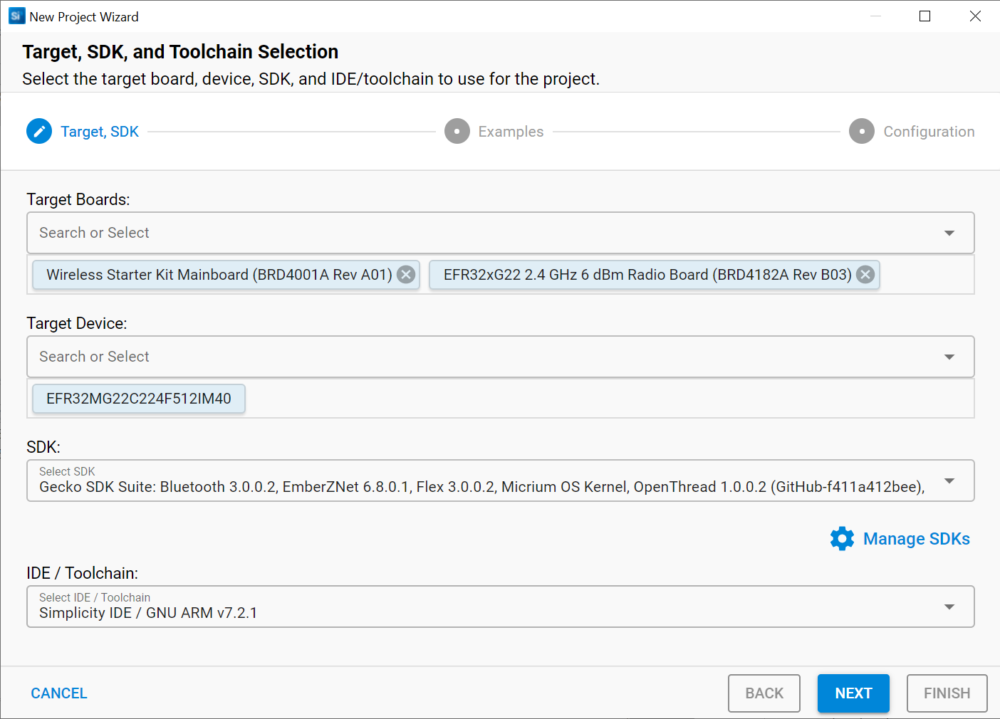  
2. Change "ZigBee Device Type" to "Sleepy End Device".  
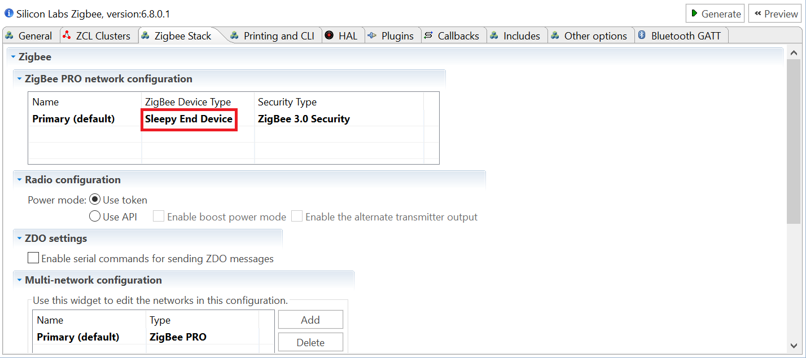  
3. Disable serial communication (optional):  
    *Disabling serial communication lowers the EM2 current by about 0.05 uA. Reserving it makes it easier for CLI debugging.*  
    1. Select "ZCL Framework Core, provides API: command-interpreter2" plugin, un-check the "Enable Command Line for Legacy CLI" option on the right.  
    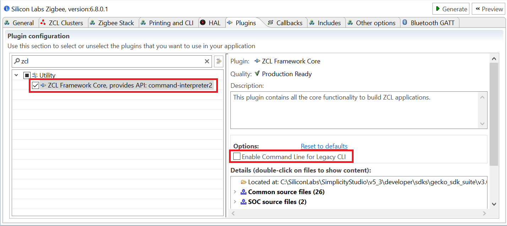  
    2. Select "Serial, provides API: serial" plugin, under "Hardware Configurator Dependent Module Options" on the right, select "SERIAL", change its "Port for application serial communication" property to "None"; select "USART1", un-check the "Enabled" checkbox.  
    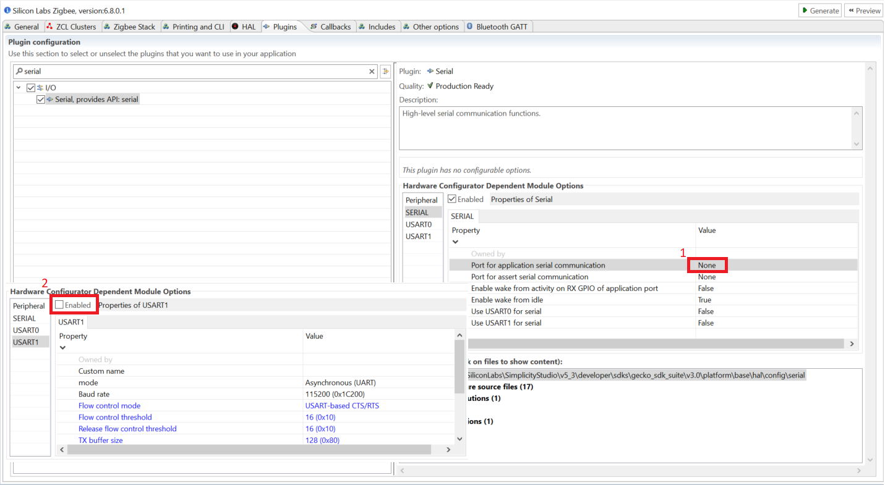  
    3. Un-check "Enable debug printing" checkbox and change "Use Command Set" option to "None".  
    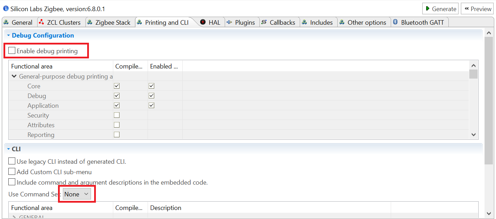  
4. Enable "Main Init" callback under "Non-cluster related".  
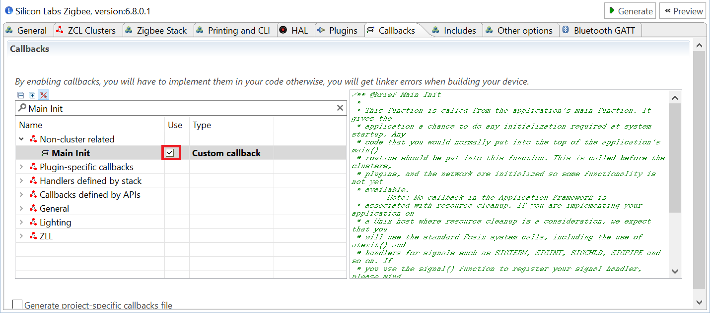  
5. Configure & initialize peripherals.  
    1. Under the switch project folder, find and open the .hwconf file. Make sure only the following peripherals are checked:  
    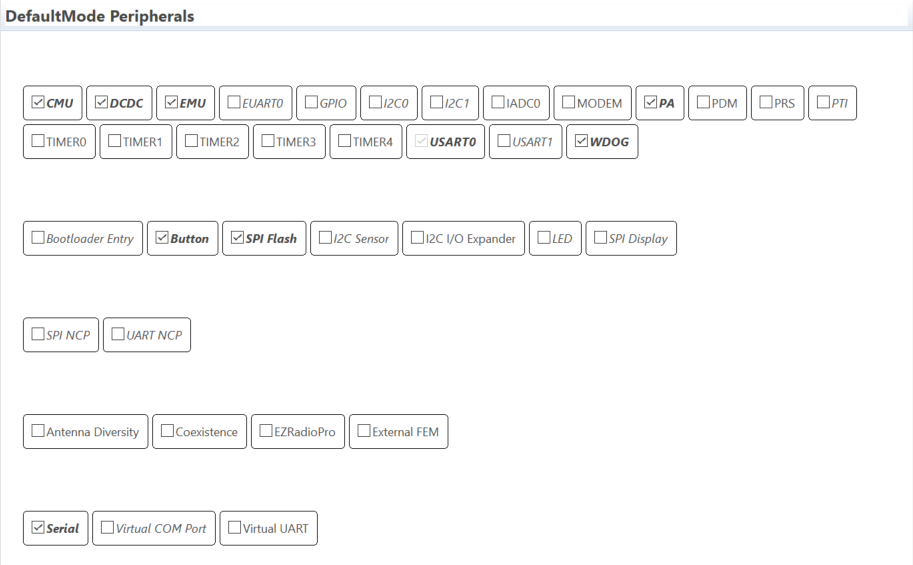  
    2. Change the last four "Clock Sources" properties of "CMU" to "LFXO", as in the screenshot shown below.  
    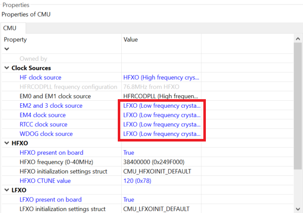  
    3. Save and generate the project.  
    4. Open "*YourProjectName*_callbacks.c" file located directly under the root of the switch project folder. Create the following function at the end of this file.  
    ```
    void emberAfMainInitCallback (void)
    {
    }
    ```
    5. Initialize DCDC. Because "_EMU_DCDCCTRL_MASK" is not defined for BRD4182A, code initializing DCDC is excluded from "hal-library/EFR32/hal-config.c" while compiling. We may add the following code manually to initialize it. This issue is expected to be fixed upon future releases, please refer to UID 475287 in future release notes.  
    ```
    #include "em_emu.h"
    ```
    ```
      // Enable DC-DC converter
      EMU_DCDCInit_TypeDef dcdcInit = EMU_DCDCINIT_DEFAULT;
      EMU_DCDCInit (&dcdcInit);
    ```
    6. Power down SPI flash. Find and copy the files "mx25flash_spi.h" and "mx25flash_spi.c" from "${StudioSdkPath}\hardware\kit\common\drivers", to the root of the switch project folder. For example, it may be located at "C:\SiliconLabs\SimplicityStudio\v5\developer\sdks\gecko_sdk_suite\v3.0\hardware\kit\common\drivers". We may add the following code to power down the flash manually. This is because plugin EEPROM POWERDOWN cannot be used on firmware built for BRD4182A to power down the flash. This issue is expected to be fixed upon future releases, please refer to UID 474616 in future release notes.  
    ```
    #include "mx25flash_spi.h"
    ```
    ```
      // Power-down the radio board SPI flash
      FlashStatus status;
      MX25_init ();
      MX25_RSTEN ();
      MX25_RST (&status);
      MX25_DP ();
      MX25_deinit ();
    ```
    7. Disable watch dog (optional).  
    ```
    halInternalDisableWatchDog (MICRO_DISABLE_WATCH_DOG_KEY);
    ```
    8. The following function, which can be appended to the end of this file, provides a summary of the last three steps.  
    ```
    void emberAfMainInitCallback (void)
    {
      // Enable DC-DC converter
      EMU_DCDCInit_TypeDef dcdcInit = EMU_DCDCINIT_DEFAULT;
      EMU_DCDCInit (&dcdcInit);

      // Power-down the radio board SPI flash
      FlashStatus status;
      MX25_init ();
      MX25_RSTEN ();
      MX25_RST (&status);
      MX25_DP ();
      MX25_deinit ();

      halInternalDisableWatchDog (MICRO_DISABLE_WATCH_DOG_KEY);
    }
    ```
    *Please note that setting EMU voltage scaling to low power mode also helps a lot, since such code already presents in the stack, there is no need to implement it again.*  

## How It Works ##

Energy Profiler is used to implement the EM2 current test. In accordance with "AEM Accuracy and Performance" section from [UG172](https://www.silabs.com/documents/public/user-guides/ug172-brd4320a-user-guide.pdf), when measuring currents below 250 uA, the accuracy is 1 uA. For more precise results, it is necessary to measure the current using a high-accuracy DC analyzer.  
Before current measurement, it is recommended to let the switch join a centralized network and pair with a light, further more, use command "aem calibrate" to run AEM calibration first.  
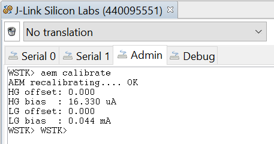  
The screenshot below contains an event that an ON command was sent to the light. Currently the EM2 current of the switch is about 2.3 uA.  
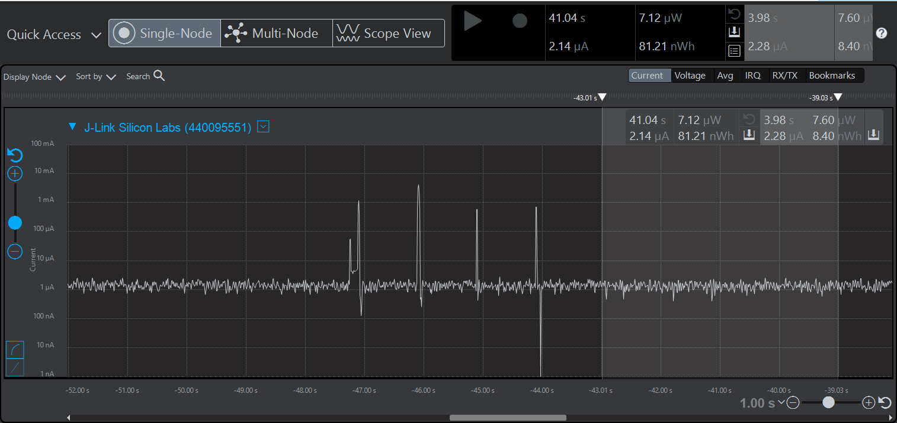  

## .sls Projects Used ##

* zigbee_sed_z3switch_mg22.sls

## How to Port to Another Part ##

* Import the .sls file into Simplicity Studio
* Open the .isc file of each project, turn to "General" tab, hit button "Edit Architecture", then select the board and part.

## Special Notes ##

1. For functional tests, PB0 on the switch can be used to start to join a network. A centralized network other than a decentralized one is required.
2. The switch only tries to pair with a light right after it joins a new network.
3. The application built from the sls project provided requires a correct bootloader to work.
4. The generation directory of the imported project may need to be changed to comply with the destination path. Save and generate after the change.  
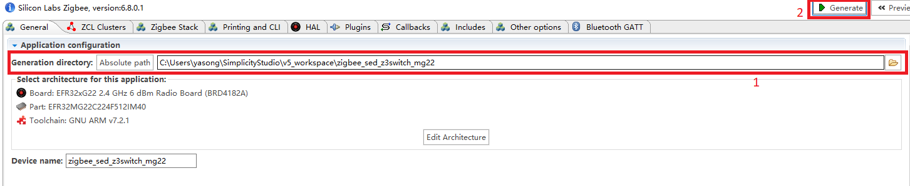  
1. Thanks to a technical bug of Simplicity Studio version 5.0.0.0, the current measured may stay at about 80 uA. In such situation, a re-flash of the .s37 firmware before a reset is needed to recover. This issue is expected to be fixed upon future releases, please refer to UID 519744 in future release notes.  
2. The EM2 current may stay at about 3 mA after flashing the firmware, keep capturing and slide the power source to BAT then back to AEM on the bottom left of the main board.   
