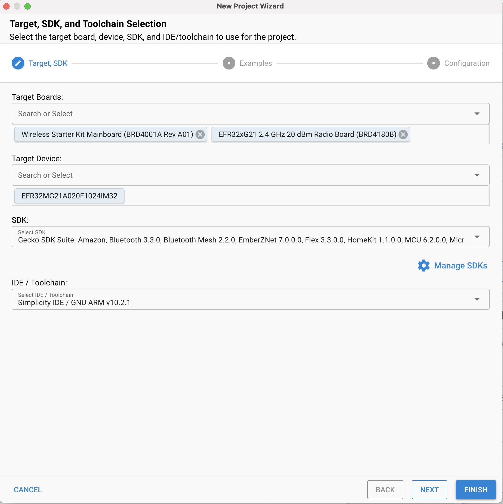
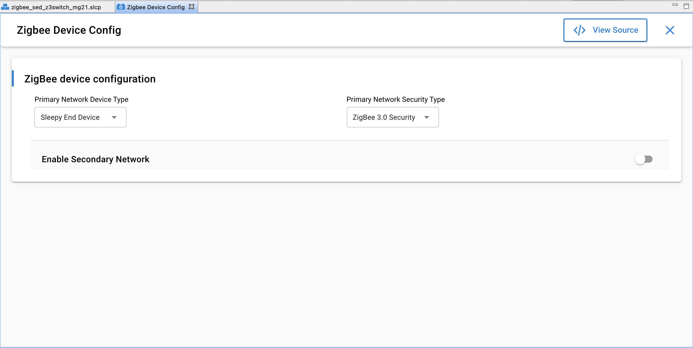
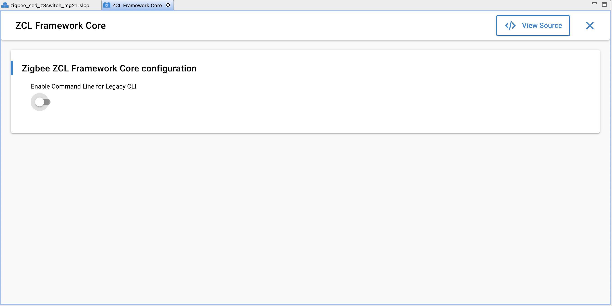
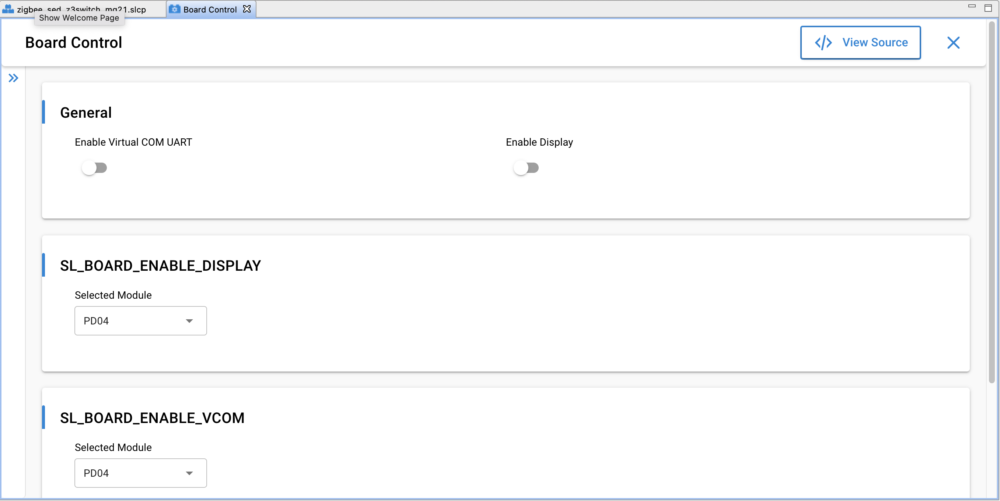
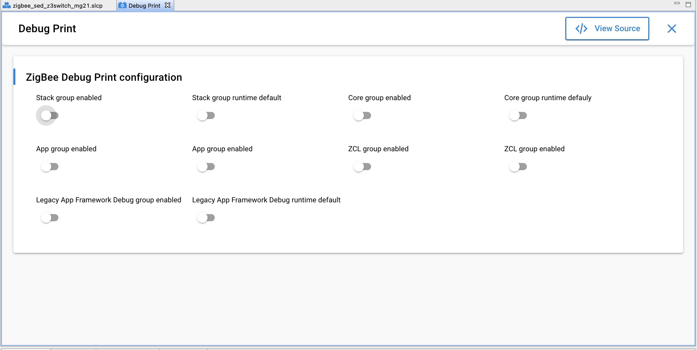
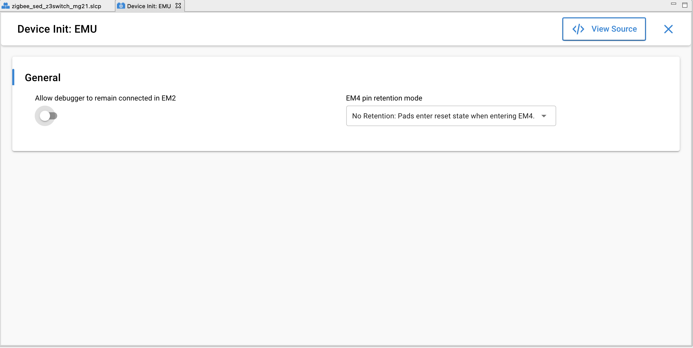
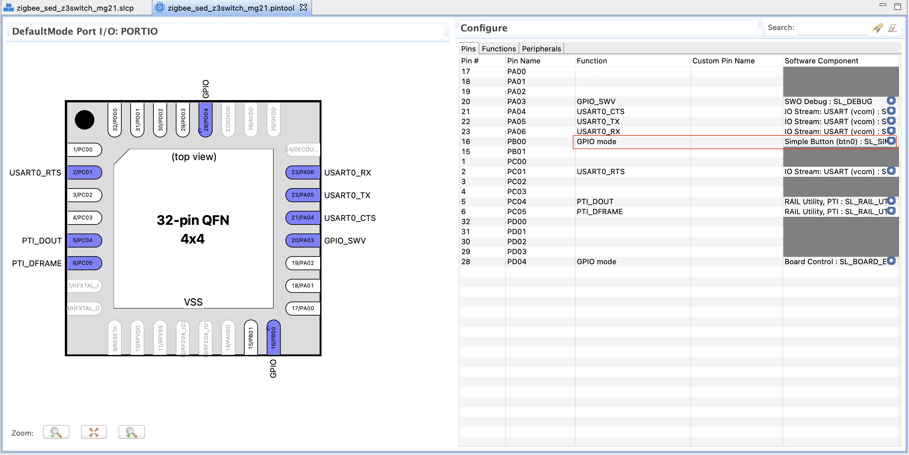
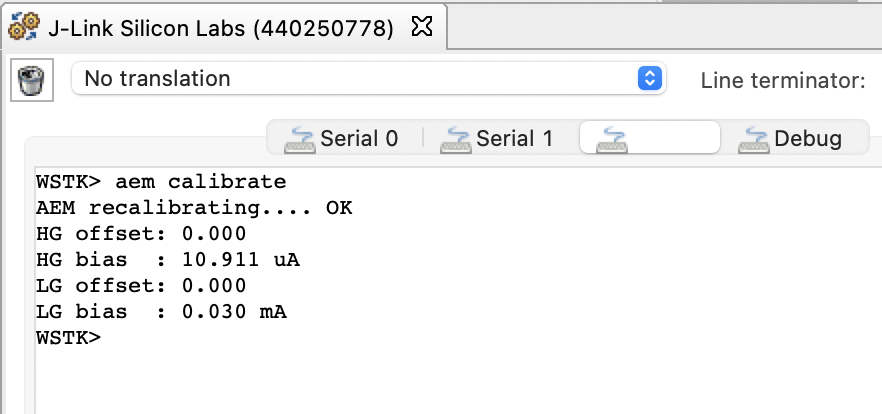
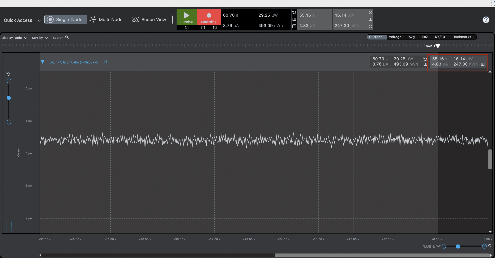

# Optimization on EM2 Current Consumption of the Sleepy Z3Swtich Example Project - UC Migration #

## Summary ##

A concrete guide to build a sleepy end device from the Z3Switch example project on radio board EFR32xG21 is provided in this article. Sample test results on EM2 current and essential troubleshooting approaches are included.

## Gecko SDK version ##

Gecko SDK Suite 4.0.

## Hardware Required ##

* Wireless Starter Kit Main Board (BRD4001)
* EFR32xG21 2.4GHz 10 dBm Radio Board (BRD4180B)

## Connections Required ##

NA

## Setup ##

### Build a Z3Switch Project  
1. Create a "Z3Switch" example for EFR32xG21 (BRD4180B).  

2. Change "ZigBee Device Type" to "Sleepy End Device" in Zigbee -> Utility -> Zigbee Device Config Component .  

3. Disable Command Line for Legacy CLI in Zigbee -> Cluster Library -> ZCL Framework Core Component.

4. Disable Virtual COM UART in Platform -> Board -> Board Control Component.

5. Uninstall instance "led0" under Platform -> Driver -> LED -> Simple LED. *Note: this will uninstall the Generic LED API and Simple LED Core component dependencies*

6. Uninstall instance "btn1" in Platform -> Driver -> Simple Button component:

7. Under Zigbee -> Utility -> Debug Print, disable the following in Zigbee Debug Print: 
    + Stack group enabled
    + Stack group runtime default
    + Core group enabled
    + Core group runtime default
    + App group enabled
    + ZCL group enabled

8. Disable the Allow debugger to remain connected in EM2 in Services -> Device Initialization -> Device Init: EMU Component:

9. Configure application & initialize peripherals. 
    1. Under Configuration Tools, open the Pin Tool : 
     
    2. Ensure that in the Pin Tool the GPIO for the btn1 is also removed: 
    
    3. Save the project. 
    4. Open "app.c" file located directly under the root of the Z3Switch project folder. Disable watch dog in void emberAfMainInitCallback (void) s(optional).  
    ```
      void emberAfMainInitCallback (void)
    {
      halInternalDisableWatchDog (MICRO_DISABLE_WATCH_DOG_KEY);
    } 
    ```
    5. Under "app.c", to ensure that the Switch attempts to join a new open network, enter the following code in the function *commissioning_event_handler()*:
    ```
    static void commissioning_event_handler(sl_zigbee_event_t *event)
    {
      
      if (emberAfNetworkState() == EMBER_JOINED_NETWORK) {
        emberAfGetCommandApsFrame()->sourceEndpoint = SWITCH_ENDPOINT;
        if (lastButton == BUTTON0) {
          emberAfFillCommandOnOffClusterToggle();
        }
        status = emberAfSendCommandUnicastToBindings();

      } else {

          if (!leavenetwork){
            emberLeaveNetwork();
            leaveNetwork = true;
          }
      emberAfPluginNetworkSteeringStart();
      }
    }
    ```
*Note: Define static bool leavenetwork = false;*


## How It Works ##

Energy Profiler is used to implement the EM2 current test. In accordance with "AEM Accuracy and Performance" section from [UG172](https://www.silabs.com/documents/public/user-guides/ug172-brd4320a-user-guide.pdf), when measuring currents below 250 uA, the accuracy is 1 uA. For more precise results, it is necessary to measure the current using a high-accuracy DC analyzer.  
Before current measurement, it is recommended to let the switch join a centralized network and pair with a light, further more, use command "aem calibrate" to run AEM calibration first.  
  
The EM2 current of the switch in the screenshot below is about  4.79uA.  
  

## .sls Projects Used ##

* zigbee_sed_z3switch_mg21.sls

## How to Port to Another Part ##

* Import the .sls file into Simplicity Studio
* Open the .slcp file of each project, in "Overview" tab, hit button "Change Target/SDK", then select the board and part.

## Special Notes ##

1. For functional tests, BTN0 on the switch can be used to start to join a network. A centralized network other than a decentralized one is required. 
2. The switch only tries to pair with a light right after it joins a new network.
3. The application built from the sls project provided requires a correct bootloader to work.
4. The generation directory of the imported project may need to be changed to comply with the destination path. Save and generate after the change. For general information about bootloaders check Section 4.6 About Bootloaders in [QSG180](https://www.silabs.com/documents/public/quick-start-guides/qsg180-zigbee-emberznet-7x-quick-start-guide.pdf) .
  
 
1. The EM2 current may stay at about 3 mA after flashing the firmware, keep capturing and slide the power source to BAT then back to AEM on the bottom left of the main board.   
2. BTN0 and BTN1 connect to PD02 and PD03 on BRD4181A, seperately. Pins on port C and port D do not have EM2/3 wake functionality. Thus, it is impossible to use PB0 on the switch to control the light, when the switch stays in EM2. Please change to another pin that connects to port A or B for such function. For further information, please refer to the schematic of BRD4181A.  
