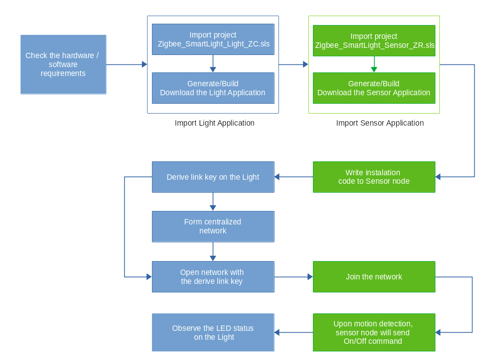

# Zigbee Motion Sensor PIR Example #


## 1. Summary ##

This demo shows the implementation of PIR sensor with Zigbee. The PIR sensor on the occupancy sensor EXP board enables the internal ADC of ZGM130S to take periodic measurements. CRYOTIMER is set to signal the ADC using PRS. The Op-Amp is configured to use the external one on the board. A simple motion detection algorithm is implemented to post-process ADC samples. Whenever certain motion of the human body is detected, the system will either turn on the light or the alarm. The setup will have at least 2 nodes, 1 for motion detection, 1 for light control. A Zigbee gateway may be involved.


In figure above, node 1 is the Zigbee Gateway. Node 2 is the motion sensor. Node 3 is the light. Upon motion detection, node 2 will notify the gateway and turn on the light.

## 2. Gecko SDK version ##

- Gecko SDK Suite 2.7.3

- Gecko SDK Suite 3.0.0

## 3. Hardware Required ##

For the gateway (Node 1):

- TBD.

For the occupancy sensor node (Node 2):

- BRD4001A WSTK board
- BRD4162A Radio board with EFR32MG12
- BRD8030A Occupancy sensor EXP board

For the light node (Node 3):

- BRD4001A WSTK board
- BRD4162A Radio board with EFR32MG12

## 4. Setup ##

On the occupancy sensor node: Connect the occupancy sensor EXP board to the WSTK board through the expansion header. Then, you should program the EFR32MG12 with the Zigbee_SmartLight_Sensor_ZR.sls project.

On the light node: Program the EFR32MG12 with Zigbee_SmartLight_Light.sls project.

On the gateway: TBD.

## 5. How It Works ##

The gateway provides CLI commands application interface to the user. The CLI command **"plugin network-creator start 1"** can be issued in order to form a centralized network. The gateway application can then be triggered to allow other devices onto the network with the CLI command  **"plugin network-creator-security open-network"**. Devices can then join the network by manually entering the install code derived link key into the gateway using the CLI command  **"plugin network-creator-security set-joining-link-key"**. The CLI command **"plugin network-creator-security close-network"** will close the network and no longer allow devices onto the gateway's network.

The light board provides a very simplistic user interface. On power up, the light will perform network steering automatically. If the light does not find a suitable network to join, it forms its own distributed network. The light will not open its network for joining as soon as the network comes up, so this must be done manually. Once a distributed network is formed and opened, the sensor may join its network by performing network steering itself. Once the light is on a network, it will set its built-in LED #0. When the light starts identifying as a find and bind target, it will blink its built-in LED #0. The light will start identifying as a find and bind target automatically when it brings its network up, but users can reopen the find and bind target window by pushing button PB1 on the light at any time when it is on a network. LED #1 is used as a simulative light. The state of light is depended on state of motion sensor on the sensor device.

The occupancy sensor board provides a simple application interface to the user. When the sensor is not on a network, it can initiate network steering to join a network using button PB1. After the sensor has successfully joining a network, it will perform the finding and binding procedure for an initiator. After this takes place, the sensor should have at least a binding to the light in its binding table for the On/Off cluster. While the sensor is performing its network commissioning, it will blink its LED #0. When the sensor is active on the network, it will set its LED #0. Once the sensor has finished finding and binding, if motion is detected, on/off cluster command is sent to the light. Users can reopen the commisioning mode by pushing button PB1 on the sensor board at any time when it is on a network. Button PB0 can be used to change the state of the motion sensor. The button behaves as a toggle, swapping the state every time it is pressed. Built-in LCD is used to displayed current state of the motion sensor is enabled or disabled. LED D1 on Occupancy Sensor Kit shows the state of motion detected. Two states are depicted:

- Solid On: The motion is detected.
- Off: The motion isn’t detected or the sensor is disabled.

The current debug printing settings in these applications are only for the purpose of aiding users in understanding and debugging this sample scenario. Debug printing should be turned off in order to save code size on a final product.

### 5.1. Setup steps for a network without the gateway ###

The figure below illustrates the working flow for the network with 2 nodes: a light and a occupancy sensor



Make sure both devices are not on any network. Go to the CLI for both and enter the command:

```
network leave
```

This tells the device to invoke the network command to leave the current network. The output similar to the following:

```
NWK Steering: Start: 0x91  
Join network start: 0x91  
EMBER_NETWORK_DOWN  
NWK Steering stack status 0x91
```

**Putting the install code on the sensor**  
The install code itself is a random value installed on the joining device at manufacturing time and is used to encrypt the initial network key transport from the coordinator to the joining device, via a unique link key. To emulate this, we are going to use commander to flash the install code onto our board. We have included a file install.txt on this page to give you an install code to work with for this example. While you can use any code you want, this code matches the commands you will see in this example and will allow you to easily follow along with our example. To install this via commander, use this command:

```
commander flash --tokengroup znet --tokenfile install.txt --device efr32mg12p
```

Here is a sample install code file. The CRC for that code is 0xB5C3 and is not included in the file.  

```
Install Code: 83FED3407A939723A5C639B26916D505  
```

Once you have flashed the install code, you can check that it was stored correctly with the following command:

```
commander tokendump --tokengroup znet --device efr32mg12p
```

Near the bottom, that the install code is stored on your device:

```
#’MFG_INSTALLATION_CODE (Smart Energy Install Code)' token group  
# Install Code Flags : 0x0006  
Install Code       : 83FED3407A939723A5C639B26916D505  
# CRC                : 0xB5C3  
```

**Start commissioning proceduce on the light**  
Reset the light by manually press RESET button or enter the command to CLI:

```
reset
```

After reseting, the light's output similar to the following:

```
Reset info: 0x06 ( SW)  
Extended Reset info: 0x0601 (RBT)  
init pass  
NWK Steering: issuing scan on primary channels (mask 0x0318C800)  
NWK Steering: Start: 0x00  
Join network start: 0x00  
NWK Steering scan complete. Beacons heard: 0  
NWK Steering: issuing scan on secondary channels (mask 0x04E73000)  
NWK Steering scan complete. Beacons heard: 0  
NWK Steering Stop.  Cleaning up.  
Join network complete: 0xAB  
Form network start: 0x00  
Scan complete. Channel: 255. Status: 0x00  
Energy scan results.  
NWK Creator: Channel: 11. Rssi: -53  
Energy scan results.  
NWK Creator: Channel: 15. Rssi: -58  
Energy scan results.  
NWK Creator: Channel: 20. Rssi: -74  
Energy scan results.  
NWK Creator: Channel: 25. Rssi: -82  
Scan complete. Channel: 0. Status: 0x00  
NWK Creator Security: Start: 0x00  
EMBER_NETWORK_UP 0xFCEF  
NWK Steering stack status 0x90  
NWK Creator: Form. Channel: 15. Status: 0x00  
Form distributed network complete: 0x00  
NWK Creator: Stop. Status: 0x00. State: 0x00  
Find and Bind Target: Start target: 0x00  
Find and bind target start: 0x00  
```

**Joining the sensor board to the network**  
From the light’s CLI, we are going to tell the light the EUI64, the install code and the CRC of the sensor, from this information it will hash out the sensor link key. To do this, enter the following on the sensor’s CLI:

```
option install-code <link key table index> {<Joining Node's EUI64>} {<16-byte install code + 2-byte CRC>}  
```

For example:

```
option install-code 0 {58 8E 81 FF FE 72 F8 80} {83 FE D3 40 7A 93 97 23 A5 C6 39 B2 69 16 D5 05 C3 B5}
```

If this command works correctly, you should see the following:

```
Success: Set joining link key
```

From this we will then get our new link key from the key table. This is done from the CLI entering:

```
keys print
```

This command displays most of the security information for our network. What you are looking for on this display is the key table, which should display information like this:

```
Transient Key Table
Index IEEE Address         In FC     TTL(s) Flag    Key    
0     (>)588E81FFFE72F880  00000000  0x0122 0x0000  66 B6 90 09 81 E1 EE 3C  A4 20 6B 6B 86 1C 02 BB  
```

Open the network for joining and provide the link key of the joining device:

```
plugin network-creator-security open-with-key {58 8E 81 FF FE 72 F8 80} {66 B6 90 09 81 E1 EE 3C  A4 20 6B 6B 86 1C 02 BB}
```

From the sensor’s CLI, start joining the network:

```
plugin network-steering start 0
```

### 5.2. Setup steps for a network with the gateway ###

- TBD.

## 6.  .sls Projects Used ##

For Gecko SDK Suite 2.7.3:

- SimplicityStudio_V4/Zigbee_SmartLight_Light.sls
- SimplicityStudio_V4/Zigbee_SmartLight_Sensor_ZR.sls

For Gecko SDK Suite 3.0.0:

- SimplicityStudio_V5/Zigbee_SmartLight_Light.sls
- SimplicityStudio_V5/Zigbee_SmartLight_Sensor_ZR.sls 

## 7. Special Notes ##

The implemention of PIR sensor driver on this demo bases on two bellow links:

- [Z-Wave Motion Sensor PIR Example](https://github.com/SiliconLabs/z_wave_applications_staging/tree/master/z_wave_motion_sensor_pir_application)

- [Silicon Labs Occupancy Sensor EXP](https://github.com/SiliconLabs/occupancy-sensor-exp.git)
