# Zigbee Smart Lighting with PIR and Ambient light sensor #


## 1. Introduction ##

In this demo, the light is controlled automatically by the PIR sensor and Ambient light sensor (using [PIR Occupancy board](https://www.silabs.com/development-tools/sensors/occupancy-sensor-kit)). If there is a motion and the ambient light is dark, the light will be turned on. The light will be turned off if there is no motion or the ambient light is bright.

This document also shows how to **integrate the Motion sensor (PIR) driver and the Ambient light sensor (ALS) driver into the Zigbee application** with the EmberZNet stack.

The **PIR sensor** is read by **using ADC** to get data from the sensor and run the **motion detection algorithm** to detect the motion. CRYOTIMER (a low energy timer) is used to trigger the ADC using PRS (Peripheral Reflex System, which allows configurable, fast, and autonomous communication between peripherals). The Op-Amp is configured to use the external one on the sensor board. A simple motion detection algorithm is implemented to post-process ADC samples. After running the algorithm, the PIR driver will return motion status to the application by running the **callback function**.

The **Ambient light sensor** is read by **using I2C** to get data from the **Si115x sensor**, then **the lux value is calculated** (lux is the unit of illuminance, measuring luminous flux per unit area). The reading process of this sensor consists of **two phases**. The **first phase** is **sending the start command** to the sensor over I2C, then wait for the sampling and processing in hardware. When the reading process in hardware is completed, a trigger will be sent back from the sensor over the sensor interrupt pin. When the signal is received by using the **external interrupt**, the second phase will start. The **second phase** consists of **reading data** from the sensor over I2C and **calculates the lux value**. This process is configured to run every 1 second. Same with the PIR driver, after getting lux value, the ALS driver will return it to the application by running the **callback function**.

The figure below shows the operation of this demo application. The **Coordinator node** will **form a network** and **open it** to allow the light node and sensor node to **join**. When a motion is detected, the **sensor node** will **update** the occupancy attribute and ambient light attribute, then **report** them to the coordinator node. If there is a motion and the ambient light value is less than a threshold value at the same time, the LED in the light node will be turned on.

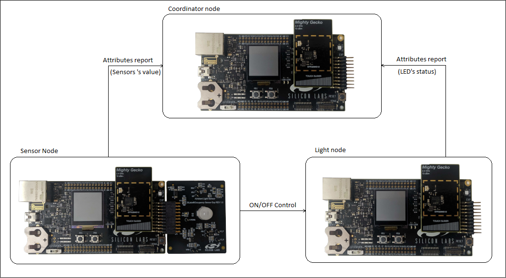

This document includes two parts:

- The first part is how to **setup and run** this demo.
- The second part is how to **integrate the PIR sensor driver and ALS driver with the Zigbee network**.

## 2. Gecko SDK version ##

- Gecko SDK Suite 3.0.0

## 3. Hardware Required ##

For the occupancy sensor node:

- BRD4001A WSTK board
- BRD4162A Radio board with EFR32MG12
- BRD8030A Occupancy sensor EXP board

For the coordinator node:

- BRD4001A WSTK board
- BRD4162A Radio board with EFR32MG12

For the light node:

- BRD4001A WSTK board
- BRD4162A Radio board with EFR32MG12

## 4. Setup and how it works ##

The figure below shows how to setup this demo and how it works.

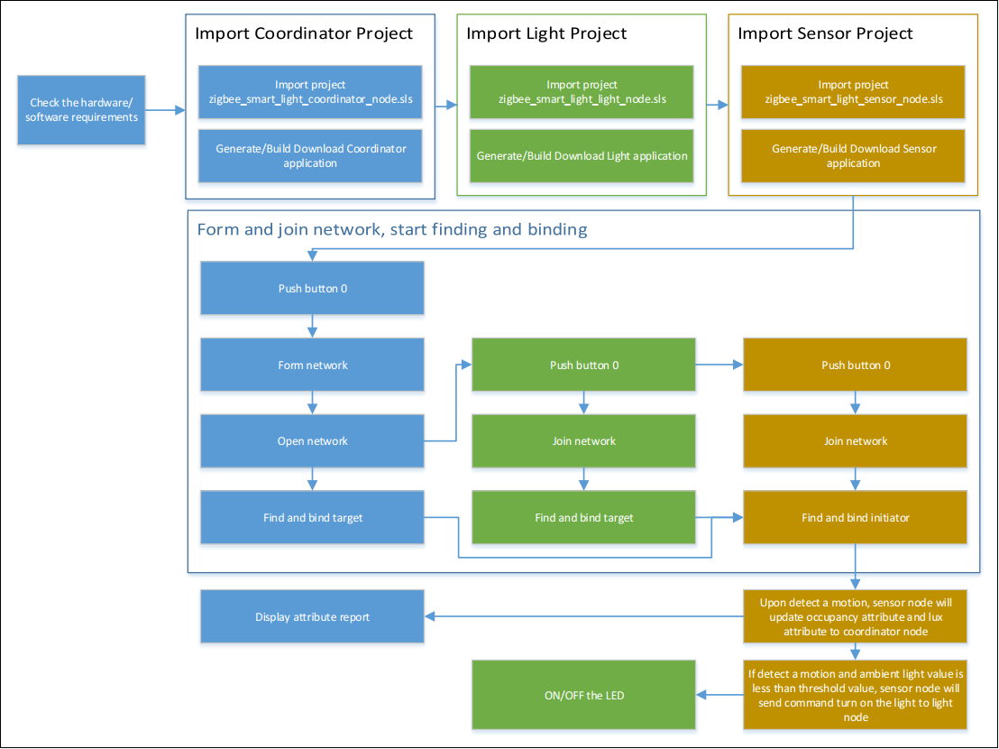

### 4.1. Setup ###

#### 4.1.1 Import, build and flash ####

1. Connect the occupancy sensor EXP board to the WSTK board through the expansion header  
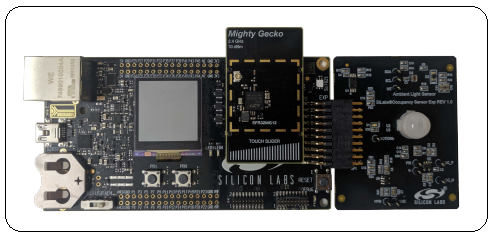

2. Import project **zigbee_sensor_node.sls** to your Simplicity Studio.  

    Select **File** -> **Import**
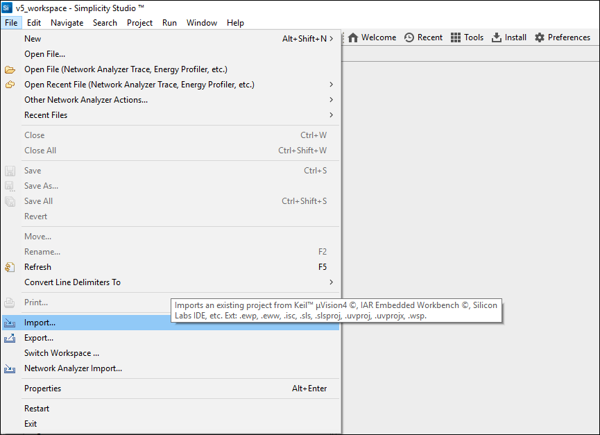  

    Link to folder includes project **.sls** file. Write the project name and click **Finish**.  
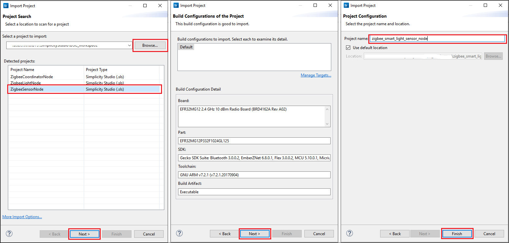  

    Build project: Right-click on your project -> **Build Project**.  
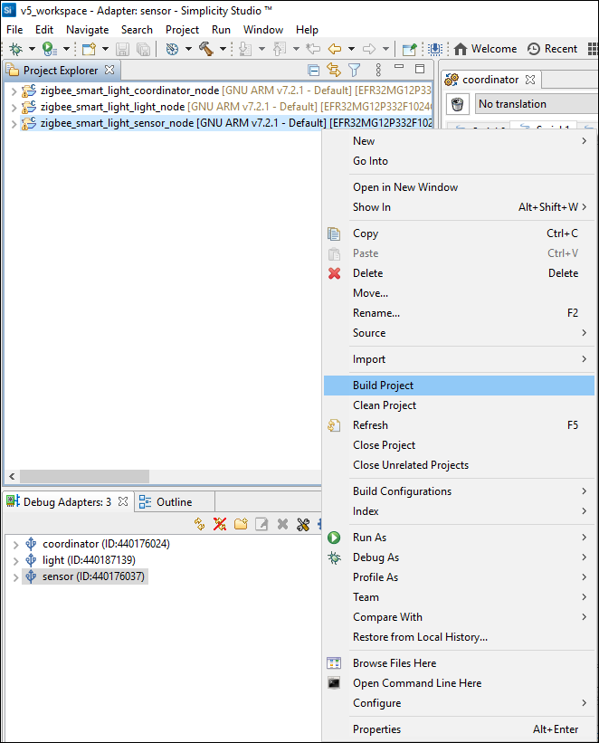  

    Load the binary file on the sensor board. Right-click on the **.hex** file -> **Flash to Device ...**  
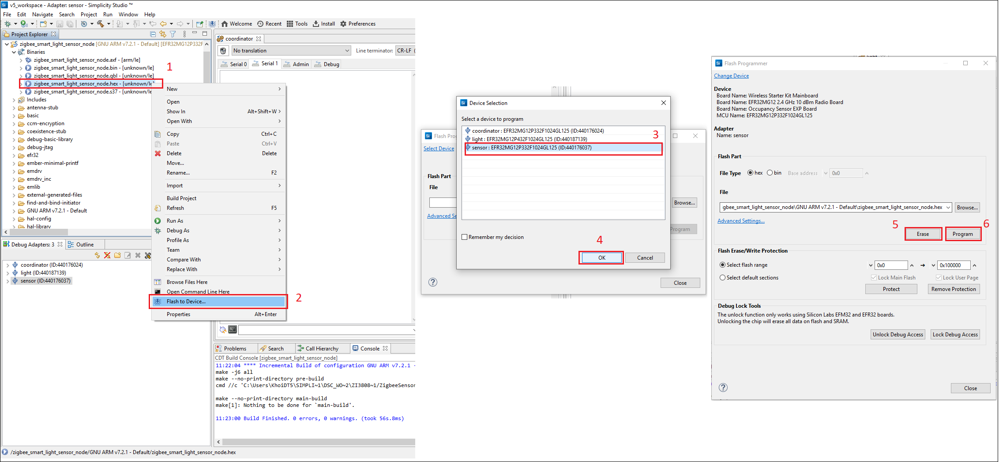  

3. Import project **zigbee_coordinator_node.sls**, build and load the binary file on the coordinator board the same way as you did with the Sensor board.

4. Import project **zigbee_light_node.sls**, build and load the binary file on the light board the same way as you did with the Sensor board.

#### 4.1.2. Run and debug ####

1. Open three consoles: coordinator node, sensor node, and light node.  
In **Debug Adapter** window, right-click on your **coordinator node**, choose **Launch Console...**.  
Do the same way with the **light node** and the **sensor node**.  
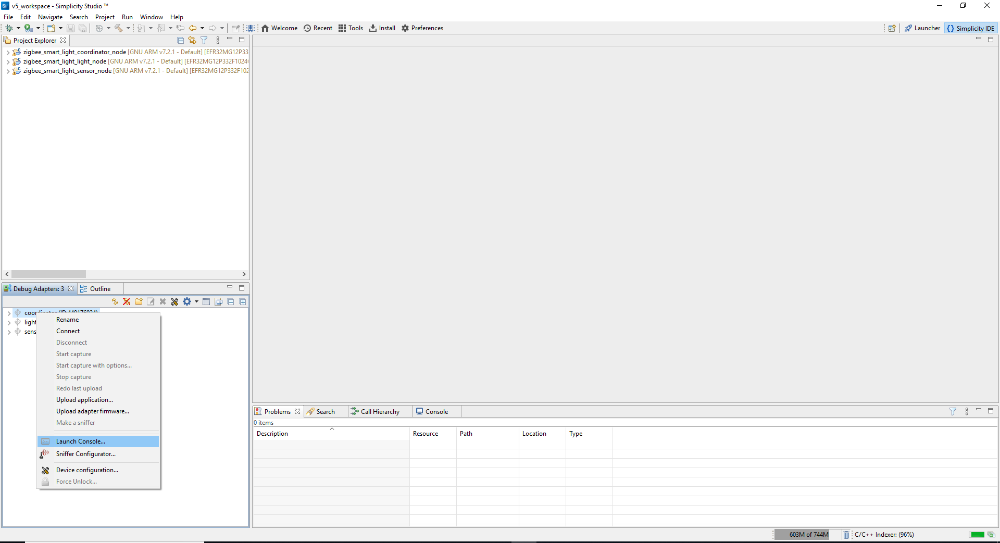  
The console will appear like this. Select **Serial 1** Tab.  
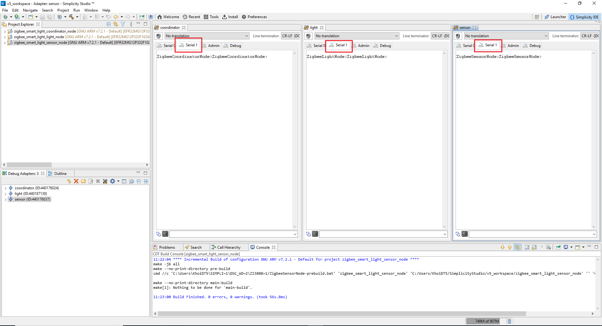

2. Push the button PB0 on the Coordinator board.  
The coordinator will start first, it forms a network and opens it to allow another device to join the network.  
After that, it will start find and bind target.  
You can see the information in the debug console.  
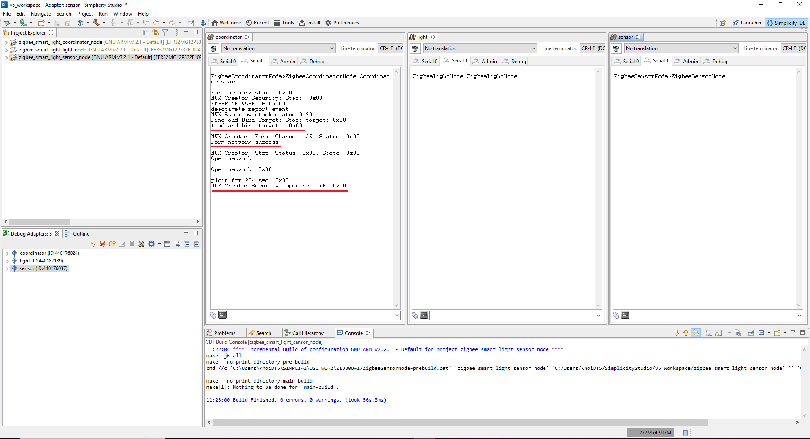

3. When the network opens succeeds, push the button PB0 on the Light node.
It will join the coordinator's network.
After that, it will start find and bind target.  
You can see the information in the debug console.  
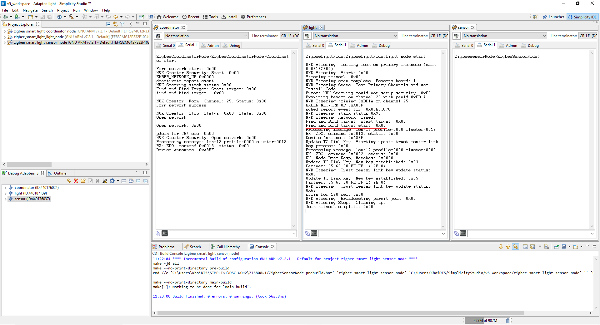

4. Push the button PB0 on the Sensor node.  
The sensor node will start last because it is a find-and-bind initiator. See Cluster section in [Introduction of Zigbee Basic](https://github.com/SiliconLabs/IoT-Developer-Boot-Camp/wiki/Introduction-of-Zigbee-Basic)  
After it joined the coordinator's network, it will start find and bind initiator.  
You can see the information in the debug console.  
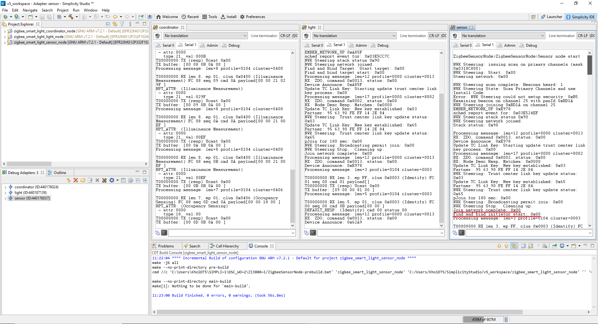

5. From now on they will keep running automatically. When the sensor detects a motion, it will get the ambient light value, compare it with the threshold value, control the light, and send the update to the coordinator.  
You can see the information in the debug console.  
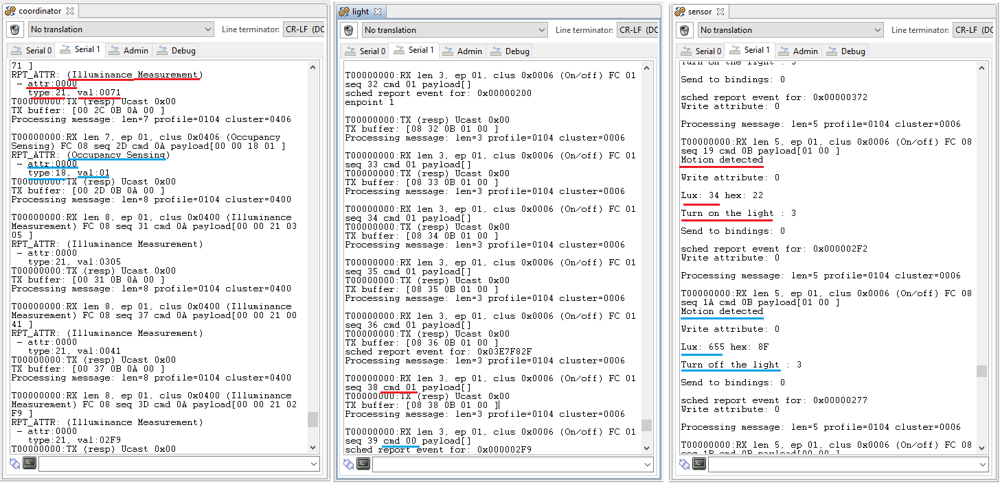

### 4.2. How it's work ###

- To form a network, the Coordinator uses function `EmberStatus emberAfPluginNetworkCreatorStart(bool centralizedNetwork)` in plugin **network-creator**.

    ```C
    void emberAfHalButtonIsrCallback(uint8_t button, uint8_t state)
    {
        if (state == BUTTON_RELEASED) {
            if(!appStart){
                appStart = true;
                emberEventControlSetActive(appStartEventControl);
            }
        }
    }
    ```

    ```C
    void appStartEventHandler()
    {
        emberEventControlSetInactive(appStartEventControl);
        emberAfCorePrintln("Coordinator start \n");

        EmberStatus status = emberAfPluginNetworkCreatorStart(true);
        emberAfCorePrintln("%p network %p: 0x%X", "Form", "start", status);
    }
    ```

    The function `appStartEventHandler()` is handler for event `appStartEventControl`. It been set in `emberAfHalButtonIsrCallback()` function. The function `emberAfHalButtonIsrCallback()` is called by the framework when you push a button PB0 or PB1.

- To open a network, the Coordinator uses function `EmberStatus emberAfPluginNetworkCreatorSecurityOpenNetwork(void)` in plugin network-creator-security.

    ```C
    void reopenNetworkEventHandler()
    {
        emberEventControlSetInactive(reopenNetworkEventControl);

        EmberStatus status =  emberAfPluginNetworkCreatorSecurityOpenNetwork();
        emberAfCorePrintln("Open network: 0x%X \n", status);

        emberEventControlSetDelayMS(reopenNetworkEventControl, NETWORK_CLOSE_TIMEOUT); // reopen after about 250s
    }
    ```

    Note that the network will automatically close after about 250s according to your configuration. After that timeframe to allow another device to join the network, you need to schedule an event to re-open the network.  
    So you will see the handler `reopenNetworkEventHandler()` actives it's event `reopenNetworkEventControl` by itself. See this in [Zigbee Hands on Using Event](https://github.com/SiliconLabs/IoT-Developer-Boot-Camp/wiki/Zigbee-Hands-on-Using-Event).  

- To join the network, the light node and sensor node use the function `EmberStatus emberAfPluginNetworkSteeringStart(void)` in plugin **network-steering**.  

    ```C
    void appStartEventHandler()
    {
        emberEventControlSetInactive(appStartEventControl);
        emberAfCorePrintln("Sensor node start \n");

        appStart = true;

        EmberStatus status = emberAfPluginNetworkSteeringStart();
        emberAfCorePrintln("Steering network: 0x%X \n", status);
    }
    ```

    When you push the button on the light node, the process is the same as with the coordinator node. But with the sensor, it is a bit different.

    On the sensor node, the Ambient light sensor uses pin PF7 for sensor interrupts, so button PB7 cannot be used with the button plugin.

    The event `appStartEventControl` is set in `void button_irq_handler(uint8_t pin)`.

    ```C
    void button_irq_handler(uint8_t pin)
    {
        /* if btn0 press */
        if (pin == BSP_GPIO_PB0_PIN) {
            if(!appStart){
                appStart = true;
                emberEventControlSetActive(appStartEventControl);
            }
        }
    }
    ```

    And the `button_irq_handler(uint8_t pin)` is registered to **gpiointerrupt** driver in `emberAfMainInitCallback(void)`

    ```C
    GPIOINT_CallbackRegister(BSP_GPIO_PB0_PIN, button_irq_handler);
    ```

- Finding and binding.  
The concept can be found in [Introduction of Zigbee Basic](https://github.com/SiliconLabs/IoT-Developer-Boot-Camp/wiki/Introduction-of-Zigbee-Basic).

    To start find and bind target, the coordinator node and light node use function `EmberAfStatus emberAfPluginFindAndBindTargetStart(uint8_t endpoint)` in plugin **find-and-bind-target**.

    To start find and bind initiator, the sensor node uses function `EmberAfStatus emberAfPluginFindAndBindTargetStart(uint8_t endpoint)` in plugin **find-and-bind-initiator**.

    The find and bind can only start after the node joined a network.

- Usage of the sensor driver:

    Both two sensors need to be initialized by calling the initiator function. This function is called when the find and bind process completes.  

    ```C
    void emberAfPluginFindAndBindInitiatorCompleteCallback(EmberStatus status)
    {
        emberAfCorePrintln("Find and bind initiator %p: 0x%X", "complete", status);
        if(status == EMBER_SUCCESS){
            findAndBindSuccsess = true;
            emberEventControlSetActive(initSensorEventControl);
        }
    }
    ```

    ```C
    void initSensorEventHandler()
    {
        emberEventControlSetInactive(initSensorEventControl);
        emberAfCorePrintln("Init ambient light sensor \n");
        als_init(&get_lux_completed_callback);

        emberAfCorePrintln("Init pir sensor \n");
        pir_init(&motion_detection_callback);
    }
    ```

    `motion_detection_callback` is called after the PIR driver finished running the motion detection algorithm. See section [5.4. The PIR sensor driver](#5.4.-The-PIR-sensor-driver) for more details.  

    ```C
    void motion_detection_callback(bool motion)
    {
        if(motion){
            if(findAndBindSuccsess){
                emberEventControlSetActive(motionDetectedEventControl);
            }
        }
    }
    ```

    `get_lux_completed_callback` is called after the ALS driver got the lux value. `lux_value` is a static variable in the application. See section [5.5. The ambient light sensor driver](#5.5.-The-ambient-light-sensor-driver) for more details.  

    ```C
    void get_lux_completed_callback(uint16_t enter_lux_value)
    {
        lux_value = enter_lux_value;
    }
    ```

## 5. How to integrate the PIR sensor driver and ambient light sensor driver into EmberZnet stack ##

The base driver is on [Silicon Labs Occupancy Sensor EXP](https://github.com/SiliconLabs/occupancy-sensor-exp.git). The structure of this driver needs to be refactored to compatible with the Zigbee stack.  

In this demo, we will start with Zigbee minimal project because it provides a minimal functional subset to work with ZigBee 3.0 network and will be fast to edit.

The steps are:

- Create a Zigbee minimal project.  
- Import base driver and necessary files.  
- Configure project: ZCL, plugins, callbacks, Events.  
- Refactor base driver.  

### 5.1. Create Zigbee Minimal project ###

You can see in [Zigbee Hands on Forming and Joining](https://github.com/SiliconLabs/IoT-Developer-Boot-Camp/wiki/Zigbee-Hands-on-Forming-and-Joining)

- Select **File** -> **New** -> **Project..** -> **Silicon Labs AppBuilder Project**  
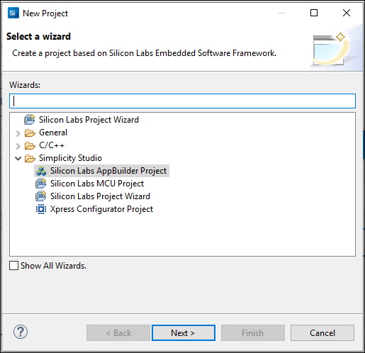

- Select Silicon Labs Zigbee and then choose the stack version for SoC, for this example is **EmberZNet 6.8.0.1 GA SoC 6.8.0.1**  
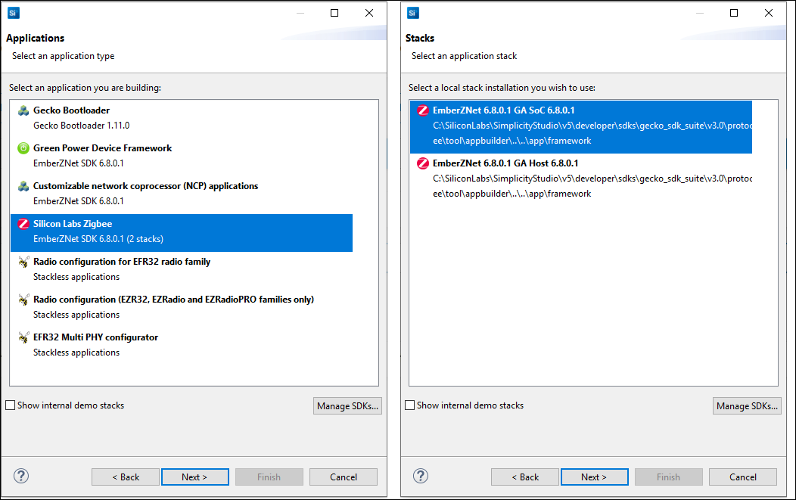

- Select **ZigbeeMinimal**  
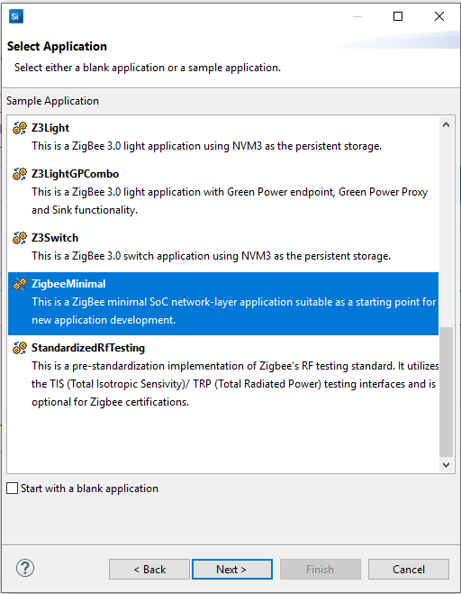

- Write the Project's name and then choose the board, for this example, it is **BRD4162A REV A02**, and then check the Configuration for the project, for this example, it is **Default GNU ARM v7.2.1**. Finally click **Finish**  
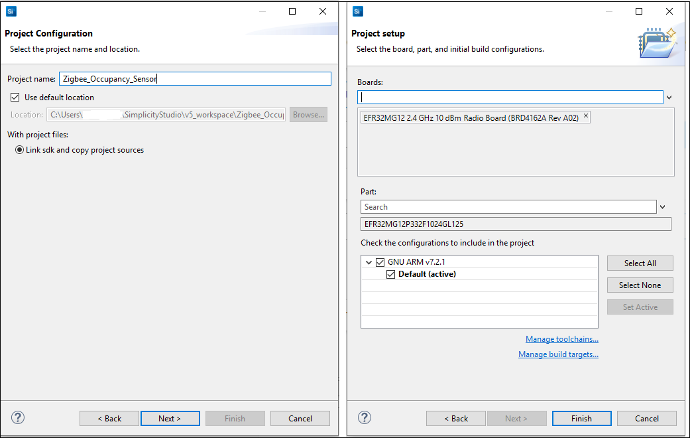

### 5.2. Import file ###

Download and copy the source folder to your project folder from [Silicon Labs Occupancy Sensor EXP](https://github.com/SiliconLabs/occupancy-sensor-exp.git). Remove the application files, just keep the driver files and configuration files.  

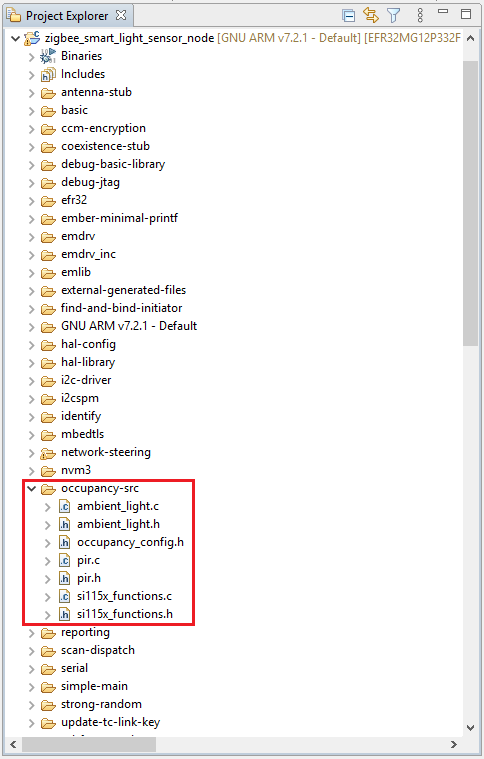  

This driver also uses some **emlib** libraries, you need to add them to your project.  
These libraries are: **em_letimer.c**, **em_opamp.c**, **em_pcnt.c**.

Right-click on **emlib** folder in the project structure, select **New** -> **File**.  
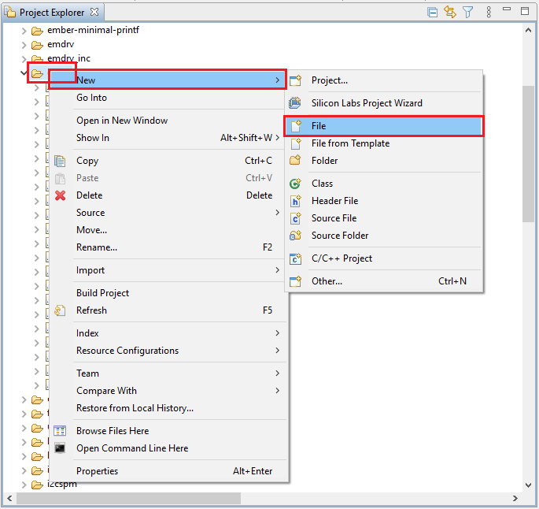  

Select **Advance** -> tick to **Link to file in the file system** -> **Browse...**.  
Browse to SDK folder **C:\SiliconLabs\SimplicityStudio\v5\developer\sdks\gecko_sdk_suite\v3.0\platform\emlib\src** and select one by one each file: **em_letimer.c**, **em_opamp**, **em_pcnt.c**.  
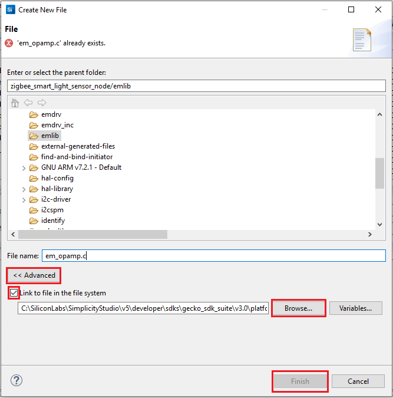  

### 5.3. Configure Zigbee Minimal project ###

- ZCL tab  

    The three clusters that the sensor node needs are: On/Off cluster, Illuminance Measurement and Occupancy Sensing, so in this demo we customize a device type based on a Home Automation device:  

    In **ZCL device type**, select **Zigbee Custom**  
    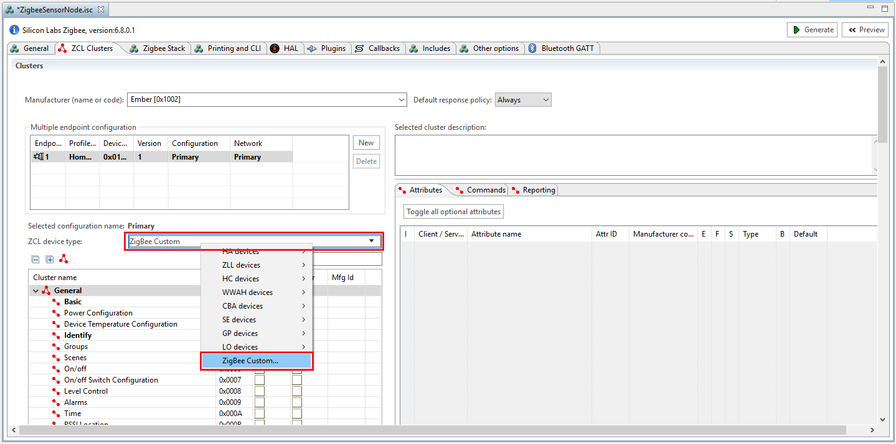  

    In **Device template**, select **HA devices** -> **HA Occupancy Sensor**  
    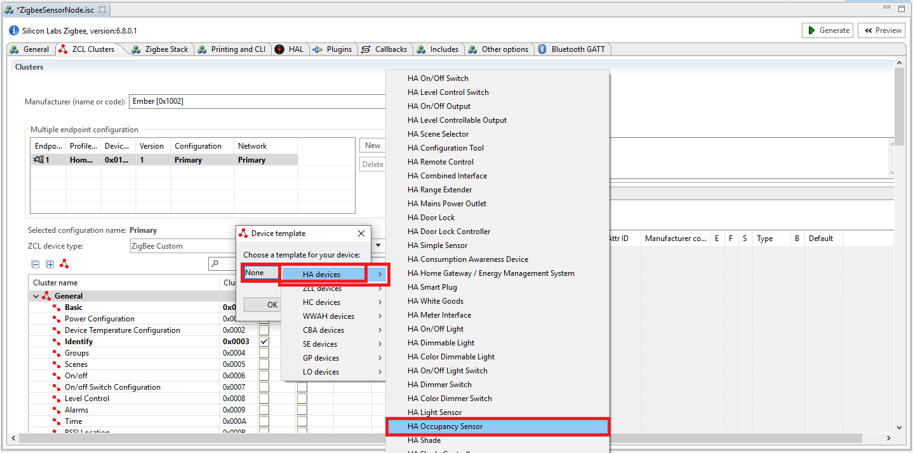  

    In **Cluster table**, select **On/Off cluster** in **client side**, **Illuminance Measurement** and **Occupancy Sensing** both in **server side**  
    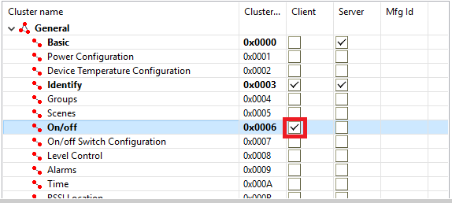  
    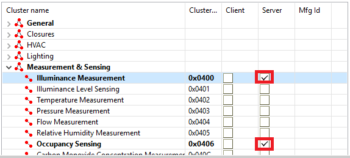  

- Zigbee Stack tab  

    In **Zigbee device type**, select **Router**  
    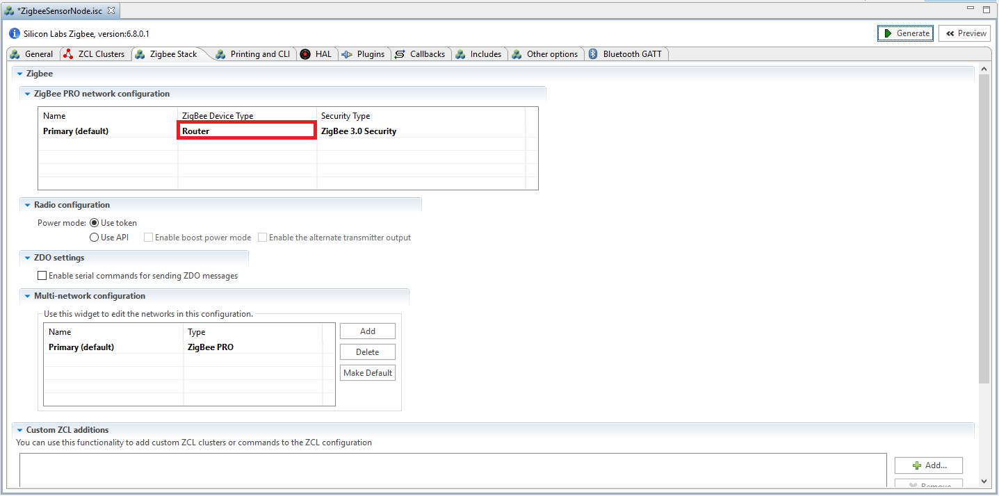  

- Printing tab

    Enable debug printing.  
    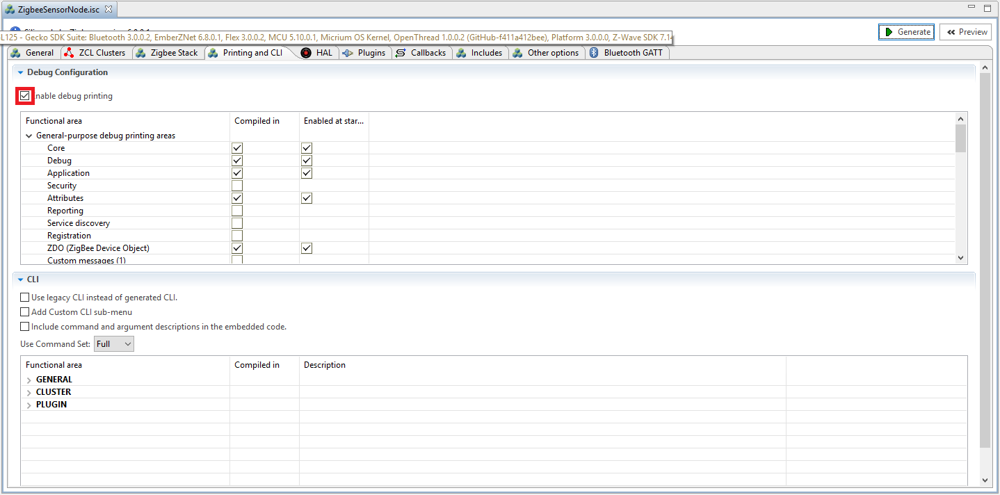  

- Plugins tab  

    Add plugins to your project by ticking in the relevant checkboxes. These plugins below are used:  

    Under **Common Clusters**, tick: **Basic Server Cluster**, **Identify Cluster**, and **Reporting**.  

    Under **HAL** tick: **i2c-driver**.  

    Under **Stack libraries**, tick: **Binding table library**, **Zigbee PRO library**.  

    Under **Utility** tick: **General Response Commands**, **mbedtls**.  

    Under **Zigbee 3.0** tick: **find-and-bind-initiator**, **network-steering**, and **update-tc-link-key**.  

    Some plugins are explained in [Building a Zigbee 3.0 Switch and Light from Scratch](https://www.silabs.com/support/training/zigbee-application-layer-concepts/building-a-zigbee-3-0-switch-and-light-from-scratch)  

    The **Reporting** plugin is used for reporting sensor value to another node. And **i2c-driver** plugin is used for the ambient light sensor.  

- Callback tab  

    Use a framework callback by ticking in it's checkbox and implementing it in your source code. These callbacks below are used:

    Under **Non-cluster related** tick: **MainInit**.  
    The function `void emberAfMainInitCallback(void)` is called at the start of the `main()` function and it is called before the clusters, network and plugins are initialized so note that some functions are not available. It is usually used for initializing your project. In this demo, it is used for the initializer button. Then when you push the button, the button handler will run and initialize the network. When the network is up, the sensor is initialized.  

    Under **Plugin-specific callbacks** tick: **Find and Bind Initiator Complete** and **Network Steering Complete**.  
    The function `void emberAfPluginNetworkSteeringCompleteCallback(EmberStatus status, uint8_t totalBeacons, uint8_t joinAttempts, uint8_t finalState)` is called after the network steering process is complete, it notifies your application whether the network steering process was successful or not.  

    The function `void emberAfPluginFindAndBindInitiatorCompleteCallback(EmberStatus status)` is called after find and bind initiator process is complete, it notifies your application whether find and bind initiator process was successful or not.  

- Include tab  

    In the Event Configuration table, add events and the handlers for them. See at [Zigbee Hands on Using Event](https://github.com/SiliconLabs/IoT-Developer-Boot-Camp/wiki/Zigbee-Hands-on-Using-Event).  

    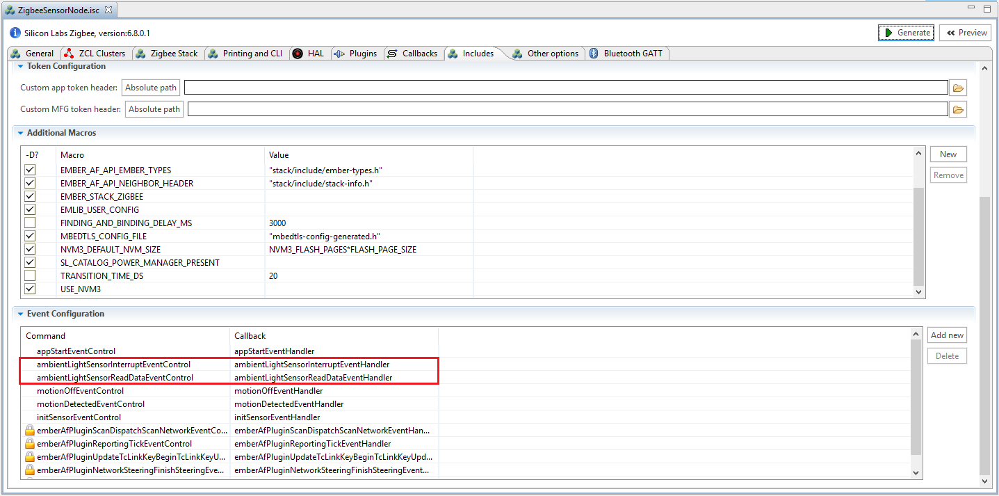  

    The `ambientLightSensorInterruptEventControl` and `ambientLightSensorReadDataEventControl` are used for the Ambient light sensor and the others are used for the application.  

### 5.4. The PIR sensor driver ###

- Add callback for the motion detection event.

The application will be notified after the driver finished running the motion detection algorithm, and the boolean parameter passed to the callback signifies whether a motion was detected or not.  

The code below is added in the `detect_motion()` function to run the callback.

```C
bool detect_motion()
{
  ...
  if (lock_out_counter > 0) {
    lock_out_counter -= (num_samples < lock_out_counter) ? num_samples : lock_out_counter;
    if (lock_out_counter == 0) {
        motion_off();
        (*motion_detection_callback)(false);
    }
  }

  /* Assert motion. */
  if (motion) {
    lock_out_counter = config.motionOnTime;
    motion_on();
    (*motion_detection_callback)(true);
  }

  ...
}
```

`motion_detection_callback` is a static function pointer in the PIR driver. It is assigned by the callback function in the application, which is registered to the PIR driver over the initial function.  

```C
void pir_init(motion_detection_callback_t callback_registration)
{
  /* Enable LDO to startup VPIR. */
  GPIO_PinOutSet(LDO_SHDN_B_PORT, LDO_SHDN_B_PIN);

  PIR_Init_TypeDef pirInit = PIR_INIT_DEFAULT;
  pirInit.opampMode = pirOpampModeExternal;

  initial(&pirInit, true);

  // set callback function for motion detection event
  motion_detection_callback = callback_registration;

  pir_start();
}
```

The figure below shows the structure of the PIR driver.  

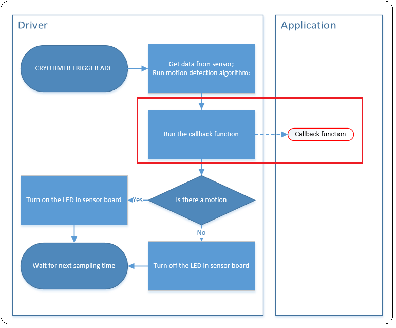  

### 5.5. The ambient light sensor driver ###

With the ALS driver, it needs more changes.

- Schedule an event to run the driver automatically.  

As described above, getting the lux value needs two phases.

First phase is sending start command over I2C:

```C
void ambientLightSensorReadDataEventHandler()
{
    emberEventControlSetInactive(ambientLightSensorReadDataEventControl);
    Si11xxReadFromRegister(si115xHandle, REG_IRQ_STATUS);   // ensure INT is cleared
    if (mode == si1150ModeAuto) {
        Si115xStart(si115xHandle);
    } else {
        Si115xForce(si115xHandle);
    }
}
```

Then the driver needs to wait for the second phase to start. The next step will show how the second phase starts.

- Using **em_gpio** and **gpiointerrupt** library to implement the sensor interrupt handler.

```C
void als_init(get_lux_completed_callback_t callback_registration)
{
    ...
    //gpio pinmode set
    GPIO_PinModeSet(SENSOR_INT_PORT, SENSOR_INT_PIN, gpioModeInput, 1);

    //register callback
    GPIOINT_CallbackRegister(SENSOR_INT_PIN, sensor_int_irq_handler);

    //interrupt configure
    GPIO_IntConfig(SENSOR_INT_PORT, SENSOR_INT_PIN, false, true, true);

    NVIC_ClearPendingIRQ(GPIO_EVEN_IRQn);
    NVIC_EnableIRQ(GPIO_EVEN_IRQn);
    NVIC_ClearPendingIRQ(GPIO_ODD_IRQn);
    NVIC_EnableIRQ(GPIO_ODD_IRQn);
    ...
}
```

`sensor_int_irq_handler` is handling interrupts received from the sensor. It is registered to **gpiointerrupt** by `GPIOINT_CallbackRegister(SENSOR_INT_PIN, sensor_int_irq_handler);`

```C
void sensor_int_irq_handler(uint8_t pin)
{
    if (pin == SENSOR_INT_PIN) {
        emberEventControlSetActive(ambientLightSensorInterruptEventControl);
    }
}
```

You can see `sensor_int_irq_handler` will start the second phase of getting lux value by setting `ambientLightSensorInterruptEventControl` active.

```C
void ambientLightSensorInterruptEventHandler()
{
    emberEventControlSetInactive(ambientLightSensorInterruptEventControl);
    uint32_t lux = read_lux(si115xHandle);

    get_lux_completed_callback(lux);

    /* repeat read lux value every 1s */
    emberEventControlSetDelayMS(ambientLightSensorReadDataEventControl, PERIOD_READ_LUX_MS);
}
```

You also see that after getting the lux value, the driver will run the callback function `get_lux_completed_callback(lux);`

`get_lux_completed_callback` is static function pointer in ALS driver. It is assigned by callback function in application, which is registered to ALS driver over initial function.  

```C
void als_init(get_lux_completed_callback_t callback_registration)
{
    ...
    get_lux_completed_callback = callback_registration;
    ...
}
```

The figure below shows the structure of the ALS driver.  

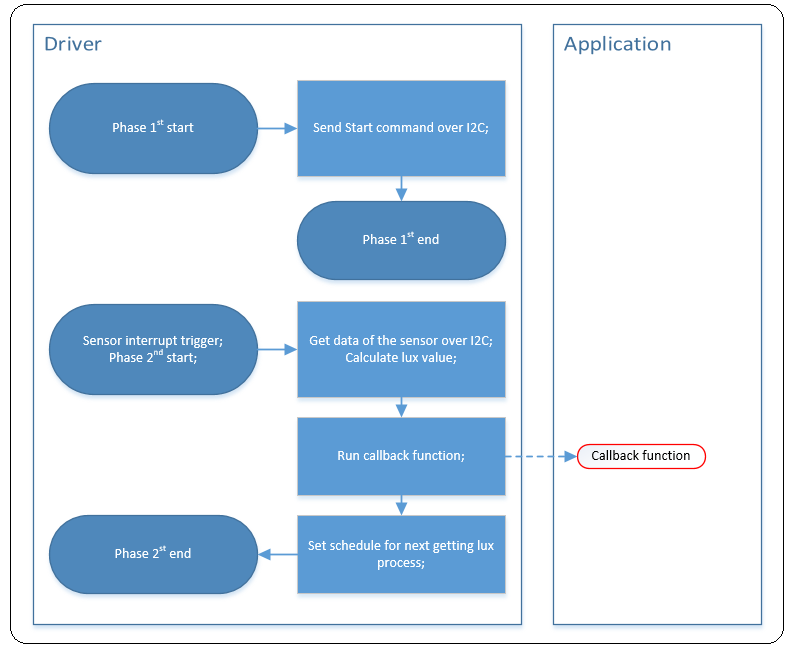  

## 6. Reference ##

The implementation of PIR driver and ambient light sensor in this demo is based on this example:

- [Silicon Labs Occupancy Sensor EXP](https://github.com/SiliconLabs/occupancy-sensor-exp.git)

Reference:

- [Zigbee Motion Sensor PIR Example](https://github.com/SiliconLabs/zigbee_applications/tree/master/zigbee_smart_lighting)

- [Z-Wave Motion Sensor PIR Example](https://github.com/SiliconLabs/z_wave_applications/tree/master/z_wave_motion_sensor_pir_application)

About setting up network, on/off cluster, more can be found here:

- [Building a Zigbee 3.0 Switch and Light from Scratch](https://www.silabs.com/support/training/zigbee-application-layer-concepts/building-a-zigbee-3-0-switch-and-light-from-scratch)

About creating Zigbee project in Simplicity Studio and network security, more can be found here:

- [Zigbee Hands on Forming and Joining](https://github.com/SiliconLabs/IoT-Developer-Boot-Camp/wiki/Zigbee-Hands-on-Forming-and-Joining)

About using event in Simplicity Studio:

- [Zigbee Hands on Using Event](https://github.com/SiliconLabs/IoT-Developer-Boot-Camp/wiki/Zigbee-Hands-on-Using-Event)  
