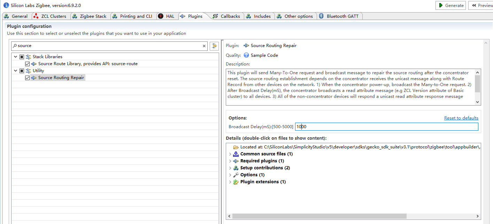

# Zigbee Source Routing Repair Plugin #

## Summary ##

In Zigbee networks, there is commonly one central node, a “concentrator”, which all nodes frequently communicate with. An example of such a network would be a gateway that collects status reports from all devices on the network. Many-to-one / Source routing scheme caters to these types of networks by creating an efficient means for nodes on a network to communicate with the concentrator.
The source routing establishment depends on the concentrator receives the Route Record from other devices on the network. When the source routing is broken, the concentrator can’t send messages to any devices on the network until the device sends a unicast message to the concentrator along with route record. so we need a mechanism to repair the source routing quickly. The typical use case of the mechanism is when the concentrator power cycle because the source route table will be cleared after the reset.

The procedure of the mechanism:
1. When the concentrator power-up, broadcast the Many-to-One request.
2.  After 500ms, the concentrator broadcasts a read attribute message (e.g ZCL Version attribute of Basic cluster) to all devices.
3. All of the non-concentrator devices will respond a unicast read attribute response message along with Route Record. Devices need to add the random delay to send read attribute response, in case of all the devices send out the packet simultaneously. The range of jitter is suggested to 0 – 3 seconds.

## Gecko SDK version ##

Gecko SDK Suite 3.1

## Hardware Required ##

* Wireless Starter Kit Main Board (BRD4001)
* Any EFR32 radio board.

## How to use ##
1. Place the source-routing-repair folder to C:\SiliconLabs\SimplicityStudio\v5\developer\sdks\gecko_sdk_suite\v3.1\protocol\zigbee\app\framework\plugin.
2. Lanuch the Simplicity Studio V5 and generate a Zigbee project.
3. Source Routing Repair plugin will be shown in Plugins window.

## Reference ##
[Zigbee Routing KBAs](https://www.silabs.com/community/wireless/zigbee-and-thread/knowledge-base.entry.html/2020/04/02/_03_zigbee_routing-u5tT) 
