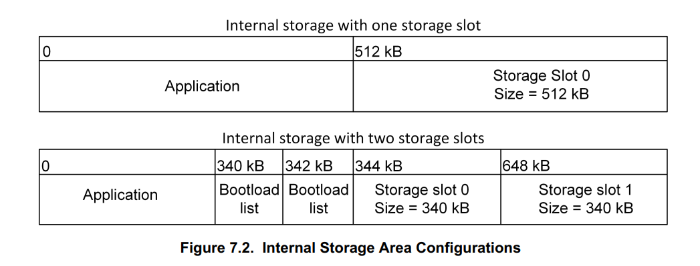
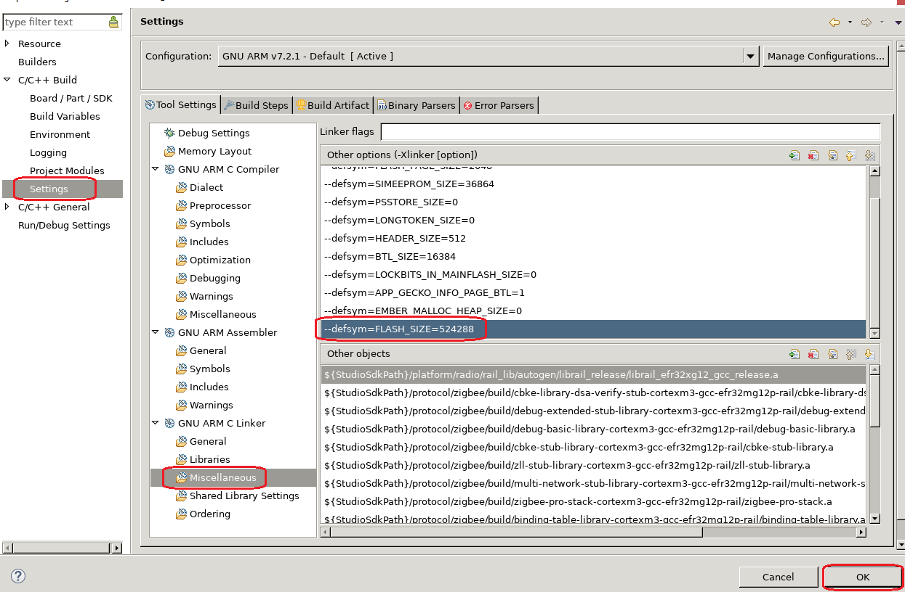
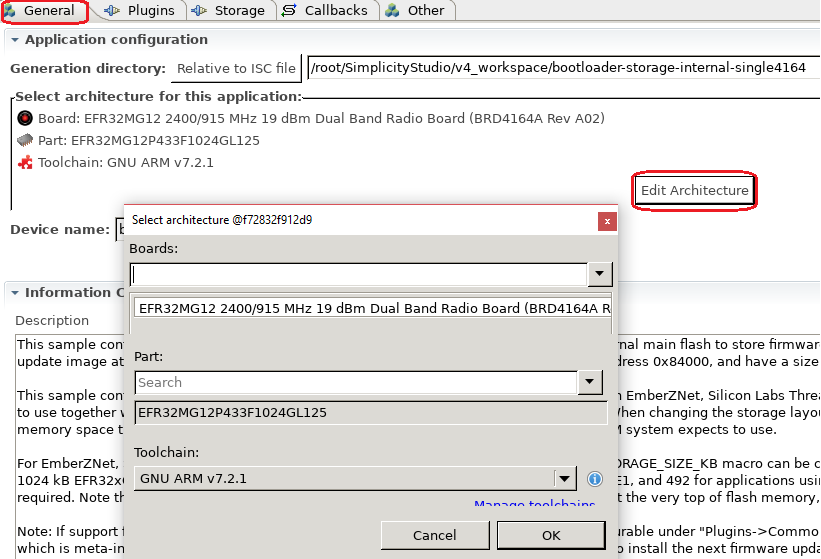

# Switching Between Two Zigbee Applications

## 1. Summary ##
This example demostrates how we put two Zigbee applicaiton images into one SoC (EFR32MG12) and switch between them.  

In this case, we use a part with 1MB flash and divide it into two area:  
Area | Address
-|-|
0 | 0x0 ~ 0x80000
1 | 0x80000 ~ 0x100000

The bootloader selects the corresponding start address to boot according to the user command. By default, it boots from address 0x0.

In section 7.1.2 of [UG266](https://www.silabs.com/documents/public/user-guides/ug266-gecko-bootloader-user-guide.pdf), there is another approach of support multiple applicaiton images in a single SoC. In this approach, we divide the internal flash into two parts. 
- The application area where the running application will be put in. 
- Storage area. This area can be configured as multiple slots. 

When we need to switch between applications, the bootloader will choose one storage slot, and then **copy** the application image from this slot to the application area. 



Comparing to the approach in UG266, the approach in this example is more efficient on ultilizing storage space.

## 2. Gecko SDK version ##
Gecko SDK Suite 2.7.

## 3. Hardware Required ##
- Wireless Starter Kit Main Board (BRD4001)
- EFR32MG12 2400/915 MHz 19 dBm Dual Band Radio Board (BRD4164A)

## 4. Connections Required ##
NA

## 5. Setup ##
### 5.1. Create Application for Area 0
Create a ZigbeeMinimal project, generate, then select this project and right click, "properties", change the symbol "FLASH_SIZE" to 512KB, so that this application will only use the flash space from 0x0 to 0x80000.



After that, build it and flash the generated image into the kit.  


**Notes: If you regenerate your project, you need to check and configure the symbol "FLASH_SZE" again.**


### 5.2. Create Application for Area 1
Create a ZigbeeMinimal project, generate, then select this project and right click, "properties", change the symbol "FLASH_SIZE" to 512KB as well. 

After that, we need to change the linker file so that this application can run from a different address other than the default (0x0).   

Copy file "C:/SiliconLabs/SimplicityStudio/v4/developer/sdks/gecko_sdk_suite/v2.7/platform/base/hal/micro/cortexm3/efm32/gcc-cfg.ld" to "C:/SiliconLabs/SimplicityStudio/v4/developer/sdks/gecko_sdk_suite/v2.7/platform/base/hal/micro/cortexm3/efm32/gcc-cfg1.ld", then modify the file gcc-cfg1.ld:
```
MFB_BOTTOM          = 0x00000000;   ---> change to 0x80000
MFB_TOP             = MFB_BOTTOM + FLASH_SIZE - 1;
```

Then build it and flash the generated image into the kit.

### 5.3. Add a Custom Command to Switch
In both the applications, add a custom command "custom test \<area\>" to switch between the two applications. The source code is:
```
void custom_test_cmd()
{
	uint8_t area = emberUnsignedCommandArgument(0);

	if (0 == area) {
		halInternalSysReset(0xDCBA);
	} else {
		halInternalSysReset(0xABCD);
	}
}

EmberCommandEntry emberAfCustomCommands[] = {
    emberCommandEntryAction("test", custom_test_cmd, "u", ""),
    emberCommandEntryTerminator()
};
```

### 5.4. Modify the Bootloader to Bootload Application According to Reset Cause
In bootloader, modify the source file "btl_main.c". 
1. Remove the "const" attribute of the global variable "mainStageTable". 
2. Modify the function SystemInit2. Find the source code started with "add by jim".
```
/**
 * This function gets executed before ANYTHING got initialized.
 * So, no using global variables here!
 */
void SystemInit2(void)
{
  // Initialize debug before first debug print
  BTL_DEBUG_INIT();

  // Assumption: We should enter the app
  bool enterApp = true;
  // Assumption: The app should be verified
  bool verifyApp = true;

  // Check if we came from EM4. If any other bit than the EM4 bit it set, we
  // can't know whether this was really an EM4 reset, and we need to do further
  // checking.
#if defined(RMU_RSTCAUSE_EM4RST) && defined(APPLICATION_VERIFICATION_SKIP_EM4_RST)
  if (RMU->RSTCAUSE == RMU_RSTCAUSE_EM4RST) {
    // We came from EM4, app doesn't need to be verified
    verifyApp = false;
  } else if (enterBootloader()) {
    // We want to enter the bootloader, app doesn't need to be verified
    enterApp = false;
    verifyApp = false;
  }
#else
  if (enterBootloader()) {
    // We want to enter the bootloader, app doesn't need to be verified
    enterApp = false;
    verifyApp = false;
  }
#endif

  //add by jim
  // *INDENT-OFF*
  #if defined(EMU_RSTCAUSE_SYSREQ)
    if (EMU->RSTCAUSE & EMU_RSTCAUSE_SYSREQ) {
  #else
    if (RMU->RSTCAUSE & RMU_RSTCAUSE_SYSREQRST) {
  #endif
      if (0xABCD == reset_classifyReset()) {
    	  mainStageTable.startOfAppSpace = (BareBootTable_t *)(0x80000);
      } else {
    	  mainStageTable.startOfAppSpace = (BareBootTable_t *)(0x0);
      }
    }
  //end add


  uint32_t startOfAppSpace = (uint32_t)mainStageTable.startOfAppSpace;

  // Sanity check application program counter
  uint32_t pc = *(uint32_t *)(startOfAppSpace + 4);
  if (pc == 0xFFFFFFFF) {
    // Sanity check failed; enter the bootloader
    reset_setResetReason(BOOTLOADER_RESET_REASON_BADAPP);
    enterApp = false;
    verifyApp = false;
  }

  // App should be verified
  if (verifyApp) {
    // If app verification fails, enter bootloader instead
    enterApp = bootload_verifyApplication(startOfAppSpace);
    if (!enterApp) {
      reset_setResetReason(BOOTLOADER_RESET_REASON_BADAPP);
    }
  }

  if (enterApp) {
    BTL_DEBUG_PRINTLN("Enter app");
    BTL_DEBUG_PRINT_LF();
#if defined(BOOTLOADER_WRITE_DISABLE)
    lockBootloaderArea();
#endif

#if defined(BOOTLOADER_ENFORCE_SECURE_BOOT) && defined(APPLICATION_WRITE_DISABLE)
    // The neccessary check of valid signature pointer for application at startOfAppSpace
    // is already done in bootload_verifyApplication.
    bootload_lockApplicationArea(startOfAppSpace, 0);
#endif

    // Set vector table to application's table
    SCB->VTOR = startOfAppSpace;

    bootToApp(startOfAppSpace);
  }
  // Enter bootloader
}
```

## 6. How It Works ##
- Flash bootloader
- Flash the built image of zigbee_minimal_soc_0_mg12
- Flash the built image of zigbee_minimal_soc_1_mg12

By default, the bootloader will bootload the application "zigbee_minimal_soc_0_mg12". When the application starts up, you can use the following command to switch between the applications.  
```
custom test 0  -- switch to application in area 0
custom test 1  -- switch to application in area 1
```

## 7. .sls Projects Used ##
Project | Comment
-|-|
bootloader_storage_internal_single_mg12.sls | Bootload application in area 0 or 1 according to the reset cause
zigbee_minimal_soc_0_mg12.sls | Application runs in area 0 (0x0 ~ 0x80000)
zigbee_minimal_soc_1_mg12.sls | Application runs in area 1 (0x80000 ~ 0x100000)

## 8. How to Port to Another Part ##
This example can be used on any parts with 1MB flash. Below are the steps of porting it to other part:
- Import the .sls file into Simplicity Studio
- Open the .isc file of each project, turn to "General" tab, hit button "Edit Architecture", then select the board and part.



## 9. Special Notes ##
**If you regenerate your project, you need to check and configure the symbol "FLASH_SZE" again.**
