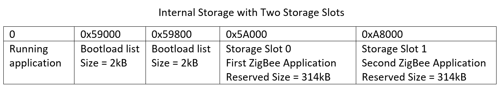

# Switching Between Two Zigbee Applications Using Slot Manager #


## 1. Summary ##

In some cases, a device might need to support running two ZigBee applications at different time and switching between them. For example, a node might need to be a line-powered coordinator if there isn't any available network for it to join. However, this node might need to become a battery-powered sleepy end device when the users want it to join an existing network and save the power as much as possible. This example illustrates a way to implement this feature making use of the Slot Manager plugin in Silicon Labs' ZigBee application framework. Additionally, it sets up a button to allow switching between two applications by a single press.

There is another way to switch between two applications without using the Slot Manager plugin. It can be found on [SiliconLabs
/zigbee_applications/zigbee_switching_between_applications/](https://github.com/SiliconLabs/zigbee_applications/tree/5e193fd209042b7ee820e292e237eba32d1c0ba6/zigbee_switching_between_applications).

## 2. Gecko SDK version ##

Gecko SDK Suite 2.7

## 3. Hardware Required ##

- Wireless Starter Kit Main Board (BRD4001)
- EFR32MG12 2.4 GHz 19 dBm Radio Board (BRD4161A) - This part has 1M Flash space which is large enough to store both of the ZigBee applications into its internal storage region.

## 4. Connections Required ##

Connect the BRD4161A radio board to the BRD4001 WSTK mainboard.

Connect the BRD4001 WSTK mainboard to the PC through the USB.

## 5. Setup ##

### 5.1 Bootloader application ###

This example uses the Internal storage bootloader(single image on 1MB device) as the Gecko Bootloader for BRD4161A.

The first ZigBee application is stored in Slot 0 between 0x5A000 and 0xA8800(314kB). Therefore, the start address of slot 0 should be configured to 368640 and the size of the start address needs to be configured to 321536 in Appbuilder.

The second ZigBee application is stored between 0xA8800 and 0xF7000(314kB). Therefore, the start address of slot 1 should be configured to 690176 and the size of the start address needs to be configured to 321536 in Appbuilder.

Two bootloader lists corresponding to these two images are stored between 0x59000 and 0x5A000. Each of them consumes one entire flash pace - 2kB. This is the default setting in the Command Storage plugin.

This memory layout for the storage is similar to the layout in the [UG266](https://www.silabs.com/documents/public/user-guides/ug266-gecko-bootloader-user-guide.pdf) Figure 6.2. More internal storage configuration information can be found there.



A pre-built bootloader_storage_internal_twoapps_mg12.sls project is provided under the SimplicityStudio directory.

### 5.2 ZigBee applications ###

Two ZigBee applications are a modified Z3Light example(Z3LIGHT_ZC) configured as Coordinator/Router and a modified Z3Switch(Z3SWITCH_SED) example configured as a Sleepy End Device. This setup is the same as the example in the Summary section.

#### 5.2.1 Z3LIGHT_ZC ####

This project uses the Z3Light sample project as the template. Besides what Z3Light has, the following modifications need to be done:

- Change The ZigBee Device Type in Appbuilder → Zigbee Stack to "Coordinator or Router"
- Enable the "Security Link Keys Library" plugin
- Enable the "Slot Manager" plugin
- Define a static variable "lastButton" in file "Z3LIGHT_ZC_callbacks.c" to keep track of the last pressed button

```C
static uint8_t lastButton;
```

- Put the following highlighted statement to ```void emberAfHalButtonIsrCallback(uint8_t button, uint8_t state)``` in Z3LIGHT_ZC_callbacks.c

```C
void emberAfHalButtonIsrCallback(uint8_t button, uint8_t state)
{
  if (state == BUTTON_RELEASED) {
    lastButton = button; //This is the line should be added
    emberEventControlSetActive(findingAndBindingEventControl);
  }
}
```

- Put the following highlighted statement to ```void findingAndBindingEventHandler()``` in Z3LIGHT_ZC_callbacks.c

```C
void findingAndBindingEventHandler()
{
  bool bootslot = (lastButton == BUTTON1); //Added codes start from this line
 
  if(bootslot)
  {
    if (emberAfPluginSlotManagerVerifyAndBootloadSlot(0x00000001/*Z3SWITCH_SED slot*/) != 0x00/*SLOT_MANAGER_SUCCESS*/)
    {
      emberAfAppPrintln("Unable to boot image at slot %d", 0x00000001/*Z3SWITCH_SED slot*/);
    }
  } //Added codes end in this line
  if (emberAfNetworkState() == EMBER_JOINED_NETWORK) {
    emberEventControlSetInactive(findingAndBindingEventControl);
    emberAfCorePrintln("Find and bind target start: 0x%X",
                       emberAfPluginFindAndBindTargetStart(LIGHT_ENDPOINT));
  }
}
```

In this project, Z3LIGHT_ZC is put into slot 0. However, readers can put this application to whichever slot they want.

A pre-built z3lightsoc_zc_mg12.sls project is provided under the SimplicityStudio directory.

#### 5.2.2 Z3SWITCH_SED ####

This project uses the Z3Switch sample project as the template. Besides what Z3Switch has, the following modifications need to be done:

- Change the ZigBee Device Type in Appbuilder → Zigbee Stack to "Sleepy End Device"
- Enable the "Slot Manager" plugin
- Enable the "Stay awake when NOT joined" option in the "Idle/Sleep" plugin
- Put the following highlighted statements to "void emberAfHalButtonIsrCallback(uint8_t button, uint8_t state)" in "Z3SWITCH_SED_callbacks.c"

```C
void commissioningEventHandler(void)
{
  EmberStatus status;
 
  emberEventControlSetInactive(commissioningEventControl);
 
  bool bootslot = (lastButton == BUTTON1); //Added codes start from this line
 
  if(bootslot)
  {
    if (emberAfPluginSlotManagerVerifyAndBootloadSlot(0x00000000/*Z3LIGHT_ZC slot*/) != 0x00/*SLOT_MANAGER_SUCCESS*/)
    {
      emberAfAppPrintln("Unable to boot image at slot %d", 0x00000000/*Z3LIGHT_ZC slot*/);
    }
  }//Added codes end in this line
 
  if (emberAfNetworkState() == EMBER_JOINED_NETWORK) {
    ...
```

In this project, the Z3SWITCH_SED is put into slot 1. However, readers can put this application to whichever slot they want.

A pre-built z3switchsoc_sed_mg12.sls project is provided under the SimplicityStudio directory.

## 6. How It Works ##

### 6.1 Upload applications into the device ###

The Gecko Bootloader is stored in its normal place - starts from 0x0FE10000 on EFR32MG12 and thus readers can use the Flash Programmer tool in Simplicity Studio or the Simplicity Commander to flash the bootloader-storage-internal-twoapps-combined.s37 image(first stage + main stage) into the device.

After loading the Gecko Bootloader, readers need to decide which application should run after the first start up on the EFR32MG12 node. The example in this document will use Z3LIGHT_ZC to start. THence, this application should also be loaded into the normal application space - starts from 0x00000000 on EFR32MG12 and therefore, readers can also use the Flash Programmer tool in Simplicity Studio or the Simplicity Commander to flash the Z3LightSoc_ZC.s37 image into the device.

The next step will be loading the two ZigBee images into the internal flash storage slot configured in the previous step. This has to be done through the Simplicity Commander with the GBL upgrade file format because the GBL file format can make the bootloading process unified for all communication interfaces: UART, OTA, external flash.

First, create an upgrade GBL file for both of the ZigBee applications with the following commands. Note that instead of producing a file with a .gbl extension, we append a .bin extension onto the filename.

```bash
commander gbl create ZB_SED.gbl.bin --app [path to your Z3SWITCH_SED.s37]
commander gbl create ZB_ZC.gbl.bin --app [path to your Z3LIGHT_ZC.s37]
```

Next, the image files need to be written into internal flash to appropriate addresses. The image files should be written to align with slot addresses. These addresses are the same ones defined when building a Gecko Bootloader with internal storage. In this example, slot 0 starts at address 0x5A000 and slot 1 starts at address 0xAC800. To flash the image files to internal flash, use the following Simplicity Commander command flash.

```bash
commander flash ZB_ZC.gbl.bin --address 0x5A000
commander flash ZB_SED.gbl.bin --address 0xA8800
```

### 6.2 Switch between two applications ###

After image files are uploaded onto the internal flash, and the main ZigBee application(Z3LIGHT_ZC) is loaded into the internal flash, reset the device. The ZigBee application will start. Now readers can use the Slot Manager plugin to list the application images and bootload from the other slot. This results in loading the Z3SWITCH_SED application image into the internal flash region for the running application.

One way to use the Slot Manager is through the Command Line Interface. In Simplicity Studio launch the console for the command-line interface for the ZigBee application.

On the Serial 1 tab, enter the following commands to get info about upgrade images.

```bash
plugin slot-manager slots-info
```

Output should be as follow.

```bash
Z3LIGHT_ZC>Slot 0
  Address     : 0x0005A000
  Length      : 0x0004E800 (321536 bytes)
  Type        : ZigBee
  Version     : 0x00000000
  Capabilities: 0x00000000
  Product ID  : 0x00 0x00 0x00 0x00 0x00 0x00 0x00 0x00 0x00 0x00 0x00 0x00 0x00 0x00 0x00 0x00
Slot 1
  Address     : 0x000A8800
  Length      : 0x0004E800 (321536 bytes)
  Type        : ZigBee
  Version     : 0x00000000
  Capabilities: 0x00000000
  Product ID  : 0x00 0x00 0x00 0x00 0x00 0x00 0x00 0x00 0x00 0x00 0x00 0x00 0x00 0x00 0x00 0x00
```

To boot from the Z3LIGHT_ZC slot (slot 1) use the following command.

```bash
plugin slot-manager boot-slot 1
```

Alternatively, press the Button 1 on the WSTK main board.

This loads the Z3SWITCH_SED application into the application region of the flash(0x00000000), and reboots the device. Now the Z3SWITCH_SED is running.

```bash
Z3LIGHT_ZC>Slot Manager: beginning image verification.............................................................................................................
..................................................................................................................................................................
..................................................................................................................................................................
..................................................................................................................................................................
..................................................................................................................................................................
..................................................................................................................................................................
..................................................................................................................................................................
..................................................................................................................................................................
..................................................................................................................................................................
..................................................................................................................................................................
.....................................................................................................................................................passed! Booting slot 1
Reset info: 0x02 (BTL)
Extended Reset info: 0x0201 (GO )
init pass
EEPROM init: 0x00
ZllCommInit - device is not joined to a network
Z3SWITCH_SED>
```

To switch back to the Z3LIGHT_ZC application, the application needs to boot from slot 0. A similar command blow can be used to bootload to slot 0 or pressing Button 1 on the WSTK main board.

```bash
plugin slot-manager boot-slot 0
```

```bash
Z3SWITCH_SED>Slot Manager: beginning image verification...........................................................................................................
..................................................................................................................................................................
..................................................................................................................................................................
..................................................................................................................................................................
..................................................................................................................................................................
..................................................................................................................................................................
..................................................................................................................................................................
..................................................................................................................................................................
..................................................................................................................................................................
..................................................................................................................................................................
..................................................................................................................................................................
..................................................................................................................................................................
..............................................passed! Booting slot 0
Reset info: 0x02 (BTL)
Extended Reset info: 0x0201 (GO )
ZllCommInit - device is not joined to a network
...
```

## 7. .sls Projects Used ##

Project | Comment
-|-|
bootloader_storage_internal_twoapps_mg12.sls | Bootloader application containing the slots allocation information
z3lightsoc_zc_mg12.sls | ZigBee coordinator application in slot 0(0x5A000 - 0xA8800)
z3switchsoc_sed_mg12.sls | ZigBee sleepy end device application in slot 1 (0xA8800 - 0xF7000)

## 8. How to Port to Another Part ##

This example can be used on any parts with 1MB flash. Below are the steps of porting it to other parts:

- Import the .sls files into Simplicity Studio
- Open the "General" tab in the .isc files of each project, press "Edit Architecture", then select the corresponding board and part

## 9. Special Notes ##

- To implement rebooting from other slot functionality in a custom application, one can use the Gecko Bootloader APIs that
includes functions for switching slots, rebooting, and so on. For details see the Gecko Bootloader API Reference Manual shipped with
the SDK

- After the EmebrZNet 6.6.0, the default NVM storage solution for Z3Light/Z3Switch examples is NVM3. Therefore, Z3SWITCH_SED and Z3LIGHT_ZC use NVM3 to store tokens. The Bootloader configuration in Appbuider → HAL is by default set to Application so that the NVM3 tokens will be stored at the top pages of the flash. In our applications, because the NVM3 uses 18 pages(36kB) by default, the NVM3 storage region will be from 0xF7000 to 0xFFFFF. This is one of the main reason why this example deliberately chooses 0xF7000 to be the end of slot 1.
Because two applications share the same NVM3 token storage region and their stack token elements are the same, they also share the same token values, which means that it is possible to join them into the same network with the same PAN ID and etc using only one "join" and one "rejoin". However, the ZigBee device types are different between these two applications and thus the framework won't initialize the network when the device switch from Z3LIGHT_ZC applicaton to Z3SWITCH_SED. To change this behavior, users need to modify ```void emAfNetworkInit(void)``` in ```project folder/zcl-framework-core/af-main-common.c``` to stop avoiding network initialization when the node type of the device doesn't match the one used previously. Specifically, comment out ```initialize = false;``` as shown below.

```C
    ...
     if (emberAfGetNodeType(&nodeType) == EMBER_SUCCESS
          && (nodeType != emAfCurrentZigbeeProNetwork->nodeType
              && (emAfCurrentZigbeeProNetwork->nodeType != EMBER_COORDINATOR
                  || nodeType != EMBER_ROUTER))) {
//        initialize = false;
      }
    ...
```

- Note that the node type stored in the token(emberGetNodeType(nodeType)) won't change and thus after changing the application from Z3LIGHT_ZC to Z3SWITCH_SED, Z3SWITCH_SED must call ```EmberStatus emberFindAndRejoinNetworkWithNodeType(bool haveCurrentNetworkKey, uint32_t channelMask, EmberNodeType nodeType)``` to do a rejoin with different node type

- Sharing tokens between two applications can be risky considering they might have different tokens with the same ID value and so on. Therefore, developers need to pay extra attention to the token configuration when using the method in this example
